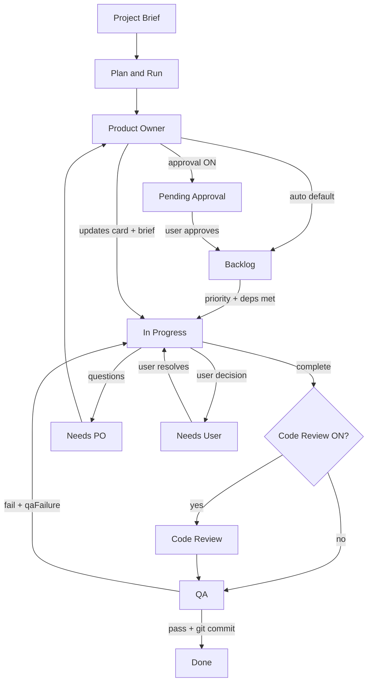

# All Hands Multi-Agent Workspace

Local multi-agent AI development workspace with Kanban board, Ollama-powered agents, skills, Monaco editor, chat composer, and file tree — inspired by Cursor IDE patterns.

**Localhost only** — binds to `127.0.0.1:6767`. No authentication. Do not expose to the network without adding your own auth layer.

## Contents

1. [Installation](#installation)
2. [Getting started](#getting-started)
3. [Recommended settings](#recommended-settings)
4. [Agent workflow](#agent-workflow)
5. [UI guide](#ui-guide)
6. [Features](#features)
7. [Task model](#task-model-kanban-cards)
8. [State API](#state-api-get-apistate)
9. [API reference](#api-reference)
10. [Configuration](#configuration)
11. [Development](#development)
12. [Troubleshooting](#troubleshooting)
13. [Offline / no-Ollama mode](#offline--no-ollama-mode)

---

## Installation

### Requirements

| Component | Version | Required |
|-----------|---------|----------|
| Python | 3.10+ | Yes |
| Node.js | 18+ | Yes (frontend build/dev) |
| [Ollama](https://ollama.com/) | latest | Recommended (offline fallbacks exist) |
| Git | any | Optional (auto-commit on Done, Git panel) |

### Clone and install

```bash
git clone <your-repo-url>
cd DevelopmentAgent
python -m venv .venv
```

Activate the virtual environment:

```bash
# Windows (PowerShell)
.venv\Scripts\Activate.ps1

# macOS / Linux
source .venv/bin/activate
```

```bash
pip install -r requirements.txt
cd frontend
npm install
cd ..
```

Python dependencies include FastAPI, Ollama SDK, Qdrant client, and pytest. See [requirements.txt](requirements.txt).

### Run the app

**Production-style (single server)**

```bash
cd frontend && npm run build && cd ..
python app.py
```

Open **http://127.0.0.1:6767** — FastAPI serves the built SPA from `frontend/dist/`.

**Development (hot reload frontend)**

```bash
# Terminal 1 — backend
python app.py

# Terminal 2 — Vite dev server (proxies /api → :6767)
cd frontend
npm run dev
```

Open **http://127.0.0.1:5173**

### Optional services

| Service | Install | Purpose |
|---------|---------|---------|
| Ollama | [ollama.com](https://ollama.com/) | LLM inference + embeddings |
| Qdrant | `docker run -p 6333:6333 qdrant/qdrant` | Semantic codebase search |
| Graphify | CLI on `PATH` | `graph_query` structural code graph tool |
| Flutter SDK | [flutter.dev](https://docs.flutter.dev/get-started/install) | `flutter analyze` via `run_command` in Flutter workspaces |
| .NET SDK | [dotnet.microsoft.com](https://dotnet.microsoft.com/download) | `dotnet build` / test in .NET workspaces |

### Recommended Ollama models

```bash
ollama pull llama3:8b              # Product Owner
ollama pull qwen2.5-coder:14b      # Developer
ollama pull qwen2.5-coder:7b       # Code Reviewer & QA
ollama pull nomic-embed-text       # Embeddings (memory + Qdrant)
```

Verify models in the sidebar **Project Config** section or `GET /api/ollama/health`. Use `GET /api/ollama/model-recommendations` for suggestions based on system RAM.

### Environment and persistence

| Variable | Default | Purpose |
|----------|---------|---------|
| `ALLHANDS_HOME` | `~/.allhands` | Runtime data directory ([backend/config.py](backend/config.py)) |

SQLite database: `~/.allhands/scrum_memory.db` — projects, board state, chat, agent memories, file revisions, brief changelog. On first run, an existing `scrum_memory.db` in the project root is copied to `ALLHANDS_HOME` automatically.

### Project layout

```
DevelopmentAgent/
├── app.py                 # Entry shim → backend.main
├── backend/
│   ├── main.py            # FastAPI app, CORS, static SPA mount
│   ├── api/               # REST + SSE route modules
│   ├── agents/            # ScrumAgent, tools, task context
│   ├── services/          # Sprint, workflow, git, terminal, events, logs
│   ├── workspace/         # File I/O, tree, search, revisions, tests
│   └── storage/           # SQLite projects, chat, memory, changelog
├── frontend/              # Vite + React + TypeScript
│   └── dist/              # Built assets (served by backend)
├── tests/                 # pytest smoke tests
├── workspace/             # Agent-written project files (runtime)
├── global_skills/         # Skill markdown library (runtime)
```

---

## Getting started

Follow these steps for your first project:

1. **Start the app** — `python app.py` (and `npm run dev` in `frontend/` if developing the UI).
2. **Create or load a project** — sidebar **Load Workspace** → create new or pick existing. Set **workspace directory** to the root of the codebase agents should edit (must contain your project files, e.g. `pubspec.yaml` for Flutter).
3. **Configure Ollama** — sidebar **Project Config**: Ollama URL (default `http://localhost:11434`), model names for PO / Dev / CR / QA.
4. **Write a Project Brief** — panel above the Kanban. Be specific about stack, constraints, and success criteria.
5. **Plan work** — choose one path:
   - **Fast:** **Plan outline** → **Generate backlog from plan** → **Execute Sprint Step**
   - **Automated:** **Plan & Run (Brief → PO → Sprint)**
6. **Watch agents work** — open bottom tabs **Console**, **Tools**, and **Model** during sprint steps. The **Agent Run bar** above the bottom panel shows live tool activity via SSE.
7. **Unblock cards** — click Kanban cards for the task detail modal. Resolve **Needs User** answers; approve **Pending Approval** cards. Use **Claim ready cards** or **Run In Progress (N)** when Dev should run while PO cards wait.
8. **Pin project facts** — bottom **Memory** tab: save conventions (API keys location, auth patterns) so all agents see them in prompts.
9. **Optional: semantic search** — start Qdrant, enable **Enable semantic search** in Workflow, then **Reindex codebase**.

### Example brief (minimal REST API)

```
Build a small Python FastAPI todo API in the workspace folder.
Stack: FastAPI, pydantic, no database (in-memory list).
Include GET/POST /todos and DELETE /todos/{id}.
Add pytest tests. Run ruff check before marking done.
Do not add auth unless I approve in Needs User.
```

---

## Recommended settings

All settings live in sidebar **Workflow** and persist per project in SQLite. Defaults are in [backend/services/workflow_settings.py](backend/services/workflow_settings.py).

### Small project / first try (defaults)

| Setting | Value |
|---------|-------|
| prioritizeImplementationOverRefinement | ON |
| enableSemanticSearch | ON (works without Qdrant for memory; Qdrant adds codebase search) |
| requireToolApproval | OFF |
| pauseSprintOnNeedsUser | OFF |
| Models | PO `llama3:8b`, Dev `qwen2.5-coder:14b`, CR/QA `qwen2.5-coder:7b` |

### Quality gate (team review)

| Setting | Value |
|---------|-------|
| requireBacklogApproval | ON |
| requireCodeReview | ON |
| requireDevVerification | ON |
| requireCleanLint | ON |
| definitionOfDone | Add project checklist (tests pass, lint clean, docs updated) |

### Refinement-heavy product work

| Setting | Value |
|---------|-------|
| requireBacklogRefinement | ON |
| maxRefinementRoundTrips | 3 |
| prioritizeImplementationOverRefinement | ON (Backlog before more Refinement) |

### Safer autonomous runs

| Setting | Value |
|---------|-------|
| requireToolApproval | ON |
| toolApprovalTools | write_file, run_command, delete_file |
| commandAutoRunMode | allowlist |
| maxNeedsUserPerSprint | 2 |
| autonomousMode | OFF until brief and AC are stable |

### Performance / large context (16 GB+ RAM)

| Setting | Value |
|---------|-------|
| ollamaNumCtx | 32768 |
| embedModel | nomic-embed-text |
| enableSemanticSprintContext | ON |
| Reindex | After large workspace changes |

### Low-RAM / CPU-only

| Setting | Value |
|---------|-------|
| Dev model | qwen2.5-coder:7b |
| ollamaNumCtx | 16384 |
| enableSemanticSearch | OFF if Qdrant unavailable |
| maxLlmIterationsPerStep | 6 |

---

## Agent workflow

The core loop is **Brief → PO → Dev → QA → Done**, with escalation lanes when agents need help.

### Typical paths

| Goal | Action |
|------|--------|
| Fully automated | Enter brief → **Plan & Run** |
| Fast planning | **Plan outline** → **Generate backlog from plan** → sprint manually |
| Manual control | **Send Brief to PO Only** → **Execute Sprint Step** |
| Dev on active cards | **Run In Progress (N)** — Dev only; skips Needs PO / Backlog / Refinement |
| Pull ready work | **Claim ready cards** — unblocked Backlog → In Progress |
| Continuous delivery | **Auto Sprint** checkbox |
| Add scope | **Add Feature** → brief + PO |

### Refinement lane and spikes

When **Require backlog refinement** is ON, Backlog cards can enter **Refinement** before implementation. Dev and PO iterate on `refinementNotes`; spike cards (`workType: spike`) produce a `spikeReport`.

**Prioritize implementation over refinement** (default ON) makes sprint steps pick **Backlog → In Progress** before more Refinement when both lanes have work.

Task detail: **Move to In Progress** with optional **Skip remaining refinement**.

### Subtasks and dependencies

Cards support `parentTaskId`, `subtaskIds`, and `blockedBy`. When blockers reach Done, **dependency outcome rollup** copies summaries to the parent (`dependencyOutcomes`) and injects them into prompts. Invalid blockers show warnings in task detail.

### Sprint handler order (Execute Sprint Step)

Needs PO → Needs User (if pause setting ON) → In Progress → Backlog/Refinement (when configured) → Code Review → QA.

**Run In Progress** bypasses this and runs Dev on the In Progress lane only.

### Step-by-step

1. **Product Owner** decomposes the brief into backlog features with acceptance criteria, priority, and optional `blockedBy`.
2. **Developer** implements in the workspace; moves to QA or Code Review when complete.
3. **Needs PO** — PO clarifies requirements and returns the card to In Progress.
4. **Needs User** — human decision required; resolve in task detail.
5. **QA** validates against AC and DoD. Pass → **Done** (auto git commit). Fail → **In Progress** with `qaFailure`.

### Workflow settings (full reference)

Persisted per project. Update via sidebar **Workflow** or `POST /api/workflow/settings`.

#### Gates

| Setting | Default | Purpose |
|---------|---------|---------|
| requireBacklogApproval | Off | New stories → **Pending Approval** first |
| requireBacklogRefinement | Off | Backlog → **Refinement** before implementation |
| prioritizeImplementationOverRefinement | On | Sprint picks Backlog before Refinement |
| requireCodeReview | Off | Dev → **Code Review** → QA |
| requireDevVerification | Off | Dev must verify before leaving In Progress |
| requireCleanLint | Off | Lint must pass before advance |

#### Refinement and subtasks

| Setting | Default | Purpose |
|---------|---------|---------|
| maxRefinementRoundTrips | 3 | Dev/PO refinement cap before Needs PO |
| maxSubtaskDepth | 4 | Max nesting depth for subtasks |
| maxSubtaskSpawns | 8 | Max subtasks per parent |

#### Sprint limits

| Setting | Default | Purpose |
|---------|---------|---------|
| maxSprintSteps | 20 | Cap for Auto Sprint and Plan & Run |
| maxLlmIterationsPerStep | 8 | Tool-call loop limit per agent turn |
| maxPoRoundTrips | 3 | PO clarification rounds per card |
| maxStuckSteps | 3 | Escalate when card does not move |
| maxToolFailuresPerStep | 5 | Stop agent loop after N tool failures |
| pauseSprintOnNeedsUser | Off | Idle sprint while Needs User cards exist |

#### Autonomous behavior

| Setting | Default | Purpose |
|---------|---------|---------|
| autonomousMode | Off | Reduce Needs User escalations |
| maxNeedsUserPerSprint | 2 | Cap Needs User cards per auto-sprint run |
| needsUserCooldownSteps | 3 | Steps between Needs User escalations |
| autoStartSprint | On | Auto-sprint behavior after plan |

#### Tools and safety

| Setting | Default | Purpose |
|---------|---------|---------|
| requireToolApproval | Off | Approve/deny write_file, run_command, delete_file |
| toolApprovalTools | write_file, run_command, delete_file | Tools requiring approval |
| nonBlockingToolApproval | On | Other tools continue while awaiting approval |
| commandAutoRunMode | off | off / allowlist / denylist for run_command |
| commandAllowlist | flutter analyze, pytest, … | Allowed commands when mode is allowlist |
| commandDenylist | rm, del, … | Blocked commands when mode is denylist |
| allowChainedCommands | Off | Allow `&&` chained shell commands |
| enableFixVerifyLoop | Off | Auto retry lint/fix loop after Dev step |
| maxFixVerifyRounds | 3 | Max fix-verify iterations |

#### Search and context

| Setting | Default | Purpose |
|---------|---------|---------|
| enableSemanticSearch | On | Qdrant codebase indexing and search |
| qdrantUrl | http://localhost:6333 | Qdrant server URL |
| qdrantApiKey | (empty) | Optional Qdrant API key |
| embedModel | nomic-embed-text | Ollama embedding model |
| enableSemanticSprintContext | On | Inject semantic + graph context into sprint prompts |
| enableWebSearch | Off | Web search tool for agents |
| ollamaNumCtx | 32768 | Context window hint for Ollama |
| ollamaKeepAlive | 30m | Ollama model keep-alive duration |

#### MCP and other

| Setting | Default | Purpose |
|---------|---------|---------|
| mcpServers | [] | Stdio MCP server configs (tools as `mcp_{server}_{tool}`) |
| maxMcpTools | 40 | Max MCP tools registered |
| definitionOfDone | [] | Checklist injected into PO/Dev/QA prompts |
| autoFormatAfterEdit | On | Format files after agent edits when supported |
| maxToolOutputCharsForLlm | 6000 | Truncate tool output in LLM context |
| messagePruneThresholdPct | 60 | Prune message history when context fills |

### Kanban lanes

**Always visible:** Backlog → In Progress → Needs PO → Needs User → QA → Done

**Conditional:** Pending Approval, Code Review, Refinement



### Agent tools

Registered per role in [backend/agents/registry.py](backend/agents/registry.py):

| Tool | Typical agents | Purpose |
|------|----------------|---------|
| read_file, list_dir | All | Read workspace |
| write_file, apply_patch, delete_file | Dev, CR | Edit code |
| run_command | Dev, QA | Shell in workspace |
| update_board, add_backlog_tasks, add_subtasks | PO, Dev | Kanban updates |
| grep, glob_file_search, search_code | PO, Dev, CR | Find code |
| semantic search | PO, Dev | Qdrant-backed search |
| graph_query | PO, Dev | Graphify structural graph |
| git_status, git_diff, git_commit | Dev, QA | Git operations |
| web_search | PO, Dev | Optional web lookup |
| MCP tools | Configurable | External MCP servers |

Prefer **apply_patch** for edits to existing files; **write_file** for new files or full rewrites.

---

## UI guide

During sprint steps, the **Agent Run bar** above the bottom panel shows live tool activity (SSE `tool_start`, `tool_end`, `agent_run`).

### Sidebar

- **Load Workspace** — create, load, export, import, delete projects
- **Project Config** — workspace dir, skills dir, Ollama URL, per-agent models
- **Agent Team & Skills** — assign markdown skills from `global_skills/`
- **Workflow** — all workflow toggles, DoD editor, Qdrant/reindex, brief changelog; link to **Memory** tab
- **Sprint** — Plan outline, Generate backlog, Plan & Run, Execute Sprint Step, **Run In Progress**, **Claim ready cards**, Auto Sprint, Cancel run
- **Escalate Needs User → PO** — when cards are clarification, not true user decisions

### Kanban board

- Drag cards between lanes; drag within **Backlog** to reorder priority
- Click a card for task detail
- Badges: priority, blocked, QA failure, file count, decision count

### Task detail modal

- View/edit title, description, acceptance criteria
- **Approve** (Pending Approval)
- **Resolve & Return to Dev** (Needs User)
- **Move to In Progress** / **Skip remaining refinement** (Backlog or Refinement)
- **Run dev step on this card** (In Progress — skips Needs PO)
- **Diagnose card** — AI root-cause analysis
- **Retry step** — same / optimized / fix_and_verify modes
- **Split task** — PO creates subtasks
- **Escape subtasks** — exit stuck subtask loop
- Missing blocker warnings for invalid `blockedBy`
- Associated files, decisions, transcript (filter failures)
- QA failure panel; **Provide command output** for next sprint step
- **Clear transcript**; git commit info when Done
- Open file diffs from associated files

### Bottom panels

| Tab | Purpose |
|-----|---------|
| Console | Persisted agent system logs |
| Model | LLM debug timeline — prompts, tool calls, `memoriesUsed`, `decisionsIncluded` (filters by selected task) |
| Tools | Tool execution log, manual runs, replay, pending approvals, stack catalog, terminal sessions |
| Activity | Board / sprint activity stream (debounced SSE) |
| Memory | View, filter, add, edit, delete project memories |
| Chat | Streaming composer, agent selector, @file context |
| Terminal | xterm.js — run commands in workspace |
| Search | Workspace file content search |
| Git | Branch, status, recent changes |

#### Memory tab filters

| Control | Purpose |
|---------|---------|
| Type | All / User notes / Tool outcomes |
| Agent | Filter by agent (Project = `__project__` scope) |
| Category | user_note, fix_pattern, failure, tool_usage (legacy) |
| Search | Content substring filter |
| Group duplicates | Collapse identical content; bulk delete grouped rows |

Memories auto-save on **fix_pattern** (file writes) and **failure** (failed tools) only — not every tool call. Identical notes are not inserted twice.

### IDE area

- **File tree** — recursive workspace explorer
- **Monaco editor** — editable files, Ctrl+S save, dirty tab indicator
- **Diff panel** — view revisions when agents edit files
- **Theme toggle** — dark/light

### Notifications (Workflow badges)

| Badge | Meaning |
|-------|---------|
| PO | Cards in Needs PO |
| User | Cards in Needs User |
| Approve | Cards in Pending Approval |
| QA fail | Cards with active `qaFailure` |

After **Plan & Run** or **Auto Sprint**, a sprint summary modal shows steps run, completed tasks, QA failures, and blocked items.

---

## Features

| Area | Capabilities |
|------|----------------|
| **Agents** | PO, Developer, Code Reviewer (optional), QA — Ollama LLM + tools |
| **Workflow** | Plan outline → backlog, Plan & Run, refinement/spikes, gates, DoD, brief changelog |
| **Kanban** | Dynamic lanes, drag-drop, priority, dependencies, subtasks, claim-ready, Run In Progress |
| **IDE** | Monaco editor, file tree, diff view, workspace search |
| **Chat** | Streaming SSE, @file context, per-agent selection |
| **Sprint** | Manual step, dev-only in-progress, auto-sprint with cancel |
| **Git** | Status panel, agent git tools, auto-commit on Done |
| **Terminal** | Sandboxed command runner (localhost-only) |
| **Skills** | Global library, per-agent assignment, suggestions API |
| **Memory** | Cross-agent project notes, semantic search, dedupe, filters |
| **Search** | Qdrant semantic search, Graphify graph, reindex |
| **Debug** | Model panel, Ollama LLM logs, per-task timeline |
| **Tools** | Manual execute, replay, approvals, aliases, stack catalog |
| **Projects** | Multi-project SQLite, export/import zip |
| **Live updates** | SSE board deltas, files, logs, sprint events |

---

## Task model (Kanban cards)

| Field | Type | Description |
|-------|------|-------------|
| `id`, `title`, `description`, `status` | string | Core story fields |
| `acceptanceCriteria` | string[] | PO-defined; QA validates |
| `priority` | number | Lower = sooner in Backlog |
| `blockedBy` | string[] | Task IDs that must reach Done first |
| `dependencyOutcomes` | array | Summaries from completed blockers |
| `parentTaskId`, `subtaskIds` | string | Subtask hierarchy |
| `refinementNotes` | string | PO/Dev refinement thread |
| `spikeReport` | string | Spike output (`workType: spike`) |
| `qaEvidence` | object | Playbook run results |
| `userResolutions` | array | Prior Needs User Q&A |
| `qaFailure` | object \| null | `{ reason, output, timestamp }` |
| `userQuestion` | string \| null | Why card is in Needs User |
| `files` | array | `{ path, action }` touched for this card |
| `decisions` | array | Agent/user decisions with timestamp |
| `transcript` | array | Full LLM + tool audit trail |

---

## State API (`GET /api/state`)

Returns the full workspace snapshot:

- `projectId`, `projectName`, `brief`, `workspaceDir`, `skillsDir`
- `board`, `files`, `logs`
- `availableSkills`, `assignedSkills`, `models`
- `projectsList`, `sprintCancel`
- `workflowSettings`, `activeLanes`
- `briefChangelog`, `lastSprintSummary`, `notifications`

Live updates: `GET /api/events` (SSE).

---

## API reference

### State and events

| Method | Path | Description |
|--------|------|-------------|
| GET | `/api/state` | Full workspace snapshot |
| GET | `/api/events` | SSE live updates |
| POST | `/api/logs/clear` | Clear system logs |

### Sprint and workflow

| Method | Path | Description |
|--------|------|-------------|
| POST | `/api/plan` | Send brief to PO |
| POST | `/api/plan/outline` | Fast PO plan outline only |
| POST | `/api/plan/backlog` | Generate backlog from outline |
| POST | `/api/step` | Execute one sprint tick |
| POST | `/api/sprint/run-in-progress` | Dev on In Progress only (`taskId` optional; 409 if empty) |
| POST | `/api/sprint/plan-and-run` | PO plan + auto-sprint |
| POST | `/api/sprint/run` | Auto-sprint until blocked |
| POST | `/api/sprint/cancel` | Cancel auto-sprint |
| GET | `/api/workflow/settings` | Read workflow settings |
| POST | `/api/workflow/settings` | Update workflow settings |

### Tasks and board

| Method | Path | Description |
|--------|------|-------------|
| POST | `/api/tasks/manual` | Add feature → brief + PO |
| POST | `/api/tasks/move` | Move card (`skipRefinement` optional) |
| POST | `/api/board/claim-ready` | Claim unblocked Backlog → In Progress |
| POST | `/api/board/clear-tasks` | Clear all tasks from board |
| POST | `/api/board/escalate-needs-user-to-po` | Move Needs User → Needs PO |
| PATCH | `/api/tasks/{id}` | Update title, description, AC |
| POST | `/api/tasks/update` | Batch task update |
| DELETE | `/api/tasks/{id}` | Delete task |
| POST | `/api/tasks/delete` | Delete task (alternate) |
| POST | `/api/tasks/{id}/approve` | Pending Approval → Backlog |
| POST | `/api/tasks/{id}/resolve-user` | Needs User → In Progress |
| POST | `/api/tasks/{id}/diagnose` | AI diagnosis for stuck card |
| POST | `/api/tasks/{id}/split` | PO split into subtasks |
| POST | `/api/tasks/{id}/escape-subtasks` | Exit subtask loop |
| POST | `/api/tasks/{id}/inject-tool-evidence` | Paste command output for agents |
| DELETE | `/api/tasks/{id}/transcript` | Clear task transcript |
| POST | `/api/tasks/reorder` | Reorder Backlog by priority |
| POST | `/api/agents/retry-step` | Retry agent step (same/optimized/fix_and_verify) |

### Memory and search

| Method | Path | Description |
|--------|------|-------------|
| GET | `/api/memory` | List memories (`agent`, `category`, `q`, `dedupe`, `limit`) |
| POST | `/api/memory` | Create project note |
| PATCH | `/api/memory/{id}` | Update memory |
| DELETE | `/api/memory/{id}` | Delete memory |
| GET | `/api/search/semantic` | Semantic codebase search |
| POST | `/api/search/reindex` | Reindex workspace into Qdrant |
| GET | `/api/search/index-status` | Index health and chunk count |

### Chat

| Method | Path | Description |
|--------|------|-------------|
| POST | `/api/chat` | Send message to agent |
| POST | `/api/chat/stream` | Streaming SSE chat |
| POST | `/api/chat/clear` | Clear chat history |

### Files and workspace

| Method | Path | Description |
|--------|------|-------------|
| GET | `/api/files/tree` | Recursive file tree |
| POST | `/api/files/save` | Save file content |
| GET | `/api/files/read` | Read file content |
| GET | `/api/files/search` | Content search (GET) |
| POST | `/api/files/search` | Content search (POST) |
| GET | `/api/files/diff` | Diff vs last revision |
| GET | `/api/files/revisions` | List revisions for path |
| GET | `/api/files/revisions/{id}/diff` | Diff for specific revision |

### Tools

| Method | Path | Description |
|--------|------|-------------|
| GET | `/api/tools/history` | Tool execution history |
| POST | `/api/tools/history/clear` | Clear tool history |
| GET | `/api/tools/registry` | Registered tools |
| GET | `/api/tools/stack-catalog` | Detected project stack |
| POST | `/api/tools/execute` | Manual tool execution |
| GET | `/api/tools/transcript/{task_id}` | Tool entries from task transcript |
| POST | `/api/tools/replay` | Replay tool call |
| GET | `/api/tools/pending` | Pending tool requests |
| GET | `/api/tools/pending-approvals` | Pending approval queue |
| POST | `/api/tools/pending/{id}/resolve` | Resolve pending tool |
| POST | `/api/tools/approvals/{id}` | Approve/deny tool |
| GET | `/api/tools/aliases` | Command aliases |
| POST | `/api/tools/aliases` | Create alias |
| DELETE | `/api/tools/aliases/{alias}` | Delete alias |

### Projects

| Method | Path | Description |
|--------|------|-------------|
| POST | `/api/projects/create` | Create project |
| POST | `/api/projects/load/{id}` | Load project |
| DELETE | `/api/projects/{id}` | Delete project |
| GET | `/api/projects/{id}/export` | Download project zip |
| POST | `/api/projects/import` | Import project zip |
| POST | `/api/config` | Update project config |
| POST | `/api/reset` | Reset board and workspace files |

### Skills, git, terminal, health

| Method | Path | Description |
|--------|------|-------------|
| GET | `/api/skills` | Scan skills directory |
| GET | `/api/skills/suggestions` | Suggested skills per agent |
| POST | `/api/assign-skill` | Assign skill to agent |
| POST | `/api/assign-skills` | Batch assign skills |
| POST | `/api/remove-skill` | Remove skill from agent |
| GET | `/api/git/status` | Git branch and status |
| POST | `/api/terminal/run` | Run command in workspace |
| POST | `/api/terminal/background` | Start background terminal session |
| GET | `/api/terminal/background` | List background sessions |
| GET | `/api/terminal/background/{id}` | Session output |
| DELETE | `/api/terminal/background/{id}` | Stop session |
| GET | `/api/ollama/health` | Ollama connectivity and models |
| GET | `/api/ollama/logs` | LLM call log |
| POST | `/api/ollama/logs/clear` | Clear LLM log |
| GET | `/api/llm-logs/timeline` | Per-task model debug timeline |
| GET | `/api/ollama/qdrant-health` | Qdrant connectivity |
| GET | `/api/ollama/system-capacity` | RAM/CPU probe |
| GET | `/api/ollama/model-recommendations` | Model suggestions for hardware |

See [backend/api/](backend/api/) for implementation details.

---

## Configuration

### Sidebar → Project Config

- Project name, workspace directory, global skills directory
- Ollama URL (default `http://localhost:11434`)
- Per-agent model names (PO, Dev, CR, QA)

### Skills directory

Place markdown skill files under `global_skills/` (or your configured path). Use **Add Skill** on an agent to copy into the workspace and assign. Skills are injected into that agent's system prompt.

### Workflow settings

Persisted in SQLite (`settings` table, key `workflow:{project_id}`). See [Recommended settings](#recommended-settings) and the full table under [Agent workflow](#workflow-settings-full-reference).

### MCP servers (optional)

Add stdio MCP servers to `workflowSettings.mcpServers`:

```json
{ "name": "myserver", "command": "npx", "args": ["-y", "my-mcp-package"] }
```

Tools register as `mcp_{server}_{tool}` on project load (up to `maxMcpTools`).

### Cursor-like tool runtime

- **Structured transcripts:** tool rows include `toolName`, `toolSuccess`, `toolArgs`, truncated output
- **Optional approval:** `requireToolApproval` pauses until Approve/Deny (120s timeout)
- **Security:** localhost bind; terminal and subprocess constrained to workspace cwd

---

## Development

| Command | Purpose |
|---------|---------|
| `python app.py` | Run backend on `127.0.0.1:6767` |
| `cd frontend && npm run dev` | Vite dev on `:5173` (proxies `/api`) |
| `cd frontend && npm run build` | Build SPA to `frontend/dist/` |
| `cd frontend && npm run lint` | Run oxlint |
| `cd frontend && npm test` | Run vitest |
| `python -m pytest tests/ -q` | Run backend tests |

### Architecture

- **Backend:** FastAPI modular monolith under `backend/`
- **Frontend:** Vite + React + TypeScript; `@dnd-kit` Kanban, Monaco, xterm.js
- **Persistence:** SQLite at `~/.allhands/scrum_memory.db`
- **Agents:** `ScrumAgent` uses [Ollama Python SDK](https://github.com/ollama/ollama-python); tool loop via native `tools` parameter

---

## Troubleshooting

| Problem | What to check |
|---------|----------------|
| Ollama unreachable | Sidebar health / `GET /api/ollama/health`. Agents use `SIMULATION_FALLBACK` offline. |
| Qdrant not running | Workflow index status; `GET /api/ollama/qdrant-health`. Semantic search disabled until Qdrant is up. |
| Graphify missing | `graph_query` tool skipped; install Graphify CLI on PATH. |
| Dev blocked by Needs PO | Use **Run In Progress** to run Dev without waiting for PO. |
| Duplicate memories | Enable **Group duplicates** in Memory tab; delete grouped entries. New saves dedupe automatically. |
| Sprint not advancing | Check `blockedBy` dependencies, **pauseSprintOnNeedsUser**, empty In Progress lane, max sprint steps. |
| Flutter analyze fails | Workspace must contain `pubspec.yaml`; Flutter SDK on PATH. |
| Tool approval timeout | Approve or deny in modal within 120s; or disable `requireToolApproval`. |
| Context overflow / slow | Lower `ollamaNumCtx` or use smaller models; reduce `maxLlmIterationsPerStep`. |
| Patch failures | Dev must `read_file` before `apply_patch`; check Console for "old_text not found". |

---

## Offline / no-Ollama mode

When Ollama is unreachable, agents return `SIMULATION_FALLBACK` and the sprint service uses deterministic offline paths (sample file writes, random QA pass/fail). The UI remains fully functional for exploring the workflow.
