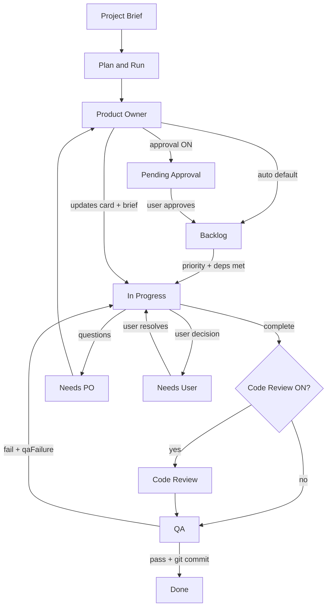

# All Hands Multi-Agent Workspace

Local multi-agent AI development workspace with Kanban board, Ollama-powered agents, skills, Monaco editor, chat composer, and file tree — inspired by Cursor IDE patterns.

**Localhost only** — binds to `127.0.0.1:6767`. No authentication. Do not expose to the network without adding your own auth layer.

## Prerequisites

- Python 3.10+
- Node.js 18+
- [Ollama](https://ollama.com/) (optional; offline simulation fallbacks exist when Ollama is unreachable)
- Git (optional; used for auto-commit on Done and the Git panel)

Recommended models:

```bash
ollama pull llama3:8b              # Product Owner
ollama pull qwen2.5-coder:14b      # Developer
ollama pull qwen2.5-coder:7b       # Code Reviewer & QA
ollama pull nomic-embed-text       # optional — semantic memory embeddings
```

## Quick start

```bash
pip install -r requirements.txt
python app.py
```

Open **http://127.0.0.1:6767**

### Development (hot reload frontend)

```bash
# Terminal 1 — backend
python app.py

# Terminal 2 — Vite dev server (proxies /api → :6767)
cd frontend
npm install
npm run dev
```

Open **http://127.0.0.1:5173**

### Production-style (single server)

```bash
cd frontend && npm install && npm run build && cd ..
pip install -r requirements.txt
python app.py
```

FastAPI serves the built SPA from `frontend/dist/`.

## Project layout

```
DevelopmentAgent/
├── app.py                 # Entry shim → backend.main
├── backend/
│   ├── main.py            # FastAPI app, CORS, static SPA mount
│   ├── api/               # REST + SSE route modules
│   ├── agents/            # ScrumAgent, tools, task context
│   ├── services/          # Sprint, workflow, git, terminal, events, logs
│   ├── workspace/         # File I/O, tree, search, revisions, tests
│   └── storage/           # SQLite projects, chat, memory, changelog
├── frontend/              # Vite + React + TypeScript
│   └── dist/              # Built assets (served by backend)
├── tests/                 # pytest smoke tests
├── workspace/             # Agent-written project files (runtime)
├── global_skills/         # Skill markdown library (runtime)
└── scrum_memory.db        # SQLite persistence (runtime, local-only — not committed)
```

---

## Agent workflow

The core loop is **Brief → PO → Dev → QA → Done**, with escalation lanes when agents need help.

### Typical paths

| Goal | Action |
|------|--------|
| Fully automated | Enter brief → **Plan & Run** (PO decomposes brief, then sprint runs) |
| Manual control | **Send Brief to PO Only** → **Execute Sprint Step** (one agent tick per click) |
| Continuous delivery | Enable **Auto Sprint** checkbox (re-runs sprint until blocked or max steps) |
| Add scope mid-project | **Add Feature** → appends to brief and sends to PO |

### Step-by-step

1. **Product Owner** decomposes the brief into backlog features with acceptance criteria, optional priority, and optional `blockedBy` dependencies.
2. **Developer** claims the highest-priority unblocked feature, implements code in the workspace, and moves it to QA (or Code Review if that toggle is on).
3. **Needs PO** — Developer questions go to the PO; PO clarifies requirements, updates the card and brief, returns the feature to In Progress.
4. **Needs User** — Developer needs a human decision (API keys, design choice). Resolve in the task detail modal; feature returns to In Progress.
5. **QA** validates against acceptance criteria and Definition of Done. Pass → **Done** (auto git commit). Fail → **In Progress** with structured `qaFailure` on the card.

### Workflow settings (sidebar → Workflow panel)

| Setting | Default | Purpose |
|---------|---------|---------|
| Require backlog approval | Off | New PO stories land in **Pending Approval** until you approve |
| Require code review | Off | Dev → **Code Review** (CR agent) → QA when ON |
| Definition of Done | Empty | Project checklist injected into PO / Dev / QA prompts |
| Max sprint steps | 20 | Cap for Auto Sprint and Plan & Run |
| Max LLM iterations/step | 8 | Tool-call loop limit per agent turn |

### Kanban lanes

**Always visible:** Backlog → In Progress → Needs PO → Needs User → QA → Done

**Conditional (when toggles ON):** Pending Approval, Code Review

**Task card fields:** `acceptanceCriteria`, `priority` (lower = sooner), `blockedBy` (task IDs that must be Done first), `qaFailure`, `userQuestion`, plus `files`, `decisions`, and `transcript` for audit.



---

## UI guide

### Sidebar

- **Load Workspace** — switch projects; Export / Import / Delete
- **Project Config** — workspace dir, skills dir, Ollama URL, per-agent models
- **Agent Team & Skills** — assign markdown skills from `global_skills/` to each agent
- **Workflow** — toggles, DoD editor, step limits, notification badges, brief changelog
- **Project Brief** — Plan & Run, Send Brief to PO, Execute Sprint Step, Auto Sprint

### Kanban board

- Drag cards between lanes (manual moves recorded on the card)
- Drag within **Backlog** to reorder priority
- Click a card for the task detail modal
- Badges: priority, blocked, QA failure, file count, decision count

### Task detail modal

- View/edit title, description, acceptance criteria
- **Approve** (when in Pending Approval)
- **Resolve & Return to Dev** (when in Needs User)
- Associated files, agent decisions, full transcript timeline
- QA failure panel with reason and output

### Bottom panels

| Tab | Purpose |
|-----|---------|
| Console | Persisted agent system logs (survive restart) |
| Chat | Streaming composer with agent selector and @file context |
| Terminal | xterm.js panel — run commands in workspace via API |
| Search | Workspace file content search (Ctrl+Shift+F style) |
| Git | Branch, status, recent changes |

### IDE area

- **File tree** — recursive workspace explorer
- **Monaco editor** — editable files, Ctrl+S save, dirty tab indicator
- **Diff panel** — view revisions when agents edit files
- **Theme toggle** — dark/light (Monaco follows app theme)

### Notifications (Workflow panel badges)

| Badge | Meaning |
|-------|---------|
| PO | Cards in Needs PO awaiting Product Owner |
| User | Cards in Needs User awaiting your input |
| Approve | Cards in Pending Approval |
| QA fail | Cards with an active `qaFailure` |

After **Plan & Run** or **Auto Sprint**, a sprint summary modal shows steps run, completed tasks, QA failures, and blocked items.

---

## Features

| Area | Capabilities |
|------|----------------|
| **Agents** | PO, Developer, Code Reviewer (optional gate), QA — Ollama LLM + tools |
| **Workflow** | Plan & Run, optional approval/review gates, DoD, brief changelog, sprint summary |
| **Kanban** | Dynamic lanes, drag-drop, priority, dependencies, AC, QA failure tracking |
| **IDE** | Monaco editor, file tree, diff view, workspace search, tabs |
| **Chat** | Streaming SSE composer, @file context injection, per-agent selection |
| **Sprint** | Manual step, auto-sprint with cancel, configurable step/iteration limits |
| **Git** | Status panel, agent git tools, auto-commit on Done |
| **Terminal** | Sandboxed command runner in workspace (localhost-only) |
| **Skills** | Global library scan, per-agent assignment, copy into workspace |
| **Memory** | TF-IDF + Ollama embeddings for agent context retrieval |
| **Projects** | Multi-project SQLite storage, export/import zip, delete |
| **Live updates** | SSE channel for board, files, logs, sprint events |

---

## Task model (Kanban cards)

Each task in `board_state` JSON supports:

| Field | Type | Description |
|-------|------|-------------|
| `id`, `title`, `description`, `status` | string | Core story fields |
| `acceptanceCriteria` | string[] | PO-defined; QA validates against these |
| `priority` | number | Lower = higher priority in Backlog |
| `blockedBy` | string[] | Task IDs that must reach Done first |
| `qaFailure` | object \| null | `{ reason, output, timestamp }` after QA reject |
| `userQuestion` | string \| null | Why the card is in Needs User |
| `files` | array | `{ path, action }` — files touched for this card |
| `decisions` | array | Agent/user decisions with timestamp |
| `transcript` | array | Full LLM + tool audit trail |

---

## State API (`GET /api/state`)

Returns the full workspace snapshot used by the frontend:

- `projectId`, `projectName`, `brief`, `workspaceDir`, `skillsDir`
- `board`, `files`, `logs`
- `availableSkills`, `assignedSkills`, `models`
- `projectsList`, `sprintCancel`
- `workflowSettings` — approval/review toggles, DoD, limits
- `activeLanes` — lanes to render based on settings
- `briefChangelog` — last 50 brief change entries
- `lastSprintSummary` — `{ stepsRun, completed, qaFailed, blocked, needsPo, needsUser }`
- `notifications` — `{ needsPo, needsUser, pendingApproval, qaFailures }`

---

## API reference

### State & events

| Method | Path | Description |
|--------|------|-------------|
| GET | `/api/state` | Full workspace snapshot |
| GET | `/api/events` | SSE live updates (board, files, logs, sprint) |

### Sprint & workflow

| Method | Path | Description |
|--------|------|-------------|
| POST | `/api/plan` | Send brief to PO (create backlog features) |
| POST | `/api/step` | Execute one sprint tick |
| POST | `/api/sprint/plan-and-run` | PO plan + auto-sprint in one call |
| POST | `/api/sprint/run` | Auto-sprint until blocked or max steps |
| POST | `/api/sprint/cancel` | Cancel running auto-sprint |
| GET | `/api/workflow/settings` | Read workflow settings |
| POST | `/api/workflow/settings` | Update workflow settings |

### Tasks & board

| Method | Path | Description |
|--------|------|-------------|
| POST | `/api/tasks/manual` | Add feature → brief + PO |
| POST | `/api/tasks/move` | Move card between lanes |
| PATCH | `/api/tasks/{id}` | Update title, description, AC, etc. |
| DELETE | `/api/tasks/{id}` | Delete a task |
| POST | `/api/tasks/{id}/approve` | Pending Approval → Backlog |
| POST | `/api/tasks/{id}/resolve-user` | Needs User → In Progress |
| POST | `/api/tasks/reorder` | Reorder Backlog by priority |

### Chat

| Method | Path | Description |
|--------|------|-------------|
| POST | `/api/chat` | Send message to an agent |
| POST | `/api/chat/stream` | Streaming SSE chat response |

### Files & workspace

| Method | Path | Description |
|--------|------|-------------|
| GET | `/api/files/tree` | Recursive workspace file tree |
| POST | `/api/files/save` | Save file content |
| GET | `/api/files/read` | Read file content |
| GET | `/api/files/search?q=` | Content search |
| GET | `/api/files/diff?path=` | Diff vs last revision |

### Projects

| Method | Path | Description |
|--------|------|-------------|
| POST | `/api/projects/create` | Create new project |
| POST | `/api/projects/load/{id}` | Load project |
| DELETE | `/api/projects/{id}` | Delete project (not active) |
| GET | `/api/projects/{id}/export` | Download project zip |
| POST | `/api/projects/import` | Import project zip |
| POST | `/api/config` | Update project config |
| POST | `/api/reset` | Reset board and workspace files |

### Skills, git, terminal, health

| Method | Path | Description |
|--------|------|-------------|
| GET | `/api/skills` | Scan global skills directory |
| POST | `/api/assign-skill` | Assign skill to agent |
| POST | `/api/remove-skill` | Remove skill from agent |
| GET | `/api/git/status` | Git branch and file status |
| POST | `/api/terminal/run` | Run command in workspace |
| GET | `/api/ollama/health` | Ollama connectivity and models |

See `backend/api/` for implementation details.

---

## Configuration

### Sidebar → Project Config

- Project name, workspace directory, global skills directory
- Ollama URL (default `http://localhost:11434`)
- Per-agent model names (PO, Dev, CR, QA)

### Skills directory

Place markdown skill files under `global_skills/` (or your configured path). Use **Add Skill** on an agent to copy a skill into the workspace and assign it. Skills are injected into that agent's system prompt.

### Workflow settings

Persisted per project in SQLite (`settings` table, key `workflow:{project_id}`). Update via sidebar toggles or `POST /api/workflow/settings`.

---

## Development

| Command | Purpose |
|---------|---------|
| `python app.py` | Run backend on `127.0.0.1:6767` |
| `cd frontend && npm run dev` | Vite dev on `:5173` (proxies `/api`) |
| `cd frontend && npm run build` | Build SPA to `frontend/dist/` |
| `cd frontend && npm run lint` | Run oxlint |
| `python -m pytest tests/ -q` | Run smoke tests |

### Architecture notes

- **Backend:** FastAPI modular monolith under `backend/`
- **Frontend:** Vite + React + TypeScript; `@dnd-kit` Kanban, Monaco editor, xterm.js terminal
- **Persistence:** SQLite (`scrum_memory.db`) — projects, board, files, logs, chat, revisions, brief changelog
- **Agents:** `ScrumAgent` uses the [Ollama Python SDK](https://github.com/ollama/ollama-python) against your local Ollama server. Tools are registered in `ToolRegistry` and passed via the native `tools` parameter; the agent loop executes `message.tool_calls` and feeds results back until the model finishes.
- **Security:** Binds localhost only; terminal and subprocess run with workspace cwd constraints

---

## Offline / no-Ollama mode

When Ollama is unreachable, agents return `SIMULATION_FALLBACK` and the sprint service uses deterministic offline paths (sample file writes, random QA pass/fail). The UI remains fully functional for exploring the workflow.
