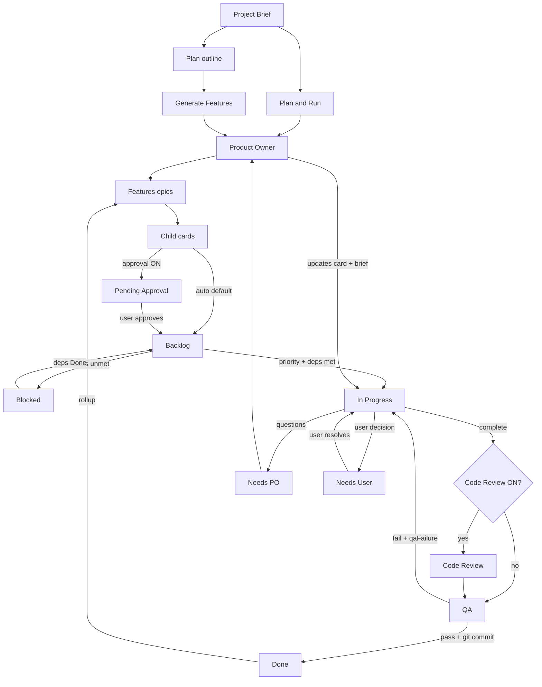
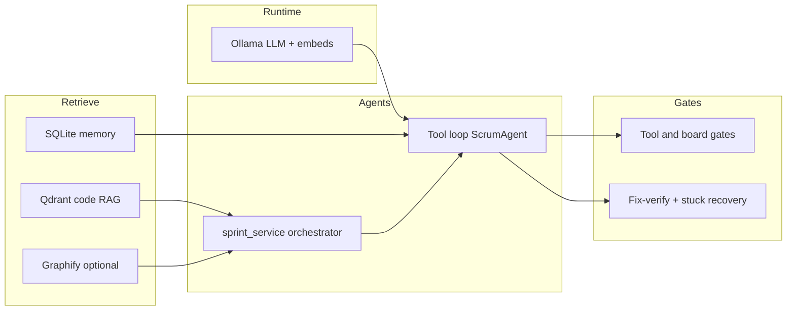

# All Hands Multi-Agent Workspace

Local multi-agent AI development workspace with Kanban board, Ollama-powered agents, skills, Monaco editor, chat composer, and file tree — inspired by Cursor IDE patterns.

**Localhost only** — binds to `127.0.0.1:6767`. No authentication. Do not expose to the network without adding your own auth layer.

## Contents

1. [Installation](#installation)
2. [Getting started](#getting-started)
3. [Recommended settings](#recommended-settings)
4. [Agent workflow](#agent-workflow)
5. [UI guide](#ui-guide)
6. [Features](#features)
7. [Task model](#task-model-kanban-cards)
8. [State API](#state-api-get-apistate)
9. [API reference](#api-reference)
10. [Configuration](#configuration)
11. [Development](#development)
12. [AI technology and patterns](#ai-technology-and-patterns)
13. [Known limitations](#known-limitations)
14. [Troubleshooting](#troubleshooting)
15. [Offline / no-Ollama mode](#offline--no-ollama-mode)

---

## Installation

### Requirements

| Component | Version | Required |
|-----------|---------|----------|
| Python | 3.10+ | Yes |
| Node.js | 18+ | Yes (frontend build/dev) |
| [Ollama](https://ollama.com/) | latest | Recommended (offline fallbacks exist) |
| Git | any | Optional (auto-commit on Done, Git panel) |

### Clone and install

```bash
git clone <your-repo-url>
cd DevelopmentAgent
python -m venv .venv
```

Activate the virtual environment:

```bash
# Windows (PowerShell)
.venv\Scripts\Activate.ps1

# macOS / Linux
source .venv/bin/activate
```

```bash
pip install -r requirements.txt
cd frontend
npm install
cd ..
```

Python dependencies include FastAPI, Ollama SDK, Qdrant client, and pytest. See [requirements.txt](requirements.txt).

### Run the app

**Production-style (single server)**

```bash
cd frontend && npm run build && cd ..
python app.py
```

Open **http://127.0.0.1:6767** — FastAPI serves the built SPA from `frontend/dist/`.

**Development (hot reload frontend)**

```bash
# Terminal 1 — backend
python app.py

# Terminal 2 — Vite dev server (proxies /api → :6767)
cd frontend
npm run dev
```

Open **http://127.0.0.1:5173**

### Optional services

| Service | Install | Purpose |
|---------|---------|---------|
| Ollama | [ollama.com](https://ollama.com/) | LLM inference + embeddings |
| Qdrant | `docker run -p 6333:6333 qdrant/qdrant` | Semantic codebase search |
| Graphify | CLI on `PATH` | `graph_query` structural code graph tool |
| Flutter SDK | [flutter.dev](https://docs.flutter.dev/get-started/install) | `flutter analyze` via `run_command` in Flutter workspaces |
| .NET SDK | [dotnet.microsoft.com](https://dotnet.microsoft.com/download) | `dotnet build` / test in .NET workspaces |

### Recommended Ollama models

```bash
ollama pull llama3:8b              # Product Owner
ollama pull qwen2.5-coder:14b      # Developer
ollama pull qwen2.5-coder:7b       # Code Reviewer & QA
ollama pull nomic-embed-text       # Embeddings (memory + Qdrant)
```

Verify models in the sidebar **Project Config** section or `GET /api/ollama/health`. Use `GET /api/ollama/model-recommendations` for suggestions based on system RAM.

### Environment and persistence

| Variable | Default | Purpose |
|----------|---------|---------|
| `ALLHANDS_HOME` | `~/.allhands` | Runtime data directory ([backend/config.py](backend/config.py)) |

SQLite database: `~/.allhands/scrum_memory.db` — projects, board state, chat, agent memories, file revisions, brief changelog. On first run, an existing `scrum_memory.db` in the project root is copied to `ALLHANDS_HOME` automatically.

### Project layout

```
DevelopmentAgent/
├── app.py                 # Entry shim → backend.main
├── backend/
│   ├── main.py            # FastAPI app, CORS, static SPA mount
│   ├── api/               # REST + SSE route modules
│   ├── agents/            # ScrumAgent, tools, task context
│   ├── services/          # Sprint, workflow, git, terminal, events, logs
│   ├── workspace/         # File I/O, tree, search, revisions, tests
│   └── storage/           # SQLite projects, chat, memory, changelog
├── frontend/              # Vite + React + TypeScript
│   └── dist/              # Built assets (served by backend)
├── tests/                 # pytest smoke tests
├── workspace/             # Agent-written project files (runtime)
├── global_skills/         # Skill markdown library (runtime)
```

---

## Getting started

Follow these steps for your first project:

1. **Start the app** — `python app.py` (and `npm run dev` in `frontend/` if developing the UI).
2. **Create or load a project** — sidebar **Load Workspace** → create new or pick existing. Set **workspace directory** to the root of the codebase agents should edit (must contain your project files, e.g. `pubspec.yaml` for Flutter).
3. **Configure Ollama** — sidebar **Project Config**: Ollama URL (default `http://localhost:11434`), model names for PO / Dev / CR / QA.
4. **Write a Project Brief** — panel above the Kanban. Be specific about stack, constraints, and success criteria.
5. **Plan work** — choose one path:
   - **Fast:** **Plan outline** → **Generate Features from plan** → **Execute Sprint Step**
   - **Automated:** **Plan & Run (Brief → Features → Sprint)**
6. **Watch agents work** — open bottom tabs **Console**, **Tools**, and **Model** during sprint steps. The **Agent Run bar** above the bottom panel shows live tool activity via SSE, and after a step finishes shows Step / Ollama / Tools time plus token totals when Ollama reports them. Kanban cards show a compact **agent usage** line (time · tokens) once steps have run; open the card for a per-role **Agent usage** breakdown. If the app was interrupted mid-sprint, a **recovery banner** offers resume/dismiss (no auto-sprint).
7. **Unblock cards** — click Kanban cards for the task detail modal. Resolve **Needs User** answers; approve **Pending Approval** cards. Use **Claim ready cards** or **Run In Progress (N)** when Dev should run while PO cards wait.
8. **Pin project facts** — bottom **Memory** tab: save conventions (API keys location, auth patterns) so all agents see them in prompts.
9. **Optional: semantic search** — start Qdrant, enable **Enable semantic search** in Workflow, then **Reindex codebase**.
10. **Optional: agent tools** — Workflow → **Agent tools** for per-agent allowlists. Tool Lab: **Tools → Health** (pass/fail checklist), **Manual Test**, **Custom tools**.

### Example brief (minimal REST API)

```
Build a small Python FastAPI todo API in the workspace folder.
Stack: FastAPI, pydantic, no database (in-memory list).
Include GET/POST /todos and DELETE /todos/{id}.
Add pytest tests. Run ruff check before marking done.
Do not add auth unless I approve in Needs User.
```

---

## Recommended settings

All settings live in sidebar **Workflow** and persist per project in SQLite. Defaults are in [backend/services/workflow_settings.py](backend/services/workflow_settings.py).

### Small project / first try (defaults)

| Setting | Value |
|---------|-------|
| prioritizeImplementationOverRefinement | ON |
| enableSemanticSearch | ON (works without Qdrant for memory; Qdrant adds codebase search) |
| requireToolApproval | OFF |
| pauseSprintOnNeedsUser | OFF |
| Models | PO `llama3:8b`, Dev `qwen2.5-coder:14b`, CR/QA `qwen2.5-coder:7b` |

### Quality gate (team review)

| Setting | Value |
|---------|-------|
| requireBacklogApproval | ON |
| requireCodeReview | ON |
| requireDevVerification | ON |
| requireCleanLint | ON |
| definitionOfDone | Add project checklist (tests pass, lint clean, docs updated) |

### Refinement-heavy product work

| Setting | Value |
|---------|-------|
| requireBacklogRefinement | ON |
| maxRefinementRoundTrips | 3 |
| prioritizeImplementationOverRefinement | ON (Backlog before more Refinement) |

### Safer autonomous runs

| Setting | Value |
|---------|-------|
| requireToolApproval | ON |
| toolApprovalTools | write_file, run_command, delete_file |
| commandAutoRunMode | allowlist |
| maxNeedsUserPerSprint | 2 |
| autonomousMode | OFF until brief and AC are stable |

### Performance / large context (16 GB+ RAM)

| Setting | Value |
|---------|-------|
| ollamaNumCtx | 32768 |
| embedModel | nomic-embed-text |
| enableSemanticSprintContext | ON |
| Reindex | After large workspace changes |

### Low-RAM / CPU-only

| Setting | Value |
|---------|-------|
| Dev model | qwen2.5-coder:7b |
| ollamaNumCtx | 16384 |
| enableSemanticSearch | OFF if Qdrant unavailable |
| maxLlmIterationsPerStep | 6 |

---

## Agent workflow

The core loop is **Brief → Features (epics) → Dev → QA → Done**, with escalation lanes when agents need help.

### Typical paths

| Goal | Action |
|------|--------|
| Fully automated | Enter brief → **Plan & Run** (creates Features epics + children, then sprint) |
| Fast planning | **Plan outline** → **Generate Features from plan** → sprint manually |
| Manual control | **Send Brief to PO Only** → **Execute Sprint Step** |
| Dev on active cards | **Run In Progress (N)** — Dev only; skips Needs PO / Backlog / Refinement |
| Pull ready work | **Claim ready cards** — unblocked Backlog → In Progress |
| Continuous delivery | **Auto Sprint** checkbox |
| Add scope | **Add Feature** → brief + PO |

### Features lane (epics)

**Plan outline** and **Generate Features from plan** (also **Plan & Run**) create **Features-lane** parent epics with child cards under each epic.

- PO guidance prefers **6–12 focused product epics** for a non-trivial brief (one capability or bounded slice each), each with **≥2 small children** (prefer 3–6).
- Anti-patterns avoided: mega “audit everything”, standalone pubspec/dependency bumps, vague tracking-only epics.
- Soft validation: few epics + a long brief/outline logs an **under-decomposition** warning in Console (cards are still created — re-run Generate Features after expanding the outline).
- Task detail on an epic shows an **epic hub**: child status, rolled-up files, and recent decisions.

Children enter the normal Backlog / refinement / implementation lanes; Features parents stay in the Features lane for rollup.

### Refinement lane and spikes

When **Require backlog refinement** is ON, Backlog cards can enter **Refinement** before implementation. Dev and PO iterate on `refinementNotes`; spike cards (`workType: spike`) produce a `spikeReport`. During refinement, Dev intentionally has **no** `write_file` / `apply_patch` / `run_command` (unless `agentToolsAllowWritesInRefinement` is ON).

**Prioritize implementation over refinement** (default ON) makes sprint steps pick **Backlog → In Progress** before more Refinement when both lanes have work.

Task detail: **Move to In Progress** with optional **Skip remaining refinement**.

### Subtasks and dependencies

Cards support `parentTaskId`, `subtaskIds`, and `blockedBy`. When blockers reach Done, **dependency outcome rollup** copies summaries to the parent (`dependencyOutcomes`) and injects them into prompts. Invalid blockers show warnings in task detail.

### Sprint handler order (Execute Sprint Step)

Needs PO → Needs User (if pause setting ON) → In Progress → Backlog/Refinement (when configured) → Code Review → QA.

**Run In Progress** bypasses this and runs Dev on the In Progress lane only.

### Step-by-step

1. **Product Owner** decomposes the brief into **Features (epics)** with smallest child cards (acceptance criteria, priority, optional `blockedBy`).
2. **Developer** implements child cards in the workspace; moves to QA or Code Review when complete.
3. **Needs PO** — PO clarifies requirements and returns the card to In Progress.
4. **Needs User** — human decision required; resolve in task detail.
5. **QA** validates against AC and DoD. Pass → **Done** (auto git commit). Fail → **In Progress** with `qaFailure`.
6. Child **Done** rolls files/decisions up to the parent Feature epic.

### Workflow settings (full reference)

Persisted per project. Update via sidebar **Workflow** or `POST /api/workflow/settings`.

#### Gates

| Setting | Default | Purpose |
|---------|---------|---------|
| requireBacklogApproval | Off | New stories → **Pending Approval** first |
| requireBacklogRefinement | Off | Backlog → **Refinement** before implementation |
| prioritizeImplementationOverRefinement | On | Sprint picks Backlog before Refinement |
| requireCodeReview | Off | Dev → **Code Review** → QA |
| requireDevVerification | Off | Dev must verify before leaving In Progress |
| requireCleanLint | Off | Lint must pass before advance |
| requireWorkspaceStructure | On | Block Code Review/QA while critical scaffold files are MISSING (known stacks only) |
| autoScaffoldOnStructureGap | On | Auto-run Vite / dotnet new / Python stubs once when structure is critically incomplete |

#### Refinement and subtasks

| Setting | Default | Purpose |
|---------|---------|---------|
| maxRefinementRoundTrips | 3 | Dev/PO refinement cap before Needs PO |
| maxSubtaskDepth | 4 | Max nesting depth for subtasks |
| maxSubtaskSpawns | 8 | Max subtasks per parent |

#### Sprint limits

| Setting | Default | Purpose |
|---------|---------|---------|
| maxSprintSteps | 20 | Cap for Auto Sprint and Plan & Run |
| maxLlmIterationsPerStep | 8 | Tool-call loop limit per agent turn |
| autoExtendOnMaxIter | **Off** | Auto-extend once when Dev hits max iterations with progress (writes/tools). Manual Extend remains |
| autoExtendExtraIterations | 4 | Extra iterations for auto-extend |
| maxPoRoundTrips | 3 | PO clarification rounds per card |
| maxStuckSteps | 3 | Escalate when card does not move (`stuckLoops` → Needs PO; Settings → Workflow) |
| maxAgentStepDurationSec | 2700 | Wall-clock cap per agent tool loop (45 min). Ends with `Timed out:…` |
| enableBlockedLane | On | Auto-move unmet `blockedBy` cards into **Blocked** (healthy wait); sprint never claims them |
| enableBackupModelOnStuck | On | Use per-agent backup model for the next N stuck steps (Settings → Models) |
| backupModelStuckSteps | 2 | How many steps to run on the backup model before reverting to primary |
| enableSplitOnStuck | On | After backup attempts fail at `maxStuckSteps`, auto-split once via PO before Needs PO |
| enableVramAwareModelSwap | On | Unload primary before loading backup when GPU VRAM &gt;85% full |
| maxToolFailuresPerStep | 5 | Stop agent loop after N tool failures (Settings → Workflow) |
| pauseSprintOnNeedsUser | Off | Idle sprint while Needs User cards exist |

#### Autonomous behavior

| Setting | Default | Purpose |
|---------|---------|---------|
| autonomousMode | Off | Reduce Needs User escalations |
| maxNeedsUserPerSprint | 2 | Cap Needs User cards per auto-sprint run |
| needsUserCooldownSteps | 3 | Steps between Needs User escalations |
| autoStartSprint | On | Auto-start sprint after Plan & Run (Settings → Workflow) |

#### Tools and safety

| Setting | Default | Purpose |
|---------|---------|---------|
| requireToolApproval | Off | Approve/deny listed tools before execute |
| toolApprovalTools | write_file, run_command, delete_file | Tools requiring approval — editable in Workflow when approval is on (`apply_patch` implied with write_file; use `customTools` or `*` for customs) |
| nonBlockingToolApproval | On | Other tools continue while awaiting approval |
| commandAutoRunMode | off | off / allowlist / denylist for run_command (shown when tool approval is on) |
| commandAllowlist | flutter analyze, pytest, … | Allowed commands when mode is allowlist |
| commandDenylist | rm, del, … | Blocked commands when mode is denylist |
| allowChainedCommands | **On** | Allow `&&` / `;` chained shell commands. Always visible under Settings → Workflow (not gated by tool approval). Redirects (`\| > <`) remain blocked. |
| enableFixVerifyLoop | Off | Auto retry lint/fix loop after Dev step (also on when requireCleanLint is On) |
| maxFixVerifyRounds | 3 | Max fix-verify iterations |
| maxInCardLintFixes | 5 | Max lint findings to fix on the current feature card |
| lintFanoutThreshold | 6 | When analyze findings ≥ this, fan leftovers to related Backlog cards |
| maxLintFanoutCards | 8 | Max related lint follow-up cards spawned per fan-out (grouped by file) |
| agentTools | `{}` | Opt-in per-agent tool allowlists; empty role → built-in defaults |
| agentToolsAllowWritesInRefinement | Off | Keep write/run/git_commit available during refinement |
| customTools | `[]` | Project-scoped user tools (shell / http / sql). Merged with **global** tools from `~/.allhands` (`global_custom_tools`); same name → project wins. Edit in **Tools → Custom tools**. |
| terminalTimeoutSec | 600 | Shell `run_command` timeout floor; long builds use remaining step time (up to 30 min) |

#### Search and context

| Setting | Default | Purpose |
|---------|---------|---------|
| enableSemanticSearch | On | Qdrant codebase indexing and search |
| qdrantUrl | http://localhost:6333 | Qdrant server URL |
| qdrantApiKey | (empty) | Optional Qdrant API key |
| embedModel | nomic-embed-text | Ollama embedding model |
| enableSemanticSprintContext | On | Inject semantic + graph context into sprint prompts |
| enableHybridSearch | On | Fuse dense Qdrant hits with lexical workspace scan (RRF) |
| semanticMinScore | 0.35 | Drop weak dense hits from sprint inject |
| semanticSprintTopK | 3 | Max semantic chunks injected per sprint step |
| sprintFileContextMode | excerpt | `excerpt` = paths + short signatures (default); `full` = whole file bodies |
| enableObservationSummaries | On | Compact `=== OBSERVATION ===` after each tool batch |
| enableEpisodeSummary | On | Fold pruned tool messages into `=== EPISODE SUMMARY ===` |
| enableStepLessonMemory | On | Save one structured lesson to memory at end of each agent step |
| enableLlmContextCompress | **Off** | When sprint inject (semantic + files) exceeds `contextCompressMinChars`, one extra Ollama call shrinks it to `contextCompressMaxChars` (fail-open). Off by default because it adds a call per step |
| contextCompressMinChars | 8000 | Minimum inject size before compress runs |
| contextCompressMaxChars | 3500 | Target size after compress |
| contextCompressModel | (empty) | Ollama model for compress; empty uses the step agent's own model (no extra model load) |
| enableWebSearch | Off | Web search tool for agents |
| ollamaNumCtx | 32768 | Context window hint for Ollama (Dev default) |
| ollamaNumCtxByRole | `{}` | Optional per-role `{po,dev,cr,qa}` overrides; unset PO/CR/QA use min(global, 16384) |
| ollamaNumCtxAuto | **On** | When On, halve Dev num_ctx on low/minimal VRAM tiers |
| ollamaKeepAlive | 30m | Ollama model keep-alive duration |
| ollamaRequestTimeoutSec | 300 | Per-request timeout for Ollama calls |
| ollamaMaxRetries | 4 | Retries on transient Ollama failures |
| ollamaRetryDelaySec | [0, 2, 5, 10] | Delay schedule between retries (comma-separated list in Settings → Workflow) |
| ollamaCooldownRetryEnabled | On | Extra cooldown retries when Ollama is busy |
| ollamaCooldownRetrySec | 15 | Cooldown wait between busy retries |
| ollamaCooldownRetryAttempts | 2 | Max cooldown retry attempts |

#### MCP and other

| Setting | Default | Purpose |
|---------|---------|---------|
| mcpServers | [] | MCP server configs (stdio, http, or sse; tools as `mcp_{server}_{tool}`). Editable as JSON under Settings → Workflow. |
| maxMcpTools | 40 | Max MCP tools registered |
| definitionOfDone | [] | Checklist injected into PO/Dev/QA prompts |
| autoFormatAfterEdit | On | Format files after agent edits when supported |
| maxToolOutputCharsForLlm | 6000 | Truncate tool output in LLM context |
| messagePruneThresholdPct | 60 | Prune message history when context fills |

#### Phone alerts (outbound Discord)

Outbound HTTPS only — **does not open ports** on your PC. Notifications go to Discord; use the Discord mobile app for phone push.

| Setting | Default | Purpose |
|---------|---------|---------|
| phoneNotifyEnabled | Off | Master switch (Settings → Workflow → Phone alerts) |
| phoneNotifyProvider | discord | Discord webhook (v1) |
| phoneNotifyDiscordWebhookUrl | (secret) | Channel webhook URL — never logged or returned to the UI after save |
| phoneNotifyOnNeedsUser | On | Alert when a card needs your answer |
| phoneNotifyOnNeedsPo | Off | Alert when a card moves to Needs PO (non-stuck paths) |
| phoneNotifyOnStuckEscalation | On | Alert when stuck ladder escalates to Needs PO |
| phoneNotifyOnStepTimeout | On | Alert when an agent step hits the wall-clock timeout |
| phoneNotifyOnBackupArmed | On | Alert when a backup model is armed for a card |
| phoneNotifyOnToolApproval | On | Alert when a tool awaits approval |
| phoneNotifyOnSprintEnd | On | Sprint finished / cancelled / max-steps summary |
| phoneNotifyOnBoardStatus | On | After each sprint step: lane counts + current work (deduped ~3 min if unchanged) |

**Setup:** Discord channel → Edit Channel → Integrations → Webhooks → New Webhook → Copy URL → paste under Settings → Workflow → Phone alerts → enable → **Send test**. Prefer a **private** server/channel with only you. If the URL leaks, delete/regenerate the webhook.

`POST /api/workflow/phone-notify/test` sends a test message.

#### Discord control bot (optional, localhost)

Optional **inbound-from-Discord** quick actions via the Discord Gateway (**outbound** from this PC — no public HTTPS Interactions endpoint, no inbound ports). The bot runs **in-process** with the AllHands backend and only exposes a fixed slash-command set (no free-form Dev chat, no arbitrary shell, no free-text model tags).

**Threading / UI:** Slash handlers `defer` then run command logic via `asyncio.to_thread` (not on the browser UI thread). `/ah-resume` starts auto-sprint on a **daemon thread**. The React SPA never talks to Discord Gateway — it only reads cheap `discordBotStatus` from `/api/state`.

| Setting | Default | Purpose |
|---------|---------|---------|
| discordBotEnabled | Off | Master switch (Settings → Workflow → Phone / Discord control) |
| discordBotToken | (secret) | Bot token — never returned to the UI after save |
| discordBotGuildId | (empty) | Optional guild for faster slash-command sync |
| discordBotAllowedUserIds | [] | Discord user IDs allowed to run commands (required) |
| discordModelPresetFast | `qwen2.5-coder:7b` | `/ah-model fast` maps to this Ollama tag |
| discordModelPresetQuality | `qwen2.5-coder:14b` | `/ah-model quality` maps to this Ollama tag |

| Slash command | Behavior |
|---------------|----------|
| `/ah-status` | Board digest + sprint cancel flag |
| `/ah-pause` | Set sprint cancel (pause auto-sprint) |
| `/ah-resume` | Clear cancel and start auto-sprint in the background (no double-start) |
| `/ah-cancel` | Same cancel flag; reply says cancelled (no auto-resume) |
| `/ah-backup-dev` | Force-arm Dev backup for active In Progress card (optional `task_id`) |
| `/ah-model` | Choice `fast` \| `quality` — applies preset to Dev primary (optional all roles) |
| `/ah-feature` | Create **draft** Feature + backlog child; does **not** start a sprint |
| `/ah-pending` | List Needs User cards + Pending Approval cards + pending tool approvals |
| `/ah-answer` | Answer a Needs User card (`answer`, optional `task_id`, `target` = dev/refinement/po) |
| `/ah-approve` | `kind=tool` (default): approve/deny tool approval; `kind=card`: approve Pending Approval → Backlog |
| `/ah-claim` | Claim ready backlog cards into In Progress (optional `limit`, default 3) |
| `/ah-extend` | Extend Dev step iterations for In Progress / recovery card (optional `task_id`, `extra`) |

**Remote unblock:** Phone alerts for Needs User / tool approval can be acted on from Discord via `/ah-pending` + `/ah-answer` / `/ah-approve` — no desktop UI required for those paths.

**Setup:** Create a Discord application → Bot → copy token → invite bot to your private server with `applications.commands` → enable Developer Mode → copy your user ID → paste under Settings → Workflow → Phone / Discord control → enable → save. Training export / LoRA is unrelated.

Requires `discord.py` (see `requirements.txt`). Actions are logged as `source=discord`.

### Custom tools (Workflow → Agent tools)

Add tools without code changes. Each entry has `name`, `description`, JSON Schema `parameters`, `agents` (roles), and an `executor`:

| Executor | Config | Behavior |
|----------|--------|----------|
| `sql` | `sql.connections`, `readOnly`, `maxRows` | In-process **SQLite** only (`sqlite:///…` relative to workspace). Read-only allows `SELECT` / `WITH`. |
| `shell` | `shell.command` | Template with `{param}` placeholders (shell-quoted); runs via `run_command` policy |
| `http` | `http.url`, `http.method` | JSON body (POST) or query string (GET) |

Example `query_sql` (also available as a **+ query_sql template** button in Workflow):

```json
{
  "name": "query_sql",
  "description": "Run a read-only SQL query against a named database connection.",
  "parameters": {
    "type": "object",
    "properties": {
      "db_name": { "type": "string" },
      "query": { "type": "string" }
    },
    "required": ["db_name", "query"]
  },
  "agents": ["Developer", "QA Tester"],
  "executor": "sql",
  "sql": {
    "connections": { "local": "sqlite:///data/app.db" },
    "readOnly": true,
    "maxRows": 200
  }
}
```

Custom tools appear in the agent’s Ollama `tools` list. If an allowlist is set for that agent, the custom name must be included on the list.

### Kanban lanes

**Always visible:** Features (Epics) → Backlog → In Progress → Needs PO → Needs User → QA → Done

**Conditional:** Pending Approval, Code Review, Refinement, **Blocked** (when `enableBlockedLane` is on — default)

#### Blocked vs agent loop stop vs stuck loops

| Term | Meaning | Board / UX |
|------|---------|------------|
| **Blocked (lane)** | Healthy wait: `blockedBy` not all Done | Auto move into **Blocked**; auto release when deps Done. Sprint does not claim these cards. |
| **Agent loop stop** | Same tool+args repeated, max tool failures, max LLM iterations, or **max step duration** | Card stays In Progress; result = clear `Stopped:…` / `Timed out:…` |
| **Stuck loops** | Sprint steps with **no lane move** (`stuckLoops`) | Ladder: arm **backup model** → at `maxStuckSteps` **auto-split** once (if `enableSplitOnStuck`) → else Needs PO. No subagents. |
| **Deadlock** | Cycle / all-missing blockers | Needs User |


```mermaid
flowchart TB
    Brief[Project Brief] --> PlanOutline[Plan outline]
    PlanOutline --> GenFeat[Generate Features]
    Brief --> PlanRun[Plan and Run]
    PlanRun --> PO[Product Owner]
    GenFeat --> PO
    PO --> Features[Features epics]
    Features --> Children[Child cards]
    Children -->|auto default| Backlog[Backlog]
    Children -->|approval ON| Pending[Pending Approval]
    Pending -->|user approves| Backlog
    Backlog -->|deps unmet| BlockedLane[Blocked]
    BlockedLane -->|deps Done| Backlog
    Backlog -->|priority + deps met| Dev[In Progress]
    Dev -->|complete| CRgate{Code Review ON?}
    CRgate -->|yes| CR[Code Review]
    CRgate -->|no| QA[QA]
    CR --> QA
    Dev -->|questions| NeedsPO[Needs PO]
    Dev -->|user decision| NeedsUser[Needs User]
    NeedsPO --> PO
    PO -->|updates card + brief| Dev
    NeedsUser -->|user resolves| Dev
    QA -->|pass + git commit| Done[Done]
    QA -->|fail + qaFailure| Dev
    Done -->|rollup| Features
```

### Agent tools

Default registration is in [backend/agents/registry.py](backend/agents/registry.py) via `configure_agent_tools`. Override per role in Workflow → **Agent tools** (`agentTools`).

| Tool | Typical agents | Purpose |
|------|----------------|---------|
| read_file, list_dir | All | Read workspace |
| write_file, apply_patch, delete_file | Dev, CR | Edit code (Dev only outside refinement by default) |
| run_command | Dev, QA | Shell in workspace |
| update_board, add_backlog_tasks, add_subtasks | PO, Dev | Kanban updates |
| grep, glob_file_search, search_code | PO, Dev, CR | Find code |
| semantic_search, graph_query | When enabled | Qdrant / Graphify |
| git_status, git_diff, git_commit | Dev | Git operations |
| web_search | When enabled | Optional web lookup |
| Custom tools | Per tool `agents` list | Project `customTools` + global `global_custom_tools` (Tool Lab) |
| MCP tools | Configurable | External MCP servers (filtered by allowlist when set) |

Prefer **apply_patch** for edits to existing files; **write_file** for new files or full rewrites.

**Unknown tools:** If the model invents a name (e.g. `flutter_analyze`), the **Unknown Tool Request** modal maps it to a real tool and can save a per-project alias. If it calls a **real** tool that is not on that agent/mode (e.g. `write_file` during refinement), the call fails with a Console warning — **do not** map `write_file` → `write_file`; that does not enable the tool. Built-in aliases (`create_file` → `write_file`, `Write` → `write_file`, `Bash` → `run_command`, …) live in [backend/services/tool_aliases.py](backend/services/tool_aliases.py).

---

## UI guide

During sprint steps, the **Agent Run bar** above the bottom panel shows live tool activity (SSE `tool_start`, `tool_end`, `agent_run`). After a step, it also shows Step / Ollama / Tools duration and token totals when available.

### Sidebar

- **Load Workspace** — create, load, export, import, delete projects
- **Project Config** — workspace dir, skills dir, Ollama URL, per-agent models
- **Agent Team & Skills** — assign markdown skills from `global_skills/`
- **Workflow** — gates, DoD, Qdrant/reindex, brief changelog, **Agent tools** (per-agent allowlists + custom tools), Memory link
- **Sprint** — Plan outline, **Generate Features from plan**, Plan & Run, Execute Sprint Step, **Run In Progress**, **Claim ready cards**, Auto Sprint, Cancel run
- **Escalate Needs User → PO** — when cards are clarification, not true user decisions

### Kanban board

- **Features (Epics)** lane — parent epics from Generate Features / Plan & Run (not drag targets for implementation cards)
- Drag other cards between lanes; drag within **Backlog** to reorder priority
- Click a card for task detail
- Badges: priority, blocked, QA failure, file count, decision count
- Live run info on cards while a sprint step is active

### Task detail modal

- View/edit title, description, acceptance criteria
- **Agent progress** — derived done/pending/blocked checklist for Dev/CR/PO process work (reads, edits, verify, lane gates). Separate from **Acceptance Criteria (QA)** checkboxes. Status reflects evidence on the card (not a live “current step”). While a step runs, the first pending/blocked row is a **suggested focus** hint only.
- **Flow** — on-demand ordered LLM↔tool graph with full prompt/response/tool text from persisted logs + step diagnostics (not stored in board/page memory). Tags each call **by tool type**; one LLM turn can match multiple progress rows. Filtering by a progress row shows tagged nodes (primary row used for highlight when a call matches several). `GET /api/tasks/{id}/flow`
- Compact agent checklist also on the kanban **card** (`agentWorkItems`)
- **Feature epic hub** — children, rolled-up files, recent decisions (`featureRollup`)
- **Approve** (Pending Approval)
- **Resolve & Return to Dev** (Needs User)
- **Move to In Progress** / **Skip remaining refinement** (Backlog or Refinement)
- **Run dev step on this card** (In Progress — skips Needs PO)
- **Diagnose card** — AI root-cause analysis
- **Retry step** — same / optimized / fix_and_verify modes
- **Split task** — PO creates subtasks
- **Escape subtasks** — exit stuck subtask loop
- Missing blocker warnings for invalid `blockedBy`
- Associated files, decisions, transcript (filter failures)
- QA failure panel; **Provide command output** for next sprint step
- **Clear transcript**; git commit info when Done
- Open file diffs from associated files

### Bottom panels

| Tab | Purpose |
|-----|---------|
| Console | Persisted agent system logs (includes under-decomposition and gated-tool warnings) |
| Model | LLM debug timeline — prompts, tool calls, `memoriesUsed`, `decisionsIncluded` (filters by selected task) |
| Tools | Tool Lab: execution log, **Manual Test**, **Health** (pass/fail probes), **Custom tools** (project + global), replay, approvals / unknown-tool mapping, stack catalog, terminal sessions |
| Activity | Board / sprint activity stream (debounced SSE) |
| Memory | View, filter, add, edit, delete project memories |
| Chat | Streaming composer, agent selector, @file context |
| Terminal | xterm.js — run commands in workspace |
| Search | Workspace file content search |
| Git | Branch, status, recent changes |

#### Tool Lab (Tools tab)

| Subtab | Purpose |
|--------|---------|
| Execution Log | Live/history tool events (filter by source, task, failures) |
| **Manual Test** | Pick agent + tool, edit JSON args, **Run tool** without a sprint step (`POST /api/tools/execute`) |
| **Health** | Checklist of tools for an agent with green/red/amber status; **Test** / **Test all safe** smoke probes; **Ask model** / **Ask model (all safe)** LLM-driven calls; optional auto LLM-test when a model is picked in Settings → Models (`POST /api/tools/probe`, `/api/tools/probe-llm`) |
| **Custom tools** | Create shell / http / sql tools for **This project** or **Global (all projects)**; Save reconfigures agent registries |
| Replay | Re-run tool calls from a task transcript |
| Stack Reference | Detected stack catalog |

Shortcut: Settings → Workflow → **Open Tools → Custom tools**. After Save, new tools appear under Manual Test for the agents you assigned.

#### Agent usage (time + tokens)

| Where | What you see |
|-------|----------------|
| Kanban **task card** | Compact line when usage exists (e.g. `Dev 2h · 1.3M tok`) |
| Card **detail modal** | **Agent usage** block — per role: wall / Ollama / tools time, steps, calls, tokens in/out |
| **Agent Run bar** | After a step: Step / Ollama / Tools ms and token totals when Ollama reported `prompt_eval_count` / `eval_count` |

Totals accumulate across steps on that card after the feature is enabled; older cards do not backfill.
#### Memory tab filters

| Control | Purpose |
|---------|---------|
| Type | All / User notes / Tool outcomes |
| Agent | Filter by agent (Project = `__project__` scope) |
| Category | user_note, fix_pattern, failure, tool_usage (legacy) |
| Search | Content substring filter |
| Group duplicates | Collapse identical content; bulk delete grouped rows |

Memories auto-save on **fix_pattern** (file writes) and **failure** (failed tools) only — not every tool call. Identical notes are not inserted twice.

### IDE area

- **File tree** — recursive workspace explorer
- **Monaco editor** — editable files, Ctrl+S save, dirty tab indicator
- **Diff panel** — view revisions when agents edit files
- **Theme toggle** — dark/light

### Notifications (Workflow badges)

| Badge | Meaning |
|-------|---------|
| PO | Cards in Needs PO |
| User | Cards in Needs User |
| Approve | Cards in Pending Approval |
| QA fail | Cards with active `qaFailure` |

After **Plan & Run** or **Auto Sprint**, a sprint summary modal shows steps run, completed tasks, QA failures, and blocked items.

After a crash or power loss mid-sprint, a **recovery banner** shows the interrupted task; choose resume or dismiss (`GET /api/sprint/recovery`).

---

## Features

| Area | Capabilities |
|------|----------------|
| **Agents** | PO, Developer, Code Reviewer (optional), QA — Ollama LLM + tools |
| **Workflow** | Plan outline → **Generate Features** (epics + children), Plan & Run, refinement/spikes, gates, DoD, brief changelog |
| **Features / epics** | Features lane, 6–12 product-epic guidance, under-decomposition warnings, epic rollup hub |
| **Kanban** | Features + dynamic lanes, drag-drop, priority, dependencies, subtasks, claim-ready, Run In Progress |
| **IDE** | Monaco editor, file tree, diff view, workspace search |
| **Chat** | Streaming SSE, @file context, per-agent selection |
| **Sprint** | Manual step, dev-only in-progress, auto-sprint with cancel, crash recovery banner |
| **Git** | Status panel, agent git tools, auto-commit on Done |
| **Terminal** | Sandboxed command runner (localhost-only) |
| **Skills** | Global library, per-agent assignment, suggestions API |
| **Memory** | Cross-agent project notes, semantic search, dedupe, filters |
| **Search** | Qdrant semantic search, Graphify graph, reindex |
| **Debug** | Model panel, Ollama LLM logs, per-task timeline, Ollama server log fallback |
| **Tools** | Tool Lab (Manual Test, Health probes, Custom tools), per-agent allowlists, project + global shell/http/sql tools, catalog API, approvals, aliases, invent mapping |
| **Projects** | Multi-project SQLite, export/import zip |
| **Live updates** | SSE board deltas, files, logs, sprint events |

---

## Task model (Kanban cards)

| Field | Type | Description |
|-------|------|-------------|
| `id`, `title`, `description`, `status` | string | Core story fields |
| `acceptanceCriteria` | string[] | PO-defined; QA validates |
| `priority` | number | Lower = sooner in Backlog |
| `blockedBy` | string[] | Task IDs that must reach Done first |
| `dependencyOutcomes` | array | Summaries from completed blockers |
| `parentTaskId`, `subtaskIds` | string | Subtask hierarchy |
| `featureId`, `childTaskIds` | string / string[] | Epic ↔ child links (Features lane) |
| `featureRollup` | object | Epic hub: children, files, recent decisions |
| `workType` | string | e.g. `feature`, `implementation`, `planning`, `spike` |
| `refinementNotes` | string | PO/Dev refinement thread |
| `spikeReport` | string | Spike output (`workType: spike`) |
| `qaEvidence` | object | Playbook run results |
| `userResolutions` | array | Prior Needs User Q&A |
| `qaFailure` | object \| null | `{ reason, output, timestamp }` |
| `userQuestion` | string \| null | Why card is in Needs User |
| `files` | array | `{ path, action }` touched for this card |
| `decisions` | array | Agent/user decisions with timestamp |
| `transcript` | array | Full LLM + tool audit trail |
| `agentUsage` | object | Per-role rollup: duration, Ollama/tool ms, prompt/eval tokens, call/step counts |
| `qaMarkdownPath` | string \| null | Path to summarized working-notes markdown (`docs/tasks/…-qa.md`) |

---

## State API (`GET /api/state`)

Returns the full workspace snapshot:

- `projectId`, `projectName`, `brief`, `workspaceDir`, `skillsDir`
- `board`, `files`, `logs`
- `availableSkills`, `assignedSkills`, `models`
- `projectsList`, `sprintCancel`
- `workflowSettings`, `activeLanes`
- `briefChangelog`, `lastSprintSummary`, `notifications`
- `recovery` — interrupted sprint context when present

Live updates: `GET /api/events` (SSE).

---

## API reference

### State and events

| Method | Path | Description |
|--------|------|-------------|
| GET | `/api/state` | Full workspace snapshot |
| GET | `/api/events` | SSE live updates |
| POST | `/api/logs/clear` | Clear system logs |

### Sprint and workflow

| Method | Path | Description |
|--------|------|-------------|
| POST | `/api/plan` | Send brief to PO (Plan & Run path creates Features epics) |
| POST | `/api/plan/outline` | Fast PO plan outline only |
| POST | `/api/plan/backlog` | **Generate Features** from outline — Features-lane epics + child cards |
| POST | `/api/step` | Execute one sprint tick |
| POST | `/api/sprint/run-in-progress` | Dev on In Progress only (`taskId` optional; 409 if empty) |
| POST | `/api/sprint/plan-and-run` | PO plan (epics) + auto-sprint |
| POST | `/api/sprint/run` | Auto-sprint until blocked |
| POST | `/api/sprint/cancel` | Cancel auto-sprint |
| GET | `/api/sprint/recovery` | Interrupted-sprint recovery context (banner) |
| POST | `/api/sprint/recovery/dismiss` | Dismiss recovery banner |
| GET | `/api/workflow/settings` | Read workflow settings |
| POST | `/api/workflow/settings` | Update workflow settings (reloads agent tool registries) |
| POST | `/api/workflow/phone-notify/test` | Send a test Discord phone alert (outbound only) |

### Tasks and board

| Method | Path | Description |
|--------|------|-------------|
| POST | `/api/tasks/manual` | Add feature → brief + PO |
| POST | `/api/tasks/move` | Move card (`skipRefinement` optional) |
| POST | `/api/board/claim-ready` | Claim unblocked Backlog → In Progress |
| POST | `/api/board/clear-tasks` | Clear all tasks from board |
| POST | `/api/board/escalate-needs-user-to-po` | Move Needs User → Needs PO |
| PATCH | `/api/tasks/{id}` | Update title, description, AC |
| POST | `/api/tasks/update` | Batch task update |
| DELETE | `/api/tasks/{id}` | Delete task |
| POST | `/api/tasks/delete` | Delete task (alternate) |
| POST | `/api/tasks/{id}/approve` | Pending Approval → Backlog |
| POST | `/api/tasks/{id}/resolve-user` | Needs User → In Progress |
| POST | `/api/tasks/{id}/diagnose` | AI diagnosis for stuck card |
| POST | `/api/tasks/{id}/split` | PO split into subtasks |
| POST | `/api/tasks/{id}/escape-subtasks` | Exit subtask loop |
| POST | `/api/tasks/{id}/inject-tool-evidence` | Paste command output for agents |
| GET | `/api/tasks/{id}/flow` | Ordered LLM↔tool flow (full payloads; from SQLite logs + diagnostics) |
| DELETE | `/api/tasks/{id}/transcript` | Clear task transcript |
| POST | `/api/tasks/reorder` | Reorder Backlog by priority |
| POST | `/api/agents/retry-step` | Retry agent step (same/optimized/fix_and_verify) |

### Memory and search

| Method | Path | Description |
|--------|------|-------------|
| GET | `/api/memory` | List memories (`agent`, `category`, `q`, `dedupe`, `limit`) |
| POST | `/api/memory` | Create project note |
| PATCH | `/api/memory/{id}` | Update memory |
| DELETE | `/api/memory/{id}` | Delete memory |
| GET | `/api/search/semantic` | Semantic codebase search |
| POST | `/api/search/reindex` | Reindex workspace into Qdrant |
| GET | `/api/search/index-status` | Index health and chunk count |

### Chat

| Method | Path | Description |
|--------|------|-------------|
| POST | `/api/chat` | Send message to agent |
| POST | `/api/chat/stream` | Streaming SSE chat |
| POST | `/api/chat/clear` | Clear chat history |

### Files and workspace

| Method | Path | Description |
|--------|------|-------------|
| GET | `/api/files/tree` | Recursive file tree |
| POST | `/api/files/save` | Save file content |
| GET | `/api/files/read` | Read file content |
| GET | `/api/files/search` | Content search (GET) |
| POST | `/api/files/search` | Content search (POST) |
| GET | `/api/files/diff` | Diff vs last revision |
| GET | `/api/files/revisions` | List revisions for path |
| GET | `/api/files/revisions/{id}/diff` | Diff for specific revision |

### Tools

| Method | Path | Description |
|--------|------|-------------|
| GET | `/api/tools/history` | Tool execution history |
| POST | `/api/tools/history/clear` | Clear tool history |
| GET | `/api/tools/registry` | Registered tools for an agent |
| GET | `/api/tools/catalog` | Builtin + custom tools (with `scope`), per-agent effective lists, presets |
| GET | `/api/tools/stack-catalog` | Detected project stack |
| GET | `/api/tools/custom` | List custom tools (`?scope=project\|global\|all`) |
| PUT | `/api/tools/custom` | Save project or global custom tools (`{ scope, tools }`) then reconfigure registries |
| POST | `/api/tools/execute` | Manual tool execution (Tool Lab) |
| POST | `/api/tools/probe` | Smoke-test one tool (Health UI) |
| POST | `/api/tools/probe-all` | Smoke-test all tools for an agent (skips destructive by default) |
| POST | `/api/tools/probe-llm` | Ask the agent model to call one tool, then execute (Health UI) |
| POST | `/api/tools/probe-llm-all` | Ask the model to call each safe tool for an agent |
| GET | `/api/tools/transcript/{task_id}` | Tool entries from task transcript |
| POST | `/api/tools/replay` | Replay tool call |
| GET | `/api/tools/pending` | Pending unknown-tool invent requests |
| GET | `/api/tools/pending-approvals` | Pending approval queue |
| POST | `/api/tools/pending/{id}/resolve` | Map invent → real tool (optional save alias) |
| POST | `/api/tools/approvals/{id}` | Approve/deny tool |
| GET | `/api/tools/aliases` | Per-project tool aliases |
| POST | `/api/tools/aliases` | Create alias |
| DELETE | `/api/tools/aliases/{alias}` | Delete alias |

### Projects

| Method | Path | Description |
|--------|------|-------------|
| POST | `/api/projects/create` | Create project |
| POST | `/api/projects/load/{id}` | Load project |
| DELETE | `/api/projects/{id}` | Delete project |
| GET | `/api/projects/{id}/export` | Download project zip |
| POST | `/api/projects/import` | Import project zip |
| POST | `/api/config` | Update project config |
| POST | `/api/reset` | Reset board and workspace files |

### Skills, git, terminal, health

| Method | Path | Description |
|--------|------|-------------|
| GET | `/api/skills` | Scan skills directory |
| GET | `/api/skills/suggestions` | Suggested skills per agent |
| POST | `/api/assign-skill` | Assign skill to agent |
| POST | `/api/assign-skills` | Batch assign skills |
| POST | `/api/remove-skill` | Remove skill from agent |
| GET | `/api/git/status` | Git branch and status |
| POST | `/api/terminal/run` | Run command in workspace |
| POST | `/api/terminal/background` | Start background terminal session |
| GET | `/api/terminal/background` | List background sessions |
| GET | `/api/terminal/background/{id}` | Session output |
| DELETE | `/api/terminal/background/{id}` | Stop session |
| GET | `/api/ollama/health` | Ollama connectivity and models |
| GET | `/api/ollama/logs` | LLM call log |
| POST | `/api/ollama/logs/clear` | Clear LLM log |
| GET | `/api/ollama/service-logs` | Ollama server log (file fallback on Windows) |
| GET | `/api/ollama/service-logs/stream` | Stream Ollama server log |
| GET | `/api/llm-logs/timeline` | Per-task model debug timeline |
| GET | `/api/ollama/qdrant-health` | Qdrant connectivity |
| GET | `/api/ollama/system-capacity` | RAM/CPU probe |
| GET | `/api/ollama/model-recommendations` | Model suggestions for hardware |

See [backend/api/](backend/api/) for implementation details.

---

## Configuration

### Sidebar → Project Config

- Project name, workspace directory, global skills directory
- Ollama URL (default `http://localhost:11434`)
- Per-agent model names (PO, Dev, CR, QA)

### Skills directory

Place markdown skill files under `global_skills/` (or your configured path). Use **Add Skill** on an agent to copy into the workspace and assign. Skills are injected into that agent's system prompt.

### Workflow settings

Persisted in SQLite (`settings` table, key `workflow:{project_id}`). See [Recommended settings](#recommended-settings) and the full table under [Agent workflow](#workflow-settings-full-reference).

### MCP servers (optional)

Add MCP servers to `workflowSettings.mcpServers` (stdio, http, or sse):

```json
{ "name": "myserver", "command": "npx", "args": ["-y", "my-mcp-package"] }
```

Tools register as `mcp_{server}_{tool}` on project load (up to `maxMcpTools`). Per-server `enabledTools` / `disabledTools` filter registration. When an agent has an `agentTools` allowlist, MCP tools must be listed by name (or use `mcp` / `mcp_*` / `*` to allow all MCP tools for that agent).

### Cursor-like tool runtime

- **Structured transcripts:** tool rows include `toolName`, `toolSuccess`, `toolArgs`, truncated output
- **Optional approval:** `requireToolApproval` pauses until Approve/Deny (120s timeout)
- **Aliases:** built-in invent names (e.g. `create_file` → `write_file`); per-project mappings in SQLite tables `tool_aliases` and `pending_tool_requests` (`~/.allhands/scrum_memory.db`)
- **Gated tools:** calling a real tool unavailable for the current agent/mode returns a Console warning — no Unknown Tool modal
- **Security:** localhost bind; terminal and subprocess constrained to workspace cwd

---

## Development

| Command | Purpose |
|---------|---------|
| `python app.py` | Run backend on `127.0.0.1:6767` |
| `cd frontend && npm run dev` | Vite dev on `:5173` (proxies `/api`) |
| `cd frontend && npm run build` | Build SPA to `frontend/dist/` |
| `cd frontend && npm run lint` | Run oxlint |
| `cd frontend && npm test` | Run vitest |
| `python -m pytest tests/ -q` | Run backend tests |

Offline fine-tuning export (no in-app training): `GET /api/training/export?limit=50` returns JSONL of recent step diagnostics.

### Architecture

- **Backend:** FastAPI modular monolith under `backend/`
- **Frontend:** Vite + React + TypeScript; `@dnd-kit` Kanban, Monaco, xterm.js
- **Persistence:** SQLite at `~/.allhands/scrum_memory.db`
- **Agents:** `ScrumAgent` uses [Ollama Python SDK](https://github.com/ollama/ollama-python); tool loop via native `tools` parameter

---

## AI technology and patterns

What AllHands actually implements today (not a roadmap). Defaults and toggles live under **Settings → Workflow** unless noted.

### LLM runtime

| Piece | What it does |
|-------|----------------|
| **Ollama** | Sole inference backend for agent chat and tool-calling |
| **Per-role models** | Separate primary models for PO / Dev / Code Review / QA (plus optional backup models when stuck) |
| **Retries / timeouts** | HTTP timeouts, retry delays, cooldown retries, context-overflow handling around Ollama calls |
| **VRAM-aware swap** | Optional unload/preload when arming a backup model on a full GPU |

Key code: `backend/agents/scrum_agent.py`, `backend/agents/registry.py`, `backend/services/ollama_warmup.py`, `backend/api/ollama.py`.

### Multi-agent scrum pattern

- Four specialists (Product Owner, Developer, Code Reviewer, QA) with role prompts and role-filtered tool sets.
- **Kanban orchestration** (`sprint_service`): lane handlers move cards Features → Backlog → In Progress → Review → QA → Done (plus Refinement, Blocked, Needs User / Needs PO).
- Auto-sprint loops steps until idle, max steps, or cancel; Plan & Run / Run In Progress / recovery resume supported.
- Agent Chat uses the same `execute_step` tool loop as one lane step (lighter prompt than a full sprint inject).

Key code: `backend/services/sprint_service.py`, `backend/api/sprint.py`, `backend/api/chat.py`.

### Tool-calling agent loop

| Pattern | Behavior |
|---------|----------|
| **ReAct-style tool loop** | Up to `maxLlmIterationsPerStep` think → tool → observe rounds per step |
| **Parallel safe tools** | Read/search-style tools may run in one batch |
| **Stop reasons** | Max iterations, timeouts, duplicate tools, tool-failure caps, duration limits |
| **Cross-step fingerprints** | Blocked/recent `(tool, args)` keys persist on the card; next step soft-skips repeats and escalates sooner when consecutive steps overlap |
| **Continuation** | Manual/auto **Extend** restarts with a continuation prompt (not an infinite in-memory chat) |
| **Observation / reflect nudges** | Short guidance after tool batches to steer the next LLM turn |

Key code: `backend/agents/scrum_agent.py`, `backend/services/parallel_tools.py`, `backend/services/prompt_retry.py`.

### Context management (not embedding-based)

**What each Dev sprint LLM call includes (order):** role system prompt + skills → optional memory search hits → `build_task_prompt` (brief, DoD, card fields, evidence, outcomes, answers, decisions, transcript) → semantic + Graphify + pre-loaded files (optionally **LLM-compressed**) → structure audit → lane instructions → tool loop with truncated outputs and char prune.

- **Char prune** of old tool/observation messages when history exceeds `%` of `num_ctx` (`messagePruneThresholdPct`).
- Optional **episode summary** lines for pruned chunks (text fold — not an embedding summarizer).
- Optional **LLM context compress** for bulky sprint inject only (`enableLlmContextCompress`, **off** by default) — one extra Ollama call before the step; card identity fields stay verbatim.
- **Tool-output truncation** before re-injection (`maxToolOutputCharsForLlm`).
- Embeddings are **not** used to compress the active prompt.

Key code: `backend/services/llm_context.py`, `backend/services/context_compress.py`, `backend/agents/tool_fingerprints.py`.

### Why agent mode is slower than chat

Chat and sprint steps run through the same `execute_step` and neither streams tokens, so the gap is real work per step — not a different code path:

| Contributor | Effect | Setting to tune |
|-------------|--------|-----------------|
| Sprint context inject | Semantic chunks, Graphify, file **excerpts** (default; full bodies via `sprintFileContextMode`), structure audit and lane instructions on top of `build_task_prompt`; chat usually sends just your message | `enableSemanticSprintContext`, `semanticSprintTopK`, `semanticMinScore`, `sprintFileContextMode` |
| Tool loop iterations | Up to `maxLlmIterationsPerStep` LLM calls per step, each re-sending the whole message list plus every tool schema | `maxLlmIterationsPerStep`, `maxMcpTools` |
| Larger context window | Dev calls use `num_ctx` 32768 (auto-halved on low VRAM when `ollamaNumCtxAuto` is on) | `ollamaNumCtx`, `ollamaNumCtxByRole`, `ollamaNumCtxAuto` |
| Model switching | Auto-sprint chains PO → Dev → CR → QA with different models, and each switch can reload weights | Use one model across roles; `ollamaKeepAlive` |
| Extra LLM passes | Context compress, auto-extend on max iterations, fix-verify | `enableLlmContextCompress` (off by default), `autoExtendOnMaxIter` (off by default) |

Per-card evidence lives in **Task Detail → Agent progress** (LLM/tool counts per checklist item) and the **Flow** tab (`LLM 12.4s · tools 3.1s` split), so you can see whether a step spent its time in the model or in tools. Progress rows are derived after the fact; Flow links calls by tool type, not strict top-to-bottom execution order. **Done** on the board does not guarantee dev verification unless agent gates passed — use **Audit Done** on the kanban to find incomplete cards and move them back.

### Embeddings, RAG, and memory

| Piece | Role |
|-------|------|
| **`embedModel` (default `nomic-embed-text`)** | Ollama embeddings for retrieval only |
| **Qdrant code index** | Chunked project files; incremental reindex on writes |
| **Hybrid search** | Dense vectors + lexical scan fused with **RRF** (`enableHybridSearch`) |
| **Semantic sprint context** | Top-k chunks injected at step start (`enableSemanticSprintContext`) |
| **Retrieval feedback** | Weak-hit banner → raise min score / re-index |
| **SQLite project memory** | Categorized notes with embeddings; TF-IDF fallback if embed fails |
| **Step-lesson memory** | Optional end-of-step lessons saved for later retrieval |
| **Graphify (optional)** | Structural graph context alongside RAG when Graphify is on PATH |

Key code: `backend/storage/code_index.py`, `backend/storage/memory_engine.py`, `backend/services/graphify_service.py`.

### Skills, MCP, and extensibility

- **Skills:** Markdown procedures from a skills directory, assignable per agent, truncated to a prompt budget; brief-based suggestions.
- **MCP:** stdio / HTTP / SSE servers; tools registered into the agent registry; Test / Reload from Workflow.
- **Custom tools:** user-defined HTTP/SQL/etc. tools, aliases, replay, health probes (deterministic + optional LLM probe).
- **Web search (optional):** DuckDuckGo HTML locally, or Serper when `WEB_SEARCH_API_KEY` is set.

Key code: `backend/services/skills.py`, `backend/services/mcp_tools.py`, `backend/api/tools.py`, `backend/workspace/web_search.py`.

### Quality gates and safety rails

- Board gates: backlog approval, refinement, code review, blocked deps, Dev verification, clean lint, AC checklist before Done.
- **Tool approval** (optional): pause `write_file` / `run_command` / etc. until UI or Discord approve.
- **Command policy:** allowlist / denylist / chaining rules for shell.
- **Needs User** dedupe, cooldown, autonomous cap, clarification → Needs PO.
- Optional **API token** middleware for localhost (`ALLHANDS_API_TOKEN`).

Key code: `backend/services/tool_approval.py`, `backend/services/command_policy.py`, `backend/services/needs_user_guard.py`, `backend/services/api_auth.py`.

### Fix-verify and stuck recovery

- **Fix-verify loop:** after Dev edits, re-run checks and allow a few fix rounds (also tied to clean-lint).
- **Stuck ladder:** `stuckLoops` → backup model → optional auto-split → Needs PO / Needs User.
- **Auto-extend on max iter** once per cycle when progress was detected.

Key code: `backend/services/fix_verify_loop.py`, `backend/services/backup_model.py`.

### Operator surfaces (not free-form agents)

- **Discord control bot:** Gateway-outbound fixed `/ah-*` slash commands (status, pause/resume, approve, answer, claim, extend, …) with allowlist.
- **Phone alerts:** outbound Discord webhooks for Needs User, approvals, sprint end, etc.
- Live progress via SSE (`tool_*`, `agent_run`, `sprint_progress`, board deltas) — **not** full token streaming yet.

Key code: `backend/services/discord_bot.py`, `backend/services/phone_notify.py`, `backend/services/events.py`.

### Training and offline

- **JSONL export only** of step diagnostics for offline SFT (`GET /api/training/export`) — no in-app LoRA/training.
- **Simulation fallback** when Ollama is down: deterministic offline lane helpers so the UI workflow remains explorable.

Key code: `backend/services/training_export.py`, `backend/services/sprint_service.py` (offline paths).

### Frontend resilience patterns

- Client caps on transcripts, decisions, `task.files`, and chat history to limit multi-hour heap growth.
- Batched/coalesced SSE updates for logs, tools, sprint progress, and agent-run status.

Key code: `frontend/src/utils/boardMemory.ts`, `frontend/src/hooks/useAppState.ts`.


```mermaid
flowchart LR
  subgraph runtime [Runtime]
    Ollama[Ollama LLM + embeds]
  end
  subgraph retrieve [Retrieve]
    Qdrant[Qdrant code RAG]
    Mem[SQLite memory]
    Graph[Graphify optional]
  end
  subgraph agents [Agents]
    Loop[Tool loop ScrumAgent]
    Orch[sprint_service orchestrator]
  end
  subgraph gates [Gates]
    Approve[Tool and board gates]
    Fix[Fix-verify + stuck recovery]
  end
  Ollama --> Loop
  Qdrant --> Orch
  Mem --> Loop
  Graph --> Orch
  Orch --> Loop
  Loop --> Approve
  Loop --> Fix
```

---

## Known limitations

- **Localhost only** — binds to `127.0.0.1`; no built-in authentication by default.
- **Optional API token:** set `ALLHANDS_API_TOKEN` to require `Authorization: Bearer …` (or `X-AllHands-Token`) on `/api/*` (health probes like `/api/ollama/health` stay open). Frontend: Settings → Models → Localhost API token, or `VITE_ALLHANDS_API_TOKEN` / `localStorage.allhandsApiToken`.
- **Discord secrets via env (preferred):** `ALLHANDS_DISCORD_BOT_TOKEN`, `ALLHANDS_DISCORD_WEBHOOK_URL` override Workflow settings when set.
- **Discord phone alerts** are outbound webhooks only (no inbound ports).
- **Discord control bot** is Gateway-outbound on this PC; fixed slash commands only — no free-form agent chat, shell, or free-text model tags.
- **Training** — `GET /api/training/export` JSONL only; no in-app LoRA / SFT.
- Acceptance criteria use an **AC checklist gate** before Done when `requireAcChecklistForDone` is on (default); they are not auto-scored by the model.
- **Retrieval feedback:** when semantic hits look weak, Task detail shows a “Semantic context may be noisy” banner with **Raise min score** (+0.05) and **Re-index**.
- **Embeddings (`nomic-embed-text` / `embedModel`)** are for Qdrant codebase search and project memory only — they do **not** summarize or prune chat before LLM calls. Context shrink uses char-based prune (`messagePruneThresholdPct`) and tool-output caps.
- **No live token streaming** yet for chat or sprint — you see tools/iteration via SSE, then the full reply when the step finishes.
- Offline / simulation fallbacks may apply when Ollama is unavailable (see Offline mode).

### Discord ops checklist

1. Create a Discord application → Bot → copy token; invite with `applications.commands`.
2. Enable Developer Mode → copy your user ID → allowlist under Workflow → Phone / Discord control (**required** — empty allowlist rejects everyone).
3. Set **Guild ID** (recommended) so `/ah-*` slash commands appear in autocomplete quickly; without it, global sync can lag. Save settings (bot reloads in-process).
4. Confirm Bot status shows **connected** (not merely “token saved”). A watchdog restarts a dead Gateway task while the bot is enabled.
5. In that server type `/ah` — Discord should list `/ah-status`, `/ah-pending`, etc.
6. Use `/ah-pending` then `/ah-answer` / `/ah-approve` to unblock Needs User / tool approvals from your phone.

## Troubleshooting

| Problem | What to check |
|---------|----------------|
| Ollama unreachable | Sidebar health / `GET /api/ollama/health`. Agents use `SIMULATION_FALLBACK` offline. |
| Qdrant not running | Workflow index status; `GET /api/ollama/qdrant-health`. Semantic search disabled until Qdrant is up. |
| Graphify missing | `graph_query` tool skipped; install Graphify CLI on PATH. |
| Dev blocked by Needs PO | Use **Run In Progress** to run Dev without waiting for PO. |
| Duplicate memories | Enable **Group duplicates** in Memory tab; delete grouped entries. New saves dedupe automatically. |
| Sprint not advancing | Check `blockedBy` dependencies, **pauseSprintOnNeedsUser**, empty In Progress lane, max sprint steps. |
| UI freezes / OOM after hours | Hard-refresh. Client caps transcripts, task file lists, and chat history; close Workspace when unused. |
| Max tool iterations reached | Step ended — card usually stays In Progress. Use **Extend** / raise Max LLM iter/step, or wait for auto-extend then stuck → Needs PO. |
| Discord `/ah` not in autocomplete | Set Guild ID, save, wait until Bot status connected; invite with `applications.commands`. Global sync without guild ID can take a long time. |
| Discord configured but silent | Allowlist user ID; Bot status must be **connected** + running; save Workflow settings to reload; check Console for `source=discord`. |
| Discord `app_commands is not defined` | Fixed by importing `discord.app_commands` at module level — restart the backend after update. |
| Chat shows … then cancelled | Chat stays mounted when you switch bottom tabs so the request keeps running; use **Stop** to cancel. Sprint/board agent is slower because it runs larger tool loops and orchestration. |
| Want streamed AI tokens | Not supported yet — watch live tool/iteration status; full reply arrives when the step completes. |
| Flutter analyze fails | Workspace must contain `pubspec.yaml`; Flutter SDK on PATH. |
| Tool approval timeout | Approve or deny in modal within 120s; or disable `requireToolApproval`. |
| Unknown Tool for `write_file` | Usually refinement or wrong agent — **Dismiss**, do not map to itself. Wait for implementation mode. |
| Too few / coarse epics | Expand outline **Proposed epics**; re-run **Generate Features**. Check Console for under-decomposition warnings. |
| Context overflow / slow | Lower `ollamaNumCtx` or use smaller models; reduce `maxLlmIterationsPerStep`. |
| Patch failures | Dev must `read_file` before `apply_patch`; check Console for "old_text not found". |
| Custom SQL tool fails | Use `sqlite:///…` under the workspace; only read-only `SELECT`/`WITH` when `readOnly` is true. |

---

## Offline / no-Ollama mode

When Ollama is unreachable, agents return `SIMULATION_FALLBACK`. For **developer** steps, if a target file already exists in the workspace (from task files, transcript paths, or description), the app **auto-completes the step using that file**—no stub overwrite and usually **no popup** (**Workflow → Auto-use existing workspace file when Ollama is offline**, default on). Other agents still pause the sprint and show a confirmation popup. The popup always includes an **Or enter an alternative value** textarea and **Continue with new value**; quick actions are **Use simulated result**, **Use existing workspace file** (when applicable), or **Dismiss**. Auto-accept after N seconds is optional (**Auto-accept offline simulation after countdown**; default off). Disable confirmation entirely with **Confirm before offline simulation**.
