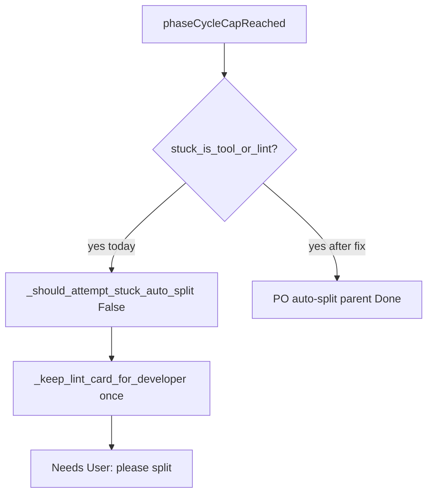

# Auto-split visit-cap cards (and bulk split the 10 already parked)

Visit-cap cards ask you to split because **lint/tool stuck skips auto-split**, then recovery parks to Needs User with that message. Your traces are all `Lint: error • …` fanout cards that hit `phaseCycleCapReached`.

Existing split machinery: [`_run_stuck_auto_split`](backend/services/sprint_service.py), [`queue_pending_split`](backend/services/sprint_service.py) / [`drain_pending_splits`](backend/services/sprint_service.py), [`POST /api/tasks/{id}/split`](backend/api/board.py), Sidebar **Send N Needs User → PO** (moves to PO, does **not** split).

## 1. Auto-split on latch (including lint)

In [`_should_attempt_stuck_auto_split`](backend/services/sprint_service.py): if `enableSplitOnStuck` and `phaseCycleCapReached` and not `splitAttemptedOnStuck` / `pendingSplit` → **True even when** [`stuck_is_tool_or_lint`](backend/services/needs_user_guard.py). Keep skipping auto-split for unlatched lint so fanout + Forced Patch still get a shot.

Call `_run_stuck_auto_split` **before** Needs User park in:

- [`_check_stuck_and_escalate`](backend/services/sprint_service.py) latched branch (today lint goes to `_keep_lint_card_for_developer` without split)
- [`_recover_latched_dev_card`](backend/services/sprint_service.py) when lint unlatch is exhausted (`lintUnlatchCount >= 1`) or non-lint latch
- [`_keep_lint_card_for_developer`](backend/services/sprint_service.py) exhausted path: split instead of `parkFailed` + skip Auto Sprint

If split succeeds (parent `Done` + `splitSuperseded`), do **not** move to Needs User. If split fails, stay In Progress with `poAutoSkip` (no “Question for you” card) and log it.

Guidance for lint titles: “This is already a single analyzer finding — split into: (1) fix this diagnostic in the named file, (2) a regression test. Do not ask the user.”

## 2. Bulk split the cards already in Needs User

Add `POST /api/tasks/split-batch` (payload: optional `taskIds`, else all **Needs User** with `needsUserKind == phase_cycle_cap`). For each: `queue_pending_split` if a sprint is running, else `run_po_split_task`. Reuse drain after the current step.

Frontend: next to **Send N Needs User → PO** in [`Sidebar.tsx`](frontend/src/components/Sidebar.tsx), add **Split N visit-cap cards** counting `needsUserKind === 'phase_cycle_cap'` (and same-shaped userQuestion). Wire through [`client.ts`](frontend/src/api/client.ts) + [`App.tsx`](frontend/src/App.tsx). Disable while sprint running; queue is fine if we queue-then-drain.

That is the one-click path for the 10 cards you have now.

## 3. Tests

- Latched + lint diagnostics → `_check_stuck_and_escalate` **calls** `run_po_split_task` (update/extend [`tests/test_stuck_split_recovery.py`](tests/test_stuck_split_recovery.py); keep unlatched lint skip).
- `_recover_latched_dev_card` after one lint unlatch splits instead of Needs User.
- `split-batch` selects only `phase_cycle_cap` Needs User cards.

Do not edit the UnboundLocal plan file.
