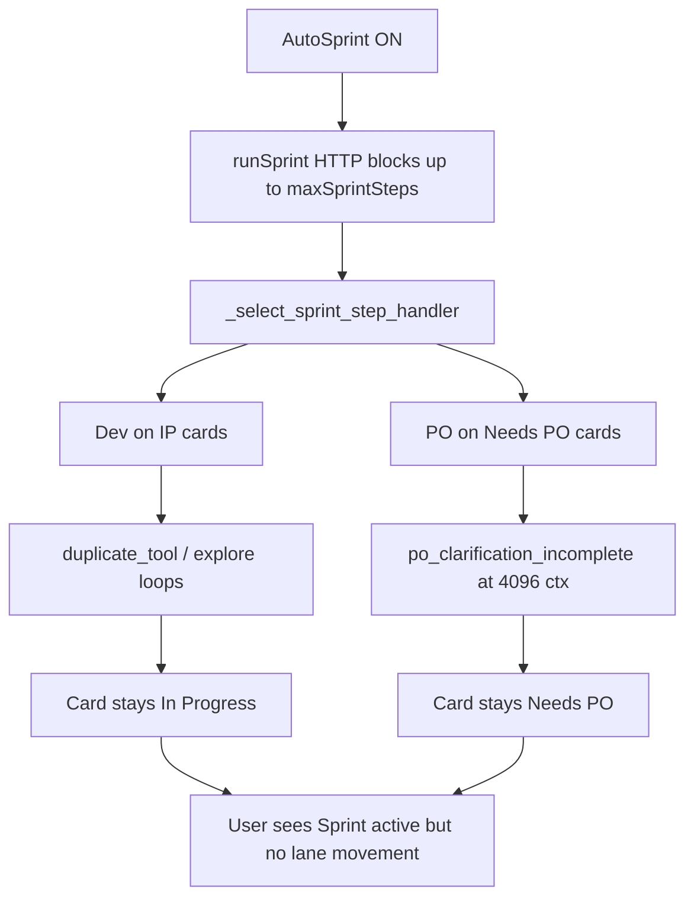

# Fix auto workflow appearing stuck (Sprint active, no card progress)

## What we know

You confirmed **Auto Sprint is ON** and the sidebar shows **"Sprint active"** — so the orchestrator is running, not paused on the toggle.

Latest saved board snapshot ([`board-20260917-013243-875895.json`](file:///home/lukemcredmond/.allhands/board_snapshots/c6196c51-11ec-4349-93b4-2282563bdc20/board-20260917-013243-875895.json)) for meal planner 5:

- **In Progress: 2** (TASK-5004, TASK-1521)
- **Needs PO: 17** (mostly `po_clarification_incomplete`)
- **Done: 1**, **Backlog: 0**

Latest Dev diagnostic ([`step-TASK-5004…-012939.json`](file:///home/lukemcredmond/.allhands/diagnostics/c6196c51-11ec-4349-93b4-2282563bdc20/step-TASK-5004F7B4F1A54C45B229712CF51DBC12-20260917T012939.json)):

- ~4.3 min/step, `numCtx: 4096` (VRAM floor on qwen3.8-27b)
- `exitReason: duplicate_tool` — read-only explore, **0 writes**
- `forcePatchNextDevStep: true` on outcome, but **`phaseGraph.forcedPatch: false`** → Forced Patch prompt did not actually engage on that step
- Card stayed **In Progress** (same lane)

So the workflow is likely **running but not advancing lanes**, which reads as "no card progress."



## Phase 0 — Live diagnosis (before code changes)

Run these checks on the running app (meal planner 5):

1. **System log** — look for recent lines like `Sprint handler: dev|po — '…'` and timestamps. If nothing new in 10+ minutes while "Sprint active", the backend may be **blocked on Ollama** ( hung LLM call ) rather than idle.
2. **Sprint progress bar** (top) — does `step X / maxSprintSteps` increment? Does it show a task id?
3. **Agent Run bar** (bottom) — any `Developer` / `Product Owner` activity, tool name, iteration count?
4. **Diagnostics folder** — newest file under [`~/.allhands/diagnostics/c6196c51-…/`](file:///home/lukemcredmond/.allhands/diagnostics/c6196c51-11ec-4349-93b4-2282563bdc20/) should be newer than the last time you saw movement. Stale timestamps ⇒ sprint HTTP hung or backend crashed mid-request.
5. **Restart backend** with current working tree — Phase 1+2 fixes from this session are **uncommitted**; a process started before those edits will still exhibit PO-skip / truncated-PO behavior.

## Root causes (ranked)

| Cause | Evidence | Impact |
|-------|----------|--------|
| **Duplicate-tool Dev loops** | TASK-5004 diagnostic: 6 Ollama calls, reads only, `duplicate_tool` | Cards stay In Progress; `agentWorkItems` barely move |
| **Forced Patch not armed for `duplicate_tool`** | `duplicate_tool` missing from `DEV_STALL_FORCE_PATCH_EXITS` and `_mark_force_patch_next_dev_step()` in [`sprint_speed_gates.py`](backend/services/sprint_speed_gates.py) / [`scrum_agent.py`](backend/agents/scrum_agent.py); trace shows `forcedPatch: false` | Next Dev step repeats explore instead of patching |
| **PO churn at 4096 ctx** | 17 Needs PO + `po_clarification_incomplete` in snapshots | Sprint burns steps; lanes don't move |
| **Slow 27B @ 4096 floor** | ~4 min/step, prompt ~4089 tokens | "Sprint active" for long stretches between visible updates |
| **UI progress is step-scoped** | Card progress comes from `agentWorkItems` / `lastStepProgress` / `activeRun` on **one** active task ([`taskRunInfo.ts`](frontend/src/utils/taskRunInfo.ts), [`TaskCard.tsx`](frontend/src/components/TaskCard.tsx)) | Other 18 cards look frozen even while sprint runs |

## Phase 1 — Backend: break duplicate-tool / PO stall loops

### 1a. Complete Forced Patch wiring for `duplicate_tool`

In [`backend/services/sprint_speed_gates.py`](backend/services/sprint_speed_gates.py):

- Add `"duplicate_tool"` to `DEV_STALL_FORCE_PATCH_EXITS` (alongside `read_only_no_edits`, `explore_budget_exhausted`).

In [`backend/agents/scrum_agent.py`](backend/agents/scrum_agent.py):

- Add `"duplicate_tool"` to `_mark_force_patch_next_dev_step()` stop-reason set.

In [`backend/services/sprint_service.py`](backend/services/sprint_service.py):

- After a Dev step ending in `duplicate_tool`, call `apply_read_only_no_edits_outcome(task)` (same as read-only stall) so the **board task** carries `forcePatchNextDevStep` into the next visit.
- Ensure `reapply_force_patch_if_dev_stalled()` treats `duplicate_tool` like other dev-stall exits (covered once it is in `DEV_STALL_FORCE_PATCH_EXITS`).

**Expected result:** next Dev step starts with `DevPhaseGraph.forcedPatch: true` and injects [`FORCE_PATCH_INSTRUCTION`](backend/services/sprint_service.py) via `_force_patch_dev_instruction()`.

### 1b. Verify PO-at-4096 fast-path (already implemented, may need restart)

Confirm these paths fire on meal planner cards with ready specs:

- [`should_move_off_needs_po_without_llm()`](backend/services/po_clarification.py) + `reapply_force_patch_if_dev_stalled()` in PO skip path ([`sprint_service.py` ~4032](backend/services/sprint_service.py))
- [`_po_step_was_truncated()`](backend/services/sprint_service.py) → move to Dev when PO incomplete but spec is ready

Add/adjust tests in [`tests/test_po_clarification_retry.py`](tests/test_po_clarification_retry.py) and [`tests/test_sprint_speed_gates.py`](tests/test_sprint_speed_gates.py) for `duplicate_tool` → force patch.

### 1c. Optional sprint-selection tweak (if PO still dominates)

In [`_select_sprint_step_handler()`](backend/services/sprint_service.py) for `executionProfile: implementer`:

- When runnable In Progress Dev cards exist **and** Needs PO head card has `task_has_ready_spec()`, prefer **Dev** over PO (mirror non-implementer branch behavior). This prevents 17-card PO churn from starving the 2 IP cards.

## Phase 2 — Frontend: make "Sprint active" show real progress

### 2a. Richer sidebar status

In [`Sidebar.tsx`](frontend/src/components/Sidebar.tsx) / [`App.tsx`](frontend/src/App.tsx):

- Replace generic **"Sprint active"** with sprint progress when available: e.g. `Step 3/20 · Developer · TASK-5004…`
- Pass `sprintProgress` into Sidebar (already available in App via `useAppState`).

### 2b. Card-level progress during steps

- Ensure `publish_board_delta()` after each step includes updated `lastStepProgress` / `agentWorkItems` (already intended in [`sprint_service.py` ~5618](backend/services/sprint_service.py)) — verify delta payload in a live step.
- On Kanban cards in **In Progress** and **Needs PO**, show a compact last-step hint from `task.lastStepOutcome.suggestedAction` or `whyCardStayed` when no `activeRun` (so idle-looking cards still show "Forced Patch next" / "PO truncated").

### 2c. Hung-sprint detection

If `sprintRunning && !sprintProgress && !activeRun` for >N minutes, surface a banner: **"Sprint may be stuck — check Ollama / cancel sprint"** (read-only timer in [`useAppState.ts`](frontend/src/hooks/useAppState.ts)).

## Phase 3 — Project settings (operational, not code)

For meal planner 5 on a VRAM-clamped 27B:

- **Dev role**: smaller/faster model, or `promptProfile: local_slm` for Dev only
- **KV cache**: try `q4_0` instead of `q8_0` to reclaim context above 4096
- **`maxSprintSteps`**: temporarily lower (e.g. 5) to confirm lane movement between intervals

These reduce step time and PO truncation without blocking the code fixes above.

## Validation

1. Restart backend; enable Auto Sprint on meal planner 5.
2. Watch TASK-5004 / TASK-1521 for a Dev step after `duplicate_tool` — diagnostic should show **`forcedPatch: true`** and a write tool in `toolsUsed`.
3. Needs PO cards with complete specs should **skip PO LLM** (`po_llm_skipped` event) and land in In Progress within a few steps.
4. Run focused tests:

```bash
.venv/bin/pytest tests/test_sprint_speed_gates.py tests/test_po_clarification_retry.py tests/test_needs_user_brief.py -q
```

5. Confirm sidebar shows step/agent/task during sprint, and at least the active card updates `agentWorkItems` mid-run via SSE.

## Files to touch

- [`backend/services/sprint_speed_gates.py`](backend/services/sprint_speed_gates.py) — `DEV_STALL_FORCE_PATCH_EXITS`
- [`backend/agents/scrum_agent.py`](backend/agents/scrum_agent.py) — `_mark_force_patch_next_dev_step`
- [`backend/services/sprint_service.py`](backend/services/sprint_service.py) — duplicate exit outcome + optional handler priority
- [`frontend/src/components/Sidebar.tsx`](frontend/src/components/Sidebar.tsx) + [`frontend/src/App.tsx`](frontend/src/App.tsx) — live sprint status
- [`frontend/src/components/TaskCard.tsx`](frontend/src/components/TaskCard.tsx) — stale-card step hint (small)
- Tests under [`tests/`](tests/)
