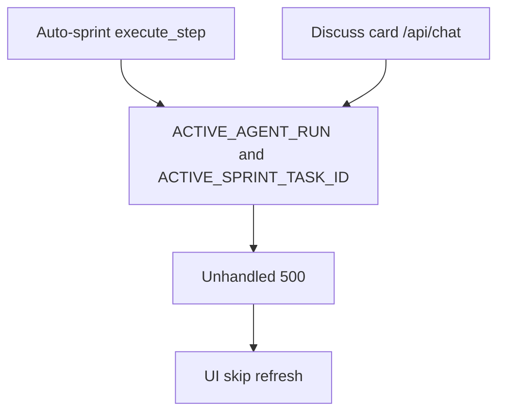

# Fix card chat 500 during auto-sprint

Auto-sprint **does** impact this. Discuss-with-agent posts `/api/chat` with `taskId` ([`ChatPanel.tsx`](frontend/src/components/ChatPanel.tsx)). That path is not guarded the way board mutations already are.

## Why you see Internal Server Error and a stale screen

Sprint step and card chat share one process-wide agent run:

- Chat calls [`_apply_chat_task_context`](backend/api/chat.py): overwrites `ACTIVE_SPRINT_TASK_ID` / `ACTIVE_SPRINT_AGENT`.
- `execute_step` calls `start_run`, which **replaces** [`state.ACTIVE_AGENT_RUN`](backend/agents/agent_run.py) — the sprint’s live run.
- Chat `finally` [`_finalize_chat_task_context`](backend/api/chat.py) sets those globals to `None` and may `save_current_project_state()`.
- Any exception in `execute_step` or persist is **unhandled** → FastAPI `500 Internal Server Error`.
- The UI only calls `onRefreshState` on **success**, so the board/sprint view stays frozen after the error.

Board APIs already reject this (`409`: “Cannot split/clear/claim while an agent sprint step is running”). Chat does not.

## Fixes

**1. Busy sprint → 409, not 500** in [`backend/api/chat.py`](backend/api/chat.py) (`/api/chat` and `/api/chat/stream`).

If [`get_active_run()`](backend/agents/agent_run.py) is set, return 409 with a concrete detail, e.g. `Cannot chat about a card while Developer is running T-ABC (auto-sprint). Pause the sprint or wait for this step to finish.`

**2. Never wipe sprint context on chat finish.** Save/restore `ACTIVE_SPRINT_TASK_ID`, `ACTIVE_SPRINT_AGENT`, and `ALLOW_DONE_RETRY` around chat (even when 409 is the main path, restore is required if a race starts chat just as a step ends).

**3. Catch exceptions in the chat handler.** Log the traceback; return 503 with `detail` = a short reason (Ollama/tool/persist), never a bare 500. Persist the user message; do not leave a half-applied assistant turn.

**4. Frontend:** In [`ChatPanel.tsx`](frontend/src/components/ChatPanel.tsx) `finally`, call `onRefreshState?.()`. Surface 409 text as-is (already uses `err.message` from `ApiError`).

## Tests

- Chat while `ACTIVE_AGENT_RUN` is set → 409, sprint globals unchanged.
- Chat exception path returns JSON `detail`, not unhandled 500.
- Existing [`test_chat_compose_includes_task_context`](tests/test_smoke.py) / done-gate chat tests still pass.

No change to Needs User copy. Pause/wait is the intended overlap policy (same as split/claim).