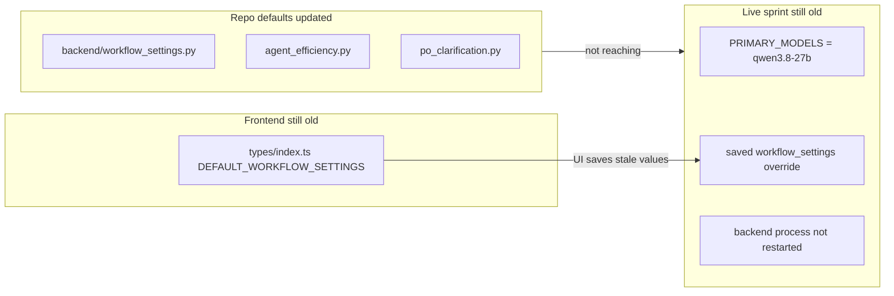

# Complete Missing Performance Updates

## What the new traces prove

Your latest 13 step files (project `c6196c51`) still show the **pre-fix behavior**:

| Signal | Expected after fix | Still observed |
|--------|-------------------|----------------|
| Dev model | `qwen2.5-coder:7b` / `14b` via phase routing | **`qwen/qwen3.8-27b:latest` on every dev step** |
| PO `numPredict` | **1024** ([`po_clarification.py`](backend/services/po_clarification.py)) | **`numPredict: 2048`** (e.g. [`step-TASK-D78B576F...`](attachments)) |
| PO wall time | under ~1 min | **8.7 min** PO steps |
| Adaptive ctx start | **6144** | starts at 6144 but still bumps to **14336** mid-step |
| Dev writes | more patch attempts | mostly `duplicate_tool` / `llm_call_failed`; one step has **1 write** (progress) |

**Conclusion:** Source changes exist in the repo, but the **running sprint is not using them**. Causes are a mix of stale runtime, frontend/backend default drift, and saved per-project overrides.



---

## Gap 1: Frontend defaults out of sync (critical)

[`frontend/src/types/index.ts`](frontend/src/types/index.ts) `DEFAULT_WORKFLOW_SETTINGS` still has **old values**:

```typescript
ollamaNumCtxAdaptive: false,
ollamaNumCtxAdaptiveStart: 8192,
devExploreModel: '',
devExploreMaxTools: 3,
```

Backend [`workflow_settings.py`](backend/services/workflow_settings.py) already has:

- `ollamaNumCtxAdaptive: True`, start **6144**
- `devExploreModel: qwen2.5-coder:7b`, `devPatchModel: qwen2.5-coder:14b`
- `devExploreMaxTools: 8`, `devExploreForcePatchInStep: True`

**Fix:** Mirror backend defaults in `DEFAULT_WORKFLOW_SETTINGS` and add missing type field `devExploreForcePatchInStep`. Update [`WorkflowPanel.tsx`](frontend/src/components/WorkflowPanel.tsx) preset that hardcodes `devExploreMaxTools: 3` and add a toggle for in-step force patch.

---

## Gap 2: Saved project settings override new defaults

[`get_workflow_settings()`](backend/services/workflow_settings.py) merges `{**DEFAULT, **saved}`. If project `c6196c51` saved:

- `devExploreModel: ""` (explicit empty)
- `enablePhaseModelRouting: false`
- `samplingByRole.po.num_predict: 2048`

…those **win over** new backend defaults. PO trace `numPredict: 2048` strongly suggests a saved sampling override or an **unrestarted backend**.

**Fix:**

1. Add [`normalize_performance_settings()`](backend/services/workflow_settings.py) on load/save:
   - Treat empty `devExploreModel` / `devPatchModel` as unset (drop key so default applies)
   - Backfill missing performance keys from `DEFAULT_WORKFLOW_SETTINGS` for existing projects
2. Add one-time migration when opening a project in [`project_service.py`](backend/services/project_service.py) or [`workspace_open.py`](backend/services/workspace_open.py)

---

## Gap 3: Model routing never reaches runtime (highest impact)

Code in [`agent_efficiency.py`](backend/services/agent_efficiency.py) routes **Developer** explore/patch, but:

- **PO / CR / QA** always get `primary` from `PRIMARY_MODELS` ([`resolve_step_model`](backend/services/agent_efficiency.py) line ~161)
- [`apply_model_for_step`](backend/services/backup_model.py) sets `agent.model = primary` before the dev loop
- Live project `PRIMARY_MODELS.dev` / `po_model` is still **`qwen/qwen3.8-27b:latest`** (visible in every `ollama_wait` line)

**Fix:**

1. Add `effective_role_model(role, primary, ws)` used by both `apply_model_for_step` and `_apply_phase_model_routing`:
   - PO → fast coder preset (`qwen2.5-coder:7b`) when primary is heavy general
   - Dev → existing phase routing
2. Call `_apply_phase_model_routing()` for **PO steps** too (or normalize in `apply_model_for_step` for all roles)
3. Log routing reason into step diagnostics (`modelRouteReason`) so traces prove the fix
4. **Operational:** restart backend after deploy; optionally update project `dev_model` / `po_model` in Project Config to `qwen2.5-coder:7b`

---

## Gap 4: Plan item 6 not implemented (empty-generation)

From original plan section 6 — not done in prior pass:

- Explore-phase empty-gen timeout still **90s** globally
- No phase-specific shorter timeout

**Fix in [`scrum_agent.py`](backend/agents/scrum_agent.py) / [`llm_provider.py`](backend/services/llm_provider.py):**

- When dev phase is `explore`, use `min(60, ollamaEmptyGenerationTimeoutSec)`
- Confirm [`empty_gen_should_skip`](backend/services/sprint_speed_gates.py) fires (already wired in [`sprint_service.py`](backend/services/sprint_service.py) ~4321) and add a step diagnostic event when skipped

---

## Gap 5: Scaffold + explore budget (code exists, verify wiring)

Already implemented in repo:

- [`scaffold_task_referenced_stubs()`](backend/services/workspace_scaffold.py)
- In-step force patch in [`dev_phase_graph.py`](backend/services/dev_phase_graph.py)

**Verify / finish:**

- Ensure [`maybe_auto_scaffold`](backend/services/workspace_scaffold.py) is called on **every** dev step entry in [`sprint_service.py`](backend/services/sprint_service.py) (already at ~4377)
- Add integration test: task referencing `lib/models.dart` gets stub before first `read_file`
- Confirm `devExploreMaxTools: 8` is used (frontend currently displays **3** in presets)

---

## Implementation order

1. **Sync frontend defaults + WorkflowPanel** (prevents UI from re-saving stale values)
2. **Settings normalization + project migration** (existing projects pick up new defaults)
3. **Effective model resolver for all roles** (fixes qwen3.8-27b in traces)
4. **PO num_predict enforcement** — ensure `samplingByRole.po.num_predict` cannot exceed `PO_NUM_PREDICT_DEFAULT` unless explicitly overridden in UI
5. **Empty-gen explore timeout** (plan item 6)
6. **Restart backend** and validate on one dev + one PO step

---

## Validation checklist (post-fix)

After restart, a single dev step trace should show:

- `model=qwen2.5-coder:7b` (explore) or `qwen2.5-coder:14b` (patch)
- `numCtx` starting at **6144**, not jumping to 14336 unless prompt overflow
- PO step `numPredict` ≤ **1024**
- `Explore 8/8` then forced patch in same step (not 12 explore tools)
- Stub creation logged when AC references missing `lib/models.dart`

Target KPIs from original plan:

- Eval tok/s **>15** on 7B (vs current ~1.2 on 27B)
- PO clarification **< 1 min**
- Dev step with **≥1 write** before duplicate-tool stop
