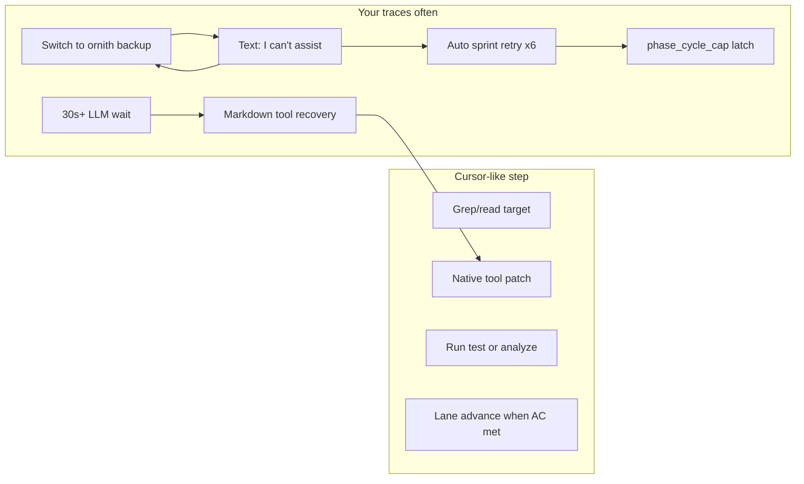
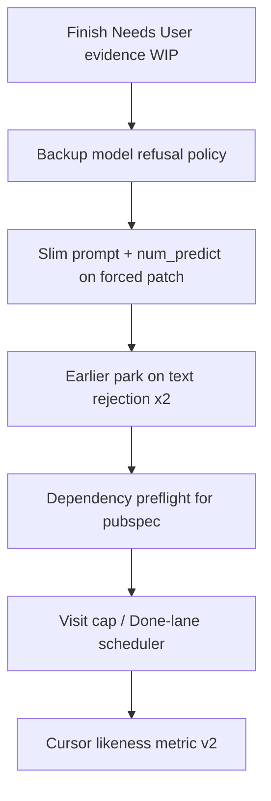

# Cursor-like flow: diagnostics review and readjustment plan

## What the 26 step files show

All traces are build `8071708`, project `c6196c51`, mostly **qwen2.5-coder:14b** with **`cursorLikenessScore: false` on every record** (including the two successful `completed_with_writes` steps).

| Outcome (complete steps) | Count | Representative tasks |
|---|---:|---|
| `text_rejection_loop` | 8 | TASK-96B (6×), TASK-D78 (2×) |
| `phase_cycle_cap` / System latch | 5 | TASK-96B, TASK-D78, TASK-BB3 |
| `tool_failure_stop` | 4 | TASK-22B, TASK-316 |
| `completed_with_writes` | 2 | TASK-22B, TASK-318 (SDK/pubspec work) |
| `explore_budget_exhausted` | 1 | TASK-316 |
| `llm_call_failed` | 1 | TASK-318 |
| `lint_stay_in_progress` | 1 | TASK-D78 |
| `interrupted` | 2 | TASK-18C, TASK-D78 |

**What “Cursor-like” means in this repo** ([`step_diagnostics.py`](backend/services/step_diagnostics.py) ~637–638):

- At least one successful write
- **`nativeToolCallRate >= 0.5`** (native API tool calls, not markdown recovery)
- **`durationMs < 180_000`**

Even the “good” pubspec steps fail the score because **`nativeToolCallRate` is 0.0** (`tool_calls_recovered_from_content` on almost every tool) and/or **`timeToFirstWriteMs` ~89s** on TASK-18C.

---

## Insight 1 — Tool transport, not orchestration, is the main “not Cursor” signal

- **Symptom:** `performanceSummary.primaryBottleneck` is **`markdown_tool_recovery`** on successful SDK tasks (TASK-318 ~66s, TASK-22B ~98s) and TASK-18C running trace.
- **Symptom:** `nativeToolCallRate` is **0.0** on qwen paths even though [`OllamaProvider`](backend/services/llm_provider.py) advertises `native_tool_name=True`.
- **Cursor gap:** Cursor consistently uses **native tool calls**; your stack recovers tools from fenced content in [`scrum_agent.py`](backend/agents/scrum_agent.py) (~4208–4222), which adds latency and fails the likeness metric.

**Readjust (local Ollama, no cloud):**

1. **Instrument first:** Log whether the Ollama response had `message.tool_calls` vs recovery-only (you already have `native_tool_calls_before_recovery` in code — expose aggregate **`nativeToolCallRate` per model** in diagnostics and sprint UI).
2. **Prompt + sampling:** For Developer on qwen, tighten the system prompt to **forbid markdown tool blocks** when tools are registered (mirror what Cursor’s tool schema implies). Pair with **`num_predict` floor** on forced-patch turns so tool JSON is not truncated (TASK-96B iter 2 uses `num_predict: 256` after backup switch — too small for reliable tools).
3. **Optional fast path:** If iteration 1 recovers from markdown **and** latency exceeds a threshold (e.g. 20s), **retry the same turn once** with a one-line “use native tool_calls only” nudge before continuing (cheaper than swapping models).

---

## Insight 2 — Backup model routing is actively anti–Cursor-like

Evidence: TASK-96B [`…013621.json`](file:///home/lukemcredmond/.cursor/projects/mnt-Storage-my-agents-my-agent-lab-DevelopmentAgent/attachments/e75426d6-ebe0-4803-8c7a-0592b187b949/step-TASK-96B9B6220E0744ACB38CA9CE740C95AB-20260925T013621.json):

- qwen text reject → **`backup_model_switched`** to `ornith-1.5-35b-…`
- Both iterations: **`text_rejected`** — *“I'm sorry, but I can't assist with that request.”*
- **`forcedToolMode: true`** but **`forcedToolModeEffective: false`** (no successful tool under forced mode)
- ~6 minutes per step × 6 steps → **`phase_cycle_cap`** on a card already at **Done** lane

**Readjust** ([`backup_model.py`](backend/services/backup_model.py), [`scrum_agent.py`](backend/agents/scrum_agent.py) `_maybe_switch_backup_on_text_reject` / `_switch_dev_backup_model`):

1. **Do not switch backup on generic safety refusals** if the backup model repeats the same apology hash (detect `safety_refusal` + identical text — you already track `identical_text_reject`).
2. **Prefer recovery over backup** on first Developer text reject: synthetic read + slim prompt ([`_should_slim_dev_prompt`](backend/services/sprint_service.py)) **before** model swap.
3. **If backup also refuses:** park to **Needs User** immediately (see Insight 3) instead of **`text_rejection_loop` hard stop + auto sprint** (burns visit cap).
4. **Project setting guardrail:** Document that `dev_backup_model` must be a **tool-friendly coder** (same family as primary); ornith in traces behaves like a chat safety model, not a dev agent.

---

## Insight 3 — Text rejection should exit the auto-sprint loop earlier (WIP aligns here)

[`_try_park_text_rejection_loop`](backend/agents/scrum_agent.py) (~2088) runs, but traces show **8× `text_rejection_loop` completes** without stable Needs User parking. Common blockers:

- [`should_park_in_needs_user`](backend/services/needs_user_guard.py) returns **`lint_use_file_blocker`** / **`no_mcq_options`** for stuck lint/tool cards
- [`should_escalate_to_needs_user`](backend/services/needs_user_guard.py) cooldown / duplicate question guards after repeated failures

**Your uncommitted work** (already in the working tree) is the right direction:

- [`_diagnosis_from_task_evidence`](backend/services/needs_user_guard.py), [`finalize_needs_user_options`](backend/services/needs_user_guard.py), evidence in LLM options prompt, **dev model** for options chat, drop duplicate `enrich_needs_user_options` from [`board_service.py`](backend/services/board_service.py) / [`sprint_service.py`](backend/services/sprint_service.py)

**Finish and extend:**

1. **Commit/finish** the WIP on [`needs_user_guard.py`](backend/services/needs_user_guard.py) + [`tests/test_needs_user_brief.py`](tests/test_needs_user_brief.py).
2. **Allow park for `text_rejection_loop`** when `consecutiveBadExits >= 2` even if `stuck_is_tool_or_lint` — kind **`stuck_loop`** with evidence MCQ (manual edit vs reset latch vs split), instead of infinite Forced Patch on a refusing model.
3. Wire **`finalize_needs_user_options`** from [`refresh_generic_needs_user_options`](backend/services/needs_user_guard.py) paths so reload/UI never shows generic “Continue implementing…” labels ([`_GENERIC_FALLBACK_OPTION_MARKERS`](backend/services/needs_user_guard.py)).

---

## Insight 4 — Phase cycle cap is a symptom of retry policy, not task size

Cards hit **`devStepCount: 13`** / **`phaseCycleCapReached: true`** (TASK-96B, TASK-D78, TASK-BB3) after many **zero-write** Developer steps.

**Readjust:**

1. **Auto-sprint scheduler:** Skip Developer on cards with `phaseCycleCapReached` **before** emitting a 832ms `dev_precheck_skip` trace (TASK-BB3) — reduces noise and matches “Cursor stops and asks human.”
2. **Earlier cap → Needs User:** At **`consecutiveBadExits >= 3`** with last exit ∈ `{text_rejection_loop, llm_call_failed}`, call [`_handle_visit_cap_stall`](backend/services/sprint_service.py) / `_try_move_to_needs_user(..., kind="phase_cycle_cap")` **before** visit 13.
3. **Done-lane churn:** TASK-96B System steps show **`laneBefore: Done`** while latch fires — reconcile so **Done cards are not selected** for Dev retry unless user explicitly resets latch ([`is_visit_cap_needs_user_card`](backend/services/sprint_service.py)).

---

## Insight 5 — Successful micro-edits prove fix-verify works; dependency order breaks larger cards

**Near Cursor behavior (keep):**

- TASK-18C running trace: read → apply_patch → **`fix_verify_done:clean`** in ~107s — correct **read → patch → analyze** loop ([`fix_verify_loop`](backend/services/fix_verify_loop.py)).

**Still not Cursor:**

- TASK-22B [`…022235.json`](file:///home/lukemcredmond/.cursor/projects/mnt-Storage-my-agents-my-agent-lab-DevelopmentAgent/attachments/e75426d6-ebe0-4803-8c7a-0592b187b949/step-TASK-22BBDBBBC95641C2B86B07108588861A-20260925T022235.json): patch `lib/models/aisle.dart` while **`package:drift/drift.dart` missing** — lint hard-stop, context rewind ×2, 4min step. Cursor typically **`pubspec.yaml` + `flutter pub get`** before model files.

**Readjust:**

1. When lint mentions **missing package URI**, inject a **deterministic preflight** (edit `pubspec.yaml` / run `flutter pub get`) via [`file_blocker`](backend/services/file_blocker.py) or a small sprint pre-step — before forced patch on `lib/**/*.dart`.
2. Mark **`verify:command` work item done** when **`lint_run`** succeeds inside fix-verify (today UI shows Verify pending while lint ran — TASK-18C `agentWorkItems` vs `events` mismatch).

---

## Insight 6 — Tune metrics so they match user-visible success

Current **`cursorLikenessScore`** will stay false for all markdown-recovery Ollama runs even when outcomes match Cursor.

**Readjust (diagnostics only):**

- Add **`cursorLikenessScoreV2`** (or relax v1): writes succeeded + duration &lt; 180s + **(native_rate ≥ 0.5 OR (`markdownRecovery` and `timeToFirstWriteMs` &lt; 45s))**.
- Keep v1 for strict native-tool regression tracking.

Files: [`step_diagnostics.py`](backend/services/step_diagnostics.py), [`tests/test_cursor_like_diagnostics.py`](tests/test_cursor_like_diagnostics.py), optional badge in [`TaskDetailModal.tsx`](frontend/src/components/TaskDetailModal.tsx).

---

## Recommended implementation order

---

## Validation (after changes)

1. Re-run the same sprint subset: **TASK-318** (SDK test), **TASK-18C** (SDK constraint), **TASK-96B** (should park or split, not 6× text loop).
2. Assert diagnostics: **`primaryBottleneck` ≠ `backup_model_switch`** on text reject; at least one step with **`nativeToolCallRate > 0`** OR **`timeToFirstWriteMs` &lt; 45s** with markdown recovery.
3. **`pytest`:** `tests/test_needs_user_brief.py`, `tests/test_cursor_like_diagnostics.py`, `tests/test_text_rejection_circuit_breaker.py`, `tests/test_slim_dev_prompt.py`.

---

## Out of scope (per your choice)

- Cloud / Cursor API provider swap
- Replacing Ollama with a different host (unless native tool calls remain broken after prompt/sampling fixes)
