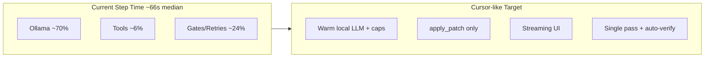
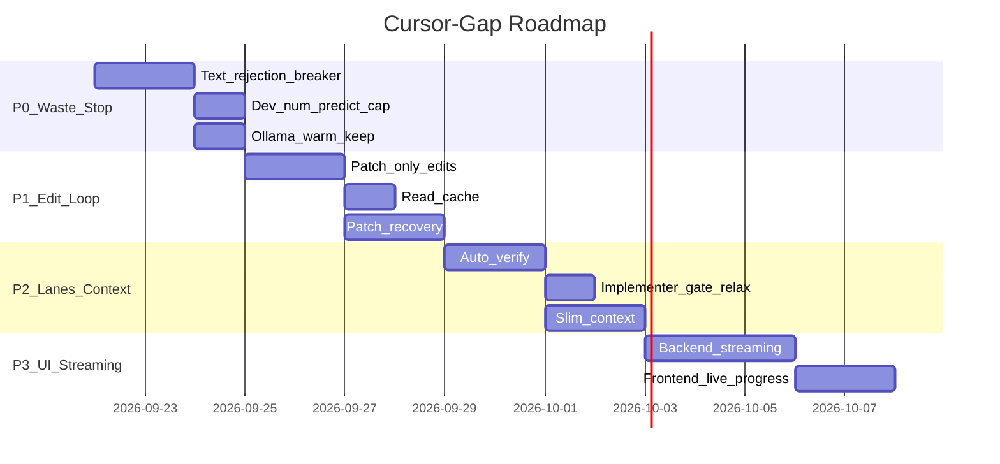

# Cursor-Like Performance & Efficiency Plan

## Diagnostic Summary (Evidence)

Analyzed **51 step traces** across **20 Flutter sprint tasks** (2026-09-20). Key findings:

| Metric | Observed | Impact |
|--------|----------|--------|
| Step duration (median) | **66s** (up to 7.5 min; one 36 min runaway) | User waits per card |
| Ollama share of step time | **~70%** | Dominant bottleneck |
| Text-rejection loops | **62 rejections** in 6 steps (max **29**/step) | 80%+ of step time wasted |
| `write_file` vs `apply_patch` | **4.3s** vs **241ms** median | 18× slower edits |
| Patch failures | **20 events**, same patch retried 4× | Forces 2–3 dev steps per task |
| Step success rate | **49%** (25/51 ok) | Cards stall, re-run |
| Lane advance blocked | **30+** `lane_advance_skipped` events | Successful writes don't advance |

**Worst-case evidence:**

```1:29:/home/lukemcredmond/.cursor/projects/mnt-Storage-my-agents-my-agent-lab-DevelopmentAgent/attachments/8e82af08-7fa2-4e18-8d66-ca07960c3161/step-TASK-1CF122EC8D8B4A14A1D415399F059032-20260920T033159.json
{
  "durationMs": 449940,
  "textRejections": 29,
  "llmIterations": { "used": 30, "max": 2 },
  "ollamaMsTotal": 406370,
  "totalTokens": 150058,
  ...
}
```

Iterations 2–30 all returned identical **724-char text** with no tool calls — ~7.5 minutes burned.



---

## Gap vs Cursor (Local-First)

| Cursor behavior | Current gap | Plan direction |
|-----------------|-------------|----------------|
| Sub-second feedback | Whole-step blocking, 15s wait ticks | Token streaming to UI |
| Targeted diffs | `write_file` full rewrites (4.3s) | Enforce `apply_patch` for edits |
| Strict tool schema | Text retried up to 29× | Early abort + forced tool mode |
| File cache | Same file read 2–3×/step | In-step read cache |
| Inline lint | Model must run `flutter analyze` | System auto-verify after writes |
| Single conversational turn | 2–3 dev steps + PO/QA lanes | Implementer fast-path defaults |
| Output caps | 51K token runaway possible | `num_predict` cap for Dev |

**Existing foundations to extend** (do not rebuild):
- [implementer_profile.py](backend/services/implementer_profile.py) — PO skip, gate relaxation
- [card_session.py](backend/services/card_session.py) — cross-step continuity
- [llm_context.py](backend/services/llm_context.py) — rewind, prune, fingerprint guard
- [patch_recovery.py](backend/services/patch_recovery.py) — read-before-retry (partially wired)
- [test_plan_run_cursor_gap.py](tests/test_plan_run_cursor_gap.py) — tracked gap features

---

## Phase 1: Stop Wasted Inference (P0 — highest ROI)

**Goal:** Eliminate 5–36 min/step disasters. Est. impact: **−50–80%** on worst steps.

### 1.1 Identical text-rejection circuit breaker

**Problem:** [scrum_agent.py](backend/agents/scrum_agent.py) rejects text-only responses but continues until `max_iterations` (lines ~3882–3959). Reflect nudge only fires at 2+ rejects; no hash-based abort.

**Changes in** [scrum_agent.py](backend/agents/scrum_agent.py) + [step_diagnostics.py](backend/services/step_diagnostics.py):
- Hash assistant text content; after **2 identical hashes**, exit with `text_rejection_loop` (not 29 retries)
- After **3 total** text rejects (non-identical), switch to **forced tool mode**: inject system message with only `apply_patch`/`write_file` schemas, set `num_predict` low (256)
- Log `identicalTextRejectCount` in diagnostics for monitoring

### 1.2 Dev output token cap

**Problem:** `TASK-2EAF7C4` generated **213K chars / 51K tokens** in one call.

**Changes in** [scrum_agent.py](backend/agents/scrum_agent.py) + [agent_efficiency.py](backend/services/agent_efficiency.py):
- Add `devNumPredictDefault` (e.g. **2048**) in [workflow_settings.py](backend/services/workflow_settings.py)
- Abort LLM call if `evalMs > 60_000` without tool calls (watchdog in Ollama chat wrapper)
- Track `runawayGenerationAborted` in step diagnostics

### 1.3 Ollama warm-keep tuning (local)

**Problem:** First-call `promptEvalMs` ~4.5s (cold load). Sampling shows `keep_alive: "-1s"` in traces when single-model mode unloads.

**Changes in** [agent_efficiency.py](backend/services/agent_efficiency.py):
- For implementer profile + Dev-only runs: use configured `ollamaKeepAlive` (**30m**) even in single-model mode (don't return `-1s` when only one model is loaded)
- Add `warmModelOnSprintStart` option: call [ollama_warmup.py](backend/services/ollama_warmup.py) at sprint boot
- Prefetch system prompt tokens on first Dev step (reuse cached dev prompt from sprint_service)

**Tests:** Extend [test_step_diagnostics.py](tests/test_step_diagnostics.py), [test_ollama_retry.py](tests/test_ollama_retry.py)

---

## Phase 2: Cursor-Like Edit Loop (P1)

**Goal:** One read → one patch → verify. Est. impact: **−3–4s per write**, fewer re-steps.

### 2.1 Deprecate `write_file` for existing files

**Problem:** 35 `write_file` calls at 4.3s median; hints already say prefer patch ([tool_probe.py](backend/services/tool_probe.py) line 32).

**Changes:**
- [scrum_agent.py](backend/agents/scrum_agent.py): Block `write_file` when target path exists (return structured error: "use apply_patch")
- [task_context.py](backend/agents/task_context.py): Update dev nudges to patch-only for edits
- [dev_phase_graph.py](backend/services/dev_phase_graph.py): Count `write_file` on existing paths against patch budget

### 2.2 In-step file read cache

**Problem:** `lib/main.dart` read 2–3× per step despite unchanged mtime.

**New helper** in [llm_context.py](backend/services/llm_context.py) or [workspace/files.py](backend/workspace/files.py):
- Cache `{path: (mtime, content_hash)}` per step trace
- Skip redundant `read_file` (return cached tool result with `cached: true` flag)
- Invalidate on successful `apply_patch`/`write_file` for that path

### 2.3 Strengthen patch recovery

**Problem:** [patch_recovery.py](backend/services/patch_recovery.py) exists but `TASK-79CD92CD` still retried identical 1141-char replace 4×.

**Changes in** [patch_recovery.py](backend/services/patch_recovery.py) + [scrum_agent.py](backend/agents/scrum_agent.py):
- Block `apply_patch` when fingerprint matches prior failure in same step (extend `identicalPatchFailCount`)
- On patch fail: auto-inject **target file excerpt** (last 40 lines around mismatch) into next system message — avoids extra read round-trip
- Optional: fuzzy-match suggestion when `old_text` not found (show closest line from cached read)

### 2.4 Allow patch from preloaded context when hash matches

**Problem:** Sprint inject uses excerpt mode; agent must re-read before patch ([sprint_service.py](backend/services/sprint_service.py) ~line 104).

**Changes in** [workspace/files.py](backend/workspace/files.py) + sprint context inject:
- For 1–2 focus files: inject full body + content hash in pre-step context
- `apply_patch` accepts preloaded hash if file mtime unchanged since inject

---

## Phase 3: Lane & Verification Simplification (P1–P2)

**Goal:** Successful writes advance in one step. Est. impact: **−1 full dev step per task**.

### 3.1 System auto-verify after writes

**Problem:** `lane_advance_skipped:no_verify_in_tools_log` — model didn't run analyze.

**Changes in** [sprint_service.py](backend/services/sprint_service.py):
- After Dev step with `writesSucceeded > 0`, auto-run project lint command (from stack catalog) **outside** the LLM loop
- Record result in tools log as `system_verify` so lane advance passes
- Treat blocked-duplicate `run_command` as success with cached output ([duplicate_tool_policy.py](backend/services/duplicate_tool_policy.py))

### 3.2 Relax lane gates for implementer profile

**Problem:** [sprint_speed_gates.py](backend/services/sprint_speed_gates.py) blocks advance on `max_iterations_after_writes`, `completed_with_writes_no_advance`, etc.

**Changes:**
- Extend [implementer_profile.py](backend/services/implementer_profile.py) gate relaxation to **manual In Progress** runs (not only `AUTO_SPRINT_ACTIVE`)
- Add `LINT_OK_ADVANCE_EXITS` fast-path: if lint clean + writes succeeded, advance even after `max_iterations_after_writes`
- Soften `focus_slice` gate when all AC files were written

### 3.3 Reduce fix-verify outer loop

**Problem:** [workflow_settings.py](backend/services/workflow_settings.py) defaults `enableFixVerifyLoop: true`, `maxFixVerifyRounds: 2` — doubles Dev cost.

**Changes:**
- Implementer default: `maxFixVerifyRounds: 1`, `enableFixVerifyLoop: false` when auto-verify (3.1) is on
- [fix_verify_loop.py](backend/services/fix_verify_loop.py): Inline lint result from 3.1 instead of full re-`execute_step`

---

## Phase 4: Context & Orchestration (P2)

**Goal:** Leaner prompts, fewer explore turns, less sprint machinery.

### 4.1 Slim sprint context inject

**Changes in** [sprint_service.py](backend/services/sprint_service.py) `_inject_sprint_context`:
- Implementer mode: skip graphify when Qdrant hit count < threshold
- Cap semantic results to top-3 chunks
- Rotate focus slice only when prior step had zero writes

### 4.2 Tighter DevPhaseGraph budgets

**Changes in** [dev_phase_graph.py](backend/services/dev_phase_graph.py):
- Default `devExploreMax: 1` for implementer (from 3)
- Skip explore phase when preloaded paths cover AC file list
- Force-patch transition after 1 explore tool if file already in session

### 4.3 Card session incremental prompts

**Changes in** [card_session.py](backend/services/card_session.py):
- On step resume: append only delta (last step summary + new AC) instead of rebuilding full system prompt
- Persist last successful tool results; skip re-injecting unchanged reads

### 4.4 Workflow defaults for Cursor-like Plan & Run

Update [workflow_settings.py](backend/services/workflow_settings.py) defaults:
- `executionProfile: implementer` (already default per tests)
- `enableCardSessionContinuity: true`
- `enableContextRewind: true`
- `sprintFileContextMode: excerpt`
- `singleModelMode: on`
- `maxLlmIterationsPerStep: 12` (down from 30 — fail faster with circuit breakers)
- `devExploreMax: 1`

---

## Phase 5: Streaming & UI Feedback (P2–P3)

**Goal:** Perceived latency like Cursor (tokens appear immediately).

### 5.1 Backend streaming surface

**Changes in** [llm_provider.py](backend/services/llm_provider.py) + [scrum_agent.py](backend/agents/scrum_agent.py):
- Expose Ollama streaming chunks via existing SSE/WebSocket sprint channel
- Emit `llm_token` events during generation (not only post-call)
- Show tool-call JSON as it streams (partial parse for UI preview)

### 5.2 Frontend live progress

**Changes in** [SprintProgressBar.tsx](frontend/src/components/SprintProgressBar.tsx), [TaskDetailModal.tsx](frontend/src/components/TaskDetailModal.tsx), [streamBuffers.ts](frontend/src/utils/streamBuffers.ts):
- Render streaming assistant text in task detail
- Show phase intent (`explore` / `patch` / `verify`) from existing `reject_intent` events
- Surface diagnostics rollups: `ollamaMsTotal`, `textRejections`, exit reason hints from [step_diagnostics.py](backend/services/step_diagnostics.py)

### 5.3 Adaptive budgets from diagnostics

**Changes in** [step_diagnostics.py](backend/services/step_diagnostics.py) + sprint boot:
- If prior step `textRejections > 5`, next step lowers `maxLlmIterations` and enables forced tool mode
- Export aggregate metrics endpoint for support bundle ([support_bundle.py](backend/services/support_bundle.py))

---

## Phase 6: Observability & Regression Guards

### 6.1 Diagnostic-driven eval harness

Extend [eval_harness.py](backend/services/eval_harness.py):
- Score steps: `ok`, `wasted_ms` (text reject time), `patch_fail_rate`, `steps_to_done`
- CI gate: no step with `textRejections > 5` in golden traces

### 6.2 New regression tests

| Test file | Covers |
|-----------|--------|
| [test_capped_retry_loop_regression.py](tests/test_capped_retry_loop_regression.py) | Text-rejection circuit breaker |
| [test_plan_run_cursor_gap.py](tests/test_plan_run_cursor_gap.py) | Implementer defaults + new settings |
| New `test_patch_recovery_blocks_repeat.py` | Identical patch fingerprint block |
| New `test_read_cache_skips_redundant.py` | In-step read cache |

---

## Expected Outcomes

| Scenario | Before (observed) | After (target) |
|----------|-------------------|----------------|
| Median successful task | ~224s (2–3 steps) | **<90s** (1 step) |
| Text-rejection disaster | 450s, 29 retries | **<15s** early exit |
| Runaway generation | 36 min | **Blocked at 60s** |
| Edit operation | 4.3s `write_file` | **<300ms** `apply_patch` |
| Perceived latency | Step-complete only | **Streaming tokens** |

---

## Implementation Order



**Start with Phase 1** — two diagnostic files alone (`TASK-1CF122EC`, `TASK-17836DBB`) burned ~14 minutes on identical text loops. Fixing that plus Phase 2 edit changes yields the largest local-Ollama win without new infrastructure.
