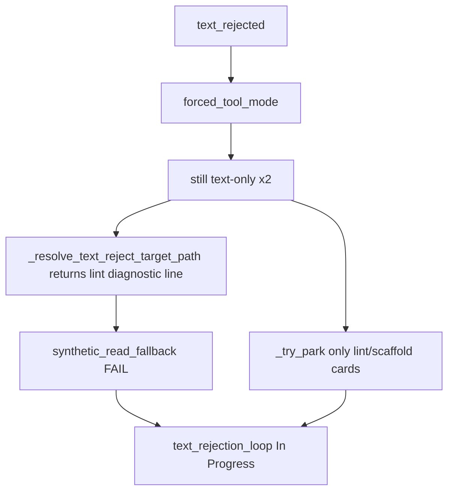

# Cursor-like follow-ups from full trace batch (110 steps, 28 cards)

## Batch verdict

The [prior plan](file:///home/lukemcredmond/.cursor/plans/cursor-like_diagnostics_improvements_b9c2a8ba.plan.md) is **implemented in code** (helpers in [`scrum_agent.py`](backend/agents/scrum_agent.py), UX in [`sprint_service.py`](backend/services/sprint_service.py), metrics in [`step_diagnostics.py`](backend/services/step_diagnostics.py)). **99/110 traces are legacy** (pre-deploy, no `promptTokensAtFirstCall`); **11 traces are post-deploy** and confirm new behavior is live.

| Metric | Full batch (110) | Post-deploy cohort (11) | Prior batch (plan baseline) |
|--------|------------------|-------------------------|----------------------------|
| Dominant exit | `text_rejection_loop` **24** | `phase_cycle_cap` 4, `text_rejection_loop` 2 | `text_rejection_loop` 18 |
| `explore_budget_exhausted` | 16 | 1 | 4 |
| Median dev step duration | **110s** | ~108–237s on sampled steps | ~2 min |
| Steps with writes / lane advance | **12** | FA56A36 had tools; 96B9B622 had 0 | 2 wins |
| Stale *"Run In Progress again"* hint | 52 (all legacy) | **0** | common |
| `text_rejection_loop` parked to Needs User | **0 / 24** | **0 / 2** | 0 |
| `forcedToolMode` on text loops | 18 / 24 | yes | yes |
| `forcedToolModeEffective` on text loops | **1 / 24** | 1 | low |
| `promptTokensAtFirstCall >= 8k` | 5/6 measured (**83%**) | yes on feature cards | ~19k |

**Conclusion:** Observability and honest UX are fixed on new runs. The agent loop is still not Cursor-like: apology text wins over tools, synthetic read misfires, and parking never triggers on feature cards.

---

## Root causes confirmed in traces

### 1. Synthetic read uses lint diagnostic text as a file path (P0 bug)

[`step-TASK-D78B576…011627.json`](file:///home/lukemcredmond/.cursor/projects/mnt-Storage-my-agents-my-agent-lab-DevelopmentAgent/attachments/42a02783-5eeb-4ba8-8b8e-b7c0b1888ec6/step-TASK-D78B576FBDCE4E3B9C4BA2B8B505E75B-20260923T011627.json):

- Card title: *"Build main app UI with tabs"* (feature card, not lint wall)
- `synthetic_read_fallback` message = full lint line: `warning • The URI 'package:flutter_lints/flutter.yaml'… • analysis_options.yaml`
- `read_file` fails because that string is passed as `path`

**Cause:** [`_resolve_text_reject_target_path`](backend/agents/scrum_agent.py) delegates to [`file_blocker._task_file_path`](backend/services/file_blocker.py), which reads `lastCommandDiagnostics[].file` on **any** card. Fix-verify lint on the project poisons feature-card fallback. [`is_junk_lint_path`](backend/services/lint_fanout.py) does not reject formatted diagnostic lines.

**Fix:** Add `resolve_dev_edit_target_path(task)` that:
- Validates path looks like a workspace-relative file (no `•`, no `warning`, max length, matches `^[\w./-]+$`)
- For non-lint cards: prefer `writePaths`, `scaffoldedFiles`, title keywords (`pubspec.yaml`, `main.dart`, `lib/…`), then **last** diagnostic file only if valid
- Extract trailing filename from lint lines (`• analysis_options.yaml` → `analysis_options.yaml`) as last resort

### 2. Needs User parking never fires (P0 gap)

[`_try_park_text_rejection_loop`](backend/agents/scrum_agent.py) returns early unless `is_lint_wall_card` or `structureScaffoldAttempted`. **21/24 text loops had zero tools**; worst cards are feature cards:

- `TASK-1521AAD` — 5 text loops on *"Project scaffold & offline persistence"*
- `TASK-D63DD03` — 5 text loops on *"Club card photos"*
- `TASK-96B9B622` — forced mode, 0 tools, hard stop (good hint, still In Progress)

**Fix:** After identical-text + backup attempt + synthetic read fail, park **any** Developer card with `text_n >= 2` and no write tools to Needs User (`kind=stuck_loop` or new `text_rejection_loop` kind). Only hard-stop if `_try_move_to_needs_user` fails.

### 3. Backup model switch not visible / likely not engaging (P0)

Across 24 text loops: **0 trace events** containing backup switch; `forcedToolModeEffective` true on only 1 step. Either backup equals primary, switch happens but isn't logged to trace events, or switch runs too late (after hard stop).

**Fix:**
- Log `backup_model_switched` event in [`step_diagnostics.log_event`](backend/services/step_diagnostics.py) when [`_maybe_switch_backup_on_identical_text`](backend/agents/scrum_agent.py) succeeds
- Switch backup on **first** text reject for Developer (not only identical hash ≥ 2)
- If backup unavailable, skip straight to synthetic read / park

### 4. Prompt still bloated on feature cards (P1)

Post-deploy `promptTokensAtFirstCall`: 3718–20263; **83% ≥ 8k**. Slim prompt in [`_should_slim_dev_prompt`](backend/services/sprint_service.py) only applies to lint/forced-patch cards. Feature cards like `TASK-96B9B622` (14556) and `TASK-D78B576` (15866–20263) still load full sprint context.

**Fix:** Extend slim prompt when **any** of:
- `consecutiveBadExits >= 2`
- `cardToolFailures >= 3`
- prior step exit in `{text_rejection_loop, explore_budget_exhausted, llm_call_failed}`
- estimated prompt chars > 70% `num_ctx` before first LLM call

Keep: target file excerpt, one AC line, one-line lint if present. Strip: semantic/graph/packer/structure audit/transcript replay beyond last 2 tool rows.

### 5. Markdown tool recovery dominates (P1)

**59%** of dev steps (48/82) have `tool_calls_recovered_from_content` (205 events). `nativeToolCallRate` is null on legacy traces and 0.0 on FA56A36 despite tool usage — recovered calls aren't counted as native.

**Fix:**
- On first LLM turn, if tools only arrived via recovery (no native `tool_calls` before [`apply_tool_call_recovery`](backend/services/llm_tool_recovery.py)), call [`maybe_route_backup_from_step_probe`](backend/services/tool_llm_probe.py) or arm backup for rest of step
- Fix `nativeToolCallRate` denominator: track `nativeToolCalls / ollamaCallCount`, not `native / calls_with_tools`
- When recovery parses multiple `read_file`, batch via existing [`partition_tool_calls`](backend/services/parallel_tools.py) (plan item 8 — verify wiring)

### 6. Explore budget still fires on non-lint cards (P1)

16 `explore_budget_exhausted` exits. Forced-patch bypass in [`dev_phase_graph.py`](backend/services/dev_phase_graph.py) only applies when `force_patch=True` at step start (lint wall / `forcePatchNextDevStep`). Feature cards still hit explore cap after prior explore-only steps.

**Fix:** After **one** explore-only step without writes on a card, auto-set `forcePatchNextDevStep` and start next step in Patch (already partially done via [`should_force_patch_next_dev_step`](backend/services/sprint_speed_gates.py) — extend to treat `explore_budget_exhausted` as immediate forced patch on **next** step without another explore cycle).

### 7. Phase cap UX on legacy traces (done for new runs)

7/13 `phase_cycle_cap` traces still show stale hints — all legacy, captured before deploy. New traces (`TASK-6ECE8D19`, `TASK-A7A1F04`, `TASK-D63DD03`) show `textOnlyTurns: 0` and correct latch handling. No code change required; re-run latched cards to refresh board state.

---

## Plan validation cards (from original plan)

| Card | Steps | Post-fix status |
|------|-------|-----------------|
| `TASK-971A43D` (pubspec SDK) | 3 | Legacy; 2× `text_rejection_loop`, stale hint; identical_write_loop once |
| `TASK-3FD5E15C` (analysis_options lint) | 3 | Legacy; write loop + text loop; first call 3761–19658 tokens |
| `TASK-BD3E1823` (drift repo) | 6 | Legacy; 3× `llm_call_failed`, `phase_cycle_cap`; no text loop |
| `TASK-96B9B622` (new) | 1 | **Good hint**; still hard stop, 0 tools, p1=14556 |
| `TASK-D78B576` (new) | 7 | Synthetic read **broken path**; p1≈20k; eventual text loop |

---

## Recommended implementation order

### P0 — Stop broken recovery and hard stops

1. **Safe target path resolver** — new helper; replace `_resolve_text_reject_target_path` usage; add unit tests with D78B576 diagnostic line fixture
2. **Park all text loops** — broaden `_try_park_text_rejection_loop`; log `needs_user_parked` event
3. **Backup on first text reject** — reorder: text reject → backup switch → forced mode → synthetic read → park → hard stop (last resort only)

**Files:** [`scrum_agent.py`](backend/agents/scrum_agent.py), [`file_blocker.py`](backend/services/file_blocker.py), [`step_diagnostics.py`](backend/services/step_diagnostics.py)

### P1 — Prompt diet + tool reliability

4. **Extended slim prompt triggers** — [`sprint_service._should_slim_dev_prompt`](backend/services/sprint_service.py), [`_inject_sprint_context`](backend/services/sprint_service.py)
5. **Backup on markdown recovery** — first-turn check in [`scrum_agent.py`](backend/agents/scrum_agent.py) after `apply_tool_call_recovery`
6. **Explore → forced patch latch** — [`sprint_speed_gates.py`](backend/services/sprint_speed_gates.py), [`dev_phase_graph.py`](backend/services/dev_phase_graph.py)
7. **Fix `nativeToolCallRate` math** — [`step_diagnostics.py`](backend/services/step_diagnostics.py)

**Files:** above + [`tool_llm_probe.py`](backend/services/tool_llm_probe.py)

### P2 — Validation rerun

8. Re-run auto sprint on stuck cards: `TASK-971A43DF`, `TASK-3FD5E15C`, `TASK-BD3E1823`, `TASK-96B9B622`, `TASK-D78B576`, `TASK-1521AAD`, `TASK-D63DD03`

**Success criteria (unchanged from original plan):**
- No `text_rejection_loop` ending In Progress without Needs User park or backup engaged
- `promptTokensAtFirstCall < 8000` on single-file lint cards; `< 12000` on feature cards after slim
- `nativeToolCallRate > 0.5` OR `backup_model_switched` event present
- Latched cards show split/latch hint (already true on new traces)
- At least one lint card reaches QA with `fixVerifyLintClean: true`

**Tests to extend:** [`tests/test_cursor_like_diagnostics.py`](tests/test_cursor_like_diagnostics.py) (new), [`tests/test_scrum_agent_read_continue.py`](tests/test_scrum_agent_read_continue.py), path resolver unit tests

---

## What is already working (no further work)

- Honest `suggestedAction` / hints on **post-deploy** traces (e.g. `TASK-96B9B622`)
- New diagnostic fields populated when trace completes under new code
- `synthetic_read_fallback` event pipeline (logic works; path input is wrong)
- Phase cap auto-park attempt in [`scrum_agent.py`](backend/agents/scrum_agent.py) cycle-cap early exit
- Test suite: 60/60 targeted tests passing after prior implementation
