# Why Cursor Beats Autonomous Plan & Run (and What You're Missing)

## Short answer

You're not missing one feature — you're paying a **stack of structural taxes** that Cursor avoids:

| Factor | Cursor (Agent) | AllHands Plan & Run |
|--------|----------------|---------------------|
| Model | Frontier cloud models with reliable tool calling | Local Ollama (default: `qwen2.5-coder:14b` / `llama3:8b`) |
| Session shape | One continuous agent run on a focused task | Many discrete **sprint steps** with role/lane handoffs |
| Context | Open file, selection, diagnostics injected automatically | Large monolithic prompt assembled per step; char-pruned |
| Human gates | Inline clarification, keep going | Needs User MCQ, lane moves, circuit breakers, split cards |
| Edit loop | Direct multi-file edits | `read_file` → `apply_patch` ceremony + fix-verify gates |
| Default mode | Agent chat | **Scrum profile** (PO → Dev → CR → QA), not implementer |

Cursor feels better because it optimizes for **one smart agent, one task, one session**. AllHands optimizes for **safe autonomous scrum on weak local models** — a harder problem with more stop points.

---

## Root causes (ranked for autonomous sprint)

### 1. Model capability ceiling (largest gap)

Your README recommends 7B–14B local coder models. Cursor uses frontier models that are materially better at:

- Multi-file reasoning and refactors
- Reliable native tool calling (your codebase has extensive recovery for markdown tool JSON, echo loops, system-message reordering in [`backend/services/llm_provider.py`](backend/services/llm_provider.py))
- Knowing when to stop vs when to keep fixing

**Symptom in sprint:** cards stall, split, or reach Done with stubs; PO plans are vague; QA/CR on 7B add steps without adding judgment.

**You partially addressed this** in uncommitted work ([`tests/test_quality_model_tuning.py`](tests/test_quality_model_tuning.py)) — single 14B model, phase routing off — but that only narrows the gap; it doesn't close it vs Claude/GPT-class models.

### 2. Scrum orchestration tax on every card

[`run_plan_and_run()`](backend/services/sprint_service.py) always starts with PO planning, then [`run_auto_sprint()`](backend/services/sprint_service.py) loops discrete handlers: Needs PO → Dev → Refinement → Code Review → QA.

Each step:

- Rebuilds prompt via [`_inject_sprint_context()`](backend/services/sprint_service.py) + [`build_task_prompt()`](backend/agents/task_context.py)
- Runs a **bounded** tool loop (`maxLlmIterationsPerStep`, `maxDevPhaseCyclesPerCard`, phase graph)
- May end with unhealthy exits blocked by [`sprint_speed_gates.py`](backend/services/sprint_speed_gates.py)

Cursor's agent doesn't re-decompose the same task through four roles and twelve visit caps — it just keeps working until done or you stop it.

**You already built the escape hatch:** `executionProfile: "implementer"` in [`workflow_settings.py`](backend/services/workflow_settings.py) — single Cursor-like dev agent, skips PO when spec exists, disables lint fanout. **Default is still `"scrum"`**, so Plan & Run users often never hit this mode.

### 3. Context loss across steps (autonomous killer)

README explicitly states ([Known limitations](README.md)):

- Embeddings do **not** summarize/prune chat before LLM calls
- Context shrink is char-based (`messagePruneThresholdPct`)
- **No live token streaming** — step completes, then you see output
- SSE board updates **slim** transcripts to last few entries

For a hands-off sprint running 10–20 steps on one card, the agent repeatedly loses earlier reasoning. Cursor keeps a longer coherent thread on the same task.

**Stale preload risk:** sprint inject preloads semantic chunks and file contents in parallel; after writes, freshness depends on prompts ("re-read"), not structural invalidation.

### 4. Guardrails that block more than Cursor would

Recent additions (in your working tree) increase strictness:

- [`file_completeness.py`](backend/services/file_completeness.py) — regex stub detection blocks lane advance
- [`file_blocker.py`](backend/services/file_blocker.py) — canonical fix cards when multiple cards touch a broken file
- [`needs_user_guard.py`](backend/services/needs_user_guard.py) — blocks conversational escalation; requires MCQ options
- [`done_audit.py`](backend/services/done_audit.py) — pulls Done cards back if evidence missing

These are **good for pipeline discipline** but bad for "just ship it" autonomous feel. Cursor applies judgment; your app applies rules. Regex completeness (`pass`, `TODO`, `...`) will false-positive and false-negative vs a human/agent judgment call.

### 5. Planning quality before auto-run

Plan & Run trusts [`run_po_plan()`](backend/services/sprint_service.py) to create backlog cards, then immediately sprints. Bad plans → too-large cards, planning-only cards (`requiresDev: false`), missing AC → Dev explores without patching, zero-work watchdog fires.

Cursor typically starts from **your** focused prompt, not an LLM-generated backlog of 8 cards.

### 6. Optional infrastructure often off

Semantic search (Qdrant), Graphify, repomix/code2prompt packer, MCP servers are **optional** and workflow-gated. Without them, Dev steps rely on grep/read loops — slower and noisier than Cursor's always-on indexing.

### 7. Interaction model mismatch (even in autonomous mode)

Auto-sprint polls every 5s ([`useAppState.ts`](frontend/src/hooks/useAppState.ts)); each step is a full LLM episode. When blocked on Needs User, autonomous run **stops** until structured answers — Cursor would ask inline and continue in the same session.

---

## What you already have (don't rebuild)

These are strengths Cursor doesn't replicate in scrum form:

- **Implementer profile** — already Cursor-like; underused because default is scrum
- **Fix-verify loop** + lint oracle ([`fix_verify_loop.py`](backend/services/fix_verify_loop.py))
- **Card ledger / step diagnostics** — excellent observability ([`step_diagnostics.py`](backend/services/step_diagnostics.py), support bundle)
- **File blocker / blocked lane** — prevents N cards fighting one file
- **Backup model on stuck**, auto-split, circuit breakers
- **MCP, custom tools, skills**, semantic index, phase model routing
- **Fast first code preset** in WorkflowPanel

The gap is not "no tools" — it's **how autonomously those tools are orchestrated under local model limits**.

---

## What to add (prioritized for autonomous Plan & Run)

### Tier A — Highest impact, aligns with your existing code

1. **Make Plan & Run default to implementer profile**
   - Or prompt: "Autonomous coding → Implementer; Full scrum → Scrum"
   - Wire [`run_plan_and_run()`](backend/services/sprint_service.py) to set/verify `executionProfile: implementer` unless user opts into scrum
   - Skip PO planning when brief is already actionable (or run a lightweight plan validator, not full backlog generation)

2. **Cloud model lane for autonomous runs**
   - Add first-class Anthropic/OpenAI (or stronger OpenAI-compatible) provider path for Dev in Plan & Run
   - Keep Ollama for PO/chat; use frontier model only for implementer steps (cost control)
   - Your [`llm_provider.py`](backend/services/llm_provider.py) already abstracts providers — extend, don't rewrite

3. **Pre-flight gate before auto-sprint starts**
   - Block Plan & Run if: Ollama/simulation pending, Qdrant down when semantic preload on, zero claimable dev cards, cards missing AC, cards too large (AC count / description length heuristics)
   - Surface in UI: "3 cards not dev-ready — fix or auto-split"

4. **Per-card session continuity**
   - Instead of full prompt rebuild every step, maintain a **card-scoped conversation thread** (like Cursor's agent transcript) with incremental inject (only new lint output, changed files, AC status)
   - Summarize pruned history with a cheap model call before char-prune drops it

5. **Smarter stuck recovery before split/Needs PO**
   - Order: retry with backup model → inject force-patch nudge → **one** cloud model attempt → then split
   - Today split/Needs PO often fires while Cursor would push through one more iteration

### Tier B — Medium impact

6. **Auto-index + packer before Plan & Run**
   - If Qdrant empty → trigger reindex
   - If `contextPacker` set → run once before first Dev step
   - Log context sources on sprint progress bar (partially exists)

7. **Relax gates in implementer autonomous mode**
   - When `executionProfile === implementer` && auto-sprint: soften `requireFileCompleteness` regex blocks, skip CR/QA lanes, use oracle-only Done gate
   - Keep strict gates for scrum profile

8. **Card sizing enforcement at plan time**
   - PO must produce cards with ≤3 AC, single primary file target, `requiresDev: true`
   - Reject/auto-split oversized epics before sprint starts (you have split tooling; apply at plan boundary)

9. **Workspace rules injection**
   - Auto-load `AGENTS.md`, `.allhands/rules.md`, or `.cursor/rules/**` from workspace into system prompt (you have skills; this is missing entirely)
   - Cursor's project rules materially improve consistency

### Tier C — Longer-term parity

10. **Live token streaming for agent steps** (README lists as missing)
11. **Editor-aware context in sprint** — open file, selection, LSP diagnostics auto-injected (chat has `@file`; sprint inject doesn't use editor state)
12. **Inline diff accept/reject in Monaco** — post-hoc FileDiffModal isn't a steering loop
13. **Parallel independent cards** — `enableParallelIndependentCards` defaults false

---

## Architecture diagram: where quality leaks

```mermaid
flowchart TB
  brief[Brief] --> poPlan[PO Plan and Backlog]
  poPlan --> cards[Kanban Cards]
  cards --> stepLoop[Auto Sprint Step Loop]
  stepLoop --> rebuild[Rebuild Prompt plus Preload]
  rebuild --> localLLM[Local 14B Tool Loop]
  localLLM --> gates{Gates}
  gates -->|pass| advance[Lane Advance]
  gates -->|fail| blocked[Needs User / Split / Blocked]
  advance --> crqa[CR and QA Steps]
  crqa --> done[Done]
  blocked --> stepLoop

  cursorBrief[Focused User Task] --> cursorAgent[Frontier Agent Session]
  cursorAgent --> cursorDone[Done with inline steer]

  style localLLM fill:#333
  style cursorAgent fill:#333
```

---

## Practical "try this first" checklist (no code changes)

Before building new features, validate whether config explains the gap:

1. Workflow → **Execution profile: Implementer** (not Scrum)
2. Workflow → Preset **Fast first code**
3. Dev model: strongest model you can run (`qwen2.5-coder:14b` or cloud if available)
4. Disable or relax for MVP runs: `requireCodeReview`, `requireAcChecklistForDone`, strict completeness if causing false blocks
5. Qdrant up + **Reindex codebase** before Plan & Run
6. Keep cards small: ≤3 AC, one logical change each
7. Confirm sidebar Ollama health — **never run autonomous sprint on simulation fallback**

If quality jumps after step 1–3, your main gap is **orchestration + model**, not missing tools.

---

## Honest conclusion

**Cursor wins autonomous-style delivery because it is a single high-capability agent with IDE-native context and minimal ceremony.** AllHands wins on **structured multi-agent QA, lint recovery, and ops visibility** — but defaults to the harder path (scrum + local models + strict gates) that fights autonomous delivery.

The highest-leverage additions are not more blockers — they're:

1. **Implementer-first Plan & Run**
2. **Stronger model path for implementer steps**
3. **Card-scoped session continuity** instead of per-step prompt amnesia
4. **Plan-time validation** so auto-sprint doesn't execute bad backlogs
5. **Workspace rules auto-load**

You already have pieces 1 and partial 2 in the codebase; they're just not the default autonomous path.
