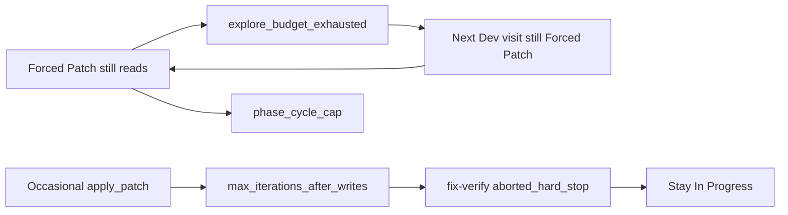

# Verdict, then remaining Dev-loop work

## Working as expected (limbo plan)

The empty-console / no-Ollama stuck state is **fixed**. The 51 traces from last night (~22:38–00:45) show:

- Developer steps of **1–8 minutes** with **2–12 Ollama calls** (`gemma-4-q4km:26b`), not 1s ticks.
- Multiple cards actually run (Store List Screen, Repository Tests, StoreRepository unit tests).
- Product Owner runs and sometimes moves cards (`Needs PO → In Progress`, two parents `→ Done` after split).
- The only `ollama=0` / `<2s` exits are genuine `phase_cycle_cap` after the visit budget — and the picker then goes to **other** work instead of spinning forever.

Restarting `python app.py` after the picker/`has_sprint_work` change is doing what we wanted.

## Not done: cards still do not finish

Of those 51 steps: **47 `ok=false`**, **0 QA**, **25 `explore_budget_exhausted`**, **9 `max_iterations_after_writes`**, **8 `duplicate_tool`**, **42 lastEvent `fix_verify_done:aborted_hard_stop`**. Typical card: explore-only Forced Patch for many visits → one write step that still stays In Progress → more explore → `phase_cycle_cap`.

### 1. Forced Patch still allows an explore wheel

[`DevPhaseGraph.observe_tools`](backend/services/dev_phase_graph.py) nudges once then stops on a second explore-only batch. The **next sprint step** starts Forced Patch again; Gemma’s first action is `read_file`; nudge + second read → stop. That costs a full `devStepCount` visit. Store List Screen (1/2) and Write Repository Tests (1/2) did this **8–11 times** until cap.

Fix in [`dev_phase_graph.py`](backend/services/dev_phase_graph.py) + [`sprint_speed_gates.py`](backend/services/sprint_speed_gates.py) + picker:

- Count consecutive `explore_budget_exhausted` on the card; after **2** (configurable), skip further Dev visits and park (`kind=phase_cycle_cap` or a dedicated `forced_patch_no_write`) so other cards run **before** visit 12.
- On Forced Patch, reject explore tools with a tool error (“Patch required: apply_patch/write_file”) instead of burning an LLM round on reads — or start the step already `pending_stop_after_nudge` so the first explore-only batch stops only after one short nudge turn, and consecutive exhaust still parks.

### 2. Fix-verify `aborted_hard_stop` swallows writes

[`_is_hard_stop_result`](backend/services/fix_verify_loop.py) treats any result starting with `"stopped:"` as hard. Explore-budget and `max_iterations_after_writes` both match, so **lint never runs** after a write-success stop. [`UNHEALTHY_LANE_ADVANCE_EXITS`](backend/services/sprint_speed_gates.py) then blocks In Progress → QA.

Fix:

- Do **not** treat `explore_budget_exhausted` as a reason to skip lint (there is nothing to verify).
- After `max_iterations_after_writes` / `completed_with_writes`, still run the lint command once; if clean, allow lane advance (remove those exits from the unhealthy set, or add an exception when `writesSucceeded > 0` and lint is clean).

### 3. `duplicate_tool` on Write Repository Tests

That card bounced PO ↔ Dev with repeated identical tools and **0 writes**. Treat consecutive `duplicate_tool` like explore-exhaust (force patch / park after 2) so it does not chew the visit cap.

## Tests

- Consecutive Forced Patch explore-only steps park/skip by visit 3, not 12 ([`tests/test_dev_phase_graph.py`](tests/test_dev_phase_graph.py), [`tests/test_capped_retry_loop_regression.py`](tests/test_capped_retry_loop_regression.py)).
- Fix-verify still lints after a write-stop result; does not start extra LLM rounds on explore-stop ([`tests`](tests/) for `fix_verify_loop`).
- Writes + clean lint can leave In Progress toward QA/CR.

Out of scope: model quality of `gemma-4-q4km:26b` itself; splitting cards (already happening).