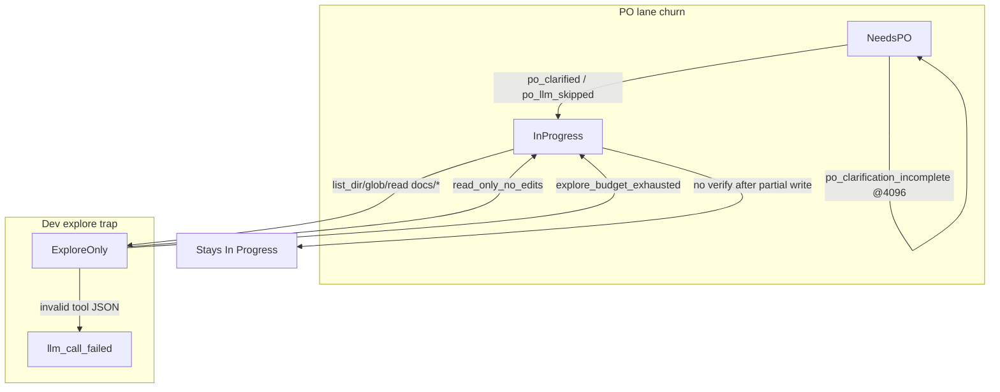

# Diagnostic insights from pre-update sprint traces

## What you shared

29 step JSON files under the attachments folder (project `c6196c51`, qwen3.8-27b, **`numCtx=4096`** throughout). They capture a greenfield Flutter meal-planner sprint where most cards never left **Needs PO** or **In Progress** without writes.

Two files (`TASK-23C1…-20260917T011305.json`, `TASK-1521…-20260917T011305.json`) already show **`numCtxFit`** — partial post-fix telemetry mixed into the bundle.

---

## Exit-reason taxonomy (37 step records in bundle)

| Exit reason | Count (approx) | Representative cards | Primary symptom |
|---|---|---|---|
| `po_clarification_incomplete` | ~15 | A77AF, 5DC6A4, 61CC1F, 7B38D1 | PO turn ends with no JSON applied; card stays Needs PO |
| `po_clarified` / `po_llm_skipped` | ~12 | Most cards’ first PO hop | Spec already present; PO skipped or moved to In Progress |
| `explore_budget_exhausted` | 3 | B8558, D3C62, 504A16 | 14 explore tools, 0 writes; `forcePatchNextDevStep: true` but graph still `forcedPatch: false` |
| `duplicate_tool` | 4 | B8B4, D63DD, F968, B27 | Re-reads `docs/plan.md`, `docs/tasks/…` until hard stop |
| `llm_call_failed` (JSON) | 4 | B27, F0610, 1ECF977 | `unexpected end of JSON input` on `list_dir` / `write_file` from llama-server |
| `read_only_no_edits` | 1 | **TASK-23C1** (Export) | 7 explore tools, iteration 5 `doneReason=length`, **`forcePatchNextDevStep: false`** |
| `interrupted` | 1 | A7A1F0 | User/system cancel mid-PO |

---

## Confirmed root causes (with trace evidence)

### 1. Export card (`TASK-23C1`) — the original Needs User mystery

[`step-TASK-23C1…-20260916T012632.json`](file:///home/lukemcredmond/.cursor/projects/mnt-Storage-my-agents-my-agent-lab-DevelopmentAgent/attachments/96286c63-cd75-4054-95ab-3df83f904ae9/step-TASK-23C1DAFF20094801A0D0027D03D6F572-20260916T012632.json):

- Dev: 7 tools (`list_dir`, `glob **/*.dart`, reads under `docs/`), **0 writes**
- Final iteration: `promptTokens=4089`, `doneReason=length`, `truncated=true`
- `exitReason=read_only_no_edits`, **`forcePatchNextDevStep: false`**, `stuckLoops=1`
- Tools never touched `lib/` — empty Flutter workspace

**Already addressed (uncommitted)** by the completed plan:

- [`apply_read_only_no_edits_outcome`](backend/services/sprint_service.py) sets `forcePatchNextDevStep`
- [`ensure_needs_user_brief`](backend/services/needs_user_guard.py) + UI fallbacks for empty `userQuestion`
- Greenfield Flutter scaffold in [`workspace_scaffold.py`](backend/services/workspace_scaffold.py) + [`workspace_structure_audit.py`](backend/services/workspace_structure_audit.py)
- VRAM clamp surfacing in [`prompt_budget.py`](backend/services/prompt_budget.py) + UI

### 2. PO skip re-opens explore loop (gap still visible post-fix)

[`step-TASK-23C1…-20260917T011305.json`](file:///home/lukemcredmond/.cursor/projects/mnt-Storage-my-agents-my-agent-lab-DevelopmentAgent/attachments/96286c63-cd75-4054-95ab-3df83f904ae9/step-TASK-23C1DAFF20094801A0D0027D03D6F572-20260917T011305.json):

- `po_llm_skipped: last_exit=read_only_no_edits` → `po_clarified` in 241ms
- Task snapshot still shows **`forcePatchNextDevStep: false`**
- `stepProgress.suggestedAction` still generic (“Run In Progress again… move to QA”) — stale progress from prior Dev step

**Why:** [`should_move_off_needs_po_without_llm`](backend/services/po_clarification.py) fires when `identicalPoClarificationCount >= 1` (not because `read_only_no_edits` is in `PO_LLM_SKIP_EXITS`). The PO skip path in [`_run_po_step`](backend/services/sprint_service.py) (~3968) calls `move_off_needs_po` and may chain `_run_developer_step` **without** re-applying `apply_read_only_no_edits_outcome`.

**Defense-in-depth also missing:** [`_FORCE_PATCH_EXITS`](backend/services/sprint_speed_gates.py) and [`_mark_force_patch_next_dev_step`](backend/agents/scrum_agent.py) include `explore_budget_exhausted` but **not** `read_only_no_edits`.

### 3. Context truncation at 4096 (PO + Dev)

Multiple traces show `doneReason=length` with `promptTokens` near 4096:

- Dev on TASK-23C1 (above)
- PO on TASK-23C1 [`…-20260916T004501.json`](file:///home/lukemcredmond/.cursor/projects/mnt-Storage-my-agents-my-agent-lab-DevelopmentAgent/attachments/96286c63-cd75-4054-95ab-3df83f904ae9/step-TASK-23C1DAFF20094801A0D0027D03D6F572-20260916T004501.json): PO ~6–7 min, truncation mid-clarification
- PO cards stuck in `po_clarification_incomplete` (A77AF, 5DC6A4, etc.)

**Partially addressed:** adaptive prune/bump in [`scrum_agent.py`](backend/agents/scrum_agent.py) + tighter budgets in [`prompt_budget.py`](backend/services/prompt_budget.py). **Still weak for PO-only turns** — PO prompt may fill window before JSON is emitted.

### 4. llama-server invalid tool-call JSON (biggest hard failure)

8+ iteration errors across 4 Dev steps:

> `llama-server returned invalid tool call arguments for "list_dir": unexpected end of JSON input`

This fails **inside llama-server** before [`tool_call_normalizer`](backend/services/tool_call_normalizer/) can recover. Often co-occurs with `doneReason=length` (truncated tool args). Worst case: [`TASK-B27…-20260916T221520.json`](file:///home/lukemcredmond/.cursor/projects/mnt-Storage-my-agents-my-agent-lab-DevelopmentAgent/attachments/96286c63-cd75-4054-95ab-3df83f904ae9/step-TASK-B27FF8EF09F74AC6BDD4B788F2932AFF-20260916T221520.json) — **43+ min**, one successful `write_file`, then 6 failed `write_file` JSON errors → `llm_call_failed` + `no_verify_in_tools_log`.

**Not addressed** by the Needs User plan; normalizer exists but does not intercept server-side 500s.

### 5. Docs wandering → `duplicate_tool`

Dev repeatedly lists/reads `docs/`, `docs/tasks/{id}/`, `docs/plan.md` instead of `lib/`. Duplicate policy correctly stops the step, but the card stays In Progress with no scaffolded target files.

Greenfield scaffold helps **first** Dev turn; duplicate stops on **subsequent** turns still lack a “stop reading docs” nudge tied to structure audit.

### 6. PO outcome recording noise

Example: [`TASK-A77AF…-20260917T005907.json`](file:///home/lukemcredmond/.cursor/projects/mnt-Storage-my-agents-my-agent-lab-DevelopmentAgent/attachments/96286c63-cd75-4054-95ab-3df83f904ae9/step-TASK-A77AF072F96D4A0FAD70ECE1DEDD0F8E-20260917T005907.json) — `exitReason=po_clarification_incomplete` but `lastStepOutcome.agentResultSnippet` says *“Moved to In Progress without a PO generate”* (stale from a prior PO skip). Confusing for UI/diagnostics.

---

## Mapping: completed plan vs remaining gaps

| Finding | Completed plan | Still open |
|---|---|---|
| Empty Needs User brief | `ensure_needs_user_brief` + UI | Verify on parked TASK-23C1 after reload |
| First read-only → park | `apply_read_only_no_edits_outcome` | PO skip path drops flag; add to `_FORCE_PATCH_EXITS` |
| Empty Flutter workspace | auto-scaffold before Dev | SDK missing → Needs User question exists; confirm `flutter` on PATH |
| 4096 truncation visibility | `numCtxFit`, prune/bump | PO-specific budget; default warn when VRAM clamps |
| PO oversize bounce | trim desc / honest bounce | Less visible in these traces (specs were present) |
| Tool JSON 500s | deferred | Retry with `{}` args for zero-arg tools; optional text-mode fallback |
| PO incomplete loop | — | Skip PO when spec ready + last exit is dev stall; don’t re-enter Needs PO |
| Docs duplicate loop | — | Inject “do not re-read docs/tasks” when greenfield + no dart files |

---

## Recommended Phase 2 (prioritized)

### P0 — Stop PO skip from undoing Forced Patch

**Files:** [`backend/services/sprint_service.py`](backend/services/sprint_service.py), [`backend/services/po_clarification.py`](backend/services/po_clarification.py), [`backend/services/sprint_speed_gates.py`](backend/services/sprint_speed_gates.py), [`backend/agents/scrum_agent.py`](backend/agents/scrum_agent.py)

- In PO skip branch (~3968): if `last_step_exit_reason` ∈ `{read_only_no_edits, explore_budget_exhausted}` → call `apply_read_only_no_edits_outcome(task)` before `move_off_needs_po` / chained Dev step
- Add `read_only_no_edits` to `_FORCE_PATCH_EXITS` and `_mark_force_patch_next_dev_step`
- Optional routing: when spec is ready and last Dev exit is explore stall, **skip Needs PO entirely** (Dev recovery path instead of PO handler)

**Test:** extend [`tests/test_po_clarification_retry.py`](tests/test_po_clarification_retry.py) — PO skip after `read_only_no_edits` must leave `forcePatchNextDevStep=true`.

### P1 — Recover from llama-server empty tool JSON

**Files:** [`backend/agents/scrum_agent.py`](backend/agents/scrum_agent.py), [`backend/services/llm_provider.py`](backend/services/llm_provider.py), [`backend/services/tool_call_normalizer/native.py`](backend/services/tool_call_normalizer/native.py)

- On error matching `invalid tool call arguments` + `unexpected end of JSON`:
  - For zero-arg tools (`list_dir` with optional path): retry once with normalized `{}` or `{path:"."}`
  - If prompt near ctx ceiling: trigger same prune/bump path as `doneReason=length` before retry
- Log recovery source in step diagnostics (`tool_json_recovered`)

**Test:** fixture in [`tests/test_tool_call_normalizer.py`](tests/test_tool_call_normalizer.py) + integration stub for server error string.

### P1 — PO prompt budget at 4096

**Files:** [`backend/services/prompt_budget.py`](backend/services/prompt_budget.py), [`backend/services/sprint_service.py`](backend/services/sprint_service.py) (PO inject path)

- Dedicated smaller PO preload cap when `initial_ollama_num_ctx() <= 4096`
- When PO ends `po_clarification_incomplete` + truncated: auto `prepare_task_for_dev_claim` trim (reuse oversize path) instead of looping Needs PO

### P2 — Anti-docs-wander nudge (greenfield)

**Files:** [`backend/services/sprint_service.py`](backend/services/sprint_service.py) (`_inject_sprint_context`), [`backend/services/workspace_structure_audit.py`](backend/services/workspace_structure_audit.py)

- When audit says greenfield Flutter and glob finds 0 `*.dart`: inject one-line instruction — *“Do not re-list docs/tasks; scaffold or patch lib/ now.”*
- Tie to duplicate_tool stop: suggest Forced Patch in `lastStepOutcome` (mirror `read_only_no_edits` copy)

### P2 — Diagnostics hygiene

**Files:** [`backend/services/sprint_service.py`](backend/services/sprint_service.py) (`_record_last_step_outcome`), [`backend/services/step_diagnostics.py`](backend/services/step_diagnostics.py)

- PO skip / PO incomplete must not reuse prior step’s `agentResultSnippet`
- Refresh `stepProgress.suggestedAction` when PO step completes (don’t carry Dev stale copy)
- Surface `forcePatchNextDevStep` on PO skip traces for easier debugging

---

## Validation plan (after Phase 2)

1. Reset or clone project `c6196c51`; confirm preflight shows `numCtxFit` when VRAM clamps
2. Run sprint until **TASK-23C1** (Export) hits first read-only Dev step → expect **In Progress + forcePatch**, not Needs User with null fields
3. Force PO skip path (spec present, `identicalPoClarificationCount>=1`) after read-only → next Dev must show `forcedPatch: true` in phase graph
4. Deliberately run at 4096 — PO cards with ready spec should not accumulate `po_clarification_incomplete` loops
5. Re-run focused pytest suite (83 tests from prior session + new PO-skip / tool-json tests)

---

## What not to chase from these traces

- **`no_verify_in_tools_log` on B27** after partial write — separate verify-policy issue; only worth tackling if cards with successful writes still cannot reach QA
- **PO 6–7 min latency** — mostly local model speed at 4096; pruning helps tokens, not wall clock
- **RAG export test failure** (`test_rag_loop_pack`) — unrelated to this sprint
