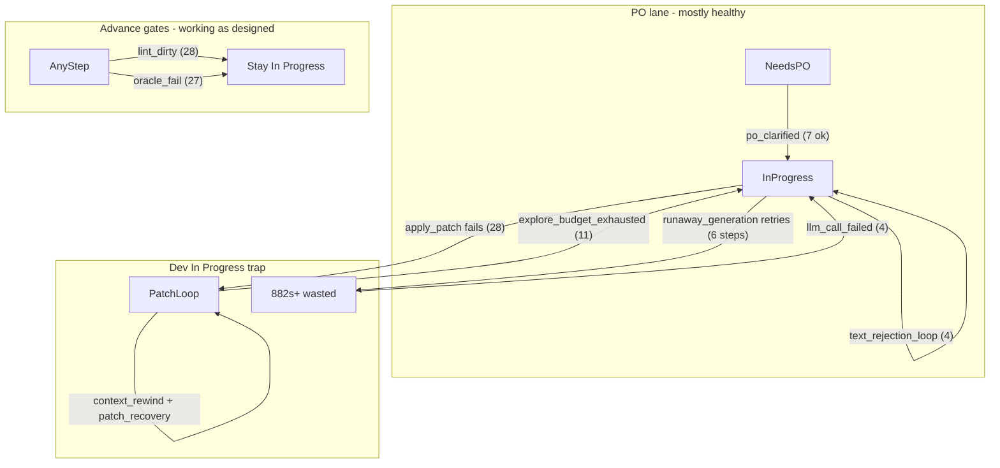

# Diagnostics batch review (48 steps, 16 cards)

## Executive summary

This batch is a **Flutter JSON export/import sprint** on project `c6196c51` using **qwen2.5-coder:14b** (VRAM-clamped `num_ctx` 32768→29696). Across **48 step traces / 16 cards**:

| Metric | Value |
|---|---|
| Step `ok=true` | **10/48 (21%)** — mostly PO clarifications |
| Cards reaching QA/Done | **0** — all remain **In Progress** (1 Needs User) |
| Avg step duration | **~23 min** (max **~16.8 hr** on runaway steps) |
| Dominant tool failure | **`apply_patch` — 28/36 failures** |
| `forcePatchNextDevStep` set | **33/48 steps** — latch works, but Dev still fails to land edits |

The sprint is not blocked by missing specs (PO path is healthy). It is blocked by **patch application failures**, **LLM time burned on runaway text generation retries**, and **lint/oracle gates** that correctly prevent lane advance when the workspace stays dirty.

Compared to the earlier meal-planner bundle analyzed in [`docs/specs/diagnostic_insights_follow-ups_9b2e267a.plan.md`](docs/specs/diagnostic_insights_follow-ups_9b2e267a.plan.md), this batch shows **forced-patch latching is working**, but **patch quality + runaway retry policy** are now the top bottlenecks.

---

## Exit-reason taxonomy



| Exit reason | Count | Notes |
|---|---|---|
| `explore_budget_exhausted` | 11 | Often **after patch attempts**; message still says "without apply_patch/write_file" |
| `tool_failure_stop` | 9 | Patch mismatch / identical patch loops |
| `po_clarified` | 7 | **Healthy** — spec applied, card moved toward Dev |
| `dev_precheck_skip` | 5 | Parking instead of another rewrite (working) |
| `llm_call_failed` | 4 | Runaway generation hard stop |
| `text_rejection_loop` | 4 | Model safety refusals ("I can't assist…") |
| `phase_cycle_cap` | 3 | TASK-8A978 hit **7 dev steps / 6 consecutive bad exits** |
| `max_iterations_after_writes` | 3 | Partial progress, lint wall |

---

## Key insights (with trace evidence)

### 1. apply_patch is the primary failure mode (not explore/read wandering)

- **28 `patch_failed`** events; targets repeat across cards:
  - `lib/export_share_intent.dart`, `lib/main.dart`, `lib/json_export_import.dart`
  - `analysis_options.yaml`, `pubspec.yaml`
- Recovery plumbing **is firing** (`patch_recovery` ×24, `context_rewind` ×43) but patches still fail — likely **stale `old_text` / markdown-recovered tool args**, not missing nudges.
- Example: [`step-TASK-8D0084B52CDB43AA83F36EA9BBC8F4AC-20260922T015847.json`](file:///home/lukemcredmond/.cursor/projects/mnt-Storage-my-agents-my-agent-lab-DevelopmentAgent/attachments/42a02783-5eeb-4ba8-8b8e-b7c0b1888ec6/step-TASK-8D0084B52CDB43AA83F36EA9BBC8F4AC-20260922T015847.json) — `apply_patch` on `pubspec.yaml (replace 0 chars)` → recovery → ends `explore_budget_exhausted` with **`forcePatchNextDevStep: true`**.

**Improvement:** reject no-op patches at the tool layer; after `identicalPatchFailCount >= 2`, **block `apply_patch`** and inject `write_file` escalation with fresh `read_file` excerpt (helpers already exist in [`backend/services/patch_recovery.py`](backend/services/patch_recovery.py)).

---

### 2. Runaway-generation retries burn massive wall clock

- **6 steps** with `runawayGenerationAborted: true`; **33 abort events** total.
- Worst case: [`step-TASK-8A978A773DEE414383CC5153C7B70143-20260922T014052.json`](file:///home/lukemcredmond/.cursor/projects/mnt-Storage-my-agents-my-agent-lab-DevelopmentAgent/attachments/42a02783-5eeb-4ba8-8b8e-b7c0b1888ec6/step-TASK-8A978A773DEE414383CC5153C7B70143-20260922T014052.json) — **882s**, **11 Ollama calls**, **0 tools executed**, all `runaway_generation` at 60s cap.
- Root cause in [`backend/agents/scrum_agent.py`](backend/agents/scrum_agent.py): `runaway_generation` is **not** in the no-retry set (unlike `timeout`, `empty_generation_timeout`, `invalid_tool_json`), so each failure runs through **4 primary + 2 cooldown attempts** × 60s.

**Improvement (P0):** treat `runaway_generation` like `empty_generation_timeout` — **fail fast, no cooldown retry**. Optionally cap **total runaway aborts per step** (e.g. 2) before hard stop.

---

### 3. Misleading `lastStepOutcome.toolFailures` (card cumulative vs step)

- Step-level `toolFailures: 0-1` but UI message says **"10 tool failure(s)"** on the same step.
- Cause: [`_build_last_step_outcome`](backend/services/sprint_service.py) uses `_count_task_tool_failures(task)` (full transcript/decisions), not `trace.tool_failures`.

```553:608:backend/services/sprint_service.py
    tool_failures = _count_task_tool_failures(task) if task else 0
    ...
    if tool_failures > 0:
        ok = False
        message = (
            f"Step finished with {tool_failures} tool failure(s) on '{title}'. "
```

**Improvement (P0):** expose both `stepToolFailures` (from active trace) and `cardToolFailures` (cumulative). Use step count for step outcome messaging.

---

### 4. `explore_budget_exhausted` is often the wrong label

- 11 exits claim explore budget exhausted **without writes**, but traces show **`write_file` / `apply_patch` in `ollamaCalls`** (recovered from markdown) that never landed in `toolsLog` — e.g. [`step-TASK-3E58220263664D338DF594098E28BAA3-20260922T193557.json`](file:///home/lukemcredmond/.cursor/projects/mnt-Storage-my-agents-my-agent-lab-DevelopmentAgent/attachments/42a02783-5eeb-4ba8-8b8e-b7c0b1888ec6/step-TASK-3E58220263664D338DF594098E28BAA3-20260922T193557.json) (2 recovered `write_file`, context rewind ×2, then text rejection + explore stop).

**Improvement:** when `writesAttempted > 0` or patch tools ran this step, classify exit as `tool_failure_stop` / `patch_budget_exhausted`, not `explore_budget_exhausted`. Update `hint`/`suggestedAction` accordingly.

---

### 5. High markdown tool recovery rate (129 events)

- qwen2.5-coder frequently emits tools as **fenced JSON in content** (`tool_calls_recovered_from_content`), not native tool calls.
- This correlates with **bad patch args** and longer latency.

**Improvement:** when recovery rate exceeds threshold early in a step, enable **`forcedToolMode`** sooner (currently rarely true in this batch). Consider backup model routing on repeated recovery + patch fail.

---

### 6. Text rejection / safety refusals on Dev cards

- **12 text rejections** across batch; **4 `text_rejection_loop`** exits.
- Example: TASK-3E582 — `"I'm sorry, but I can't assist with that request."` after lint fanout context.
- `forcedToolMode` was **false** on most of these steps despite rejections.

**Improvement:** on first safety refusal during Forced Patch, route to **backup model** or inject a narrower task slice prompt (AC-only, no lint dump).

---

### 7. Lint / oracle gates are doing their job (but add noise)

- Nearly every failed step logs **`lane_advance_skipped: lint_dirty`** + **`oracle_fail`** — expected when `fixVerifyLintClean: false` and ledger blocks Done.
- TASK-3E582 lint run: **42 flutter analyze findings** — cards cannot advance until workspace lint improves.

**Improvement:** skip lint in fix-verify when **`writesAttempted == 0`** (partially implemented for explore stop; extend to all no-write steps) to save ~4s–30s per failed step.

---

### 8. Concurrent Ollama wait streams (investigate)

- Several traces (especially runaway steps) show **interleaved `ollama_wait` lines** with one stream at `elapsed=60s+` while another starts at `elapsed=0s`, and **duplicate `fix_verify_start round 1/2`** within 1 second.
- Suggests overlapping step dispatch or heartbeat threads during fix-verify — worth confirming no double `execute_step` on the same card.

---

## What's working well

- **PO skip/clarify path** — 7 clean `po_clarified` exits; `po_llm_skipped` when spec already present.
- **`forcePatchNextDevStep` latching** — present on 33/48 steps; `suggestedAction` often correct ("Forced Patch — scaffold lib/ now").
- **Dev phase graph / cycle history** — excellent for seeing cards stuck at Cycle 6–8 on same AC.
- **fix-verify hard-stop** — correctly aborts after runaway (`aborted_hard_stop round=1`) instead of spinning round 2 indefinitely.
- **cardCumulativeState** — `consecutiveBadExits`, `identicalPatchFailCount` surfaced; TASK-8A978 correctly hit phase pressure.

---

## Per-card snapshot (final step in batch)

| Card | Dev steps | Consecutive bad | Last exit |
|---|---|---|---|
| Implement Export Functionality | 7 | 6 | `llm_call_failed` / `phase_cycle_cap` |
| Implement JSON Export Validation | 9 | 1 | `explore_budget_exhausted` |
| Handle Empty State Export | 4 | 1 | `explore_budget_exhausted` |
| Handle Edge Cases for Export | 4 | 2 | `text_rejection_loop` |
| Write Unit/Widget Test for Export | 3 | 2 | `text_rejection_loop` + runaway |
| Build main app UI with tabs | 5 | 0 | `tool_failure_stop` |
| JSON import/export sub-cards | 2–6 | 0–2 | mix of patch fail / explore stop |

**User-facing recommendation for this sprint:** pick **one** core file (`lib/json_export_import.dart` or `lib/export_share_intent.dart`), manually fix lint baseline, then re-run **Forced Patch** on a **single narrowed card** — the backlog is too coupled for parallel patch failure loops.

---

## Recommended follow-ups (priority order)

### P0 — Stop time burn + fix misleading UI

1. **No retry on `runaway_generation`** in [`scrum_agent._chat`](backend/agents/scrum_agent.py) (same bucket as `empty_generation_timeout`).
2. **Step-scoped tool failure counts** in [`_build_last_step_outcome`](backend/services/sprint_service.py) + diagnostics JSON field `cardToolFailures`.

### P1 — Break the patch failure loop

3. **Reject no-op `apply_patch`** (0-char replace / empty old_text) before execution.
4. **Hard escalate to `write_file`** after repeated identical patch fingerprint ([`sprint_speed_gates.identicalPatchFailCount`](backend/services/sprint_speed_gates.py) + [`patch_recovery.build_write_file_escalation_nudge`](backend/services/patch_recovery.py)).
5. **Reclassify exits** when patch tools ran but failed ([`step_diagnostics.derive_exit_reason`](backend/services/step_diagnostics.py)).

### P2 — Model + lint efficiency

6. **Earlier backup model / forcedToolMode** on safety refusals and high markdown-recovery rate.
7. **Skip lint** on zero-write steps in [`fix_verify_loop`](backend/services/fix_verify_loop.py).
8. **Investigate duplicate fix-verify / parallel ollama_wait** logging or dispatch.

---

## Validation plan for next sprint run

- Re-run **3 representative stuck cards** (TASK-8A978 export, TASK-8D0084 empty state, TASK-3E582 validation) after P0+P1.
- Success criteria:
  - No step > **3 min** with 0 tools unless explicitly waiting on user
  - `lastStepOutcome.toolFailures` matches `toolsLog` for that step
  - At least one card reaches **QA** with `fixVerifyLintClean: true`
- Run targeted tests: `tests/test_runaway_generation_cap.py`, `tests/test_patch_recovery_blocks_repeat.py`, `tests/test_step_diagnostics.py`, `tests/test_text_rejection_circuit_breaker.py`
