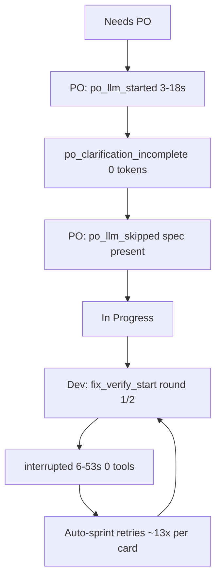

# This batch is crash telemetry, not a trend

**Verdict: do not treat this run as improving or degrading agent performance.** Compared with the overnight Gemma run (real writes, ~2h15m, generation-bound) and the earlier PO-fix traces (~108s PO turns, 1024-token truncations, explore-no-write), this window never reached the model.

Source: 50 uploaded step files, project `155fe53e…`, 2026-09-13 **16:45:08–17:21:53**. Uncommitted repair in [`backend/storage/project_storage.py`](backend/storage/project_storage.py) (WAL, 30s busy timeout, locked retry) is the likely confounder.

## Headline numbers

- **50 traces / 5 lint cards / ~37 min wall clock / 18.5 min summed duration**
- **Ollama calls: 0 · tokens: 0 · tools: 0 · writes: 0**
- Exits: **42 Developer `interrupted`**, 4 PO `po_clarification_incomplete`, 4 PO `po_clarified`
- No `evalTokens == 1024` hits, no explore-budget stops, no iteration-cap stops

Those zeros are the tell. Previous batches spent ~85% of time in Ollama. Here the sprint never generated.

## What actually happened on each card

Typical pattern (e.g. compilation-failed lint card `…3602C50`, 15 steps, 5.1 min):

1. PO logs `po_llm_started` then exits **incomplete in ~11s with no `ollamaCalls`**. That is not a truncated 1024-token turn (those were ~105s). The generate never recorded.
2. Next PO step **skips LLM** (`po_llm_skipped: spec present; last_exit=po_clarification_incomplete`) and moves **Needs PO → In Progress** in ~18s. Skip is intentional: [`PO_LLM_SKIP_EXITS`](backend/services/po_clarification.py) includes `po_clarification_incomplete`.
3. Developer starts, last event is always **`fix_verify_start: round 1/2`**, then **`interrupted`**. Hint: “cancelled or raised an exception.” No `execute_step` tools, no lint_run event.
4. Auto-sprint repeats that Dev crash **~13 times** per card. `cardCumulativeState.consecutiveBadExits` stays **0** because `interrupted` is **not** in [`CIRCUIT_BREAKER_EXITS`](backend/services/sprint_speed_gates.py).

Same shape on the other lint cards. The last card (`store_creation_screen`) only got 1 Dev interrupt before the window ended.

## Why this looks “faster” but is false

| Signal | Overnight / PO-fix batches | This batch | Read |
| --- | --- | --- | --- |
| Time in Ollama | Dominant (~85% / ~108s PO) | **0** | No model work |
| PO leaving Needs PO | Rare, then 1-call ~108s | **4/4 after a skip** | Skip after a failed start, not a successful spec |
| Dev writes | 27/35 overnight; later explore-stuck | **0/0** | Died before first tool |
| Dominant exit | cap / explore / 1024 trunc | **interrupted** | Runtime, not policy |
| Circuit / watchdog | Phase cap, explore | **Did not stop 13 retries** | Stale outcome + `interrupted` not a breaker exit |

Wall clock looks “cheap” (~5 min/card) only because each step died in 6–50s. That is not throughput.

## Link to the repaired bug

The uncommitted change is SQLite: `timeout=30`, `PRAGMA busy_timeout`, WAL, one retry on `locked`. That matches this shape:

- Settings / session / board writes from overlapping sprint + diagnostics
- Step raises or is cancelled mid-`execute_step`
- Trace finalized as `interrupted` with empty Ollama/tool logs
- Next tick starts another Dev step because **`lastStepOutcome` on interrupted Dev traces is still the previous PO `po_clarified`** (stale). Auto-sprint prefers `LAST_STEP_OUTCOME.exitReason` over the trace’s `interrupted`, so [`note_early_interrupt`](backend/services/sprint_speed_gates.py) / [`note_zero_work_exit`](backend/services/sprint_speed_gates.py) may not see a storm.

Developer traces copying PO `lastStepOutcome` also pollutes any dashboard that reads that field.

## What we can still trust

- **PO skip-after-incomplete is firing** (good vs the 21× empty 1024-token PO loop). Here it fired because the *first* PO generate crashed, not because a spec was actually produced this step.
- **Fix-verify is the first Dev action** (`enableFixVerifyLoop`). We never saw whether lint or the LLM is the hang; interrupt lands immediately after `fix_verify_start`.
- **Agent quality metrics from this batch are invalid** (tokens/s, write rate, lint-clean rate, iteration-cap rate).

## What to do next (after you confirm)

1. **Re-run one short sprint on the same lint cards with the SQLite repair deployed.** That is the first comparable sample.
2. Optionally persist a canvas of this tainted vs prior batches (same layout as [last-execution-diagnostics](/home/lukemcredmond/.cursor/projects/mnt-Storage-my-agents-my-agent-lab-DevelopmentAgent/canvases/last-execution-diagnostics.canvas.tsx)).
3. Optional hardening (only if you want it in the same pass): on interrupt, write `LAST_STEP_OUTCOME.exitReason=interrupted`; add `interrupted` to the zero-work / circuit path so 13 silent retries cannot happen.