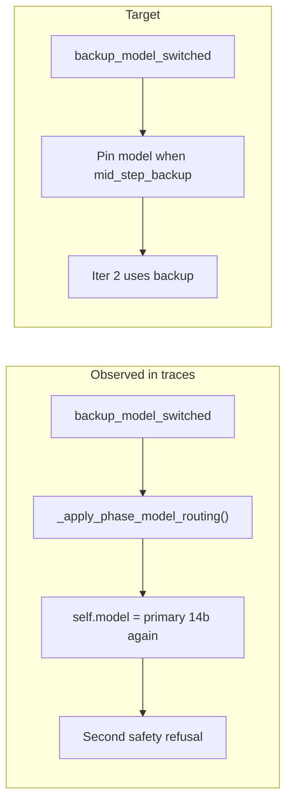

# Diagnostics versioning + batch-driven improvements

## What the Sep 24 batch tells us (53 step files)

| Exit reason | Count | Insight |
|-------------|------:|---------|
| `text_rejection_loop` | 26 | Dominant failure; ~14k–21k prompt tokens on first call |
| `po_clarified` / `po_llm_skipped` | 11 | PO LLM skipped → card returns to Dev with `forcePatch=True` without fixing root cause |
| `phase_cycle_cap` | 6 | Cycle latch working; cards like TASK-54835 hit cap after repeated refusals |
| `completed_with_writes` / `max_iterations_after_writes` | 3 | Recovery path **can** work (e.g. TASK-3FD5E15C lint fix → Done) |
| `interrupted` | 2 | Long-hung steps (~20h) — no `step_stall_watchdog` events in any file |
| `llm_call_failed` / `runaway_generation` | 2 | GPU/generation issues on TASK-67478F |

**Did this batch run commit `925ae98`?** Partially, not reliably:

| Marker expected after `925ae98` | Seen in batch |
|---------------------------------|---------------|
| `synthetic_read_fallback` | 27 traces (also existed before) |
| `synthetic_read_continue` | **0** — either process not restarted after deploy, or steps stop at `identical_text_reject` before `continue` |
| `step_stall_watchdog` | **0** |
| Slim prompts (&lt;8k tokens) on stuck cards | **Rare** — most `text_rejection_loop` still **17k–21k** tokens |
| `cursorLikenessScore` / `cardCumulativeState` | Present (diagnostics shape from recent work) |

Example where recovery almost works but fails on iteration 2 ([step-014244](attachments/...)): backup switches to `ornith-1.5-35b-...`, synthetic read succeeds on `lib/models.dart`, then **`ollama_wait` still shows `qwen2.5-coder:14b`** on iter 2 — backup model is likely **overwritten** by phase routing before `_chat`.



Success contrast: TASK-3FD5E15C reached Done after text reject + backup + `apply_patch` on `analysis_options.yaml` (18k tokens — still not slim). TASK-18BC8ADA used **3656** tokens and advanced with writes (slim/recovery path engaged).

---

## 1. Add build/version stamp to diagnostics (your request)

**Goal:** Every step JSON answers “which code ran this?”

### Design

Add [`backend/services/build_info.py`](backend/services/build_info.py):

- `DIAGNOSTICS_SCHEMA_VERSION = 2` (integer; bump when payload fields change)
- `get_app_build_info()` → cached dict:
  - `gitSha` — short SHA (`git rev-parse --short HEAD` at process start; fallback `"unknown"`)
  - `gitShaFull` — optional full hash
  - `diagnosticsSchemaVersion`
  - `recoveryFeatures` — explicit list of recovery flags shipped in this build, e.g. `["lint_wall_recovery", "synthetic_read_continue", "step_stall_watchdog", "slim_dev_prompt"]` (maintained in one constant so traces are grep-able without git)

Wire into [`step_diagnostics.py`](backend/services/step_diagnostics.py) `_build_payload()`:

```python
"diagnosticsSchemaVersion": 2,
"appBuild": get_app_build_info(),
```

Also add per `ollamaCalls[]` entry: `modelUsed` (actual model string passed to provider) — today `ollama_wait` can disagree with backup switch.

### UI / API

- [`frontend/src/components/TaskDetailModal.tsx`](frontend/src/components/TaskDetailModal.tsx): show `appBuild.gitSha` + schema version in diagnostics header (next to trace id).
- [`frontend/src/types/index.ts`](frontend/src/types/index.ts): type `appBuild` on step diagnostic payload.
- Optional: include same block in [`support_bundle.py`](backend/services/support_bundle.py) manifest.

### Tests

- `tests/test_step_diagnostics.py`: finalized payload includes `diagnosticsSchemaVersion` and `appBuild.gitSha` (mock `get_app_build_info`).

**Operational note:** After deploying, **restart the FastAPI/sprint process** once; otherwise traces will keep missing new event kinds even if git is updated on disk.

---

## 2. P0 — Pin backup model after mid-step switch

**File:** [`backend/agents/scrum_agent.py`](backend/agents/scrum_agent.py) `_apply_phase_model_routing`

When `getattr(self, "_mid_step_backup_switched", False)` and `self.model` is already the armed backup:

- **Skip** `effective_role_model` reset to primary, or pass a flag so routing returns current `self.model`.
- Log `log_event("backup_model_pinned", model)` once per step for trace verification.

This directly addresses the iter-2 `qwen2.5-coder:14b` pattern after `backup_model_switched`.

---

## 3. P0 — Slim prompt on lint-wall + `forcePatchNextDevStep`

**Problem:** [`_should_slim_dev_prompt`](backend/services/sprint_service.py) triggers on `consecutiveBadExits >= 2` but many lint-wall cards retry with **18k+** tokens while `forcePatchNextDevStep` is true on first attempt.

**Change:** Extend `_should_slim_dev_prompt` to return true when:

- `should_force_patch_next_dev_step(task)` **or**
- `is_lint_wall_card(task)` **or**
- `task.get("forcePatchNextDevStep")` (already partially covered)

Ensure lint-wall titles like `Lint: error • Undefined class 'Widget'...` set `lintSourceFile` via existing [`infer_lint_source_file`](backend/services/file_blocker.py) at sprint prompt build time.

**Target:** First-call tokens on forced-patch lint cards **&lt; 8k** (match TASK-18BC8ADA at 3656).

---

## 4. P1 — Break PO skip churn loop

**Problem:** 11× `po_llm_skipped` with `last_exit=text_rejection_loop` and `forcePatch=True` — [`should_move_off_needs_po_without_llm`](backend/services/po_clarification.py) treats `text_rejection_loop` as [`DEV_STALL_FORCE_PATCH_EXITS`](backend/services/sprint_speed_gates.py), so PO never reframes the card.

**Change:**

- Track `poSkipRoundTrips` on card (or use existing `cardProgress.poRoundTrips`) and when **≥ 2** consecutive Dev steps after `po_llm_skipped` end in `text_rejection_loop` (or `phase_cycle_cap`), **do not** auto `move_off_needs_po` — instead park to **Needs User** with message citing lint-wall / model refusal, or auto-split lint card from feature card.
- Gate in [`sprint_service.py`](backend/services/sprint_service.py) before `should_move_off_needs_po_without_llm` PO skip path.

---

## 5. P1 — Lint-wall deterministic recovery earlier

Batch shows synthetic read on real paths (`lib/models.dart`) but still `text_rejection_loop` — deterministic [`lint_wall_recovery.py`](backend/services/lint_wall_recovery.py) may not run when pattern is `Undefined class Widget` (not `flutter_lints`).

**Extend** `detect_lint_wall_pattern` for:

- `Undefined class 'Widget'` / missing `import 'package:flutter/material.dart'` on `lib/main.dart`
- Auto `apply_patch` or inject nudge with exact import line when `read_file` content lacks material import

Log `log_event("lint_wall_deterministic_patch", path)` when applied (grep-able alongside `appBuild.recoveryFeatures`).

---

## 6. P2 — Test hygiene (batch unrelated but blocks CI confidence)

- Fix ollama_retry + scrum_agent **test isolation** (MagicMock in active trace → JSON flush errors when run together).
- Tighten or relocate `test_ui_improvements_pack_markers` in [`test_fix_verify_timeout.py`](tests/test_fix_verify_timeout.py).

---

## Implementation order

1. **build_info + diagnostics fields + UI** (unblocks “which code ran?” immediately)
2. **Backup model pin** in phase routing (highest ROI on refusal loops)
3. **Slim prompt for lint-wall / forcePatch** (cut 20k → ~8k prefill)
4. **PO skip churn gate**
5. **Widget/import lint-wall pattern**
6. Tests + restart reminder in README or sprint boot log line: `AllHands build gitSha=... schema=2`

---

## How you’ll verify the next batch

After deploy + **process restart**, a healthy step file should include:

```json
"diagnosticsSchemaVersion": 2,
"appBuild": { "gitSha": "925ae98", "recoveryFeatures": ["synthetic_read_continue", ...] }
```

And on refusal recovery traces you should see **`backup_model_pinned`** and/or **`synthetic_read_continue`**, with `ollamaCalls[].modelUsed` matching the backup model on iteration 2+.
