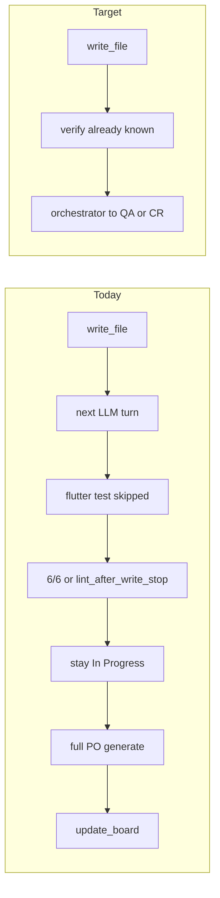

# Faster sprint execution (show progress, not 2h of In Progress)

Last run: **2h 15m**, **85% Ollama**, **0 cards left In Progress via Developer**, **0/23 lint-clean**, **17 skipped-duplicate `flutter test` still costing a generate**, **6 PO steps that only called `update_board`**. Local 26B decode (~14 tok/s) is fine. The loop never promoted work.

## 1. Do not buy another generate for a test you already ran

[`_should_stop_after_write_and_dup_verify`](backend/agents/scrum_agent.py) only fires when **this batch** contains a skipped `run_command`/`run_test` **and** a write already happened. Typical waste: iter N writes, returns `None`, iter N+1 spends ~3 min asking for `flutter test`, then skip+stop.

- After a successful write this step, if that verify command is already in `successful_tool_keys` (including fingerprints seeded at step start), **stop immediately** with the existing `"files already written... duplicate skip"` path — **before** scheduling the next LLM iteration.
- Same stop if the current batch is write-only and a prior success fingerprint matches a verify command (`flutter test`, `dart test`, `dotnet test`, etc.).
- Tests: extend [`tests/test_duplicate_tool_policy.py`](tests/test_duplicate_tool_policy.py) / agent tests so write then “would-be duplicate test” does not call chat again.

## 2. Promote the card when there is something to show

[`_maybe_advance_dev_after_lint_write`](backend/services/sprint_service.py) already moves In Progress → QA/CR **without** `update_board`, but only if `FIX_VERIFY_LINT_CLEAN`. Last run: **always false** (`flutter analyze` after write-stop), so files existed and tests had passed/skipped and the board never moved.

- Add `_maybe_advance_dev_after_verify`: same gates (focus slice, subtasks, unhealthy exit) but trigger when this step **wrote** and verify **succeeded or duplicate-skipped**.
- Keep lint as a signal on the card (`fixVerifyLintClean`, diagnostics). Do **not** require lint-clean to leave In Progress; QA/CR is the review lane.
- Do **not** escalate `max_iterations_after_writes` / `lint_after_write_stop` to Needs PO when writes succeeded ([`_check_stuck_and_escalate`](backend/services/sprint_service.py) ~1449). Stay In Progress for one Patch step or advance if verify already passed.
- Narrow auto-extend: if still In Progress after write+max-iter and verify is unknown, one extend **only** to run verify — default extra 2, skip if duplicate verify is already known. [`autoExtendOnMaxIter`](backend/services/workflow_settings.py) is False in stored defaults; write+dup stop text also fails `_result_is_max_iterations`.

## 3. Kill same-file rewrite churn

[`IDENTICAL_SUCCESS_WRITE_LIMIT = 3`](backend/services/sprint_speed_gates.py) allowed ~10 rewrites of `test/data/store_repository_test.dart`.

- Default limit **2** (workflow override `identicalSuccessWriteLimit`).
- On `identical_write_loop`: **do not** start another Developer In Progress step; park or split. Pair with existing `forcePatchNextDevStep` so explore does not restart.
- Tests: [`tests/test_sprint_speed_gates.py`](tests/test_sprint_speed_gates.py).

## 4. Skip the 2.5-minute PO `update_board`

Picker always prefers Needs PO and [`_run_po_clarification`](backend/services/sprint_service.py) always `execute_step`s. `move_off_needs_po` already exists in [`backend/services/po_clarification.py`](backend/services/po_clarification.py).

- **Before** Ollama: if the card has usable description/AC and last outcome is write-stop / board-noop / identical PO clarification, call `move_off_needs_po` and return.
- Do not send cards to Needs PO solely so PO can `update_board` back (section 2).
- Tests: [`tests/test_po_clarification_retry.py`](tests/test_po_clarification_retry.py) / sprint picker tests — PO `execute_step` not called.

## 5. Size `num_ctx` to the packed prompt

Adaptive ctx is **off**; every step uses **32768**. First-call prefill was ~18s vs ~3.6s later.

- On first chat of a step, set `num_ctx = min(ceiling, round_up(estimate_messages_chars(messages)/4 + 1024))`, floor 2048. Reuse [`estimate_messages_chars`](backend/services/llm_context.py) and VRAM clamp in [`resolve_ollama_num_ctx`](backend/services/prompt_budget.py).
- Keep overflow bump. Do not pack *up* to 32k when the prompt is 5–12k.
- Tests: [`tests/test_adaptive_num_ctx.py`](tests/test_adaptive_num_ctx.py).

## 6. Escalate `apply_patch` mismatch to `write_file` after one fail

[`build_write_file_escalation_nudge`](backend/services/patch_recovery.py) waits for **two identical** mismatches. Last run: 8 patch failures, 48–379 char replaces.

- After **one** `patch_mismatch`, nudge: retry patch once **or** `write_file` full file. After two, force write_file (existing).
- Tests: existing patch recovery tests.

## 7. Abort empty generations before the HTTP timeout

Agent chat is non-streaming; tokens appear only when the request finishes. Last delete-tests step: **301s timeout, 0 tokens**. Do **not** lower the global 900s timeout (kills large `write_file`).

- Stream agent steps ([`llm_provider.py`](backend/services/llm_provider.py) already supports `stream=True`).
- New setting `ollamaEmptyGenerationTimeoutSec` (default **90**): if prefill finished (or first stream event) and `eval_count` stays 0, abort. Keep full timeout while tokens are flowing.
- Timeouts still do not retry ([`scrum_agent.py`](backend/agents/scrum_agent.py) ~1330). One continuation with lower `num_predict` is optional and only if no tools ran.
- Tests: [`tests/test_ollama_retry.py`](tests/test_ollama_retry.py) with a fake stream that emits prompt_eval then silence.

## Tests and verification

- Unit tests per section above; no new markdown docs.
- Run the focused pytest files plus `tests/test_fix_verify_loop.py` / sprint advance if present.
- No UI required unless a setting needs a WorkflowPanel field (`ollamaEmptyGenerationTimeoutSec`, `identicalSuccessWriteLimit`) — add only if other timeouts already appear there.

## Out of scope

- Changing Fast preset from 6 iterations (policy above makes 6 enough).
- Model swap or GPU tuning.
