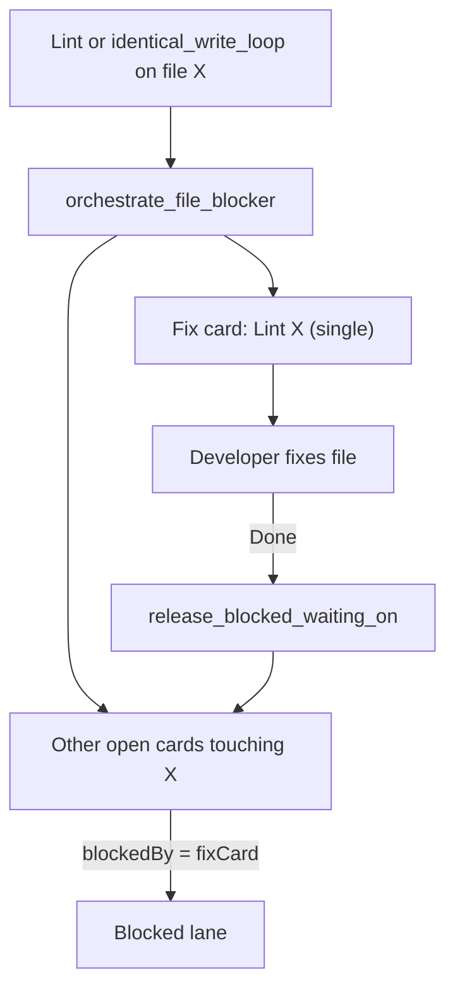

# Shared-file Blocker + Needs User Multiple Choice

## What you asked for

1. **Agent handles shared file breakages** — if one file (e.g. `lib/main.dart`) is breaking many cards, create **one fix card** and move dependents to **Blocked** until it is Done. You should not have to answer 26 lint questions manually.
2. **Needs User like Cursor** — real user decisions show **A / B / C / D + Other**, not a blank textarea.
3. **Lint/tool never Needs User** (your choice) — lint walls use file-block orchestration only.

## Current gaps

| Capability | Today | Gap |
|------------|-------|-----|
| Per-file lint cards | [`lint_fanout.py`](backend/services/lint_fanout.py) spawns `Lint: {path}` siblings | No `blockedBy`; duplicates pile up (your 26 cards) |
| Blocked lane | [`blocked_lane.py`](backend/services/blocked_lane.py) auto-parks cards with unmet `blockedBy` | Only enters from **Backlog / Refinement / Pending Approval** — not In Progress or Needs User |
| Needs User UX | [`TaskDetailModal.tsx`](frontend/src/components/TaskDetailModal.tsx) textarea + Send buttons | No structured options |
| Lint → Needs User | Partially fixed in recent sprint changes | Policy should be **hard ban**; route to file blocker instead |



---

## Part A: Shared-file blocker orchestration

### A1. New service: `backend/services/file_blocker.py`

Core API:

```python
def orchestrate_file_blocker(
    *,
    file_path: str,
    diagnostics: list[dict] | None = None,
    source_task_id: str = "",
    reason: str = "",
) -> dict  # {fixTaskId, blocked: [...], created: bool}
```

Behavior:

1. **Normalize path** (same rules as [`lint_fanout.is_junk_lint_path`](backend/services/lint_fanout.py)).
2. **Find or create one canonical fix card** per file:
   - Reuse open card where `lintSourceFile == path` or title `Lint: {path}`.
   - Else create on **Backlog** (priority 1) using existing `_build_file_card` shape from lint fanout.
   - Set `workType: implementation`, `requiresDev: true`, AC = analyze clean for file.
3. **Find dependents** among open lanes (`In Progress`, `Needs User`, `Backlog`, `Refinement`, `QA`, …):
   - Same `lintSourceFile`, or title prefix `Lint: {path}`, or `lastCommandDiagnostics` mentioning path, or `writePaths` / fanout `relatedTaskIds`.
   - Skip the fix card itself and cards already Done.
4. **Wire deps**: append fix card id to `blockedBy` (dedupe), set `blockedReturnLane` to current lane.
5. Call [`sync_blocked_lane`](backend/services/blocked_lane.py) to park them.
6. **Never** call `_try_move_to_needs_user` for lint/tool paths.

### A2. Extend Blocked lane entry sources

In [`blocked_lane.py`](backend/services/blocked_lane.py):

- Add `In Progress`, `Needs User`, `QA`, `Code Review` to `_ENTER_FROM` **only when** `blockedBy` was set by file blocker (new flag `blockedByKind: "file_fix"` on task, or helper `is_file_blocker_wait(task)`).
- Preserve existing behavior for normal dependency waits from Backlog.

On fix card **Done**, existing [`release_blocked_waiting_on`](backend/services/blocked_lane.py) already releases dependents.

### A3. Trigger points (replace lint → Needs User parking)

| Hook | File | Change |
|------|------|--------|
| After lint fanout | [`lint_fanout.maybe_fanout_lint_diagnostics`](backend/services/lint_fanout.py) | After spawn, call `orchestrate_file_blocker` per affected file; consolidate duplicate lint cards |
| Identical write loop | [`sprint_service._check_stuck_and_escalate`](backend/services/sprint_service.py) ~1705 | If `stuck_is_tool_or_lint` + known file → file blocker, not Needs User |
| Pre-dev park | [`sprint_service._run_developer_step`](backend/services/sprint_service.py) ~4312 | Same for `identical_write_loop_should_park` / `same_next_task_should_park` |
| Recover 26 parked cards | One-shot helper `reconcile_file_blockers_from_board()` | Scan Needs User + In Progress for shared `lintSourceFile`; create fix card + block + **move out of Needs User** |

### A4. Settings (WorkflowPanel)

Add toggles in [`workflow_settings.py`](backend/services/workflow_settings.py) + [`WorkflowPanel.tsx`](frontend/src/components/WorkflowPanel.tsx):

- `enableFileBlockerOrchestration` (default **true**)
- `fileBlockerMinDependents` (default **2** — block when 2+ open cards share a file)
- `fileBlockerAutoCreateFixCard` (default **true**)

### A5. Recover your current 26 cards

Add sidebar action (next to Split visit-cap):

- **“Unblock lint pile”** — runs `reconcile_file_blockers_from_board()`:
  - Groups Needs User / In Progress lint cards by file
  - Creates one fix card per file
  - Sets `blockedBy` + moves dependents to Blocked
  - Clears bogus Needs User fields on those cards

This is a one-click cleanup for the existing backlog without manual answers.

---

## Part B: Needs User multiple choice (Cursor-style)

Only for **genuine** user decisions: secrets, product choices, phase-cycle-cap split vs reset (non-lint).

### B1. Backend brief shape

Extend [`build_needs_user_brief`](backend/services/needs_user_guard.py) return value:

```python
{
  "question": "...",
  "why": "...",
  "action": "...",
  "suggestedTarget": "dev",
  "kind": "product_choice",
  "options": [
    {"id": "a", "label": "Use SQLite only (offline-first)", "answer": "...", "target": "dev"},
    {"id": "b", "label": "Add optional sync later", "answer": "...", "target": "po"},
    {"id": "other", "label": "Other (type below)", "answer": "", "target": "dev"},
  ],
}
```

Store on task as `needsUserOptions` (new field). Kind-specific generators:

- **`product_choice` / `secret` / `phase_cycle_cap`**: 2–4 deterministic options from brief, AC gaps, or known templates (no extra LLM call in v1).
- **`lint`**: **do not escalate to Needs User** — redirect to file blocker (Part A).

Update [`apply_needs_user_brief`](backend/services/needs_user_guard.py) and [`resolve-user` API](backend/api/board.py) to accept `optionId` + optional `customAnswer`.

### B2. Frontend UX

In [`TaskDetailModal.tsx`](frontend/src/components/TaskDetailModal.tsx) Needs User section:

- Render radio list from `task.needsUserOptions` (A/B/C/D labels).
- Selecting an option fills the answer; **Other** enables the textarea.
- Primary button: **Submit answer** (uses option’s `target` or suggested target).
- Keep Send to Dev / PO / Refinement as secondary routing if needed.

In [`TaskCard.tsx`](frontend/src/components/TaskCard.tsx): show first option line or “Pick A–D” badge instead of raw question wall.

Types: add `needsUserOptions` to [`frontend/src/types/index.ts`](frontend/src/types/index.ts) `Task` interface.

### B3. Hard ban lint in Needs User guard

In [`should_escalate_to_needs_user`](backend/services/needs_user_guard.py):

- If `stuck_is_tool_or_lint(task)` and kind is not explicitly user-only → return `(False, "lint_use_file_blocker")`.
- Remove lint-shaped brief generation from parking paths entirely.

---

## Tests

| Area | File |
|------|------|
| File blocker creates one fix card, blocks 2 dependents | `tests/test_file_blocker.py` (new) |
| Lint identical_write_loop triggers blocker not Needs User | extend [`tests/test_capped_retry_loop_regression.py`](tests/test_capped_retry_loop_regression.py) |
| Blocked lane releases when fix card Done | extend [`tests/test_blocked_lane_and_loops.py`](tests/test_blocked_lane_and_loops.py) |
| Needs User options stored + resolve by optionId | extend [`tests/test_needs_user_brief.py`](tests/test_needs_user_brief.py) |
| Frontend option rendering + Other fallback | extend [`frontend/src/utils/taskFormat.needsUser.test.ts`](frontend/src/utils/taskFormat.needsUser.test.ts) |

---

## Implementation order

1. **File blocker service + blocked lane extension** (unblocks your meal-planner pile fastest)
2. **Replace lint → Needs User with file blocker** at sprint hooks
3. **Sidebar “Unblock lint pile”** for existing 26 cards
4. **Needs User options** backend + modal UI
5. **Tests**

---

## What this does NOT do (v1)

- No LLM-generated A/B/C/D options (deterministic templates only; can add LLM later for product_choice)
- Does not auto-fix `lib/main.dart` without a Developer step — it **schedules** one fix card and stops duplicate thrashing
- Does not remove lint fanout entirely — it **consolidates** fanout + blocking
