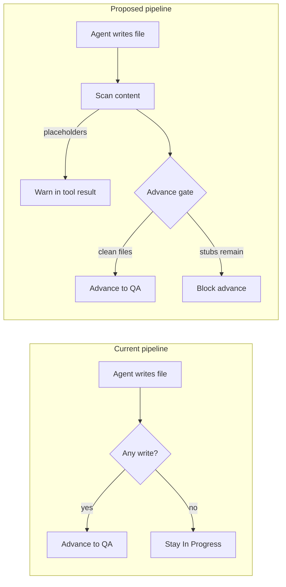

# Ensure Complete Code Output (No Placeholders)

## Problem diagnosis

Your `local_meal_planner_5` output shows the exact failure mode the pipeline allows today:

| File | State |
|------|-------|
| `lib/meal_repository.dart` | Comment-only TODO |
| `lib/main.dart` | Comment-only TODO |
| `lib/shopping_list_service.dart` | Partial class, no real service |
| `lib/meal_selector.dart`, `lib/json_export_import.dart` | Actually implemented |

**Root cause:** DevelopmentAgent is **write-centric, not content-centric**. A card advances when:

1. At least one `write_file`/`apply_patch` succeeded ([`dev_gate_blocks_advance`](backend/services/sprint_service.py))
2. Workspace structure is present ([`workspace_structure_audit.py`](backend/services/workspace_structure_audit.py))
3. Optionally lint is clean — but `requireCleanLint` defaults to **false** ([`workflow_settings.py`](backend/services/workflow_settings.py))

There is **no scanner** for `TODO`, `// This file will handle`, auto-scaffold markers, or comment-only files. Worse, the system **actively encourages stubs**:

- [`prompt_defaults.py`](backend/services/prompt_defaults.py) line 66: *"write_file minimal valid stubs"*
- [`workspace_scaffold.py`](backend/services/workspace_scaffold.py): auto-creates `// Auto-scaffolded stub for ...` files
- [`FORCE_PATCH_INSTRUCTION`](backend/services/sprint_service.py) line 2201: *"scaffold first ... then implement"* — but nothing enforces the "then implement" part



## Recommended approach (your choices)

**Enforcement:** warn during writes **and** block lane advance.

**Scaffold behavior (hybrid A + C):**
- **Default:** files scaffolded or written by this card must be fully implemented before the card advances.
- **Delegation carve-out:** if another Backlog/In Progress card explicitly owns the file (via `lintSourceFile`, title prefix `Implement: <path>`, or AC mentioning the path), the scaffolder may advance — but the owning card is blocked until the file is complete.

---

## Implementation plan

### 1. New completeness scanner service

Create [`backend/services/file_completeness.py`](backend/services/file_completeness.py):

```python
PLACEHOLDER_PATTERNS = [
    r"^\s*//\s*TODO\b",
    r"^\s*//\s*FIXME\b",
    r"Auto-scaffolded stub",
    r"This file will handle",
    r"not implemented",
    r"throw\s+UnimplementedError",
    r"^\s*pass\s*$",          # Python empty body
    r"^\s*\.\.\.\s*$",        # ellipsis placeholder
]
```

Core functions:
- `scan_file_content(path, content) -> list[Finding]` — line-level matches with pattern id
- `scan_workspace_file(path) -> list[Finding]` — read from disk
- `scan_task_files(task) -> CompletenessReport` — scan all paths in `task.files` with write actions
- `is_comment_only_source(content, ext) -> bool` — detect files that are only comments (like `meal_repository.dart`)
- `is_scaffold_stub(content) -> bool` — detect auto-scaffold output

**False-positive guards:**
- Skip test files (`*_test.dart`, `test_*.py`)
- Skip generated paths (`*.g.dart`, `node_modules/`)
- Allow `TODO` in markdown/docs only
- Configurable `placeholderAllowlist` patterns in workflow settings

### 2. Write-time warnings (in-loop feedback)

In [`backend/workspace/files.py`](backend/workspace/files.py) `write_workspace_file()` (~line 434), after a successful write:

- Call `scan_file_content(safe_path, content)`
- If findings exist, append to tool return message:
  ```
  Warning: file contains placeholder/incomplete patterns (lines 1, 3): TODO, comment-only.
  Replace with full implementation before moving to QA.
  ```
- Record findings on task: `task["fileCompletenessWarnings"]`

This gives the agent immediate feedback in the same LLM turn without blocking the write (stubs are sometimes a valid intermediate step mid-card).

### 3. Lane-advance gate (hard block)

Add `requireFileCompleteness: true` to [`workflow_settings.py`](backend/services/workflow_settings.py) defaults.

Wire into [`dev_gate_blocks_advance()`](backend/services/sprint_service.py) (~line 2818), after write check, before lint:

```python
if ws.get("requireFileCompleteness", True):
    report = scan_task_files(task)
    if report.blocking_findings:
        return True, f"Incomplete files: {report.summary()}"
```

Also wire into [`qa_gate_blocks_done()`](backend/services/sprint_service.py) (~line 2641) and extend [`done_audit.py`](backend/services/done_audit.py) to flag Done cards with placeholder files.

**Scaffold delegation logic** (hybrid A+C):
- Track scaffolded paths in task metadata when [`scaffold_task_referenced_stubs()`](backend/services/workspace_scaffold.py) runs: `task["scaffoldedFiles"] = [...]`
- At gate time, for each incomplete scaffolded file:
  - If `allowStubDelegation` is true AND another card owns the path → skip blocking for scaffolder
  - Otherwise → block scaffolder until file is complete
- Owning card detection reuses patterns from [`file_blocker.py`](backend/services/file_blocker.py) (cards touching same path) plus explicit `lintSourceFile` / AC path mentions

### 4. Prompt hardening

Update [`backend/services/prompt_defaults.py`](backend/services/prompt_defaults.py) Developer instructions:

**Add (after structure section):**
> "Never leave TODO, FIXME, 'This file will handle', or comment-only placeholder files. Every file you write must be fully working implementation. Auto-scaffold stubs must be replaced with real code in this card before advancing — unless a separate backlog card explicitly owns that file."

**Change line 66** from *"minimal valid stubs"* to:
> "minimal compilable stubs only when files are missing — then immediately replace with full implementation in the same card"

Update Code Reviewer prompt (~line 46) to:
> "Reject files containing TODO/FIXME/placeholder comments or auto-scaffold markers. Return to Developer if any touched file is incomplete."

### 5. Scaffold tracking

In [`workspace_scaffold.py`](backend/services/workspace_scaffold.py) `scaffold_task_referenced_stubs()`:
- After creating stubs, set `task["scaffoldedFiles"]` on the active sprint task
- Log decision with `structure_scaffold` (already exists) including file list

In [`sprint_service.py`](backend/services/sprint_service.py) dev handler (~line 4704), after `maybe_auto_scaffold()`:
- Inject scaffold file list into Developer prompt context so agent knows which files need full implementation

### 6. Settings UI

Add to [`frontend/src/types/index.ts`](frontend/src/types/index.ts) and [`WorkflowPanel.tsx`](frontend/src/components/WorkflowPanel.tsx):
- `requireFileCompleteness` (default: true) — checkbox under quality gates
- `allowStubDelegation` (default: false) — advanced toggle for hybrid scaffold behavior

Update **Gated** preset to include `requireFileCompleteness: true`.

### 7. Tests

New [`tests/test_file_completeness.py`](tests/test_file_completeness.py):
- Detects `meal_repository.dart`-style comment-only TODO files
- Detects auto-scaffold markers
- Allows legitimate `TODO` in test files
- `dev_gate_blocks_advance` blocks when incomplete
- Scaffold delegation: scaffolder advances when owning card exists; owner blocked
- `write_workspace_file` returns warning suffix when placeholders present

Extend [`tests/test_workflow_settings_api.py`](tests/test_workflow_settings_api.py) for new settings fields.

---

## Immediate mitigations (no code — use today)

While the above is being built, you can reduce placeholder output now via Workflow settings:

| Setting | Value | Effect |
|---------|-------|--------|
| Workflow preset | **Gated** | Enables `requireCleanLint` + `requireDevVerification` |
| `autoScaffoldOnStructureGap` | **false** | Stops system from writing stub files the agent never replaces |
| Card sizing | Smaller AC per card | One file per card reduces "write 8 stubs, implement 2" pattern |

---

## Key files to change

| File | Change |
|------|--------|
| `backend/services/file_completeness.py` | **New** — scanner + report |
| `backend/workspace/files.py` | Write-time warnings |
| `backend/services/sprint_service.py` | `dev_gate_blocks_advance`, scaffold prompt injection |
| `backend/services/workspace_scaffold.py` | Track `scaffoldedFiles` |
| `backend/services/prompt_defaults.py` | Anti-placeholder instructions |
| `backend/services/workflow_settings.py` | New settings |
| `backend/services/done_audit.py` | Post-hoc completeness audit |
| `backend/api/schemas.py` | API types |
| `frontend/src/components/WorkflowPanel.tsx` | UI toggles |
| `tests/test_file_completeness.py` | **New** — coverage |

## Expected outcome

After implementation, a card like your meal planner example would:
1. Get a **warning** on `write_file` when it writes `// TODO: Implement MealRepository...`
2. Be **blocked** from In Progress → QA with: *"Incomplete files: lib/meal_repository.dart (TODO line 1), lib/main.dart (comment-only)"*
3. Force the agent to loop until files contain real implementations — or split into per-file cards with delegation enabled
