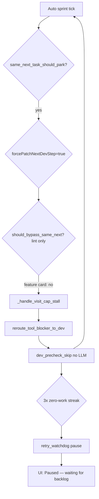

# Fix Autonomous Auto Sprint Stall

## What your support bundle shows

Three diagnostics in ~4 seconds on `TASK-96094376…` — each **243–371ms**, **0 Ollama calls**, `exitReason: dev_precheck_skip`:

**Root cause:** After the NU-loop fix, feature cards get `forcePatchNextDevStep=true` via [`reroute_tool_blocker_to_dev`](backend/services/needs_user_guard.py), but [`should_bypass_same_next_task_park`](backend/services/card_ledger.py) only bypasses **lint wall** cards. Feature cards like *Import from document* never run Dev; they spin precheck → reroute → precheck. After 3 ticks, [`note_zero_work_exit`](backend/services/sprint_speed_gates.py) pauses auto sprint. The UI then shows **"Paused — waiting for backlog"** even though **5+ In Progress cards** exist — resume only happens when Backlog length grows ([`useAppState.ts`](frontend/src/hooks/useAppState.ts) L1373–1385).

Board snapshot confirms: every In Progress card has `forcePatchNextDevStep=true`, `lastNextWorkNoWrite=true`, same `lastNextWorkKey`.

---

## Fix 1 — Unblock Forced Patch on all cards (primary)

**[`backend/services/card_ledger.py`](backend/services/card_ledger.py)**

- Change `should_bypass_same_next_task_park()` to bypass when **`forcePatchNextDevStep`** is set on **any** card (not only `is_lint_wall_card`). Align with existing [`should_force_patch_next_dev_step`](backend/services/sprint_speed_gates.py) which already treats all force-patch cards equally.
- Update docstring; flip [`test_feature_card_qa_diagnostics_does_not_bypass_same_next`](tests/test_card_ledger.py) → expect bypass **True** and `same_next_task_should_park` **False**.

**[`backend/services/needs_user_guard.py`](backend/services/needs_user_guard.py)**

- In `reroute_tool_blocker_to_dev()`, also clear `lastNextWorkKey` / `lastNextWorkNoWrite` (same as [`_keep_lint_card_for_developer`](backend/services/sprint_service.py) L5706) so the next tick cannot re-arm the gate even if bypass regresses.

**[`backend/services/sprint_service.py`](backend/services/sprint_service.py)**

- Rename `_forced_patch_lint_retry_allowed` → `_forced_patch_retry_allowed` (call sites only; behavior uses broadened bypass).
- Add regression test: feature card with `forcePatchNextDevStep` + same-next markers → `_run_developer_step` calls `begin_dev_step` (Dev actually runs).

Expected result: real LM Studio/Ollama calls resume; steps take seconds/minutes, not milliseconds.

---

## Fix 2 — Autonomous recovery ladder on repeated zero-work (your policy)

When auto sprint would set `retry_watchdog`, **do not permanently pause** if actionable work remains. Instead run a recovery pass, then auto-retry.

**New helper** in [`backend/services/sprint_service.py`](backend/services/sprint_service.py): `_recover_zero_work_stall(task_id, exit_reason)`:

| Step | Action | Agent |
|------|--------|-------|
| 1 | Clear same-next markers; reset `consecutiveNoWriteStall`; optionally rewind dev phase graph one cycle if stuck in patch-with-no-writes | System |
| 2 | If `enableSplitOnStuck` → `_run_stuck_auto_split` | PO |
| 3 | If still stalled and PO rounds remain → `_redirect_to_needs_po` / `_run_po_clarification` with stall context from diagnostics | PO |
| 4 | If latched visit cap → existing `_recover_latched_dev_card` | System |
| 5 | **Only if all above fail** → `_try_move_to_needs_user` with MCQ (existing last-resort path) | User |

Wire into [`run_auto_sprint`](backend/services/sprint_service.py) where `note_zero_work_exit` returns True (~L6400): call recovery once per watchdog trip, reset watchdog, **continue the loop** instead of `break` (cap recovery attempts per session via setting e.g. `maxZeroWorkRecoveryAttempts: 2`).

**[`backend/services/sprint_speed_gates.py`](backend/services/sprint_speed_gates.py)**

- Optionally exclude `dev_precheck_skip` from zero-work counting when `forcePatchNextDevStep` is set (belt-and-suspenders until Fix 1 is verified in prod).

---

## Fix 3 — UI: honest status + auto-retry (not “waiting for backlog”)

**[`frontend/src/hooks/useAppState.ts`](frontend/src/hooks/useAppState.ts)**

- Track `lastSprintSummary.status` (already returned from API).
- On `retry_watchdog`: **do not** set `autoSprintPaused=true` when `hasSprintWork(board)` is still true — let the 5s interval retry (or retry immediately once after recovery).
- Keep pause only for true idle (`!hasSprintWork`) or simulation pending.
- Broaden resume trigger: unpause when In Progress cards change state (not only Backlog length increase).

**[`frontend/src/components/Sidebar.tsx`](frontend/src/components/Sidebar.tsx)**

- Replace generic `"Paused — waiting for backlog"` with status-aware text:
  - `retry_watchdog` → "Paused — recovering from zero-work stall…"
  - `idle` + no work → "Paused — no actionable cards"
  - Show last recovery action from console/summary when available.

---

## Fix 4 — Tests

| Test | File | Asserts |
|------|------|---------|
| Feature forcePatch bypasses same-next | `tests/test_card_ledger.py` | Dev precheck does not skip |
| Reroute clears lastNextWork* | `tests/test_card_ledger.py` or new | After `reroute_tool_blocker_to_dev`, same-next false |
| Auto sprint runs Dev after reroute | `tests/test_capped_retry_loop_regression.py` | `begin_dev_step` called, not 3× precheck skip |
| Recovery ladder before pause | new | 3 zero-work exits → recovery invoked, sprint continues |
| UI pause message | `frontend/src/types/hasSprintWork.test.ts` or hook test | retry_watchdog does not block retry when IP work exists |

---

## Expected behavior after fix

| Situation | Before | After |
|-----------|--------|-------|
| Feature card, forcePatch, same-next stall | 200ms precheck loop → pause | Dev runs with Forced Patch instruction |
| 3 zero-work exits | Pause forever until new backlog card | Auto recovery (clear → split → PO) → retry |
| Still unfixable after recovery | Silent stall / wrong UI | Needs User MCQ only as last resort |
| UI | "Waiting for backlog" | Accurate stall/recovery status |

**Immediate workaround (before deploy):** On each stuck In Progress card, clear `lastNextWorkNoWrite` in the board JSON or click **Send to Developer** after toggling off/on Auto Sprint; cards already have `forcePatchNextDevStep=true` so one manual Dev run may unblock them once Fix 1 ships.
