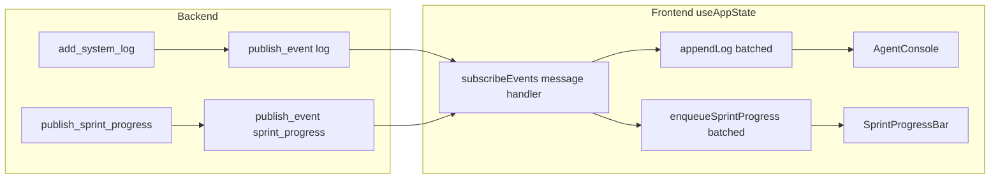

# Fix Console + Progress Bar Not Updating

## Diagnosis (expanded panel, empty/frozen)

The recent **quality-model tuning** changes ([`allhands.project.json`](allhands.project.json), [`WorkflowPanel.tsx`](frontend/src/components/WorkflowPanel.tsx), [`SettingsSlideOver.tsx`](frontend/src/components/SettingsSlideOver.tsx)) do **not** touch the console/progress pipeline. They cannot directly break SSE or [`AgentConsole`](frontend/src/components/AgentConsole.tsx).

What matches your symptom (Console tab open, nothing moving):

| Likely cause | Evidence in code |
|--------------|------------------|
| **Auto sprint failed silently** | [`startAutoSprint`](frontend/src/hooks/useAppState.ts) catches all errors and only clears `sprintRunning` — no toast/error |
| **Backend not restarted** after prior `effective_role_model` import fix in [`backup_model.py`](backend/services/backup_model.py) | Step can crash before any `add_system_log` / `publish_sprint_progress` |
| **No early progress event** | [`run_auto_sprint`](backend/services/sprint_service.py) does not call `publish_sprint_progress` until a step handler runs — long first Ollama wait shows blank bar even when `sprintRunning` is true |
| **Progress bar hidden when panel collapsed** | [`App.tsx`](frontend/src/App.tsx) wraps `SprintProgressBar` in `{!bottomPanelCollapsed && (...)}` — separate issue if panel toggles |
| **SSE disconnected** | Console header shows **Reconnecting…** (you did not report this) |

Logs and progress both flow through **`/api/events`** SSE:



Backend [`add_system_log`](backend/services/logs.py) always publishes `log` events. If Console stays at **0 events** during a sprint, either the sprint never started on the server or SSE is not delivering.

---

## Fix plan

### 1. Surface auto-sprint failures (high impact, small diff)

In [`frontend/src/hooks/useAppState.ts`](frontend/src/hooks/useAppState.ts) `startAutoSprint`:

- On `catch`, call `setError(...)` with `ApiError.detail` or message (today: empty `catch`)
- Optionally `add_system_log`-equivalent: append a local error log entry so Console shows why sprint stopped

This prevents “frozen empty UI” when `/api/sprint/run` returns 500 or network fails.

### 2. Emit progress immediately when auto sprint starts

In [`backend/services/sprint_service.py`](backend/services/sprint_service.py) `run_auto_sprint`, right after `state.SPRINT_PROGRESS_MAX = limit` (before the loop):

```python
publish_sprint_progress(
    phase="sprint_step",
    step=0,
    max_steps=limit,
    agent="System",
    task_title="Auto sprint starting…",
    status="starting",
)
```

Ensures violet progress strip appears within ~50ms of SSE even before first Ollama call.

### 3. Keep sprint chrome visible during work

In [`frontend/src/App.tsx`](frontend/src/App.tsx):

- **Move `SprintProgressBar` (and optionally `AgentRunBar`) outside** the `{!bottomPanelCollapsed && (...)}` guard so collapse never hides progress
- Add `useEffect` on `orchestratedActive`: when it becomes true, call existing `expandBottomPanel()` + `setBottomTab('console')` (same pattern as [`onPlanAndRun`](frontend/src/App.tsx) lines 1653–1657)

### 4. Harden log merge on SSE state snapshots (defensive)

In [`applySseStateSnapshot`](frontend/src/hooks/useAppState.ts), if incoming `data.logs` is missing or shorter than `prev.logs`, **keep the longer list** (append-only logs should never shrink during a live sprint).

Extract helper to [`frontend/src/utils/streamBuffers.ts`](frontend/src/utils/streamBuffers.ts) (alongside existing `capLogs`) for unit testing:

```typescript
export function mergeLogsPreservingLive(prev: SystemLog[], incoming?: SystemLog[]): SystemLog[]
```

### 5. Operational check (no code)

Restart backend after pulling latest changes (especially [`backup_model.py`](backend/services/backup_model.py) `effective_role_model` import). Stale process = steps crash with no UI feedback.

---

## Tests to add (prevent regression)

### Frontend (vitest, `src/**/*.test.ts`)

New file [`frontend/src/utils/sprintUi.test.ts`](frontend/src/utils/sprintUi.test.ts):

- **`mergeLogsPreservingLive`**: incoming `[]` or shorter array must not wipe prior logs
- **`isSprintProgressActive`**: extracted from [`SprintProgressBar`](frontend/src/components/SprintProgressBar.tsx) logic — `sprintRunning` true with null progress still active
- **`mapSprintProgress`**: unknown phase maps safely; `done` clears via existing flush rules (export map function to test file or duplicate minimal cases)

### Backend (pytest)

New file [`tests/test_auto_sprint_progress_boot.py`](tests/test_auto_sprint_progress_boot.py):

- Patch `run_sprint_step` to no-op, call `run_auto_sprint` with empty board / immediate idle
- Assert **first** `publish_sprint_progress` call includes `status="starting"` or `step=0` before loop exit

Extend or mirror existing [`tests/test_smoke.py::test_publish_sprint_progress_emits_event`](tests/test_smoke.py) for `publish_event("log", ...)`.

### Optional UI smoke (manual checklist after fix)

- Start auto sprint → Console shows **Live**, event count increases, violet bar shows “Auto sprint starting…”
- Collapse bottom panel (Ctrl+J) → progress strip still visible
- Induce 500 (stop backend mid-run) → error message visible, not silent freeze

---

## Files to change

| File | Change |
|------|--------|
| [`frontend/src/hooks/useAppState.ts`](frontend/src/hooks/useAppState.ts) | Surface sprint errors; merge logs in SSE snapshot |
| [`frontend/src/App.tsx`](frontend/src/App.tsx) | Progress bar always visible; auto-expand on orchestrated work |
| [`frontend/src/utils/streamBuffers.ts`](frontend/src/utils/streamBuffers.ts) | `mergeLogsPreservingLive` helper |
| [`frontend/src/components/SprintProgressBar.tsx`](frontend/src/components/SprintProgressBar.tsx) | Export `isSprintProgressActive()` for tests |
| [`backend/services/sprint_service.py`](backend/services/sprint_service.py) | Initial `publish_sprint_progress` on auto sprint start |
| [`tests/test_auto_sprint_progress_boot.py`](tests/test_auto_sprint_progress_boot.py) | New backend regression |
| [`frontend/src/utils/sprintUi.test.ts`](frontend/src/utils/sprintUi.test.ts) | New frontend regression |

---

## What we are not changing

- Quality model presets / 14B routing (separate concern)
- Qdrant indexing
- Plan file edits
