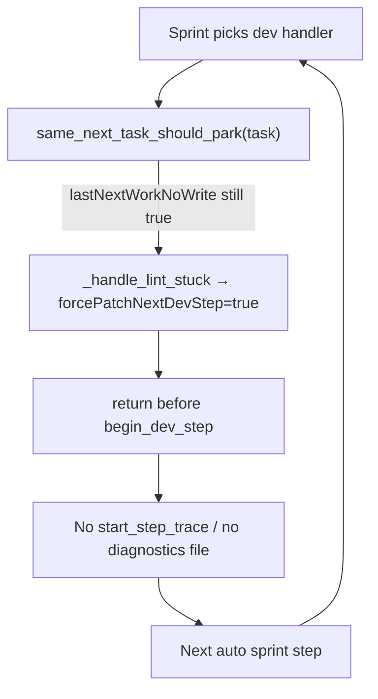

# Fix Dev Precheck Loop + Missing Diagnostics

## What the console shows

Repeated pattern every ~1s:

1. `Sprint handler: dev` — card selected
2. `Same next task reissued with no writes or better oracle — parking instead of another generate.`
3. `lint/tool errors — staying In Progress for Forced Patch`
4. No `Implementing '…'` log, no new step JSON under `~/.allhands/diagnostics/`

The card never moves because **Developer never runs** — the sprint tick exits in a pre-check.

## Root cause



In [`_run_developer_step`](backend/services/sprint_service.py) (~4401):

```python
if same_next_task_should_park(live_task):
    ...
    if stuck_is_tool_or_lint(live_task):
        _handle_lint_stuck(task_id, dict(live_task), park_msg)
        return  # ← exits before _ensure_dev_step_trace (line 4497)
```

[`same_next_task_should_park`](backend/services/card_ledger.py) is true when `lastNextWorkKey` matches and `lastNextWorkNoWrite` is set by the **previous** Dev visit via [`record_next_work_visit`](backend/services/sprint_service.py) (~842). [`_keep_lint_card_for_developer`](backend/services/sprint_service.py) arms `forcePatchNextDevStep` but **does not clear** `lastNextWorkNoWrite`, so every subsequent tick re-parks.

Same issue affects `identical_write_loop_should_park` early return (~4391) — also returns without trace.

This is a regression from the lint-stuck UX fix: `_handle_lint_stuck` short-circuits Dev but leaves the same-next-task gate armed.

## Fix plan

### 1. Unblock Forced Patch lint retries from same-next-task gate

**File:** [`backend/services/sprint_service.py`](backend/services/sprint_service.py)

In `_run_developer_step` pre-checks, **skip** `same_next_task_should_park` (and optionally `identical_write_loop_should_park`) when:

- `stuck_is_tool_or_lint(task)` **and** `task.get("forcePatchNextDevStep")`

Pattern (mirror existing `no_write_stall` fix at ~4430):

```python
if same_next_task_should_park(live_task):
    if stuck_is_tool_or_lint(live_task) and live_task.get("forcePatchNextDevStep"):
        pass  # allow Forced Patch retry — do not park
    else:
        ... existing park / Needs User path ...
```

**File:** [`backend/services/sprint_service.py`](backend/services/sprint_service.py) — `_keep_lint_card_for_developer`

Clear ledger stall flags when arming retry:

```python
task.pop("lastNextWorkNoWrite", None)
# optionally task.pop("lastNextWorkKey", None)  # only if still stuck after one clear
task["consecutiveNoWriteStall"] = 0  # already done
```

**File:** [`backend/services/card_ledger.py`](backend/services/card_ledger.py) (optional belt-and-suspenders)

Add `should_bypass_same_next_task_park(task)` used by sprint pre-check: true when `forcePatchNextDevStep` and lint/tool card.

### 2. Record diagnostics on Dev pre-check skips

When a pre-check still returns early (empty-gen cool-off, capped visit, etc.), diagnostics must not be silent.

**New helper** in [`backend/services/sprint_service.py`](backend/services/sprint_service.py):

```python
def _record_dev_precheck_skip(
    task_id, title, lane_before, *, reason: str, exit_reason: str = "lint_stay_in_progress"
) -> None:
    _ensure_dev_step_trace(task_id, title, lane_before)
    state.LAST_AGENT_STEP_RESULT = reason
    _record_last_step_outcome(task_id, lane_before, "Developer", agent_result=reason)
    _finalize_dev_step_diagnostics_if_auto_sprint(task_id, lane_before)
```

Call from lint `_handle_lint_stuck` early-return paths in `_run_developer_step` when we **do** park (non-forcePatch cases), and from `_handle_lint_stuck` itself when it only sets flags (record a thin “Forced Patch queued” skip trace so UI/console has a file).

Important: `_finalize_dev_step_diagnostics_if_auto_sprint` no-ops when `SPRINT_PROGRESS_MAX == 1` — verify auto-sprint sets max > 1; if not, call `_finalize_step_diagnostics_if_traced` directly for precheck skips.

### 3. Prevent dev_recovery from stealing ticks (already partially done)

Confirm [`_in_progress_pending_recovery`](backend/services/sprint_service.py) exclusion for forcePatch lint cards remains. No change expected unless tests show dev_recovery still wins.

### 4. Tests (prevent recurrence)

| Test | File | Asserts |
|------|------|---------|
| forcePatch lint card bypasses `same_next_task_should_park` in `_run_developer_step` | extend [`tests/test_capped_retry_loop_regression.py`](tests/test_capped_retry_loop_regression.py) | mock `agent_dev.execute_step`; assert it was called |
| `_keep_lint_card_for_developer` clears `lastNextWorkNoWrite` | [`tests/test_card_ledger.py`](tests/test_card_ledger.py) or new | after call, `same_next_task_should_park(task)` is False |
| precheck skip writes diagnostics JSON | extend [`tests/test_step_diagnostics.py`](tests/test_step_diagnostics.py) | call `_record_dev_precheck_skip`; assert trace file exists with `exitReason` |
| no infinite loop: two sprint ticks on stalled lint card → second runs Dev | integration-style in capped retry tests | handler dev both times; second does not hit park-only path |

## Expected behavior after fix

- Console shows `Implementing 'Lint: …'` after the park message, not an endless park/Forced Patch loop
- New files appear under `~/.allhands/diagnostics/<project>/step-TASK-…json` each sprint step
- Card stays In Progress with Forced Patch until Developer actually patches or lint clears
- Run bar shows lint-specific copy (from prior lint-stuck UX fix), not “text-only”

## Files to change

- [`backend/services/sprint_service.py`](backend/services/sprint_service.py) — pre-check bypass, `_keep_lint_card_for_developer` ledger clear, `_record_dev_precheck_skip`
- [`backend/services/card_ledger.py`](backend/services/card_ledger.py) — optional bypass helper
- [`tests/test_capped_retry_loop_regression.py`](tests/test_capped_retry_loop_regression.py), [`tests/test_step_diagnostics.py`](tests/test_step_diagnostics.py), [`tests/test_card_ledger.py`](tests/test_card_ledger.py)
