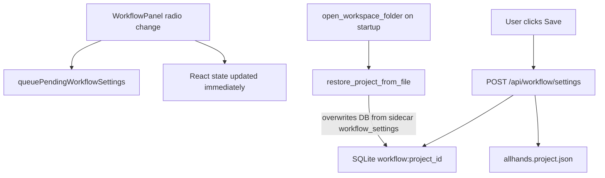

# Fix executionProfile save/load regression

## Answer: does your JSON match expectations?

**No — not for execution profile.** Your pasted [`allhands.project.json`](file:///mnt/Storage/my-agents/ai_projects/coding_output/local_meal_planner_5/allhands.project.json) (and the on-disk copy under `local_meal_planner_5`) both contain:

```json
"executionProfile": "scrum"
```

If Implementer had been saved successfully, this would be `"implementer"`. Everything else in your JSON looks internally consistent (Ollama provider, `prioritizeImplementationOverRefinement: true`, sprint tuning, etc.), but **the execution mode itself is still Scrum on disk**.

## How save/load works today



Key behaviors:

1. **Manual save only** — Autosave for workflow settings was removed ([`docs/specs/manual_project_save_d2cb825c.plan.md`](docs/specs/manual_project_save_d2cb825c.plan.md)). Changing the Execution profile radio only stages a pending patch via [`handleWorkflowSettingsChange`](frontend/src/App.tsx) → [`queuePendingWorkflowSettings`](frontend/src/workflowSettingsPending.ts). It is **not** persisted until **Save** runs [`handleSaveAll`](frontend/src/App.tsx) → `updateWorkflowSettings`.

2. **Sidecar wins on workspace open** — [`open_workspace_folder`](backend/services/workspace_open.py) always calls [`restore_project_from_file`](backend/services/project_file.py), which runs `save_workflow_settings(sidecar.workflow_settings)`. If the sidecar still says `scrum`, every app restart / workspace reopen resets the DB to Scrum.

3. **Backend save path is fine** — [`save_workflow_settings`](backend/services/workflow_settings.py) merges partial updates and syncs the sidecar. There is no code that forces `scrum` on save (only [`get_execution_profile`](backend/services/workflow_settings.py) normalizes at read time).

4. **SSE stomp gap (in-session UI revert)** — [`mergePendingWorkflowSettings`](frontend/src/workflowSettingsPending.ts) only keeps **`lastSavedLlm`** across stale SSE snapshots (LLM provider/base URL). **`executionProfile` is not in that overlay.** After a successful save of other settings, or after page reload / session refresh clears pending state, the UI can show Scrum again even if the user previously selected Implementer in the same session without saving.

## Test gap (why this slipped through)

| Test file | What it covers | Gap |
|-----------|----------------|-----|
| [`tests/test_execution_profile.py`](tests/test_execution_profile.py) | Runtime handler selection when `save_workflow_settings({"executionProfile": "implementer"})` is called in-process | No API POST, no sidecar round-trip |
| [`tests/test_project_settings_sidecar.py`](tests/test_project_settings_sidecar.py) | Sidecar round-trip for tool approval, MCP, prompts | Does not assert `executionProfile` |
| [`tests/test_workflow_settings_api.py`](tests/test_workflow_settings_api.py) | Payload key coverage; other toggles persist | No `executionProfile` persist test |
| [`frontend/src/workflowSettingsPending.test.ts`](frontend/src/workflowSettingsPending.test.ts) | LLM overlay survives SSE stomp | No `executionProfile` overlay test |

There is **no end-to-end test** that: UI-equivalent POST → SQLite → sidecar → restore → still `implementer`.

## Proposed fix

### 1. Persist execution profile immediately on change (primary UX fix)

In [`frontend/src/App.tsx`](frontend/src/App.tsx) `handleWorkflowSettingsChange`, when `partial` contains `executionProfile`, fire an immediate `updateWorkflowSettings({ executionProfile })` (with in-flight guard via existing `workflowSettingsPending` helpers), then `markWorkflowSaveSucceeded`. This matches user expectation for a mode-switching radio and removes dependence on noticing the global Save button.

Keep the existing Save-all path for other workflow fields.

### 2. Extend SSE overlay to committed execution profile

In [`frontend/src/workflowSettingsPending.ts`](frontend/src/workflowSettingsPending.ts):

- Track `lastSavedExecutionProfile` (or generalize to a small `COMMITTED_KEYS` list: LLM keys + `executionProfile`).
- Update `queuePendingWorkflowSettings`, `markWorkflowSaveSucceeded`, and `mergePendingWorkflowSettings` so stale SSE/refresh cannot revert a committed `implementer` back to `scrum`.

Add a vitest case mirroring the existing LLM stomp test.

### 3. Normalize on backend save (defensive)

In [`save_workflow_settings`](backend/services/workflow_settings.py), if `executionProfile` is present in updates, coerce via the same rule as `get_execution_profile()` (`implementer` only when exactly `"implementer"`, else `scrum`). Prevents junk values and keeps sidecar clean.

### 4. Add missing regression tests

**Backend** — extend [`tests/test_workflow_settings_api.py`](tests/test_workflow_settings_api.py) or [`tests/test_project_settings_sidecar.py`](tests/test_project_settings_sidecar.py):

- `POST /api/workflow/settings` with `"executionProfile": "implementer"` → `get_workflow_settings()` and sidecar both `implementer`.
- Wipe SQLite, `restore_project_from_file` → still `implementer`.

**Frontend** — extend [`frontend/src/workflowSettingsPending.test.ts`](frontend/src/workflowSettingsPending.test.ts):

- After successful save of `implementer`, stale incoming `scrum` merges back to `implementer`.

### 5. Optional UX polish (small)

In [`WorkflowPanel.tsx`](frontend/src/components/WorkflowPanel.tsx), add a one-line hint under Execution profile: **“Saved to project file on change”** (after immediate persist) or **“Unsaved — click Save”** (if we keep manual-only for other reasons).

## Verification after fix

1. Open meal planner project, select **Implementer**.
2. Confirm [`local_meal_planner_5/allhands.project.json`](file:///mnt/Storage/my-agents/ai_projects/coding_output/local_meal_planner_5/allhands.project.json) shows `"executionProfile": "implementer"` without requiring a separate Save click.
3. Restart backend / reload page / reopen workspace — UI and sidecar remain `implementer`.
4. Run new tests + existing `test_execution_profile.py`.
