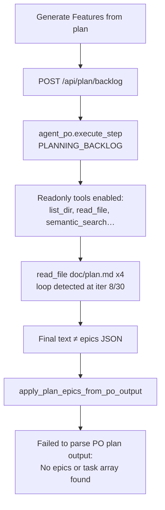

# Fix Generate Features from plan (PO parse failure)

## Root cause (from your logs)



The approved outline is **already embedded** in the prompt ([`run_po_plan_backlog()`](backend/services/sprint_service.py) ~2931: `Approved plan outline:\n{outline_text}`). Despite that, [`execute_step()`](backend/agents/scrum_agent.py) still gives PO all readonly tools during any planning task (~2803–2811), so models like `qwen3.8-27b` explore the workspace, re-read `doc/plan.md`, hit the duplicate loop breaker, and never emit the required JSON shape.

Rejection logic in [`scrum_agent.py`](backend/agents/scrum_agent.py) correctly rejects markdown outlines for `PLANNING_BACKLOG` (~314–315, ~376–388), but that only retries — it does not recover when iterations exhaust or loop-stop returns non-JSON text.

**Note:** The earlier persistence/progress work (sidecar merge, `planBacklogActive`, tests) is already in the repo. This plan addresses the **card creation failure** specifically.

---

## Fix 1: JSON-only PO step for `PLANNING_BACKLOG` (primary fix)

In [`backend/agents/scrum_agent.py`](backend/agents/scrum_agent.py) `execute_step()`:

- When `state.ACTIVE_SPRINT_TASK_ID == PLANNING_BACKLOG_TASK_ID`, set **`tools = []`** (do not filter to readonly tools).
- Suppress the misleading `"No tools registered"` error log for this intentional JSON-only step; optionally log info: `"Generate Features — JSON-only step, no tools"`.
- Keep readonly tools for `PLANNING_OUTLINE` (workspace inspection is useful when drafting the markdown plan).

In [`run_po_plan_backlog()`](backend/services/sprint_service.py):

- Add explicit instruction at top of prompt: **"Do NOT call any tools. The full approved plan outline is below — convert it directly to JSON."**
- Cap iterations for this step to a small budget (e.g. `min(6, _llm_iterations())`) since no tool loop is needed.

---

## Fix 2: Deterministic fallback from outline (safety net)

Add [`build_epics_json_from_plan_outline(outline: str) -> str`](backend/services/feature_service.py):

- Parse the `## Proposed epics` section (case-insensitive header match).
- Extract bullet/numbered lines (`- …`, `* …`, `1. …`).
- For each line, build `{title, description, children:[…]}` with 2 small implementation children and testable AC (reuse [`_normalize_plan_child()`](backend/services/feature_service.py) patterns).
- Return `json.dumps({"epics": [...]})` or `""` if no bullets found.

In [`run_po_plan_backlog()`](backend/services/sprint_service.py), after the LLM call:

1. If output is valid epics JSON → existing path.
2. If output is markdown-only outline → keep current error (model ignored instructions).
3. **Else** (loop stop, max iterations, unparseable text, empty output) and `outline_text` has Proposed epics bullets → call fallback, log a **warning** ("Created cards from outline — LLM did not return valid epics JSON"), then `apply_plan_epics_from_po_output`.

This guarantees cards appear when the outline is good but the model misbehaves — matching your meal-shopping-list scenario.

---

## Fix 3: Tests to prevent regression

| Test file | Test | Asserts |
|-----------|------|---------|
| [`tests/test_plan_outline.py`](tests/test_plan_outline.py) | `test_run_po_plan_backlog_fallback_from_outline_when_llm_returns_loop_stop` | Mock PO returns loop-stop text; cards still created from outline bullets |
| [`tests/test_plan_outline.py`](tests/test_plan_outline.py) | `test_build_epics_json_from_plan_outline_parses_bullets` | Unit test for bullet extraction |
| [`tests/test_po_idle_rejection.py`](tests/test_po_idle_rejection.py) or new file | `test_planning_backlog_uses_no_tools` | With `ACTIVE_SPRINT_TASK_ID=PLANNING_BACKLOG`, tool list passed to chat is empty |

---

## Verification

1. Run Generate Features with an outline that has `## Proposed epics` bullets → Features lane gets epics + children within one LLM call (no `read_file doc/plan.md` spam).
2. Simulate bad LLM (or use offline stub) → fallback still creates cards + warning log.
3. `pytest tests/test_plan_outline.py tests/test_po_idle_rejection.py -q`

```bash
.venv/bin/pytest tests/test_plan_outline.py tests/test_po_idle_rejection.py -q
```
