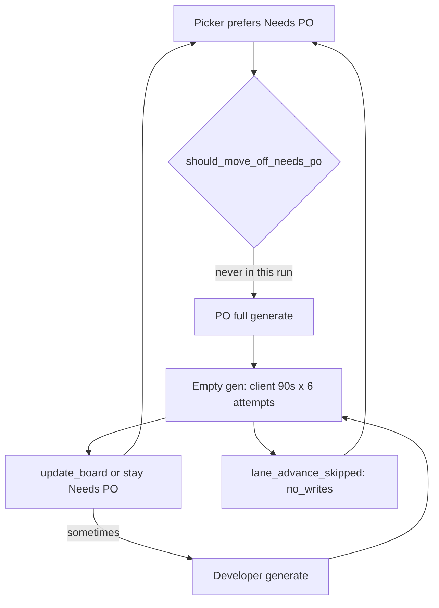

# Why the sprint is still wasting GPU

**Verdict:** the faster-sprint work is only half-live. Prefill is cheaper. The loop that actually burns the 26B model is worse than before on hung generations.

This window (12:22–14:40 local, gemma-4-q4km:26b, four lint cards) spent **~110 minutes in Ollama**. Roughly **90+ minutes produced zero tokens**. Writes on these traces: **0**. Lane advances from Developer: **0**.

## What the traces actually show

| What we hoped | What this run did |
|---|---|
| Abort hung gen at 90s | Error text says 90s; **wall clock per `_chat` is ~582–587s** (4 retries + 2 cooldown × ~90s + delays ≈ 572s). Logged as **one** `ollamaCall`. |
| Timeouts do not retry | HTTP `timeout` does not retry. **`empty_generation_timeout` does** ([`scrum_agent.py`](backend/agents/scrum_agent.py) `_chat`: only `err_type == "timeout"` short-circuits). |
| Skip PO LLM when spec exists | **Zero** `po_llm_skipped`. Every PO step is `po_llm_started` with `last_exit=max_iterations` or `po_clarification_incomplete`. Skip only allows write-stop exits ([`po_clarification.py`](backend/services/po_clarification.py) `should_move_off_needs_po_without_llm`). |
| Advance after write+verify | `writesSucceeded: 0` everywhere. [`_maybe_advance_dev_after_verify`](backend/services/sprint_service.py) never had a write. Developer empty gens exit `completed_text_only` / `lane_advance_skipped:no_writes`. |
| Packed `num_ctx` | **Worked.** Sampling is 4096–6144, not 32768. |
| Patch → `write_file` after one fail | Not exercised (no writes). Code still waits for **2 identical** patch fingerprints. |

Concrete waste:

- **PO empty gens** (~10 min each, 0 tokens): overflow card 12:37 and 12:47; store_list_screen 14:03 and 14:13; store.dart 14:23.
- **Dev empty gens doubled**: store_repository_test three Developer steps (~20 min each, **two** ~587s chats, 0 tools, 0 writes). Same card, three times.
- **PO that should have been a no-LLM board move**: 12:34 overflow (6 iters, glob/grep/read, `max_iterations`); 12:57 and 14:33 `update_board` after 3 generates (~2–3 min GPU for a deterministic move).
- **In-flight at dump time**: store.dart Developer already at `ollama_wait` **205s** on iter 1 — that is retry attempt 2–3, not a 90s abort.

First 90s file (`12:22`) looks “correct” only because the step was **`interrupted`** after attempt 1.

Client abort also **does not cancel Ollama**. `_next_stream_chunk` raises while a daemon thread is still blocked on `next(iterator)` ([`llm_provider.py`](backend/services/llm_provider.py)). Retries then pile new requests on a busy GPU, which is why later hangs sit near 10 minutes.

## Why this fails the “home agent / min GPU” goal

The 26B model is fine when it actually decodes (~14 tok/s on earlier runs). This run is not decode-bound. It is **queueing and retrying silent generations**, then **re-picking Needs PO** so PO explores the repo instead of moving the card. Speed gates that need a successful write never fire, so the board cannot show progress.

## Fix (implementation after you confirm)

### 1. Treat empty generation like a timeout (stop multiplying GPU)

In [`backend/agents/scrum_agent.py`](backend/agents/scrum_agent.py) `_chat`:

- Do **not** retry `empty_generation_timeout` (same branch as `timeout`).
- Skip cooldown retries for it (today cooldown excludes only `timeout` and `context_overflow`).
- Extend [`tests/test_ollama_retry.py`](tests/test_ollama_retry.py) so empty-gen is **one** `provider.chat` call.

Also: **wall-clock** empty timeout from stream start (or from first prompt-eval chunk), not 90s *between* chunks. Heartbeats / prompt-eval-only chunks currently reset the 90s join.

On abort: close the HTTP/stream so Ollama can drop the job (do not leave the daemon `next()` running). Best-effort: close the underlying response; if the Ollama client cannot cancel, stop issuing new chats until the previous stream thread finishes or a short GPU cool-off.

Log **each attempt** in diagnostics (`attempt`, `errorType`) so 582s is not disguised as one 90s timeout.

### 2. Skip PO LLM whenever the card already has a spec

Widen [`should_move_off_needs_po_without_llm`](backend/services/po_clarification.py) so description + AC is enough to `move_off_needs_po` when last exit is any of:

- `max_iterations`, `po_clarification_incomplete`, `completed_text_only`
- `empty_generation_timeout` / `llm_call_failed` / `interrupted` (if spec already present)

Keep the LLM path only when description or AC is missing. Tests in [`tests/test_po_clarification_retry.py`](tests/test_po_clarification_retry.py): after `max_iterations` on Needs PO, `execute_step` is **not** called.

Optional tightener: if PO is invoked, **forbid explore tools** (glob/grep/list_dir) on Needs PO — JSON + `update_board` only — so a 6-iter explore cannot happen again.

### 3. Do not re-run a 10-minute empty gen on the same card immediately

After `LLM_CALL_FAILED` / empty-gen: park or rotate the picker; count empty-gen toward the circuit breaker / no-write stall. A Developer step that used 0 tools and 0 writes should not be scheduled again until other cards run (or a short backoff).

[`fix_verify_loop.py`](backend/services/fix_verify_loop.py) hard-stop markers should include `llm_call_failed` and `empty generation` so round 2 does not buy another `_chat`.

### 4. Leave the parts that already work

- Packed `num_ctx` — keep.
- Write + duplicate-verify stop and advance-on-verify — keep; they will matter once a write actually happens.
- Patch escalation after one fail can land in the same PR (plan §6 still unimplemented: still `identical_counts >= 2`) but it is **not** why this run wasted GPU.

## Verification

- Unit: empty-gen no-retry; PO skip on `max_iterations` / `po_clarification_incomplete`; consume_chat_stream wall-clock abort even if empty chunks arrive.
- Do not declare success from a UI screenshot. Next real sprint dump should show: empty-gen `durationMs` ~90s **and** `ollamaCallCount` 1; `po_llm_skipped` on spec-complete cards; no 20-minute Developer steps with `evalTokensTotal: 0`.
