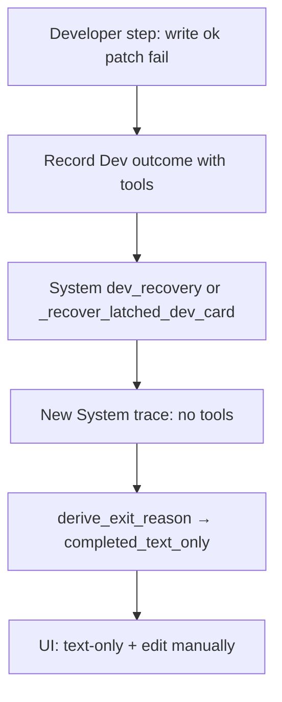

# Fix Lint Cards Stuck on Misleading "Text-Only" Message

## What you're seeing

From step trace [`step-TASK-E9B9FECEC97E4AD993C866960CD98CAF-20260919T132908.json`](/home/lukemcredmond/.cursor/projects/mnt-Storage-my-agents-my-agent-lab-DevelopmentAgent/attachments/a9051624-e2e9-4c54-8c94-d42e4ea936a2/step-TASK-E9B9FECEC97E4AD993C866960CD98CAF-20260919T132908.json):

- Developer **did** run tools: `write_file` succeeded on `lib/main.dart`, `apply_patch` failed, lint still dirty
- Final recorded step is **System** (245ms, 0 LLM calls), not Developer
- `exitReason` = `completed_text_only` → UI shows *"Developer returned text-only…"* and *"edit manually"*
- Card still has `forcePatchNextDevStep: true` — it should auto-retry, not look stuck

## Root causes

1. **System recovery overwrites Developer outcome** — [`_recover_latched_dev_card`](backend/services/sprint_service.py) hits `stuck_is_tool_or_lint(task)` **unconditionally** (before latch checks), calls `_handle_lint_stuck`, then `_record_last_step_outcome(..., agent="System")`. That replaces the real Dev outcome on the task.

2. **Wrong exit reason for System steps** — [`derive_exit_reason`](backend/services/step_diagnostics.py) treats any In Progress → In Progress step with a non-empty `agent_result` and no trace tools as `completed_text_only` (line ~1245). System recovery messages like *"Lint/tool errors remain — staying In Progress"* match this path.

3. **Misleading copy** — [`_outcome_why_card_stayed`](backend/services/sprint_service.py) / [`_outcome_suggested_action`](backend/services/sprint_service.py) have no lint-specific branch; default suggests manual edit even when `forcePatchNextDevStep` is armed.

4. **dev_recovery can steal the sprint tick** — [`_select_sprint_step_handler`](backend/services/sprint_service.py) may pick `dev_recovery` for cards in `_in_progress_pending_recovery` (e.g. `no_write_stall_should_park`) instead of running another Developer step, triggering the System overwrite path above.

## Implementation plan

### 1. Stop System recovery from clobbering Developer outcomes

**File:** [`backend/services/sprint_service.py`](backend/services/sprint_service.py) — `_recover_latched_dev_card`

- Restrict the lint/tool branch to **actual recovery cases** only:
  - `phaseCycleCapReached`, OR
  - `no_write_stall_should_park`, OR
  - card is in `_in_progress_pending_recovery` / `_in_progress_exhausted_latched`
- For lint cards that are otherwise **dev-runnable** (`forcePatchNextDevStep` + still In Progress): call `_handle_lint_stuck` but **do not** `_record_last_step_outcome` / `_ensure_step_trace` (use `quiet=True` behavior) — preserve the Developer outcome already on the task.

### 2. Classify System lint recovery correctly

**File:** [`backend/services/step_diagnostics.py`](backend/services/step_diagnostics.py) — `derive_exit_reason`

- Add early match for System recovery copy (`"staying In Progress"`, `"Lint/tool errors remain"`, `"Not moving to Needs User"`) → new exit reason: `lint_stay_in_progress`
- Pass agent role into `derive_exit_reason` (or detect from trace.agent) so System steps are never classified as `completed_text_only`

**File:** [`backend/services/sprint_service.py`](backend/services/sprint_service.py) — `_outcome_why_card_stayed` / `_outcome_suggested_action`

- Add `lint_stay_in_progress` copy: *"Lint still dirty on {file} — auto sprint will run Forced Patch again."*
- Add `tool_failure_stop` branch when last failed tool was `apply_patch` on a lint card: cite the failed patch, not "text-only"
- When `forcePatchNextDevStep` on a lint card: suggested action = *"Forced Patch queued — auto sprint will retry Developer on this card."* (not manual edit)

### 3. Fix Developer exit reason when patch partially succeeds

**File:** [`backend/services/step_diagnostics.py`](backend/services/step_diagnostics.py)

- After Dev step: if trace has successful `write_file`/`apply_patch` **and** failed `apply_patch`, and `lastCommandDiagnostics` still present → `tool_failure_stop` (or keep `completed_with_writes` but set a new flag `lintStillDirty: true` on outcome)
- Ensures `_record_no_write_stall` does not treat a write step as a no-write stall when `writes_succeeded > 0`

**File:** [`backend/services/sprint_speed_gates.py`](backend/services/sprint_speed_gates.py)

- Do not increment `consecutiveNoWriteStall` when last step had successful writes but lint remains

### 4. Keep auto-sprint on lint cards (don't park as dev_recovery)

**File:** [`backend/services/sprint_service.py`](backend/services/sprint_service.py) — `_select_sprint_step_handler` / `_in_progress_pending_recovery`

- Exclude lint/tool cards with `forcePatchNextDevStep` from `pending_recovery` when they are in `_in_progress_dev_runnable`
- Prefer `dev` handler over `dev_recovery` for the same card when Forced Patch is armed

**File:** [`backend/services/sprint_service.py`](backend/services/sprint_service.py) — `_run_developer_step` pre-check (~4355)

- When `no_write_stall_should_park` but `stuck_is_tool_or_lint` + `forcePatchNextDevStep`: call `_handle_lint_stuck` and **return without** `_recover_latched_dev_card` (avoid System outcome overwrite)

### 5. Give Developer a concrete lint fix target (optional but high value)

**File:** [`backend/agents/task_context.py`](backend/agents/task_context.py) or dev prompt assembly

- When card title/`lintSourceFile`/`lastCommandDiagnostics` identify a lint card, inject first diagnostic into Forced Patch brief: e.g. *"Remove erroneous @override or fix method signature at lib/main.dart:line"*
- Helps the model stop narrating and call `apply_patch` with the right edit

### 6. Tests

| Case | File |
|------|------|
| System lint recovery does not overwrite Dev outcome / exitReason | extend [`tests/test_capped_retry_loop_regression.py`](tests/test_capped_retry_loop_regression.py) |
| `derive_exit_reason` → `lint_stay_in_progress` for recovery copy | new cases in [`tests/test_needs_user_brief.py`](tests/test_needs_user_brief.py) or step diagnostics test |
| Lint card with write+failed patch → not `completed_text_only` | extend [`tests/test_file_blocker.py`](tests/test_file_blocker.py) or capped retry tests |
| Suggested action mentions Forced Patch retry, not manual edit | frontend [`frontend/src/utils/taskFormat.needsUser.test.ts`](frontend/src/utils/taskFormat.needsUser.test.ts) if outcome surfaced in UI helpers |

## Expected behavior after fix

- Lint card after failed `apply_patch`: UI shows *"apply_patch failed on lib/main.dart — Forced Patch will retry"* (not text-only)
- Auto sprint keeps picking the card for Developer while diagnostics remain
- System recovery (`_handle_lint_stuck` / file blocker) runs quietly without replacing the last Dev step trace
- User is not asked to manually answer or edit for analyzer errors the agent should fix

## Out of scope (v1)

- Auto-fixing `@override` without any Developer LLM call
- LLM-generated A/B/C/D for lint (already banned from Needs User per file-blocker plan)
