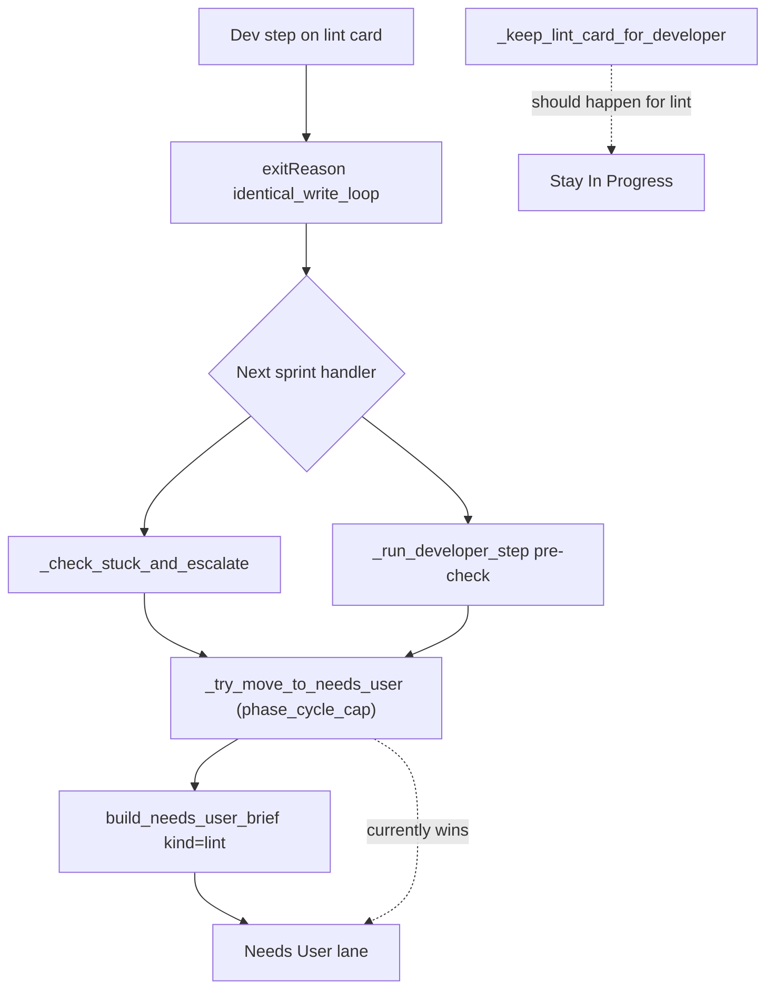

# Fix mapCardProgress + Needs User avalanche

## Diagnosis

### 1. `mapCardProgress is not defined` (frontend regression)

During the sprint-progress refactor, `mapCardProgress` was moved into [`frontend/src/utils/sprintProgress.ts`](frontend/src/utils/sprintProgress.ts) as a **private** function, but [`frontend/src/hooks/useAppState.ts`](frontend/src/hooks/useAppState.ts) still calls it from `mapAgentRun`:

```181:181:frontend/src/hooks/useAppState.ts
    cardProgress: mapCardProgress(raw.cardProgress ?? raw.card_progress) ?? null,
```

`mapAgentRun` runs on every `agent_run` SSE event (and on state refresh). The thrown `ReferenceError` breaks progress/console updates mid-sprint.

**Fix:** export `mapCardProgress` from `sprintProgress.ts` and import it in `useAppState.ts`. Add a small vitest case in [`frontend/src/utils/sprintUi.test.ts`](frontend/src/utils/sprintUi.test.ts).

---

### 2. Why cards end up in Needs User (from your diagnostics)

Your attached step traces share a Flutter **lint-wall** pattern, not a user-decision pattern:

| Pattern | Evidence |
|---------|----------|
| Same broken file | Many cards target `lib/main.dart` (`BuildContext` / `Text` undefined) |
| Identical write loop | e.g. `step-TASK-51CA607D…121951.json` — `exitReason: identical_write_loop`, same patch on `lib/main.dart` |
| Oracle blocks advance | e.g. `step-TASK-819C76C…124921.json` — `lane_advance_skipped: lint_dirty` + `oracle_fail`, stays In Progress |
| Dev tries Needs User, blocked | e.g. `step-TASK-0E788D8C…122838.json` — `update_board → Needs User` fails with `board_blocked` (guard working) |

**Parking path (the bug):** after an `identical_write_loop` exit, the backend **does** move cards to Needs User in two places:

```1705:1717:backend/services/sprint_service.py
    if exit_r == "identical_write_loop":
        ...
        _try_move_to_needs_user(task_id, task, park_msg, kind="phase_cycle_cap")
```

```4312:4317:backend/services/sprint_service.py
    if identical_write_loop_should_park(live_task):
        ...
        _try_move_to_needs_user(task_id, dict(live_task), park_msg, kind="phase_cycle_cap")
```

When the task has lint/tool evidence, [`build_needs_user_brief`](backend/services/needs_user_guard.py) resolves kind to **`lint`**, producing questions like *"Which lint/tool error should Developer fix…?"* — even though prompts and guards explicitly say **not** to use Needs User for lint.

This contradicts the existing lint-wall policy used elsewhere in `_check_stuck_and_escalate` (lines 1738–1751) and `_keep_lint_card_for_developer` (lines 5388–5439), which keep lint cards in **In Progress** with forced Patch / one visit-cap unlatch.



With `maxNeedsUserPerSprint: 2` ([`allhands.project.json`](attachments/.../allhands.project.json)), the first lint cards get parked; the rest appear stuck or keep retrying — matching “all cards stopping in Needs User.”

---

## Implementation plan

### A. Frontend hotfix (immediate)

- [`frontend/src/utils/sprintProgress.ts`](frontend/src/utils/sprintProgress.ts): change `function mapCardProgress` → `export function mapCardProgress`
- [`frontend/src/hooks/useAppState.ts`](frontend/src/hooks/useAppState.ts): `import { mapSprintProgress, mapCardProgress } from '../utils/sprintProgress'`
- [`frontend/src/utils/sprintUi.test.ts`](frontend/src/utils/sprintUi.test.ts): assert `mapCardProgress` maps snake_case `card_progress` fields

### B. Backend: stop parking lint/tool cards on identical-write-loop

In [`backend/services/sprint_service.py`](backend/services/sprint_service.py):

1. **`_check_stuck_and_escalate` (~1705)** — before `_try_move_to_needs_user` for `identical_write_loop`:
   - If `stuck_is_tool_or_lint(task)`: call `_keep_lint_card_for_developer(task)` (or attempt `_run_stuck_auto_split` first when enabled) and **return** without Needs User.
   - Only non-lint identical-write-loop cards should park to Needs User.

2. **`_run_developer_step` pre-check (~4312)** — same guard:
   - If `identical_write_loop_should_park(live_task)` and `stuck_is_tool_or_lint(live_task)`: keep In Progress via `_keep_lint_card_for_developer` instead of `_try_move_to_needs_user`.

3. **Optional same guard for `same_next_task_should_park` (~4319)** when lint/tool — prevents a second parking path on the same cards.

Reuse existing helper [`stuck_is_tool_or_lint`](backend/services/needs_user_guard.py) — no new abstractions.

### C. Tests

Add backend regression in [`tests/test_capped_retry_loop_regression.py`](tests/test_capped_retry_loop_regression.py) (or adjacent sprint tests):

- Task in In Progress with `lastStepOutcome.exitReason = "identical_write_loop"` and lint diagnostics → `_check_stuck_and_escalate` leaves lane **In Progress**, sets `forcePatchNextDevStep`, does **not** increment `SPRINT_NEEDS_USER_COUNT`.
- Same task shape → `_run_developer_step` pre-check does not call `_try_move_to_needs_user`.
- Non-lint identical-write-loop task still parks to Needs User (preserve existing `test_phase_cycle_cap_park_not_redirected_to_needs_po` behavior).

Run: `.venv/bin/python -m pytest tests/test_capped_retry_loop_regression.py -q` and frontend vitest for `sprintUi.test.ts`.

---

## Operational note (not code)

Your workspace lint cards all fight over the same broken [`lib/main.dart`](attachments indicate missing Flutter imports). Even after the policy fix, cards may remain in In Progress until that file analyzes clean. Consider one manual fix or a single “fix scaffold / imports” card before re-running lint fanout.

---

## Files to change

| File | Change |
|------|--------|
| [`frontend/src/utils/sprintProgress.ts`](frontend/src/utils/sprintProgress.ts) | Export `mapCardProgress` |
| [`frontend/src/hooks/useAppState.ts`](frontend/src/hooks/useAppState.ts) | Import `mapCardProgress` |
| [`frontend/src/utils/sprintUi.test.ts`](frontend/src/utils/sprintUi.test.ts) | Regression test |
| [`backend/services/sprint_service.py`](backend/services/sprint_service.py) | Lint-aware identical-write-loop handling (2–3 sites) |
| [`tests/test_capped_retry_loop_regression.py`](tests/test_capped_retry_loop_regression.py) | Backend regression tests |
