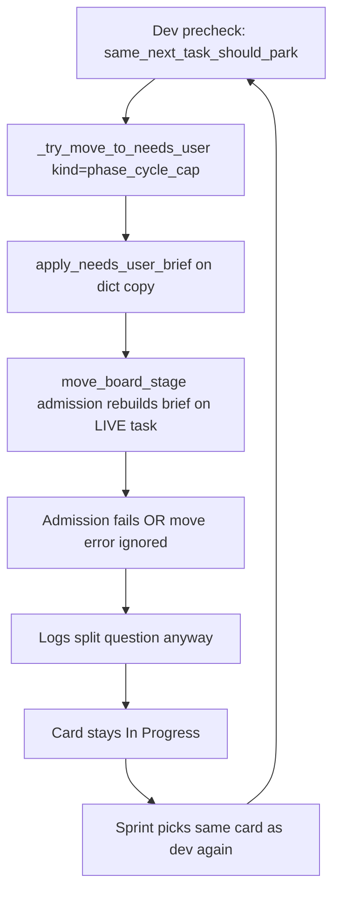

# Fix Needs User Loop, Diagnostics, and Support Sharing

## What your logs show

The repeating pattern on `TASK-96094376…` is a **failed park loop**, not normal sprint progress:



Three concrete bugs cause this:

### Bug 1 — Mutating a copy, not the board task

In [`backend/services/sprint_service.py`](backend/services/sprint_service.py) (~4492–4503), precheck parks call:

```python
_try_move_to_needs_user(task_id, dict(live_task), park_msg, kind="phase_cycle_cap")
```

`_try_move_to_needs_user` applies `apply_needs_user_brief()` to that **copy**, then calls `move_board_stage()`, which mutates the **live** task in `SHARED_BOARD`. **`needsUserOptions` never land on the card the UI reads.**

### Bug 2 — `move_board_stage` re-validates with wrong kind

Admission in [`backend/services/board_service.py`](backend/services/board_service.py) (~107–117) rebuilds the brief using:

```python
kind=str(active_task.get("needsUserKind") or "stuck_loop")
raw_msg=str(active_task.get("userQuestion") or "")
```

It does **not** receive the intended `kind="phase_cycle_cap"` or the park message. If the live task has lint diagnostics, `_resolve_needs_user_kind` returns `lint` → admission fails (`autonomous_tool_blocker`) even though the copy passed.

### Bug 3 — Move failures treated as success

`_try_move_to_needs_user` never checks the return value of `move_board_stage()`. On failure it still increments `SPRINT_NEEDS_USER_COUNT`, publishes activity, and logs the split question — while the card **remains In Progress**. That matches your console exactly.

---

## Fix 1 — Make parking actually stick (MCQ included)

**File:** [`backend/services/sprint_service.py`](backend/services/sprint_service.py)

- Add `_live_task(task_id)` helper: always `find_task_by_id(task_id)`; refuse to park if missing.
- Replace all `_try_move_to_needs_user(..., dict(live_task), ...)` precheck calls with the **live** task reference.
- After building the brief, call a new helper `_apply_needs_user_park(task_id, task, brief, kind)` that:
  1. `apply_needs_user_brief(live_task, brief)` on the **board task**
  2. Calls `move_board_stage(task_id, "Needs User", park_kind=kind, park_msg=msg)` (new optional params)
  3. Returns `False` unless result starts with `"Successfully"`
  4. Only then increments counter, publishes activity, and logs

**File:** [`backend/services/board_service.py`](backend/services/board_service.py)

- Extend `move_board_stage(..., park_kind="", park_msg="")` so Needs User admission uses the **same** `kind` + `raw_msg` as `_try_move_to_needs_user`, not stale/empty task fields.
- After a successful move, if `needsUserOptions` is still empty but admission brief had options, apply them to `active_task` (belt-and-suspenders).

**File:** [`backend/services/needs_user_guard.py`](backend/services/needs_user_guard.py)

- Extend `should_reconcile_needs_user_task()` to also reconcile cards in Needs User with **`needsUserKind` in (`stuck`, `phase_cycle_cap`) and empty `needsUserOptions`** — these are broken parks from the bug above.

---

## Fix 2 — Autonomous visit-cap policy (your choice: auto-split first)

**File:** [`backend/services/sprint_service.py`](backend/services/sprint_service.py)

Replace direct `_try_move_to_needs_user(..., kind="phase_cycle_cap")` from **precheck gates** (`same_next_task`, `identical_write_loop`) with a shared helper `_handle_visit_cap_stall(task_id, task, reason)`:

1. If `is_lint_wall_card(task)` → existing `_handle_lint_stuck` + `_record_dev_precheck_skip` (unchanged)
2. Else if `_should_attempt_stuck_auto_split(task)` → `_run_stuck_auto_split`; on success, record diagnostics and **return** (no Needs User)
3. Else if `_recover_latched_dev_card` can unlatch → use that path
4. **Only then** `_try_move_to_needs_user(..., kind="phase_cycle_cap")` with live task + verified move — genuine split/reset MCQ

Keep true visit-cap latch parking in `_recover_latched_dev_card` / `_check_stuck_and_escalate`, but use the same live-task + move-result checks.

Result: feature cards like **Import from document** stop spinning in In Progress; Needs User is only for real split vs reset decisions when automation cannot resolve the cap.

---

## Fix 3 — Diagnostics always written for precheck skips

Your console shows precheck skips (`Same next task reissued…`) but no files under `~/.allhands/diagnostics/<projectId>/`.

**File:** [`backend/services/sprint_service.py`](backend/services/sprint_service.py)

- In `_record_dev_precheck_skip`, **always** call `_finalize_step_diagnostics_if_traced(task_id)` after outcome is recorded (remove the auto-sprint early-return path that skips finalize for some modes).
- Pass `exitReason=dev_precheck_skip` explicitly so JSON is non-empty and includes the park reason.

**File:** [`backend/services/step_diagnostics.py`](backend/services/step_diagnostics.py)

- Ensure `start_step_trace` checkpoint flush happens even when finalize follows within milliseconds (precheck path).
- Add `parkAttempted`, `parkSucceeded`, `needsUserKind` fields to finalized JSON when outcome includes them.

Diagnostics folder (from bootstrap): `~/.allhands/diagnostics/<CURRENT_PROJECT_ID>/step-<task>-<timestamp>.json`

---

## Fix 4 — Easier sharing: Support Bundle

Today you can only partially export via [`GET /api/projects/{id}/export`](backend/api/projects.py) (project + logs + chat, **no diagnostics**). Console logs live in memory/DB and are awkward to copy from the UI.

### Backend: `GET /api/support/bundle`

New route (e.g. in [`backend/api/projects.py`](backend/api/projects.py) or new `support.py`):

Zip containing:
- `console_logs.json` — `state.SYSTEM_LOGS`
- `board_snapshot.json` — current `SHARED_BOARD`
- `workflow_settings.json`
- `last_step_outcome.json` / `last_step_diagnostics.json` if present
- `diagnostics/` — last 30 step JSON files for current project from [`diagnostics_dir()`](backend/config.py)
- `sprint_reports/` — recent sprint report files if any
- `environment.txt` — project id, workspace path, active sprint handler, git branch (readonly)

### Frontend: one-click export

In [`frontend/src/components/SettingsSlideOver.tsx`](frontend/src/components/SettingsSlideOver.tsx) or Sidebar:

- **“Download support bundle”** button → fetches zip → saves `allhands-support-<projectId>-<date>.zip`
- **“Copy last 50 console lines”** → plain-text clipboard for quick paste into chat

### Optional CLI (for agents/CI)

```bash
curl -o support.zip http://127.0.0.1:6767/api/support/bundle
```

---

## Tests to add/update

| Test | File | Asserts |
|------|------|---------|
| Park applies options to live board task | `tests/test_needs_user_brief.py` | after `_try_move_to_needs_user`, live task has `needsUserOptions` |
| Failed `move_board_stage` does not log success | new | admission reject → `_try_move` returns False, lane unchanged |
| `same_next_task` tries auto-split before NU | `tests/test_capped_retry_loop_regression.py` | no `_try_move_to_needs_user` when split succeeds |
| Precheck skip writes diagnostics file | `tests/test_step_diagnostics.py` | file exists with `dev_precheck_skip` |
| Reconcile broken NU cards (cap/stuck, no options) | `tests/test_needs_user_brief.py` | moved to In Progress |

---

## Expected behavior after fix

| Situation | Lane | MCQ | Diagnostics |
|-----------|------|-----|-------------|
| Lint / patch / explore stall | In Progress | None — Dev retries | Yes |
| Visit cap / same-next stall | In Progress first; auto-split | — | Yes |
| Auto-split failed | Needs User | Split / Reset / Other | Yes |
| Broken legacy NU cards (no options) | Reconciled → In Progress on next tick | — | Yes |

**Immediate workaround (before code deploy):** restart backend; manually move stuck cards to In Progress or use existing “Send to Developer”; for visit-cap cards use the split action in the UI if visible.

**Sharing today (until bundle ships):** copy console lines manually, or run `GET /api/projects/{projectId}/export` for logs; diagnostics are at `~/.allhands/diagnostics/<projectId>/`.
