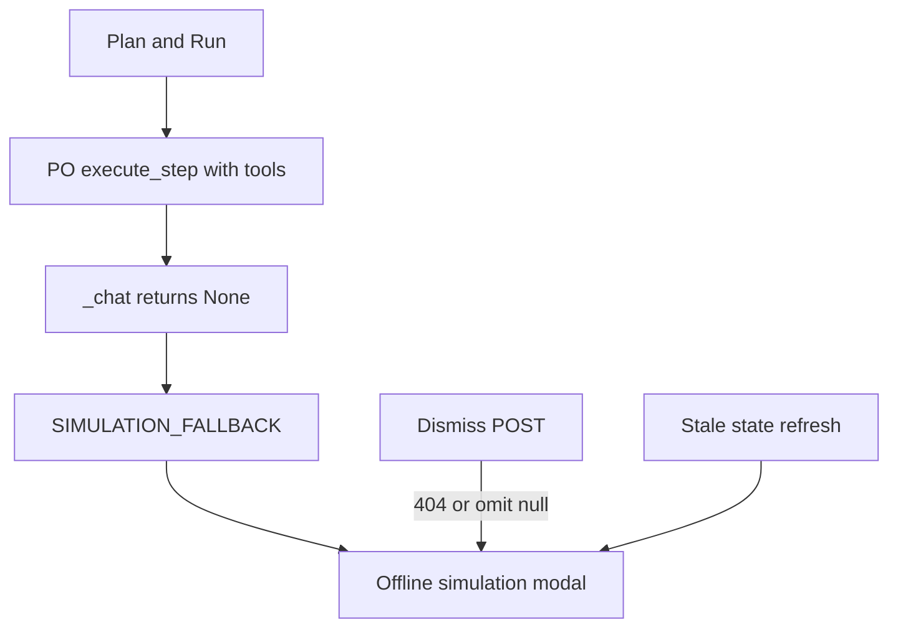

# Fix Plan and Run offline simulation + Dismiss

Plan and Run is hitting the same catch-all as a dead Ollama process. The Models **Test** button only health-probes one model with no tools. **Plan and Run** runs Product Owner `execute_step` with the full tool schema and a large JSON prompt, then maps **any** `chat()` returning `None` to `SIMULATION_FALLBACK` and the Offline simulation modal.

Dismiss looks broken because the API omits `pendingSimulation` when it is cleared, a 404 is treated as failure (modal stays), and a delayed GET `/api/state` or SSE snapshot can put the old pending object back.

## Why Test works and Plan and Run does not

- Test: [`backend/api/ollama.py`](backend/api/ollama.py) `test_llm_model` → `probe_model` (tiny completion, no tools).
- Plan and Run: [`frontend/src/App.tsx`](frontend/src/App.tsx) passes `ollama_url: ollamaUrl` (defaults to `http://localhost:11434`). [`run_po_plan`](backend/services/sprint_service.py) sets `agent_po.ollama_url` then [`execute_step`](backend/agents/scrum_agent.py) with `tools = self.registry.get_ollama_tools()`.
- [`ScrumAgent._get_provider`](backend/agents/scrum_agent.py) calls `get_chat_provider(override_url=self.ollama_url)`. If workflow still says Ollama, that override **is** used. If LM Studio is selected, 11434 is supposed to be ignored — a failed LM Studio tool/context load still becomes “offline.”
- [`execute_step`](backend/agents/scrum_agent.py) (~line 2721): `if response is None: return "SIMULATION_FALLBACK"`. Timeouts, HTTP 400 (tools), context overflow, and unload errors all look like Ollama down. Modal copy always says “Ollama is unavailable.”

## Dismiss

- [`dismiss_pending_simulation`](backend/services/simulation_gate.py) clears `PENDING_SIMULATION`.
- [`build_state_response`](backend/api/helpers.py) **only adds** `pendingSimulation` when it is set — JSON has no `null`.
- [`applyState`](frontend/src/hooks/useAppState.ts) spreads the payload; a later `refresh()` / `debouncedRefreshAfterSprint` that started **before** dismiss can re-apply the pending object.
- [`dismissSimulation`](frontend/src/components/SimulationConfirmModal.tsx): 404 (`No pending simulation`) is caught, `onResolved` is skipped, modal stays.

## Repair

**1. Only simulate when the provider is actually unreachable**

In [`scrum_agent.py`](backend/agents/scrum_agent.py), if `_chat` returns `None`:

- If `provider.health()` is not ok → keep `SIMULATION_FALLBACK`.
- Else → return a real error string (include `_last_chat_error` / HTTP body). Do **not** open the offline modal for tool/context/timeout failures.

PO plan in [`sprint_service.py`](backend/services/sprint_service.py) should treat that error as a failed plan (log + stop Plan and Run), not `try_defer_simulation`.

**2. Plan and Run must use the same endpoint as Test**

- Sprint routes should resolve URL via `chat_config()` (saved `llmBaseUrl` / preset), not the frontend default 11434.
- [`_get_provider`](backend/agents/scrum_agent.py): do not pass `override_url` when it is the legacy Ollama default and workflow is OpenAI-compat / LM Studio (already partly in `chat_config`; keep agent cache keyed by resolved `baseUrl`, not the stale 11434 string).
- Frontend: pass `state.workflowSettings.llmBaseUrl` (or omit url and let the backend decide).

**3. Modal: honest copy + working Dismiss**

- Always include `"pendingSimulation": null` in [`build_state_response`](backend/api/helpers.py).
- [`applyState` / `applySseStateSnapshot`](frontend/src/hooks/useAppState.ts): set `pendingSimulation: data.pendingSimulation ?? null`. Ignore a snapshot that reintroduces an id the user just dismissed (short-lived `dismissedSimId` ref).
- Dismiss: 404 counts as success; clear local pending even if the POST fails with “already gone.”
- Modal subtitle: “LLM call failed / provider unreachable” plus `lastChatError` when present — not always “Ollama is unavailable.”

**4. Tests**

- Chat `None` + healthy provider → no pending simulation; plan does not write the offline stub.
- Chat `None` + unhealthy provider → pending simulation as today.
- Dismiss with no pending → 200 and `pendingSimulation: null`.
- Apply-state after dismiss does not revive the same id from a stale payload.
