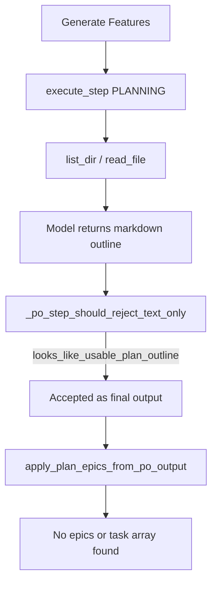

# Fix PO Backlog Parse Failure

## Diagnosis

Error path:

```
run_po_plan_backlog → execute_step → _append_po_backlog_from_output
  → apply_plan_epics_from_po_output → ValueError("No epics or task array found...")
```

Phase 2 explicitly asks for JSON epics ([`run_po_plan_backlog`](backend/services/sprint_service.py)):

```2890:2898:backend/services/sprint_service.py
po_output = agent_po.execute_step(
    ...
    "Reply with ONLY a JSON object of this shape:\n"
    '{"epics":[{"title":"...","description":"...","children":[...]}]}'
```

But the recent idle-rejection fix in [`_po_step_should_reject_text_only`](backend/agents/scrum_agent.py) accepts **any** markdown outline during `task_id == "PLANNING"`:

```367:368:backend/agents/scrum_agent.py
if (task_id or "") == "PLANNING" and looks_like_usable_plan_outline(content):
    return False  # do not reject — treat as valid final answer
```

Both phase 1 (outline) and phase 2 (backlog) use the same `PLANNING` task id. After explore tools, Qwen often returns markdown (`## Summary`, `## Proposed epics`) — correct for phase 1, **wrong for phase 2**. That markdown is accepted as `po_output`, then the parser in [`apply_plan_epics_from_po_output`](backend/services/feature_service.py) finds no `epics` array and logs the error you saw.



## Fix strategy

### 1. Split planning task IDs

In [`backend/services/sprint_service.py`](backend/services/sprint_service.py):

| Constant | Used by | Expected output |
|----------|---------|-----------------|
| `PLANNING_OUTLINE_TASK_ID = "PLANNING_OUTLINE"` | `run_po_plan_outline` | Markdown outline |
| `PLANNING_BACKLOG_TASK_ID = "PLANNING_BACKLOG"` | `run_po_plan_backlog` | JSON `{"epics":[...]}` |
| `PLANNING_TASK_ID = "PLANNING"` (keep) | `run_po_plan` legacy | JSON epics |

Add helper `is_planning_task_id(task_id) -> bool` for shared checks.

### 2. Fix idle-rejection by phase

In [`backend/agents/scrum_agent.py`](backend/agents/scrum_agent.py) `_po_step_should_reject_text_only`:

- **PLANNING_OUTLINE** + `looks_like_usable_plan_outline()` → accept (do not reject)
- **PLANNING_BACKLOG** or **PLANNING** + parseable epics JSON → accept via new `looks_like_usable_plan_epics()`
- **PLANNING_BACKLOG** + markdown outline → **reject** (continue loop; model must emit JSON)
- Remove the blanket `task_id == "PLANNING" and looks_like_usable_plan_outline` check

Also update `planning_step` tool filter and `_save_step_lesson` skip to use `is_planning_task_id()` instead of `== "PLANNING"`.

### 3. Add `looks_like_usable_plan_epics()` helper

In [`backend/services/feature_service.py`](backend/services/feature_service.py) (or [`brief_service.py`](backend/services/brief_service.py)):

```python
def looks_like_usable_plan_epics(text: str) -> bool:
    obj = extract_json_object_from_text(text)  # balanced-brace parser from po_clarification
    if not obj:
        return False
    epics = obj.get("epics")
    return isinstance(epics, list) and any(isinstance(e, dict) for e in epics)
```

Reuse [`extract_json_object_from_text`](backend/services/po_clarification.py) — more robust than the greedy `\{.*\}` regex currently in `apply_plan_epics_from_po_output`.

### 4. Add backlog-phase rejection nudge

When `_po_step_should_reject_text_only` rejects markdown during `PLANNING_BACKLOG`, return a targeted system message (similar to `_PO_CLARIFICATION_PLAN_REJECTION`):

> "You returned a markdown plan outline. This step requires ONLY a JSON object with an `epics` array. Do not repeat the outline — convert it to epics + children JSON."

Wire through `_po_rejection_system_message()`.

### 5. Pre-parse validation in `run_po_plan_backlog`

Before `_append_po_backlog_from_output`, check output shape:

- If `looks_like_usable_plan_outline(po_output)` and not `looks_like_usable_plan_epics(po_output)` → log a **clear** error: *"Generate Features failed — model returned a markdown outline instead of JSON epics. Retry Generate Features."* and return 0 (don't run generic parser error).
- If `looks_like_usable_plan_epics` is false and output is non-empty → log snippet preview in error for debugging.

Same optional guard for legacy `run_po_plan`.

### 6. Harden parser (small improvement)

Refactor [`apply_plan_epics_from_po_output`](backend/services/feature_service.py) to call `extract_json_object_from_text()` before the greedy-regex fallback. Keeps behavior the same for valid JSON but improves recovery when Qwen wraps JSON in prose.

## Tests to add/update

| File | Test |
|------|------|
| [`tests/test_po_idle_rejection.py`](tests/test_po_idle_rejection.py) | Markdown accepted for `PLANNING_OUTLINE`, rejected for `PLANNING_BACKLOG` after explore |
| [`tests/test_po_idle_rejection.py`](tests/test_po_idle_rejection.py) | JSON epics accepted for `PLANNING_BACKLOG` after explore |
| [`tests/test_po_execute_step_sampling.py`](tests/test_po_execute_step_sampling.py) | Update existing tests to use `PLANNING_OUTLINE` |
| [`tests/test_plan_outline.py`](tests/test_plan_outline.py) | `test_run_po_plan_backlog_rejects_markdown_outline` — mock PO returning `## Summary...`, assert 0 cards + clear log message |
| [`tests/test_plan_epics.py`](tests/test_plan_epics.py) | `test_looks_like_usable_plan_epics` for prose-wrapped JSON |

## Out of scope

- Changing `maxLlmIterationsPerStep` (30) or PO `num_predict` — separate perf tuning
- Disabling explore tools during backlog phase — still useful to inspect existing board/code

## Success criteria

1. Generate Features no longer accepts markdown outlines as final output
2. Valid JSON epics (including fenced/prose-wrapped) create Features + child cards
3. Clear user-facing error when model returns markdown instead of JSON
4. Phase 1 plan outline flow still works (explore → markdown plan)
