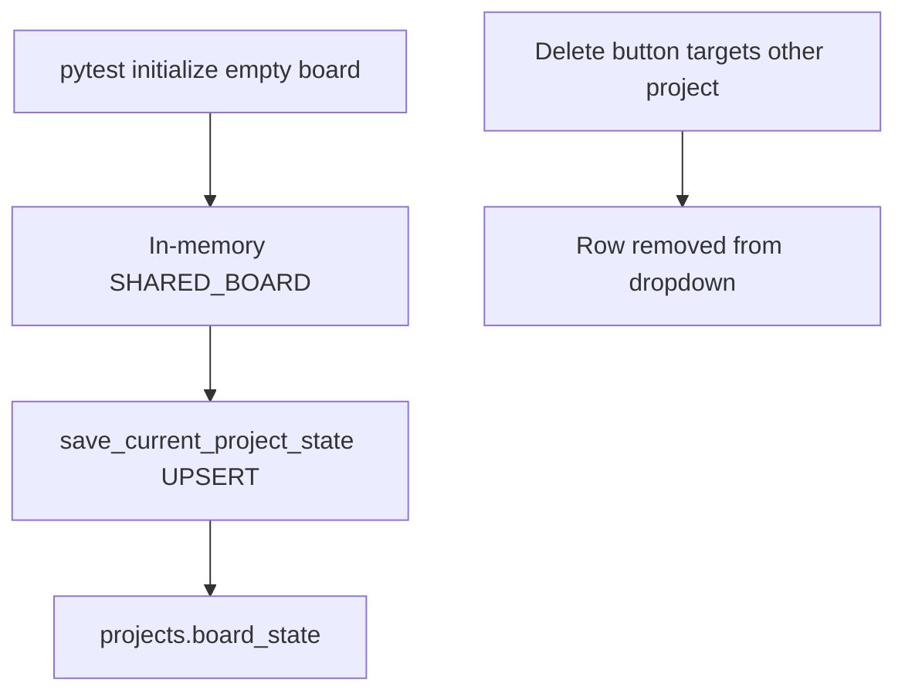

# Stop projects and cards from vanishing

The dropdown is `SELECT id, name FROM projects`. A project disappears only if that row is deleted or the UI drops `projectsList`. Cards disappear when `save_project` UPSERTs an empty `board_state` over a full one. Both became much easier after LM Studio work because **pytest `initialize()` + `_empty_board()` often hit the same `~/.allhands/scrum_memory.db` the app uses**, and **sprint/config still auto-save the live in-memory board on every persist**.

## Root causes

1. **Blind UPSERT** in [`backend/storage/project_storage.py`](backend/storage/project_storage.py) `save_project`: every `save_current_project_state()` writes whatever is in memory to `CURRENT_PROJECT_ID`. No check that the new board is not empty while the stored board has cards.

2. **Auto-save is everywhere** ([`project_service.py`](backend/services/project_service.py), sprint, tools, chat, config). A race after **New project** / **Reset** / tests can persist an empty board onto the project you still care about.

3. **Delete is inverted** in [`App.tsx`](frontend/src/App.tsx): `projectsList.find((p) => p.id !== state.projectId)` deletes **another** project, not the one in the dropdown. Confirm text uses that other name, so one click removes it from the list while you keep viewing the current workspace.

4. **Tests are not isolated.** [`tests/conftest.py`](tests/conftest.py) auto-calls `reset_workflow_settings()` against the process default DB. Many tests call `initialize()` without `ALLHANDS_HOME` → they load and then save the **real** project.

5. **UI state replace:** [`applySseStateSnapshot`](frontend/src/hooks/useAppState.ts) does `{ ...data }` with no merge of `projectsList` / `projectId` from `prev`. A partial payload can make the dropdown look empty even if SQLite still has rows.

## Repair (no schema migration required)

Keep one SQLite file. Split **what** we write, not necessarily new tables:

- **Metadata save** (name, workspace, models, skills, VFS): allowed anytime.
- **Board save**: only if `force=True` (explicit clear / restore / import) **or** incoming task count is **>=** stored count **or** stored row is missing. **Never** auto-save a 0-card board over a non-empty row. Log a warning and skip.

Change [`save_current_project_state`](backend/services/project_service.py) to take `project_id=` (default current) and `persist_board=` / `allow_empty_board=`. Capture `project_id` under `STATE_LOCK` so a sprint finishing after “New project” cannot write the old empty board onto the new id (or the new empty board onto the old id).

Cut routine auto-saves: sprint step-end still persists the board (with the guard above); skip snapshot-on-every-save (already cooldown). Config/models save must not rewrite board unless board actually changed.

**Delete:** delete the **selected** `state.projectId` only after switching away, or disable Delete unless the user picked a non-active project explicitly. Never `find` the first other id. Cannot delete the last remaining project.

**Frontend:** when applying SSE/HTTP state, keep `prev.projectsList` if incoming is missing/empty while prev had items; keep `prev.projectId` if missing. Same empty-board guard already used in `patchBoardFromEvent`.

**Tests:** autouse fixture: `ALLHANDS_HOME` + new `ProjectStorage` pointing at tmp DB; never touch live home. Tests that need to assert empty-over-full skip.

**Recovery (if the row is already gone):** Settings Board recovery already lists snapshots by project id under `~/.allhands/board_snapshots/`. Add “orphan snapshots” (folder exists, no `projects` row) to that list so a deleted project can be re-inserted from the richest snapshot.

## Verify

- Save empty in-memory board while DB has N cards → DB still has N; log skip.
- Delete control cannot remove a non-selected project.
- `pytest` with the new fixture does not change `~/.allhands/scrum_memory.db` row count or board JSON.
- Creating a project during a mocked in-flight persist cannot UPSERT empty onto the previous id.
