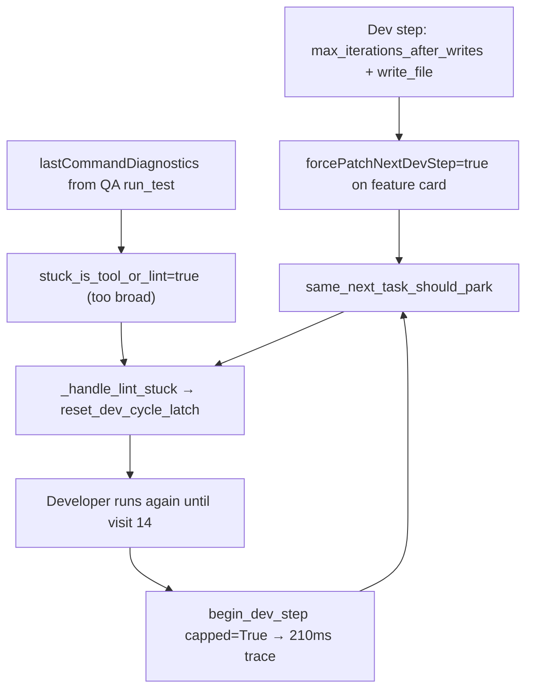

# Fix Sprint Cap Loop + Complete Precheck Fix

## What your logs actually show

This is **not** the original lint precheck loop (Developer *did* run at 14:32:53):

- Real step [`step-TASK-0E788D8…-143253.json`](step-TASK-0E788D8C7FCF4FA08BE649C95077E0D4-20260919T143253.json): 51s Dev run, `apply_patch` fail → `read_file` → `write_file` on `lib/models.dart` (normal recovery).
- After that, repeated **thin traces** (~210ms, zero tools) with `exitReason: phase_cycle_cap` at **Developer visit 14** ([`143558`](step-TASK-0E788D8C7FCF4FA08BE649C95077E0D4-20260919T143558.json), [`143711`](step-TASK-0E788D8C7FCF4FA08BE649C95077E0D4-20260919T143711.json)).
- One tick shows the old park message mislabeled as `completed_text_only` ([`143552`](step-TASK-0E788D8C7FCF4FA08BE649C95077E0D4-20260919T143552.json)).
- Embedded `stepProgress.intent` shows stale **"915s LLM in flight"** from an earlier hung step — not the current qwen2.5-coder run.



## Original plan status (already landed)

Most of [fix_dev_precheck_loop plan](file:///home/lukemcredmond/.cursor/plans/fix_dev_precheck_loop_23900f67.plan.md) is implemented in:

- [`backend/services/card_ledger.py`](backend/services/card_ledger.py) — `should_bypass_same_next_task_park`
- [`backend/services/sprint_service.py`](backend/services/sprint_service.py) — precheck bypass, `_record_dev_precheck_skip`, `_handle_lint_stuck` uses live board task, `skip_next_work_visit`
- Tests in [`tests/test_card_ledger.py`](tests/test_card_ledger.py), [`tests/test_step_diagnostics.py`](tests/test_step_diagnostics.py), [`tests/test_capped_retry_loop_regression.py`](tests/test_capped_retry_loop_regression.py) — all 7 new tests pass

**Remaining gap from original plan:** phase-cycle-cap early return at ~4496 still calls `_record_last_step_outcome` **without** `skip_next_work_visit=True`, which re-arms `lastNextWorkNoWrite` on capped ticks.

## Root cause of the new stuck behavior

1. **Over-broad lint detection** — [`stuck_is_tool_or_lint`](backend/services/needs_user_guard.py) returns true whenever `lastCommandDiagnostics` is non-empty. Your feature card picked up QA diagnostics (`run_test` failure on `lib/models.dart`), so it is routed through `_handle_lint_stuck` / `_keep_lint_card_for_developer` even though the title is *not* `Lint: …`.

2. **Visit-cap unlatch on non-lint cards** — [`_keep_lint_card_for_developer`](backend/services/sprint_service.py) calls `reset_dev_cycle_latch()` when `phaseCycleCapReached`, allowing a capped feature card back into `_in_progress_dev_runnable`.

3. **forcePatch on feature cards** — [`_check_stuck_and_escalate`](backend/services/sprint_service.py) ~1801 sets `forcePatchNextDevStep` on *any* card that wrote files and hit `max_iterations_after_writes`, which then interacts with (1) and (2).

4. **Capped card never parks** — When `begin_dev_step` returns `capped=True`, sprint writes a trace and returns, but does not call `_recover_latched_dev_card` → Needs User. Auto-sprint keeps re-selecting the card via the lint-unlatch / forcePatch path.

5. **Diagnostics/UI pollution**
   - Precheck park messages derive as `completed_text_only` ([`derive_exit_reason`](backend/services/step_diagnostics.py) ~1285–1290).
   - Thin traces embed stale `state.LAST_STEP_PROGRESS` when taskId matches but the trace has no LLM activity ([`_build_payload`](backend/services/step_diagnostics.py) ~387–391).

## Fix plan

### 1. Introduce `is_lint_wall_card(task)` and use it for lint-only routing

**File:** [`backend/services/needs_user_guard.py`](backend/services/needs_user_guard.py) (or [`sprint_service.py`](backend/services/sprint_service.py) if preferred)

```python
def is_lint_wall_card(task) -> bool:
    title = str(task.get("title") or "")
    return title.startswith("Lint: ") or bool(task.get("lintSourceFile"))
```

Replace `stuck_is_tool_or_lint` with `is_lint_wall_card` in **lint-only** paths:

| Location | Current | Change |
|----------|---------|--------|
| `_run_developer_step` precheck lint branch | `stuck_is_tool_or_lint` | `is_lint_wall_card` |
| `_handle_lint_stuck` callers | lint branch only | require `is_lint_wall_card` |
| `should_bypass_same_next_task_park` | `stuck_is_tool_or_lint` | `is_lint_wall_card` |
| `_keep_lint_card_for_developer` entry | unconditional | only called for lint wall cards |

Keep `stuck_is_tool_or_lint` for **Needs User guard** (broader “don’t park tool failures to user”) — but do not unlatch visit cap or bypass same-next for feature cards.

### 2. Stop arming forcePatch on generic feature write-stops

**File:** [`backend/services/sprint_service.py`](backend/services/sprint_service.py) ~1801

Only set `forcePatchNextDevStep` when `is_lint_wall_card(task)` **or** exit is a genuine lint/tool stop (`tool_failure_stop`, `identical_write_loop` on lint card). Feature cards that wrote files should stay In Progress via normal retry or escalate to Needs User when capped.

### 3. Park capped cards instead of infinite cap ticks

**File:** [`backend/services/sprint_service.py`](backend/services/sprint_service.py) — `begin_dev_step` capped branch (~4475)

When `capped=True`:

- Use `_record_dev_precheck_skip(..., skip via existing helper)` instead of raw `_record_last_step_outcome`
- Call `_recover_latched_dev_card(live_task, brief)` when `not is_lint_wall_card(task)` OR `lintUnlatchCount >= 1`
- For lint wall cards with one unlatch remaining, keep current unlatch behavior

This breaks the visit-14 empty-trace loop on feature cards.

### 4. Fix diagnostics for precheck / cap skips

**File:** [`backend/services/step_diagnostics.py`](backend/services/step_diagnostics.py)

- In `derive_exit_reason`, detect park/precheck messages (`"parking instead of another generate"`, `"Forced Patch retry queued"`, `"phase cycle cap reached at Developer visit"`) → return `lint_stay_in_progress` or new `dev_precheck_skip` / `phase_cycle_cap` consistently (not `completed_text_only`).
- In `_build_payload`, only attach `stepProgress` from `LAST_STEP_PROGRESS` when the trace has started real work (`llm_iterations_used > 0` or non-empty `tools_log`), preventing stale **915s** intent on 210ms cap traces.

### 5. Tests

| Test | File | Asserts |
|------|------|---------|
| Feature card with QA diagnostics does **not** bypass same-next / unlatch cap | `test_capped_retry_loop_regression.py` | `_handle_lint_stuck` not called; parks to Needs User |
| Capped feature card tick calls `_recover_latched_dev_card` | same | no second `begin_dev_step` with real LLM |
| Cap precheck uses `skip_next_work_visit` | `test_card_ledger.py` | `lastNextWorkNoWrite` stays cleared |
| Precheck park derives `phase_cycle_cap` / `dev_precheck_skip`, not `completed_text_only` | `test_step_diagnostics.py` | exitReason + no stale 915s intent on empty trace |
| Lint wall card still unlatches once | existing lint tests | unchanged behavior |

## Expected behavior after fix

- **TASK-0E788D8…** (feature card): after visit cap, moves to Needs User / split guidance — no more 1/sec empty diagnostics.
- **Lint cards** (`Lint: lib/…`): still get Forced Patch retry, bypass same-next, diagnostics on precheck skip.
- Run bar no longer shows stale **915s LLM in flight** on cap/park ticks.
- Your 14:32 apply_patch → read_file recovery remains unchanged (that part was working).

## Immediate manual unblock (no code)

For the stuck card right now: move **TASK-0E788D8C7FCF4FA08BE649C95077E0D4** to **Needs User** or **split it** (visit 14 / cycle 13 cap is already latched in diagnostics), then restart backend after the code fix.
