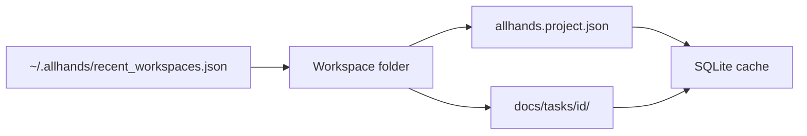

# Folder-first projects, recents, permissions, skills

The sidebar label **Default Project Workspace** is a hard-coded fallback in [Sidebar.tsx](frontend/src/components/Sidebar.tsx) when `projectsList` is empty. It is not a real SQLite row. Listing today comes only from `state.storage.list_projects()` in [helpers.py](backend/api/helpers.py). On this machine `~/.allhands/scrum_memory.db` still has five projects, so an empty dropdown usually means the UI never received that list (wrong `ALLHANDS_HOME`, failed `/api/state`, or a fresh empty DB). Even when the DB is intact, **v2 `allhands.project.json` has no cards**, so Open folder cannot restore a board.

We will make the **workspace folder** the source of truth (as you asked), recover what we can from disk, and keep SQLite as a runtime cache (transcripts, logs, embeddings) rather than the registry.



## 1. Recover then open from a folder

**Recents file** at `$ALLHANDS_HOME/recent_workspaces.json` (name, path, projectId, lastOpened). Cap ~20. This is the dropdown.

**Open folder** stays the primary action (existing [open-workspace](backend/api/projects.py) + Settings workspace path). On open:

1. Read [allhands.project.json](backend/services/project_file.py) if present; if missing, create v2 sidecar from folder name.
2. Load identity (name, brief, original_brief, models, assigned skills, workflow_settings).
3. Rebuild the board from **card files** via existing [task_spec_import.py](backend/services/task_spec_import.py) (`docs/tasks/*/README.md` and leftover `*-spec.md`).
4. If that yields no cards: restore `board_state` from a **v1** sidecar if present; else richest [board_snapshots](backend/services/board_snapshots.py) for that project id.
5. Upsert a SQLite row as cache; prepend recents; return state with `projectsList` derived from recents (not only DB).

**Switching** a recents entry = open that folder again (not `load/{id}` as the only path). **Delete** removes from recents only (folder stays). **New** still asks for a folder.

Also stop showing the fake `default-proj` option when recents are empty — show “Open folder…” instead.

## 2. Card files as board storage

Keep the unified layout already in place:

```
docs/tasks/{id}/README.md   # spec + Status lane
docs/tasks/{id}/qa.md
docs/tasks/{id}/plan.md
docs/tasks/{id}/notes.md
```

Do **not** put a giant `board_state` blob back into v2 JSON.

On every card create/move/update, keep syncing spec markdown (already done via `sync_task_spec_docs`). On folder open, import specs into the in-memory board (overwrite empty cache; do not wipe a richer live board unless the user confirms rebuild).

`allhands.project.json` stays identity + brief + models + skill lists + workflow settings (redact secrets as today). Bump a comment/`formatVersion` only if we add a `workspaceKind` or recents hint; no board dump.

## 3. Wire UI to recents

- [Sidebar.tsx](frontend/src/components/Sidebar.tsx) / [SettingsSlideOver.tsx](frontend/src/components/SettingsSlideOver.tsx): dropdown = recents; **Open folder** prominent.
- `projectsList` in [build_state_response](backend/api/helpers.py) = recents (merge any still-valid DB rows that have a workspace that exists).
- Bootstrap [initialize](backend/bootstrap.py): if recents empty, do not silently invent “Default Project Workspace”; wait for Open folder / New.

## 4. Select all permissions per agent

In [AgentToolsPanel.tsx](frontend/src/components/AgentToolsPanel.tsx) (Settings → Workflow → Tools / MCP), next to **Reset to defaults** for the active role:

- **Select all** — set `workflowSettings.agentTools[role]` to every builtin + custom name currently listed.
- Keep **Reset to defaults** (clear override).

Same save path as other workflow toggles (`onSettingsChange` → explicit Save).

## 5. Import skills from a previous project

Today skills live in global `SKILLS_DIR` plus copies under `{workspace}/skills/`, assigned lists on the project ([skills.py](backend/services/skills.py)). There is no cross-project import.

Add **Import skills from folder/project** in [SkillModal.tsx](frontend/src/components/SkillModal.tsx):

- Pick a source workspace (recents or path).
- Read `po_skills` / `dev_skills` / `cr_skills` / `qa_skills` from that folder’s `allhands.project.json`, and copy matching files from `{source}/skills/` (fallback: source files even if not in JSON).
- Reuse existing assign/copy into current `{workspace}/skills/` + agent lists.
- Backend: `POST /api/skills/import` `{ sourceWorkspaceDir, agents?: string[] }`.

No need to change GLOBAL SKILLS DIR for this flow.

## Tests

- Recents read/write and dropdown payload.
- Open folder: sidecar + `docs/tasks` import; v1 `board_state` fallback; snapshot fallback.
- Open empty folder creates sidecar, empty board.
- AgentToolsPanel select-all writes a full allowlist.
- Skill import copies files and assignment lists.

## Out of scope

- Dropping SQLite entirely (still used for logs, chat, embeddings, snapshots).
- Dumping transcripts into markdown (cards stay spec/QA/plan/notes).
- A native OS folder picker (keep path + existing Open folder unless a picker already exists).
