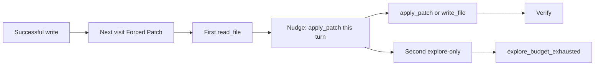

# Forced Patch: nudge once, then stop

Sep 8 traces: **39 Forced Patch visits**, all `explore_budget_exhausted` after **1 Ollama call** (always `read_file`/`list_dir`), **0 writes**, then cycle cap. Gemma always opens with an explore tool. Aborting the step on that first tool is what burned the visit budget.

[`start_forced_patch`](backend/services/dev_phase_graph.py) sets `explore_nudge_sent=True` and `pending_stop_after_nudge=True` before any tools. [`execute_step`](backend/agents/scrum_agent.py) also prepends `EXPLORE_NUDGE`. The first explore-only `record_batch` then hits the existing “after nudge, explore again → stuck” branch and ends the step.

## Change (one place)

In [`DevPhaseGraph.start_forced_patch`](backend/services/dev_phase_graph.py):

- Keep phase `patch`, `forced_patch=True`.
- Set **`pending_stop_after_nudge=False`** (do not pre-arm the stop).
- Keep the opening prompt nudge in `execute_step` (already injected when `forced_patch`).

In [`record_batch`](backend/services/dev_phase_graph.py), when `forced_patch` and no successful write yet, and the batch is **explore-only** (explore tools, no `apply_patch`/`write_file`):

1. **First time:** set `explore_nudge_sent` + `pending_stop_after_nudge`, return `EXPLORE_NUDGE` (same injection path as today: `messages.append` on `phase_action.nudge`). Do **not** stuck.
2. **Second time:** stuck `explore_budget_exhausted` (same as now). Next visit still Forced Patch.

Successful `apply_patch`/`write_file` on the first or later turn still moves to verify (existing). Mixed explore+write in one batch still counts as a write.

[`after_llm_turn_without_write`](backend/services/dev_phase_graph.py): do not stop on the **first** text-only turn of a Forced Patch visit (`pending_stop` false until an explore-only batch). After the in-step nudge, a text-only follow-up still stops (existing helper).

Do **not** change identical-write fingerprint, cycle cap skip, or fix-verify in this pass.

## Tests

Replace the current “first explore batch stops” tests in [`tests/test_dev_phase_graph.py`](tests/test_dev_phase_graph.py):

- Forced Patch + first `read_file` → `nudge` set, `stop_reason is None`, still `phase=patch`.
- Second explore-only batch → `explore_budget_exhausted`.
- First turn `apply_patch` success still goes to verify.
- `after_llm_turn_without_write` before any explore does **not** stop; after the first explore nudge it does.

Leave PO `ok` as-is: [`_build_last_step_outcome`](backend/services/sprint_service.py) already requires `po_clarified` and leaving Needs PO. The Sep 8 `ok=False` on Done is likely an old process or historic failures recorded before that override; not this hamster wheel.
