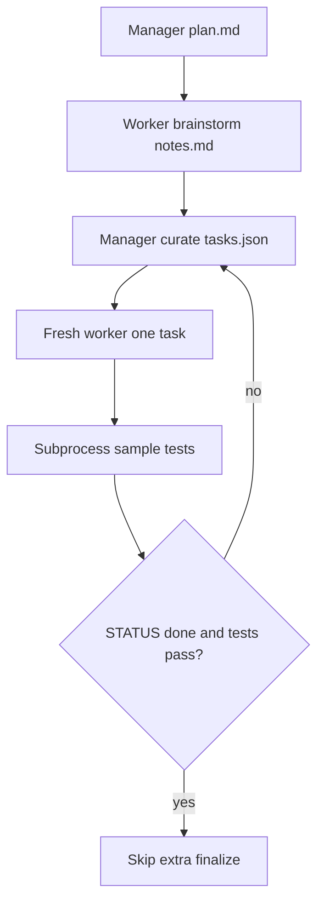

# GVS5H review and All Hands transplant

Source: [slee-persis/GVS5H](https://github.com/slee-persis/GVS5H) (v2 scaffold in `codebase/v2-current/escalation/multiagent.py`; paper: *Zero-Shot Self-Orchestration with Ledger-Based Control*). MIT code; we reimplement the **patterns**, not copy the contest runner.

## What GVS5H is (and is not)

GVS5H is a **training-free manager–worker loop** on contest problems. Five (or fewer) **fresh calls of the same model** coordinate only through a five-file workspace. It is **not** a Scrum IDE, not role-specialized (PO/Dev/CR/QA), and not tool-calling ReAct.

Headline result: Qwen3.8-27B + this scaffold ≈ Fable 5 on LCB-Hard, at ~3× tokens vs a single call. Gains are **conditional** (some models unchanged or worse). Two recurring mechanisms: **decomposition** and **short calls over a persistent ledger** (less truncation than one giant CoT).

## Comparison with All Hands

| GVS5H | All Hands today | Takeaway |
|---|---|---|
| Same model, fresh context every role | Four role models + growing ReAct chat ([`scrum_agent.py`](backend/agents/scrum_agent.py)) | Intra-card orchestration should stay on the **Dev model**; swapping PO/CR/QA is a VRAM cost, not a GVS5H win |
| Ledger: `task.md`, `plan.md`, `tasks.json`, `notes.md`, `solution.py` | SQLite card + transcript/decisions + prompt dump ([`task_context.py`](backend/agents/task_context.py) `build_task_prompt_legacy`) | We already persist history; we **do not** keep a small, named, size-capped working set on disk |
| First worker **must not write code** | Dev Explore→Patch→Verify ([`dev_phase_graph.py`](backend/services/dev_phase_graph.py)) | Missing explicit **ideation** before first patch |
| Manager re-curates one next task; **reissue same task → stop** | Focus micro-steps + speed gates ([`focus_slice.py`](backend/services/focus_slice.py), [`sprint_speed_gates.py`](backend/services/sprint_speed_gates.py)) | We park stalls; we do not fingerprint **identical next-work** |
| Sample tests as **ground truth**; failing run **overrides** `done` | Fix-verify lint + QA LLM ([`fix_verify_loop.py`](backend/services/fix_verify_loop.py)) | Lint is weak oracle; a **cheap subprocess test** should veto Done the same way |
| `finish_reason=length` → short **cutoff summarizer** | Empty-gen retries burn GPU ([`docs/specs/fix_gpu_waste_26245540.plan.md`](docs/specs/fix_gpu_waste_26245540.plan.md)) | Summarize **partial** output; **do not** retry empty gens |
| Bounded files (`MAX_PLAN_CHARS=4000`, notes ~8k) | Packed `num_ctx` but transcript still injected | Bound **what we inject**, not only `num_ctx` |
| Skip finalize if already done | Extra fix-verify rounds after abort | Already tightening; keep skip-on-hard-stop |

**Do not port:** LiveCodeBench harness, 128k contest loop, five parallel same-model workers as the product UX, or replacing Kanban with a research manager.

## What to add (implementation)

Keep Scrum as the outer loop. Apply GVS5H **inside a Developer visit** for one card.

### 1. Per-card ledger (highest leverage)

Write/read a small ledger under the project workspace, e.g. `.allhands/cards/{task_id}/`:

- `plan.md` — 3–6 sentence strategy (PO child spec or first Dev visit)
- `tasks.json` — `{id, desc, status, result}` capped (~12), mapped from AC / focus slices where they exist
- `notes.md` — **overwrite** with a compressed working note after each visit (GVS5H workers overwrite; only ideation appends). Cap ~4–8k chars
- Optional `last_oracle.txt` — last lint/test verdict

Wire into [`build_task_prompt`](backend/agents/task_context.py) **ahead of** the long transcript: inject ledger first; keep transcript as a slim tail (already 2–6 entries). Settings flag `enableCardLedger` (default on).

### 2. Ideation-before-first-write

On the **first** Dev visit of a card with empty `notes.md` / no writes: one short call (or a forced first LLM iteration) with a GVS5H-style contract — core difficulty, distinct approaches, pitfalls, **no code**. Then Explore→Patch. Skip if the card already has notes or files. Flag `enableDevIdeation` (default on for new cards).

This is the paper’s “small model skips up-front planning” mechanism, which matches local SLMs.

### 3. Test oracle overrides “done”

When `run_test` / project test command / fix-verify lint **fails**, treat it like GVS5H sample tests:

- Do **not** let Dev/QA mark Done
- Feed fail snippet into the ledger `notes.md` as ground truth
- Force next work to “fix failing case or switch approach”

Hook in [`fix_verify_loop.py`](backend/services/fix_verify_loop.py) and [`sprint_service.py`](backend/services/sprint_service.py) lane-advance (alongside existing `requireCleanLint`). Prefer **subprocess tests** over another QA generate when a test command exists.

### 4. Same-next-task no-progress stop

If the manager/focus layer would reissue the **same** next task description (normalized) as the previous visit with no new writes and no better oracle, **stop** that card (park / Needs PO) instead of another 26B generate. Fits [`sprint_speed_gates.py`](backend/services/sprint_speed_gates.py) next to stall park.

### 5. Truncation summarizer (not empty-gen retry)

When a call has **partial** text and `finish_reason=length` (or stream abort after tokens): one **short** summarizer prompt (“what was established, ruled out, unfinished — do not finish the solution”) → append to `notes.md`, then **fresh** next iteration with the summary.

**Do not** use this as an excuse to retry `empty_generation_timeout` (zero tokens). That stays one abort, as in the GPU-waste plan. Summarizer is only when there is content to salvage.

### 6. Docs, not a fifth agent

Add [`docs/specs/gvs5h_learnings.plan.md`](docs/specs/gvs5h_learnings.plan.md) (this comparison + flags) and a short README “Inspired by” note linking GVS5H. No new Kanban role.

## Explicitly out of scope

- Cloning `run_bench.py` / contest grading
- Running five concurrent Qwen instances per card (VRAM suicide on a home GPU)
- Training an orchestrator
- Changing default PO/Dev/CR/QA models to one 27B for all lanes (paper used one model because the **experiment** required it; All Hands still wants cheap PO skip-without-LLM)

## Tests

- Ledger read/write + prompt injection caps
- Ideation skipped when notes/files already exist
- Failed `run_test` blocks Done even if agent says solved
- Identical next-task fingerprint parks the card
- Length cutoff triggers summarizer once; empty-gen still **zero** retries

## Suggested order

Land **GPU-waste no-retry** first (already in tree), then ledger + oracle override, then ideation + same-task stop, then cutoff summarizer. That order cuts wasted GPU before adding extra calls.
