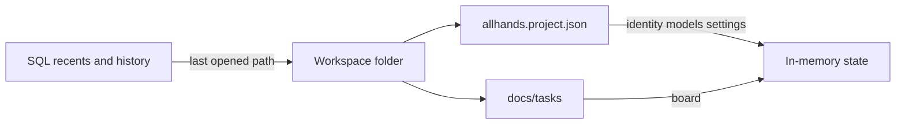

# Load projects from allhands.project.json

Today boot and `load_project_into_state` still read SQLite (`projects` row + `settings.workflow:{id}`), then dual-write the sidecar. Open-folder copies JSON into SQLite and then loads SQLite. That is the opposite of what you want.

## Source of truth

- **Project definition** always comes from [`allhands.project.json`](backend/services/project_file.py): id, name, brief, original_brief, models, backups, skills, plan_outline, workflow_settings.
- **Board** stays out of the v2 sidecar. On open, rebuild from [`docs/tasks`](backend/services/task_spec_import.py) (existing [`hydrate_board_from_workspace`](backend/services/workspace_open.py)); v1 `board_state` and snapshots remain empty-board fallbacks only.
- **SQLite** is not a project registry. It stores:
  - recent workspace history (id, name, path, lastOpened, active id)
  - session history already in SQL (chat, logs, changelogs, sprint session/reports, memories, pending tools)
  - redacted secrets (`llmApiKey`, `qdrantApiKey`, etc.) so they survive reload without being written into the sidecar

## Load path

Rewrite [`load_project_into_state`](backend/bootstrap.py) to take a workspace folder (or resolve path from recents), then:

1. `read_project_file(workspace)` — required; do not fall back to `storage.load_project`.
2. Apply identity, models, skills, plan, and `workflow_settings` from the file into memory.
3. Merge secrets from SQL (JSON wins for every non-secret setting).
4. Hydrate board from `docs/tasks` (then v1 sidecar / snapshots if empty).
5. Load SQL history (logs, chat, sprint recovery) keyed by project id.
6. `touch_recent` / upsert recents only.

[`open_workspace_folder`](backend/services/workspace_open.py) should call that path directly and **stop** going through [`restore_project_from_file`](backend/services/project_file.py) (JSON → SQLite copy). If the sidecar is missing, keep [`ensure_project_sidecar`](backend/services/workspace_open.py) to create it, then load the file.

[`initialize`](backend/bootstrap.py): recents → open that folder via JSON. Drop the SQL-only fallback (`load_project_into_state(active_id)` / `list_projects()[0]`). Empty recents means wait for Open folder.

[`POST /api/projects/load/{id}`](backend/api/projects.py): recents path only; 404 if there is no live folder + sidecar. No SQLite-only load.

## Save path

[`save_current_project_state`](backend/services/project_service.py) writes **JSON first** via existing `write_project_file`. Stop persisting name/brief/models/skills/plan/`board_state` into `projects`. Only update recents (`lastOpened`, name, path) and existing history tables.

[`save_workflow_settings`](backend/services/workflow_settings.py): sidecar is canonical. SQL `workflow:{id}` keeps secrets (and may keep a cache of the blob, but **get_workflow_settings** must read the sidecar for the open workspace, then overlay secrets).

[`sync_project_sidecar`](backend/services/project_file.py) should write from **live memory**, not `storage.load_project`.

## Recents in SQL

Keep [`recent_workspaces.py`](backend/services/recent_workspaces.py) as the client API, but persist recents in SQLite (small table or settings JSON) instead of treating `projects` as the catalog. Seed once from existing `~/.allhands/recent_workspaces.json` and leftover `projects` rows that still have a live folder. [`projects_list_for_client`](backend/services/recent_workspaces.py) should not merge `list_projects()`. Delete project = remove from recents only (folder + sidecar stay).

Slim `save_project` usage: new project create writes the sidecar + recents row, not a full project blob.

## Tests to update

- [`tests/test_project_file.py`](tests/test_project_file.py) — load from sidecar without a projects row; restore must not require SQLite identity.
- [`tests/test_project_settings_sidecar.py`](tests/test_project_settings_sidecar.py) — wipe `projects` / `workflow:*` (except secrets) and reopen from JSON.
- [`tests/test_brief_plan_persistence.py`](tests/test_brief_plan_persistence.py) — plan comes from sidecar, not SQL hydrate-back.
- [`tests/test_folder_first.py`](tests/test_folder_first.py) — boot/open never uses SQL-only load.
- [`tests/test_project_persist.py`](tests/test_project_persist.py) — save writes sidecar; recents updated; board not required in `projects`.

Add one focused test: after deleting the SQLite `projects` row, `open_workspace_folder` still loads name, models, and workflow from `allhands.project.json`.
