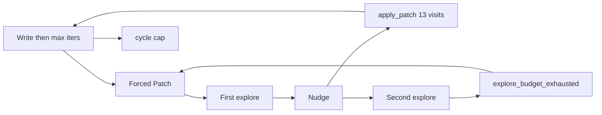

# Verdict: Forced Patch goal reached; cards still do not finish

This batch is **50 traces, ~11:33–13:38**, same Store Management job. Compared with the Sep 8 morning dump (39 Forced Patch visits, 1 Ollama call, **0 writes**).

## Forced Patch: the intended improvement is there

Gemma still opens with `read_file` / `list_dir` / `glob`. The step **stays alive for a second turn**.

- **34 Forced Patch visits:** 13 wrote (`max_iterations_after_writes`, typically 6 Ollama calls), 21 stopped after **2 explore tools** (`explore_budget_exhausted`). That is nudge-once-then-stop working.
- StoreRepository (2/2) wrote on almost every Forced Patch visit (`read → apply_patch → run_command`, often twice). Last batch never wrote after the first visit.
- **3/4 PO steps `ok=True`** with Needs PO → In Progress. One still `ok=False` with Needs PO → Done while `laneAfterTool=In Progress` (finalize-time board vs tool).

## Not reached: finishing cards

- **0 → QA.** 47/50 `ok=False`. Fix-verify still `aborted_hard_stop` on write steps.
- **`identical_write_loop` still 0.** Rewrites of `store_repository.dart` keep **changing replace size** (167 / 168 / 391 / 832), so path+size never hits 3.
- **Explore-only Forced Patch is a slower hamster wheel.** Aisle Reorder / Store List View: 2-call explore-stop, next visit Forced Patch again, until cap. Visit tax dropped from ~12 abort ticks to ~2 LLM calls, but the card still never patches.
- **Stuck still sends cards to PO** (StoreRepository 2/2 twice: write visits → PO `update_board` → In Progress → more writes → cap). Latch skip does not cover `stuckLoops`.
- **Developer cycle-cap on a Needs PO card** six times in two minutes (`Verify Store Name…`, ~1.2s, 0 Ollama). Picker is still invoking [`_run_developer_step`](backend/services/sprint_service.py) / [`begin_dev_step`](backend/services/sprint_speed_gates.py) while the card sits in Needs PO.

## Why Needs User talks about missing files / code in a file

These traces do **not** show a laneAfter of Needs User. Parking still happens on cycle cap via [`_check_stuck_and_escalate`](backend/services/sprint_service.py) → [`_try_move_to_needs_user`](backend/services/sprint_service.py).

The park **message** is “split or reset the latch.” The **UI question is not that message.** [`_resolve_needs_user_kind`](backend/services/needs_user_guard.py) prefers:

1. **lint** if `lastCommandDiagnostics` / failed tools exist → “Which lint/tool error should Developer fix” plus file:line from analyze, or last failed `apply_patch` / `read_file`.
2. Else **explore** if `exitReason=explore_budget_exhausted` **or `forcePatchNextDevStep`** (true on almost every latched card) → “Which file or function should Developer change first?”

Missing-file / “code inside the file” copy is **agent tool noise** (path not found, patch mismatch, flutter analyze). The prompt already says not to send those to Needs User; the park path ignores that and templates a user question from the last failed tool.

That is not a product decision. The user cannot usefully answer “the file does not exist.”

## Recommended next pass (if you want implementation)

1. **Needs User park copy:** if `phaseCycleCapReached` (or kind `phase_cycle_cap`), do not use lint/explore templates. Question should be split / reset latch / send to Dev after reset — never last `read_file`/`apply_patch` error.
2. **Do not run `begin_dev_step` on Needs PO** (those six 1s cap traces).
3. Optional later: fingerprint **path only** (or path + size bucket) so identical_write_loop trips; after two Forced Patch explore-stops, stop forcing Patch / park without asking about files.
4. Leave fix-verify abort as a later pass.

No code in this review. Confirm if you want (1)–(2) implemented next.
