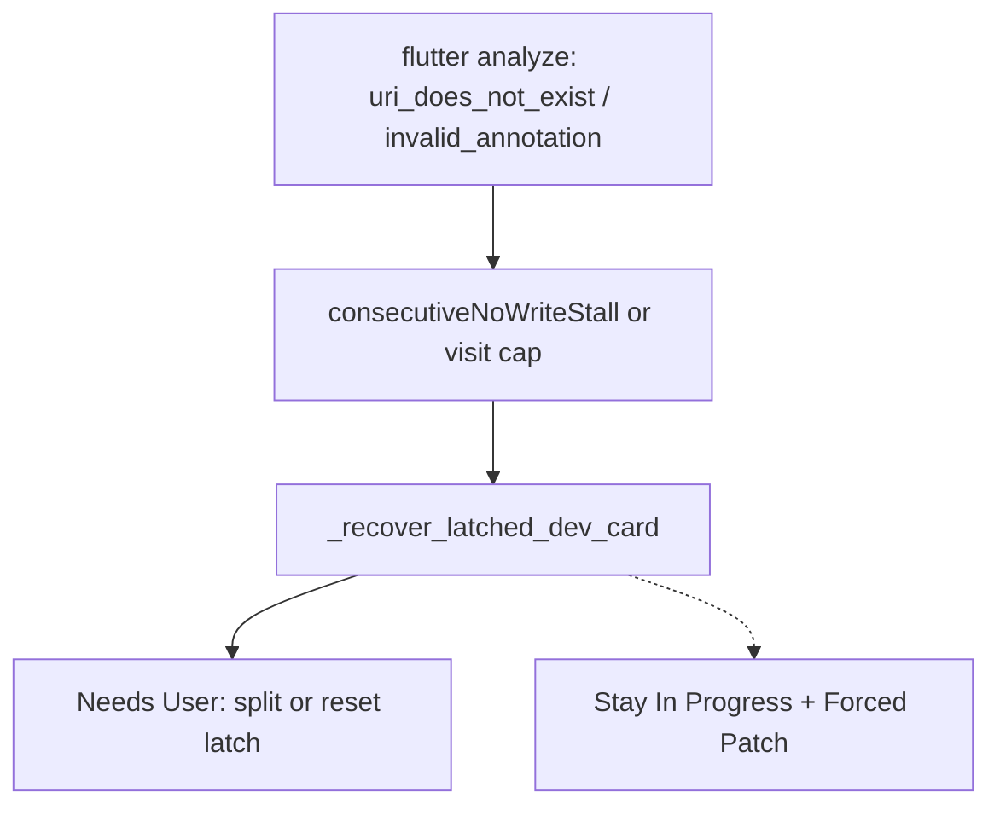

# Keep lint/URI errors on Developer, not Needs User

## Why they go to Needs User

Those messages are Dart analyzer findings (`invalid_annotation`, `extends_non_class`, `uri_does_not_exist`). Prompts already say Needs User is only for secrets / irreversible product choices ([`backend/services/prompt_defaults.py`](backend/services/prompt_defaults.py)). [`stuck_is_tool_or_lint`](backend/services/needs_user_guard.py) is meant to **keep** lint walls in In Progress.

They still park because Auto Sprint recovery does not use that guard:

1. After two explore/duplicate stalls (or visit cap), [`_run_developer_step`](backend/services/sprint_service.py) calls [`_recover_latched_dev_card`](backend/services/sprint_service.py), which always `_try_move_to_needs_user(..., kind="phase_cycle_cap")`.
2. [`_check_stuck_and_escalate`](backend/services/sprint_service.py) parks **latched** cards to Needs User even when `stuck_is_tool_or_lint` is true (comment: “Dev cannot retry while latched”).
3. Cycle-cap briefs override lint copy: “Split the card or reset the latch” ([`build_needs_user_brief`](backend/services/needs_user_guard.py)), so the UI looks like a user decision even though the blocker is missing `meal.dart` / a bad `extends`.

Stall park was added to stop Gemma’s explore wheel. For a card that already has analyzer output, parking the user is the wrong escape hatch. Developer should stay on the card and patch those files.

## Change

Treat analyzer/lint/missing-file as **dev-solvable**. Do not move those cards to Needs User. Keep Auto Sprint on Developer with Forced Patch.

### 1. Stall / cap recovery

In [`_recover_latched_dev_card`](backend/services/sprint_service.py): if `stuck_is_tool_or_lint(task)` (diagnostics, failed tools, or analyzer codes in `lastCommandDiagnostics`):

- Do **not** call `_try_move_to_needs_user`.
- Stay In Progress.
- Set `forcePatchNextDevStep`.
- Clear `consecutiveNoWriteStall` so the picker can run Dev again.
- If `phaseCycleCapReached`, call [`reset_dev_cycle_latch`](backend/services/sprint_speed_gates.py) **once** (`lintUnlatchCount`, max 1) so visit cap does not permanently block a lint fix. After that unlatch is used, skip Auto Sprint on the card without Needs User (`parkFailed` / `poAutoSkip`) if it caps again.

True non-lint latches (empty card, secrets, visit cap with no diagnostics) still park to Needs User.

### 2. Stuck-loop escalate

In [`_check_stuck_and_escalate`](backend/services/sprint_service.py): remove the latched+lint branch that parks to Needs User. Lint + latch follows the same recover path as above (unlatch once, Forced Patch, stay IP).

### 3. Brief / picker

Do not classify lint as `phase_cycle_cap` when `stuck_is_tool_or_lint` — keep `resolved_kind == "lint"` only for copy if something still escalates. `_in_progress_dev_runnable` should include lint-unstalled cards after stall reset.

### 4. Tests

- [`tests/test_capped_retry_loop_regression.py`](tests/test_capped_retry_loop_regression.py): recover with `lastCommandDiagnostics` containing `uri_does_not_exist` / `invalid_annotation` stays In Progress; `_run_developer_step` is not replaced by Needs User; `forcePatchNextDevStep` is set.
- Cooldown/hash park tests for **non-lint** cycle cap still move to Needs User.
- [`tests/test_needs_user_dedup.py`](tests/test_needs_user_dedup.py) / stuck tests: lint does not escalate when latched.

## Not in this change

- Re-doing Forced Patch verify-block / stall counting (already in tree).
- Asking the user which file to create — Developer should add `item.dart` / `meal.dart` or fix the import.

**Restart `python app.py`** after this so Auto Sprint loads the recover path.