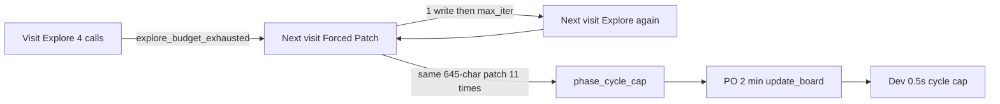

# Verdict: logging worked; the sprint loop still does not finish cards

The Sep 7 dump (50 traces, same `gemma-4-q4km:26b` / Store Management UI job) includes the new fields (`sampling`, `writesSucceeded`, `max_iterations_after_writes`, `laneAfterTool`, `doneReason`, `phaseGraph`). That part of the last change did what we wanted.

## What landed (desired diagnostic/PO effect)

- **PO sampling is live:** 9/9 PO steps have `temperature=0.4`, `num_predict=2048`, `repeat_penalty=1.05`. Typical PO is still 1 call, 465–1435 eval tokens, `doneReason=stop`, `truncated=false`. Cap/bump was not needed this run.
- **`laneAfterTool` is correct:** several PO traces have `laneAfter=Done` but `laneAfterTool=In Progress` matching `update_board`. We can trust the tool, not finalize-time board.
- **Write vs no-write exits are honest:** 22 `max_iterations_after_writes` vs 5 `max_iterations` with zero successful writes. The UI reason now says files were written.
- **Explore budget still saves 2 LLM turns** on first visits (`explore_budget_exhausted` at 4/6, `forcePatchNextDevStep=true`).

## What did not land (cards still fail)

**50/50 `ok=False`.** No card left In Progress as a successful Dev completion. `lastEvent` is still `fix_verify_done: aborted_hard_stop` on 35 Dev steps.

The loop is now **visible**, not fixed:

**1. Explore tax after a successful write (18/22 write exits still have `exploreCount>=3`).** [`forcePatchNextDevStep`](backend/agents/scrum_agent.py) is only set on `explore_budget_exhausted` and is consumed on the next visit. After `max_iterations_after_writes`, the next graph resets to Explore. That is the follow-up the last plan called out.

**2. Identical successful-patch hamster wheel.** Card `…C08491F4` wrote `store_list_screen.dart` on **11 straight visits**, 8 of them the same “replace 645 chars”, with the last four Ollama evals repeating `282, 34, 22, 24, 19` until [`phase_cycle_cap`](backend/services/sprint_speed_gates.py) (default 12 visits). Duplicate-tool policy only stops identical *args in one step*, not the same successful patch across steps.

**3. Cycle cap still burns PO.** After latch, Auto Sprint ran PO (~2 min, `update_board → In Progress`) then Dev died in 0.5s with `phase_cycle_cap` and no sampling snapshot. That happened twice on the same card. Latch is not skipping the card.

**4. Fix-verify never runs.** Writes move the in-step graph to `verify`/`done`, then the LLM still burns remaining iterations and the outer loop aborts round 1. Phase `done` ≠ card Done.

**5. `ok` is still wrong on PO.** `po_clarified` + `poJsonApplied=true` + `laneAfterTool=In Progress` still records `ok=False` because [`_build_last_step_outcome`](backend/services/sprint_service.py) treats the step as failed.

## Remaining implementation (not more logging)

Logging is sufficient. Change the loop:

1. **Skip Explore after a write.** In [`should_force_patch_next_dev_step`](backend/services/sprint_speed_gates.py), also return true for last exit `max_iterations_after_writes` / `completed_with_writes`. Set `forcePatchNextDevStep` on those exits in [`_mark_force_patch_next_dev_step`](backend/agents/scrum_agent.py). Next Dev visit starts Patch.

2. **Stop identical successful patches across visits.** Fingerprint successful `apply_patch` path + replace size (or hash of old/new text if cheap). If the same fingerprint succeeds N times (e.g. 3) on a card, stop with a dedicated exit (`identical_write_loop`) instead of burning visits to the cycle cap. Prefer treating that as “wrote enough — run verify / stay IP” rather than another Explore.

3. **Do not send latched cards to PO or Dev.** If `phaseCycleCapReached`, Auto Sprint should skip the card (Needs User / blocked / split hint) instead of Needs PO → `update_board` → instant Dev cap. [`increment_dev_visit`](backend/services/sprint_speed_gates.py) already latches; the sprint picker/PO path does not honor it.

4. **Mark PO success as `ok=true`** when `exitReason=po_clarified` and `laneAfterTool` (or tool log) is In Progress/Refinement, even if finalize-time `laneAfter` is Done.

Leave `maxDevStepsPerCard` and sampling caps alone. Fix-verify abort can be a later pass once (1)–(3) stop the 11-visit rewrite loop.

Tests: extend [`tests/test_sprint_speed_gates.py`](tests/test_sprint_speed_gates.py), [`tests/test_dev_phase_graph.py`](tests/test_dev_phase_graph.py), and PO outcome tests so force-patch-after-write, identical-write-loop stop, and cycle-cap skip are locked in.
