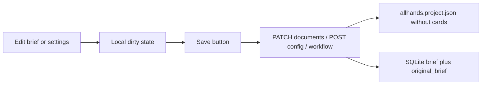

# Manual project save and brief protection

Three related failures: the workspace sidecar dumps the whole board; sprint/config writes can replace a real brief with the placeholder `"brief"`; Configuration and the brief textarea autosave on debounce so a race or stub payload lands on disk.

## 1. Keep cards out of `allhands.project.json`

Today [backend/services/project_file.py](backend/services/project_file.py) writes `board_state` on every `save_current_project_state`. Cards already live in SQLite (`projects.board_state`) and [board snapshots](backend/services/board_snapshots.py).

- Drop `board_state` from `build_project_file_payload`.
- Keep identity fields: `id`, `name`, `brief`, **`original_brief`**, `plan_outline`, workspace, models, skills, `workflow_settings`.
- `restore_project_from_file`: do **not** overwrite SQLite cards from the sidecar. Use the existing DB board if the row exists; otherwise `DEFAULT_BOARD`. Ignore a legacy `board_state` key if an old file still has it (do not delete cards by applying an empty sidecar).
- Update [tests/test_project_file.py](tests/test_project_file.py) accordingly.

Board/sprint `save_current_project_state()` still persists cards to SQLite; only the workspace JSON stops carrying them.

## 2. Keep the original brief; never persist `"brief"` as the brief

`resolve_brief_for_sprint` in [backend/services/brief_service.py](backend/services/brief_service.py) currently **writes any non-empty client string** into `PROJECT_BRIEF`. Sprint/plan APIs send `{ brief }` from the UI, and tests/callers often pass the literal `"brief"`. That becomes the saved document.

Harden `set_project_brief` / `resolve_brief_for_sprint`:

- Treat as **not a real brief**: empty, case-insensitive `"brief"` / `"plan"`, or other tiny placeholders.
- If a real brief already exists, ignore those overwrites (same pattern as today’s empty-brief guard) and keep using `state.PROJECT_BRIEF`.
- Sprint steps still **read** the server brief; they must not persist the request body’s dummy `brief` field.

Add `original_brief`:

- New optional SQLite column (same ALTER style as `plan_outline` in [backend/storage/project_storage.py](backend/storage/project_storage.py)) plus sidecar field.
- Set once when the first real brief is saved (length well above a placeholder). Later edits update `brief` only.
- Surface in API state as `originalBrief`. In [BriefPanel](frontend/src/components/BriefPanel.tsx), if it differs from the working brief, show a small read-only “Original brief” disclosure so it cannot vanish from the UI.

## 3. Remove autosave; one obvious Save

Autosave today:

- Brief + plan: 1.5s debounce in [frontend/src/App.tsx](frontend/src/App.tsx) (`patchProjectDocuments`).
- Workflow: 350ms debounce via [frontend/src/workflowSettingsPending.ts](frontend/src/workflowSettingsPending.ts) + `handleWorkflowSettingsChange`.
- Paths/models already require **Save Custom Configurations**, but it sits mid-panel and is easy to miss ([SettingsSlideOver](frontend/src/components/SettingsSlideOver.tsx) ~line 396).

Changes:

- Delete the brief/plan debounce effect. Typing only updates local state (`briefDirtyRef` / `planDirtyRef`).
- Stop the 350ms workflow POST. `onSettingsChange` only stages `queuePendingWorkflowSettings` (MCP JSON `onBlur` still validates, then stages).
- Add a **sticky Save** that is always on screen:
  - Primary: **Save** on the main chrome next to [StatusStrip](frontend/src/components/StatusStrip.tsx) / sidebar header (large, high-contrast). Enabled/highlighted when anything is dirty (brief, plan, config fields, pending workflow).
  - Same handler as Settings: persist config (`updateConfig`), flush workflow (`updateWorkflowSettings`), persist documents (`patchProjectDocuments`).
  - Keep a matching Save at the **top** of Settings (not only buried under Paths) so it is the first control in Configuration.

Dirty tracking: compare local project name / dirs / models vs `state`; `hasPendingWorkflowSettings()`; brief/plan dirty refs. Show “Unsaved changes” next to the button.

Sprint Plan/Step should send the **saved** server brief (`state.brief`) unless the user has just Saved; do not send unsaved textarea stubs, and do not send the tab id `"brief"`.

## 4. Tests

- Sidecar has `brief` / `original_brief` and **no** `board_state` (or empty omitted).
- `set_project_brief("brief")` does not clobber an existing document; `resolve_brief_for_sprint("brief")` returns the stored brief.
- First real brief sets `original_brief`; later edits leave it unchanged.
- Restore-from-file does not wipe SQLite cards.
- Frontend: no `setTimeout` document/workflow save on change (assert via existing pending-settings tests updated to require an explicit flush).
