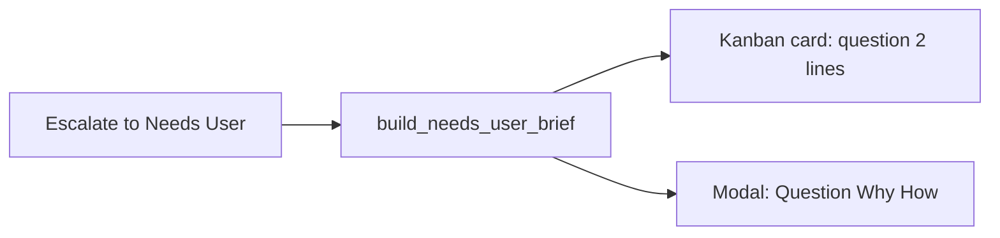

# Clearer Needs User: question, why, how to move on

Today a PO-limit escalation stores one sentence and then **reuses it as both reason and action**:

```1317:1320:backend/services/sprint_service.py
    msg = (
        f"PO and Dev could not agree after {max_trips} rounds — "
        "please clarify requirements."
    )
```

[`_set_needs_user_fields`](backend/services/sprint_service.py) takes the first line as `needsUserReason` and the second line as `needsUserAction`. One-line messages make those fields identical. The modal’s fallback [`deriveNeedsUserReason`](frontend/src/components/TaskDetailModal.tsx) also matches “could not agree / no progress”, so you never see a real ask.

The round-trip count is **context**, not the input you need.

## What you should see instead

Three distinct fields (plus a suggested destination):

- **Question** — one concrete ask (secret, product choice, missing AC, or “pick a default for X”).
- **Why** — evidence from this card: last exit (`explore_budget_exhausted`, lint, empty spec), diagnosis, failed tool, first lint hit, QA failure. PO×N only as a footnote.
- **How to unblock** — what to type and **which button** (Send to Developer / Product Owner / Refinement) so the card actually leaves Needs User.



## Backend: build a brief from existing evidence

Add `build_needs_user_brief(task, *, kind, raw_msg)` in [`backend/services/needs_user_guard.py`](backend/services/needs_user_guard.py) (no extra LLM call). Prefer, in order:

1. Agent `user_question` / explicit Needs User text when it is already specific.
2. `lastDiagnosis.problem` + `recommendedAction` if present.
3. `lastCommandDiagnostics` (file:line + message).
4. `lastStepOutcome.exitReason` / `whyCardStayed` / `message` (explore/patch budget, truncated PO, incomplete spec).
5. `qaFailure.reason`.
6. Spec gaps: empty description, empty AC, missing scope/testPlan that bounced Dev.
7. Last failed transcript tool name + snippet.

Kind-specific **how to unblock** (not “please clarify”):

- `po_limit` / clarification exhausted: “Answer the open product choice below, then **Send to Developer**. If the spec is still wrong, **Send to Product Owner** with the corrected AC.”
- lint/tool wall that was parked: “You cannot fix this by answering PO. Either accept a workaround, or **Send to Developer** with ‘ignore/fix this lint’ + which file.”
- secrets/credentials: “Paste the value or say ‘use env VAR’ then **Send to Developer**.”
- explore/no-write: “Tell Dev the first file/function to change, or split the card; **Send to Developer**.”

`_set_needs_user_fields` should apply this brief:

- `userQuestion` = question
- `needsUserReason` = why (multi-line OK, raise 240-char cap to ~600)
- `needsUserAction` = how to unblock
- new optional `needsUserSuggestedTarget`: `dev` | `po` | `refinement`
- optional `needsUserKind` for tests/UI

Call it from `_try_move_to_needs_user` so **every** path (PO limit, stuck, Dev board move, registry `update_board`) gets the same structure. `_escalate_po_limit` stops using the generic one-liner as the only message.

Keep PO round trips on the card for observability; do not put them in the headline.

## UI

[`TaskDetailModal.tsx`](frontend/src/components/TaskDetailModal.tsx) Needs User banner:

- **Question** (full `userQuestion`, not first line of a dump)
- **Why we’re stuck** (`needsUserReason`)
- **How to move on** (`needsUserAction`)
- Suggested resolve button visually emphasized using `needsUserSuggestedTarget`
- Textarea placeholder = the question
- Hide or demote `PO↔Dev ×N` and “Stuck loop rounds” from the banner (keep in header meta)

[`TaskCard.tsx`](frontend/src/components/TaskCard.tsx): two-line preview = **question**, fallback action. Never show only “PO and Dev could not agree…”.

Types: [`frontend/src/types/index.ts`](frontend/src/types/index.ts) (`needsUserSuggestedTarget`, `needsUserKind`).

## Tests

- Brief for `po_limit` + empty AC / last diagnosis includes a specific question and Dev action, not only round count.
- Brief for lint diagnostics mentions the file and “Send to Developer”.
- `_set_needs_user_fields` / `_try_move_to_needs_user` persist distinct reason vs action.
- Existing Needs User guard tests still pass (dedup still hashes the **question**).

No new LLM diagnosis at escalate time — use fields already on the task.