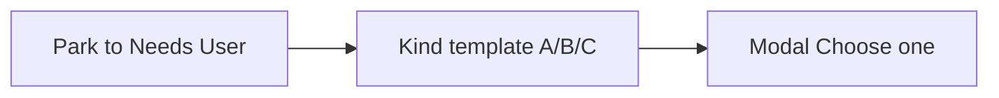
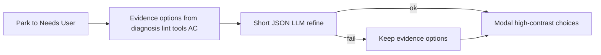

# Context-aware Needs User options

## What the support bundle shows

On project `c6196c51` (meal planner), Needs User cards ignore the actual blocker and stamp one of two templates from [`_build_needs_user_options`](backend/services/needs_user_guard.py):

- **Visit-cap cards** (Shopping list polish, Import from document, Sample export): always **Split into smaller cards** / **Reset Developer visit latch** / **Other**
- **Everything else** (Export, aisle management, club-card photo): always **Proceed with the simplest option that matches the spec** / **Send back to Product Owner** / **Answer in my own words (Other)** / **Other**

That last pair is a duplicate Other. The Export card already had a useful diagnosis (“no Dart/Flutter source; run `flutter create`”) and then offered “simplest option that matches the spec” anyway.

Option labels in [`TaskDetailModal.tsx`](frontend/src/components/TaskDetailModal.tsx) have **no text color**. Letters are `text-amber-200`; the label inherits body color. In light mode, [`index.css`](frontend/src/index.css) sets `html:not(.dark) body` to `text-slate-900` on `bg-amber-950` option rows — dark text on a dark amber tile.

Target flow:

## 1. Stop using kind templates as the options

Rewrite [`_build_needs_user_options`](backend/services/needs_user_guard.py) so every card gets **this card’s** solutions, then a single **Other**.

Build 2–4 options from, in order:

- `lastDiagnosis.recommendedAction` / `problem` (the Export card would become “Scaffold with `flutter create`, then implement export”)
- Alternatives actually in the question (`light or dark`, `A vs B`)
- Last lint/tool line (`Fix Center undefined in lib/main.dart`)
- Last failed tool snippet
- Spec gaps (empty AC → “Write 2–5 acceptance criteria”)
- Kind only as **extra** choices when they still make sense (secret → env var vs paste; visit cap → split **and** reset, not instead of the real fix)

Rules:

- Never emit “Proceed with the simplest option…”, “Send back to Product Owner to refine the spec”, or a second Other (“Answer in my own words”)
- Cap at 4 + `other`; `other` is always last
- `label` is a one-line solution the user can understand; `answer` is the instruction sent to Dev/PO
- If visit-cap question is the generic “Split X or reset latch?” **and** diagnosis/lint exists, rewrite `question` to the actual problem so the banner matches the options

Keep `build_needs_user_brief` deterministic (no LLM) so existing unit tests stay fast.

## 2. Cursor-like refine with a short LLM call at park time

After `apply_needs_user_brief` in [`_try_move_to_needs_user`](backend/services/sprint_service.py) (and the Needs User path in [`board_service.py`](backend/services/board_service.py)), call a best-effort enricher:

- One JSON completion via [`get_chat_provider`](backend/services/llm_provider.py) + the PO/quality model, `num_predict` ~512, ~20s timeout
- Prompt: title, question, why, AC, diagnosis, lint, last failed tool — “2–4 mutually exclusive concrete solutions; no generic process labels; do not invent secrets”
- Parse with the existing JSON extractor in [`po_clarification.py`](backend/services/po_clarification.py)
- On success, replace options (keep Other); on timeout/parse fail, keep evidence options
- Injectable chat fn so tests mock it; never call LLM from `build_needs_user_brief`

Refresh **already-parked** cards whose options match the old templates (detect those two label sets) the next time brief/reconcile runs, so current Needs User cards update without a re-park.

## 3. Option text contrast

In the Needs User “Choose one” radios in [`TaskDetailModal.tsx`](frontend/src/components/TaskDetailModal.tsx):

- Set the label to `text-white` (or `text-amber-50`)
- Keep the letter `text-amber-100`
- Selected row: slightly brighter border; unselected still dark amber tile
- Do not rely on inherited body color (breaks in light theme)

## 4. Tests

Update [`tests/test_needs_user_brief.py`](tests/test_needs_user_brief.py):

- Export-like fixture with `lastDiagnosis.recommendedAction` → option labels mention scaffold/`flutter create`, **not** “simplest option”
- Or-question (`light or dark`) → those two choices + Other
- Visit cap + lint line → a fix-this-error option, not only split/reset
- Duplicate Other is gone
- LLM mock replaces options; LLM failure keeps evidence options
- Old template labels get refreshed

Frontend: assert option rows include an explicit light text class (small test or existing modal test if one exists).

## Out of scope unless it blocks options

- `lastCommandDiagnostics.file` sometimes stores the whole Flutter analyze line (`error • Undefined name 'isTrue' • test/...dart`). Sanitize when building the lint option line; full parser fix is a follow-up.
- `lastStepOutcome.suggestedAction` staying “Run In Progress again” on visit-cap is a separate copy bug.
