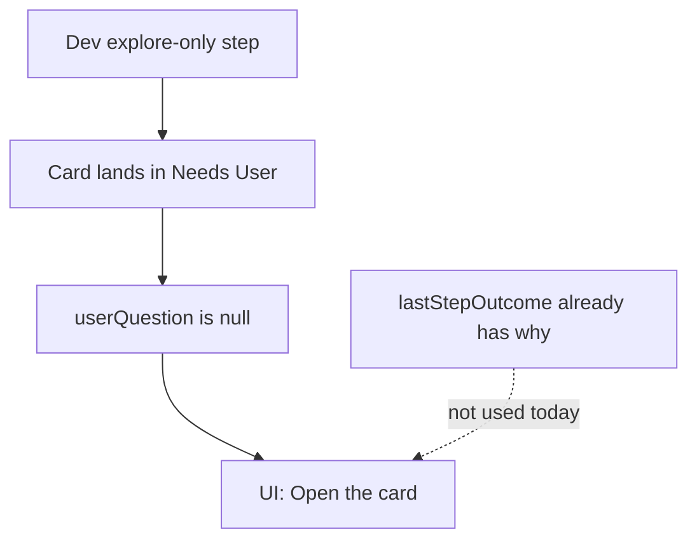

# Clearer Needs User + new-project run fixes

## What happened on this run

Project `c6196c51` (meal planner 5, qwen3.8-27b, `num_ctx=4096`).

[TASK-23C1DAFF20094801A0D0027D03D6F572](TASK-23C1DAFF20094801A0D0027D03D6F572) (Export to storage — core flow) is in **Needs User** with `userQuestion` / `needsUserReason` / `needsUserAction` all **null**. The card and modal therefore show generic copy (“Needs your answer — open card” / “Action required”). Evidence already on the card is unused:

- `lastStepOutcome.exitReason`: `read_only_no_edits`
- `whyCardStayed`: Developer listed `docs/` and never called `apply_patch`/`write_file`
- Workspace at that point: `allhands.project.json`, `docs/`, `skills/` — **zero Dart files**
- `stuckLoops: 1`, `phaseCycleCapReached: false`, `lastNeedsUserReasonHash: null` → the move **bypassed** [`_try_move_to_needs_user`](backend/services/sprint_service.py)

The brief builder in [`needs_user_guard.py`](backend/services/needs_user_guard.py) already knows how to write Question / Why / How for explore stalls. It was never applied, and the UI does not fall back to `lastStepOutcome`.

## 1. Always fill Question / Why / How

**Backend — never land in Needs User empty**

- In [`move_board_stage`](backend/services/board_service.py): if `target_lane == "Needs User"` and fields are empty, call `build_needs_user_brief` + `apply_needs_user_brief` (covers `/api/tasks/move` drag and any other bypass).
- Route [`_escalate_dependency_deadlock`](backend/services/sprint_service.py) through `_try_move_to_needs_user` instead of a raw `move_board_stage`.
- On board load / `normalize_task`: if lane is Needs User and `userQuestion` is blank, backfill from `lastStepOutcome` / `lastStepProgress` / diagnosis.
- Treat `read_only_no_edits` as **explore** in [`_resolve_needs_user_kind`](backend/services/needs_user_guard.py) (today only `explore_budget_exhausted` maps there).

**Frontend — never hide evidence**

- [`needsUserCardPreview`](frontend/src/utils/taskFormat.ts): show the real question, else `lastStepProgress.whyCardStayed` / `lastStepOutcome.message`. Stop using “Open the card — answer the question…”.
- [`deriveNeedsUserReason`](frontend/src/components/TaskDetailModal.tsx): read `lastStepOutcome` / `lastStepDiagnostics.exitReason` before the generic fallback.
- [`TaskCard.tsx`](frontend/src/components/TaskCard.tsx): drop the redundant “Needs your answer — open card” line; the two-line preview is the reason.
- Emphasize the suggested Send button from `needsUserSuggestedTarget`.

For this card, backfill should produce something like:

- **Question:** Which file should Developer create first for Export (e.g. `lib/export_service.dart` after Flutter scaffold)?
- **Why:** Dev used 7 explore tools, found no `*.dart`, never wrote files. Context filled at 4096 tokens (`doneReason=length`).
- **How:** Send to Developer with “scaffold then implement export”, or split the card. Do not send to PO.

## 2. Do not park the first explore-no-write as a user question

This was **one** Dev step (`stuckLoops=1`). Policy already wants a Forced Patch turn, not Needs User.

- After `read_only_no_edits`, stay **In Progress**, set `forcePatchNextDevStep`, and inject a hard instruction: `write_file`/`apply_patch` next (scaffold if empty).
- [`no_write_stall_should_park`](backend/services/sprint_speed_gates.py) / `_recover_latched_dev_card` must not park until the consecutive-stall limit (default 2) **and** must always apply the brief if they do park.
- `move_off_needs_po` must return the **actual** lane after `move_board_stage` (today it returns `"In Progress"` even when the claim gate bounced the card back).

## 3. Greenfield: infer Flutter from the brief and scaffold

[`detect_flutter`](backend/services/workspace_structure_audit.py) returns `None` when there is no `pubspec.yaml` and no `lib/*.dart`. Empty workspace → stack `unknown` → [`maybe_auto_scaffold`](backend/services/workspace_scaffold.py) skips. Dev then globbed `**/*.dart` (“No files match”) and wandered `docs/`.

- Infer stack from brief/project name via existing [`extract_brief_categories`](backend/services/skill_suggestions.py) (`flutter` / `dart` keywords) when the workspace is empty.
- Empty + brief says Flutter → `critical` missing `pubspec.yaml` + `lib/main.dart` → run `flutter create .` before the first Dev LLM turn.
- If scaffold fails (SDK missing), put a **specific** Needs User question: “Flutter SDK is not on PATH. Install it or tell Dev to skip mobile scaffold.” — not a blank card.

## 4. 4096-token truncation is why the step died

Every trace used `num_ctx: 4096`. Last Dev call: `promptTokens=4089`, `evalTokens=7`, `doneReason=length`. PO calls also hit the wall. Default setting is 32768 with `ollamaNumCtxAuto: true`; a 27B model that does not fit VRAM is clamped to [`MIN_USABLE_NUM_CTX=4096`](backend/services/llm_capacity.py) with **no sprint-visible warning**.

- Surface clamp in sprint status / card run info: `num_ctx 32768 → 4096 (VRAM)`.
- When remaining generation budget is tiny (`promptTokens` ≈ `num_ctx`), prune prompt harder (existing [`prompt_budget.py`](backend/services/prompt_budget.py)) and/or bump ctx on `doneReason=length` even if adaptive is off.
- Warn in Workflow when auto-clamp is at the 4096 floor: this context cannot hold a tool-using agent. Do not silently continue until the prompt fills the window.

Related (already in your working tree, not this pass): invalid tool-call JSON on the first PO call (`unexpected end of JSON input` after 13 minutes). Keep that on the tool-call-normalizer track.

## 5. PO description-too-long bounce

PO applied a 1090-char description, `update_board` reported **In Progress**, then the claim gate rewrote the destination to Needs PO ([`OVERSIZE_DESC_CHARS = 800`](backend/services/board_service.py)). [`move_off_needs_po`](backend/services/po_clarification.py) still returned `"In Progress"`, so PO kept rewriting (often making it longer). Missing `testPlan` caused the first bounce.

- Return the real lane from `move_board_stage` / `move_off_needs_po`.
- If JSON is applied but the card cannot enter In Progress, the tool result must say **why** (`Description is 1090 chars, max 800 — shorten, do not add scope`).
- When AC + testPlan exist and only length is over: auto-trim description to 800 (keep extra in `scope` / `briefAddition`) instead of another Needs PO round. Do not bounce solely for `testPlan` if AC already encodes the happy path — copy AC into `testPlan`.

## Tests (focused)

- Empty Needs User after `move_board_stage("Needs User")` backfills explore copy from `lastStepOutcome`.
- Card preview / modal reason include `whyCardStayed` when `userQuestion` is null.
- First `read_only_no_edits` stays In Progress with `forcePatchNextDevStep`.
- Empty workspace + brief containing “flutter” triggers `scaffold_flutter` (mock CLI).
- `move_off_needs_po` reports Needs PO when oversize gate fires; oversize with AC/testPlan trims instead of bouncing.

## Out of scope

- Re-running this sprint or manually resolving the live card (backfill on load will fill it; Send to Developer after scaffold is the unblock).
- The in-progress `tool_call_normalizer` package (JSON tool-arg recovery).
