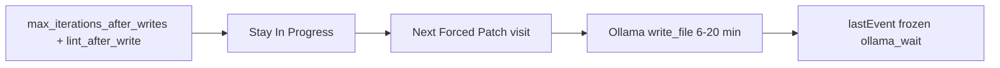

# What this batch shows, then heartbeat + QA advance

## Improvements already visible (do not redo)

Compared with the 01:14–03:01 overnight batch:

- **Fix-verify no longer aborts on write-stops.** 16 steps end `fix_verify_done:lint_after_write_stop round=1` instead of `aborted_hard_stop`. Explore-only stops log `skipped_lint_explore_stop` (3).
- **Writes happen.** 16 steps have `writesSucceeded > 0` (`write_file` / `apply_patch`).
- **Forced Patch + lint-stay is in the running process.** Cards keep In Progress after stall/System recover instead of Needs User for analyzer errors.
- Ollama is actually running (`gemma-4-q4km:26b`, 2–6 calls/step), not 1s empty ticks.

## Why it still feels stuck / “no output”

Total wall time in this dump is ~**3 hours**. Almost all of it is **Ollama eval**, not tools.

- Longest step: StoreRepository unit tests (1/2) **23.7 min**, of which **20.3 min** is one `write_file` call (`evalTokens=3846`). Console `lastEvent` stays `ollama_wait:iter 2/6` with no elapsed time. Heartbeats already go to `_publish_work_progress` every 15s in [`scrum_agent.py`](backend/agents/scrum_agent.py) but **`log_event("ollama_wait")` fires only once**, so diagnostics/UI lastEvent never updates.
- Incomplete trace at 01:07 (`status: running`) sat **11+ min** on iter 2 after a 36s `read_file` — that is the black screen you are looking at.
- After writes, **laneAfter stays In Progress**, `ok=false`. Hint: “wrote files then hit max LLM iterations before verify/lane move.” The model uses all 6 iterations on write/read/run_command and **never `update_board`**. Lint-after-write runs, but [`unhealthy_exit_blocks_lane_advance`](backend/services/sprint_speed_gates.py) only allows QA when `lint_clean` **and** someone moves the card. Traces do not even record `fixVerifyLintClean`.
- Same aisle-tests card then repeats **cycle 5–10** Forced Patch write-caps (~6–19 min each). PO `update_board` (3× `po_clarified`) does not finish the child.

## Implementation

### 1. Visible wait: refresh lastEvent while Ollama is in flight

In [`_tick_ollama_wait`](backend/agents/scrum_agent.py): every 15s also `log_event("ollama_wait", f"iter {n}/{max} elapsed={sec}s model=...")` so TaskCard `lastEvent` and step JSON move. Keep the existing `_publish_work_progress` tick.

Optional: include `evalTokens` / last tool name when known so a 20 min `write_file` is labeled as generating a patch, not a hung app.

### 2. Orchestrator advance after lint-after-write

After [`run_fix_verify_loop`](backend/services/sprint_service.py) in `_run_developer_step`, if the card is still In Progress and:

- writes succeeded this step, and
- `state.FIX_VERIFY_LINT_CLEAN` / `task.fixVerifyLintClean` is true,

then `move_board_stage` to [`_dev_complete_lane()`](backend/services/sprint_service.py) (QA or Code Review). Do **not** require the model to call `update_board`.

If lint is dirty, stay In Progress (Forced Patch next) — do not Needs User.

Persist `fixVerifyLintClean` on `lastStepDiagnostics` in finalize so traces show it.

### 3. Tests

- Ollama wait ticker logs a second `ollama_wait` with elapsed (unit test with a fake clock / mock `log_event`).
- After mocked `run_fix_verify_loop` + `FIX_VERIFY_LINT_CLEAN=True` + writes on the trace, `_run_developer_step` (or a small helper extracted from it) moves In Progress → QA/CR.
- Dirty lint does not auto-advance.

Out of scope: shrinking Gemma `write_file` eval time; PO parent Done vs children.