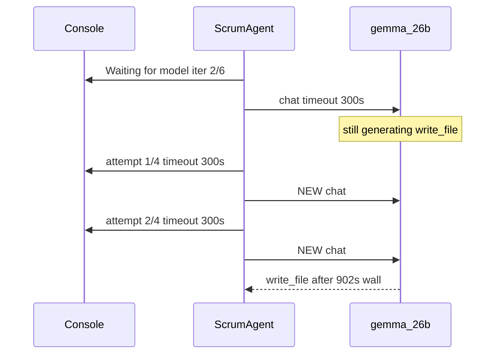

# Sprint is running; stop timeout-retry stacking

## Yes, it is running

`POST /api/sprint/run` returned 200. Console on `Implement StoreRepository update aisle tests` is a live Developer step. The 01:38–01:56 trace is **18.5 min**, `ollamaCallCount=6`, `lastEvent=fix_verify_done:lint_after_write_stop`.

What you should already see from prior fixes:

- Forced Patch **rejects** `read_file` (`Error: Forced Patch — Patch required…`) — the 29s iter 1 is the model *proposing* a read, not a successful explore.
- `write_file OK` 3943 bytes, then **skipped duplicate** `flutter test`.
- Fix-verify still lints after the write-cap.

The 1.4s `trace_started` dump at 01:57:44 is a follow-up System/recover tick, not a hung idle app. Ollama health polls in uvicorn are the UI, not extra Dev steps.

## Why it still looks stuck

Default [`ollamaRequestTimeoutSec=300`](backend/services/workflow_settings.py) with [`ollamaMaxRetries=4`](backend/agents/scrum_agent.py). [`_chat`](backend/agents/scrum_agent.py) **retries timeouts with a new request**. Gemma was still decoding the first `write_file` (~3757 eval tokens). Two killed attempts (01:38:58 → 01:43:59 → 01:49:02) plus a successful ~5 min eval = **15 min** for one tool.

Console only logs **once** per wait (`Waiting for model…`). The 15s `log_event("ollama_wait", elapsed=…)` heartbeats update TaskCard `lastEvent` / diagnostics, **not** the Console stream you pasted — so it looks hung until a timeout warning.

After the write, iter 4 started another `write_file` (95s) instead of stopping for lint/QA.

## Implementation

### 1. Do not retry Ollama timeouts with a new request

In [`_chat` / `_run_attempts`](backend/agents/scrum_agent.py): treat `err_type == "timeout"` as **final for that call** (no attempt 2/4, no cooldown extra chats). Retry only connection / 5xx / idle-server errors.

Raise default `ollamaRequestTimeoutSec` to **900** (local 26b `write_file` eval was ~290s on the successful try). Keep the setting overridable.

Log once: `Ollama timed out after Ns — not retrying (model may still be generating).`

Tests in [`tests/test_ollama_retry.py`](tests/test_ollama_retry.py): timeout on attempt 1 does not call chat again; connection errors still retry.

### 2. Console heartbeat (the log you actually watch)

In [`_tick_ollama_wait`](backend/agents/scrum_agent.py), every 15s also `add_system_log(..., f"Still waiting for Ollama — {elapsed}s, iter n/max, last_tool=…")` so Console is not silent for 15 minutes.

### 3. After a successful write this step, do not start another full write

If this step already has `write_succeeded` and the latest tool is skipped-duplicate `run_command`, stop the LLM loop (same as iteration cap) so fix-verify lint-after-write / orchestrator QA can run. Optional small guard in `execute_step` after tool batch — not a new timeout design.

## Not this change

Gemma 26b eval speed. Heartbeat `log_event` (already shipped). Restart `python app.py` after this so timeout/retry behavior loads (your current process already has Forced Patch reject).