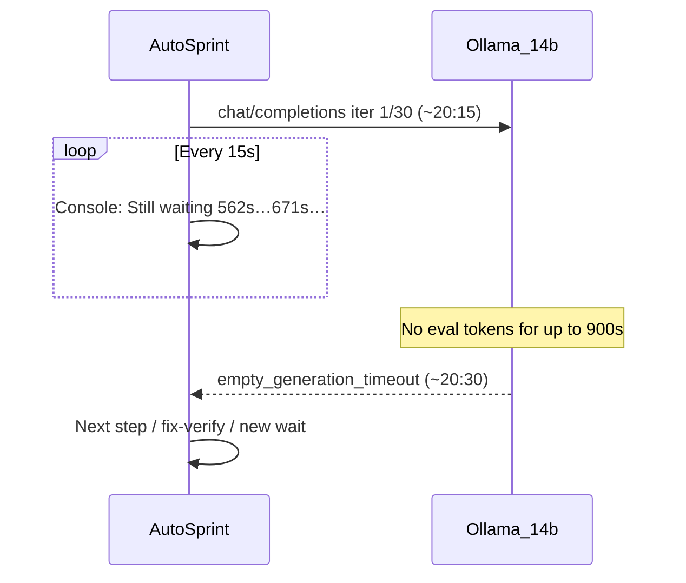

# Why the sprint looked frozen for ~30 minutes

## Short answer

**The sprint was still running.** It was stuck waiting for **Ollama** (`qwen2.5-coder:14b` at `http://localhost:11434`) to finish single LLM calls. Each hung call can block for up to **900 seconds (15 min)** before failing with `empty_generation_timeout`. The Console lines you pasted (`Still waiting for Ollama — 671s, iter 1/30`) are **15-second heartbeats** — progress indicators for a wait, not proof that work is happening.

---

## What your logs at 20:24–20:26 mean

| Agent | Message | Meaning |
|-------|---------|---------|
| **QA Tester** | `671s, iter 1/30, last_tool=run_command` | One LLM call started ~**20:15** and still had **no tokens** after ~11 minutes. Still on iteration 1 of 30 — not 671 iterations. |
| **Developer** | `121s, iter 1/2, last_tool=run_command` | A separate, shorter-wait call (max **2** iterations — cutoff summarizer path) started ~**20:24** after fix-verify lint. |

Both agents interleave Console heartbeats, but the sprint handler runs **one step at a time**. The long pole was the QA-side call that had been in flight since ~20:15.



---

## Timeline from your support bundle

Project: **meal planner 5** (`c6196c51-11e…`), exported **20:15 UTC** (bundle) / diagnostics through **21:16**.

| Time (UTC) | Event |
|------------|-------|
| **20:15:24** | New LLM call starts — `iter 1/30` (this is the call that reaches 562s+ by 20:24) |
| **20:24–20:26** | Heartbeats only — QA ~562–671s, Developer ~15–121s on a newer call |
| **20:30:27** | First `empty_generation_timeout` (~900s wall) |
| **20:39:36** | Another 900s timeout on JSON Export card |
| **20:46:12** | Dev step on **Polish & QA (2/2)** starts `iter 1/30` |
| **21:01:14** | **900s timeout** — `LLM_CALL_FAILED: Ollama empty generation timed out after 900s` |
| **21:03:17** | **Handle Empty State for JSON Export** hits **`phase_cycle_cap`** (cycle 7 > cap) — card **latched**; Auto Sprint skips further Dev on it |
| **21:07:31** | QA on **Handle Existing Meals During Export** starts another `iter 1/30` wait |
| **21:15:48** | Bundle exported while QA still waiting (496s elapsed) |

So the “~30 min doing nothing” window is roughly **20:46 → 21:16**: one 15-min Ollama hang, then latch/backoff/card switches, then another 8+ min wait.

---

## Root cause (technical)

The wait logic in [`backend/services/llm_provider.py`](backend/services/llm_provider.py) (`consume_chat_stream`):

- **Before first token**: waits up to `ollamaRequestTimeoutSec` = **900s**
- **After first event with no content/tools**: waits `ollamaEmptyGenerationTimeoutSec` = **90s**
- Failure message: `Ollama empty generation timed out after 900s`

Your settings (from bundle) use `qwen2.5-coder:14b`, `num_ctx` requested **32768** clamped to **29696 (VRAM)**, `keep_alive=30m`. Several steps also **pre-load semantic context + 3 files** (~2 min before the LLM call even starts).

**This is not an app deadlock** — it is Ollama failing to return a completion within the configured timeout. Common local causes:

- GPU/VRAM saturation (14b + large context + embeddings)
- Ollama process stuck or serializing requests behind a slow/hung generation
- Very long prefill on large prompts (semantic + file excerpts)

---

## Secondary blockers (why nothing useful happened after timeouts)

1. **43–46 lint errors** across the Flutter workspace — Oracle blocks lane advance to Done; fix-verify keeps running but cannot clean the wall.
2. **`phase_cycle_cap`** on `TASK-641DC097…` (**Handle Empty State for JSON Export**) after **7 dev cycles** — card latched; message: *"Developer execution is latched; split the card or reset the latch"*.
3. **`dev_precheck_skip`** on Polish & QA — same task reissued with no writes/oracle improvement; sprint parks instead of spinning another generate.
4. **`pauseSprintOnNeedsUser: false`** — sprint keeps cycling through blocked cards instead of stopping cleanly for you.

---

## What to do right now (no code changes)

### 1. Check Ollama health
```bash
ollama ps
curl -s http://localhost:11434/api/tags | head
```
If a model is stuck loaded or GPU is pegged, restart Ollama and retry with a smaller model for explore (`qwen2.5-coder:7b` is already configured as `devExploreModel`).

### 2. Unstick the latched card
Open **Handle Empty State for JSON Export** → either **Split card** or **Reset Developer visit latch** (Needs User / phase_cycle_cap flow in UI).

### 3. Reduce wait pain (settings)
- Lower `ollamaRequestTimeoutSec` (e.g. 300) if you prefer **fail fast** over 15-min silence
- Or fix Ollama slowness (smaller `ollamaNumCtx`, disable semantic preload for sprint, restart Ollama)

### 4. Fix the lint wall manually
43+ `flutter analyze` errors (undefined `meals`, missing `flutter_test` in pubspec) are blocking real progress regardless of LLM speed.

---

## Optional code improvements (if you want fewer long silent waits)

These are **enhancements**, not required to explain today's stall:

| Change | File | Effect |
|--------|------|--------|
| Shorter default timeout or user-visible countdown | [`workflow_settings.py`](backend/services/workflow_settings.py) | Fail in 5 min instead of 15 |
| Cancel in-flight Ollama on sprint interrupt | [`scrum_agent.py`](backend/agents/scrum_agent.py) | Stop orphaned waits when switching cards |
| Surface `phase_cycle_cap` + Ollama wait in sprint progress UI | [`SprintProgressBar.tsx`](frontend/src/components/SprintProgressBar.tsx) | Less “is it doing anything?” confusion |
| Auto-park to Needs User on repeated `empty_generation_timeout` | [`sprint_service.py`](backend/services/sprint_service.py) | Stop burning sprint steps on a dead Ollama |

---

## Bottom line

**Why?** Ollama hung on `qwen2.5-coder:14b` LLM calls for up to 15 minutes per attempt. The Console was correctly logging heartbeats, but **no tools ran** because the agent was blocked inside `_chat` waiting for the model. After timeouts, lint errors and a **phase cycle cap latch** prevented meaningful forward motion.

The sprint wasn't idle by design — it was **waiting on local LLM generation that never completed in time**.
