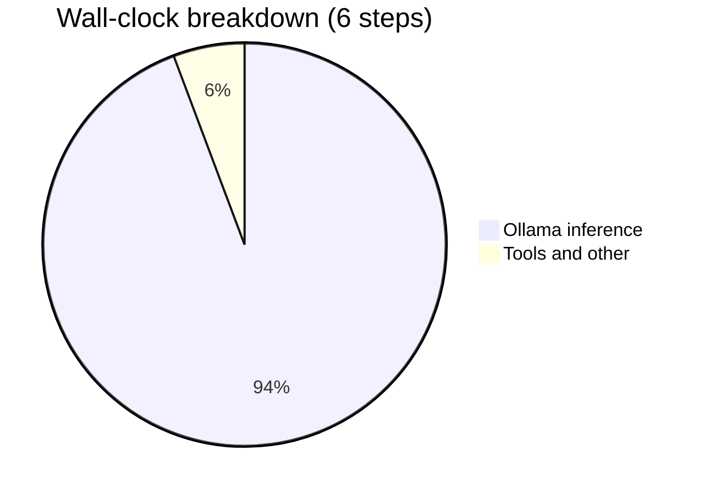
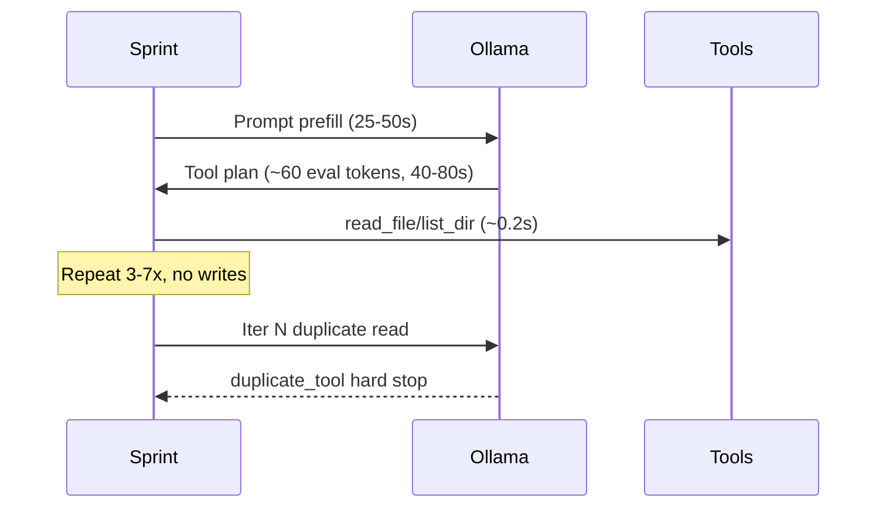

# Performance Analysis and Improvement Opportunities

## Executive summary

From the six step diagnostic files you attached (project `c6196c51`, ~**57 minutes** total wall clock):

| Metric | Value |
|--------|-------|
| Total wall time | **3,445 s** (~57 min) |
| Ollama time | **3,248 s (94.3%)** |
| Tool time | **4.8 s (0.1%)** |
| Dev writes succeeded | **0 / 5 dev steps** |
| Eval throughput | **~1.1–1.4 tok/s** |
| Unhealthy exits | **4/5 completed dev steps** (`duplicate_tool`, `empty_generation_timeout`) |

**Bottom line:** Performance is bottlenecked almost entirely by local LLM inference speed and agent behavior (explore-only loops), not by filesystem tools, network, or frontend.

---

## Per-step findings

| Task | Agent | Wall | Ollama % | Iters | Writes | Exit |
|------|-------|------|----------|-------|--------|------|
| Shopping list generation | Dev | 6.3 min | 97.6% | 3 | 0 | `duplicate_tool` |
| Meal repo (2/2) | Dev | 8.0 min | 64.0% | 4 | 0 | *(still running at capture)* |
| Polish & QA PO | PO | 1.4 s | 0% | 0 | 0 | `po_clarified` (skipped LLM) |
| Meal repo PO | PO | **8.5 min** | 99.6% | 1 | 0 | `po_clarified` |
| Polish & QA (2/2) | Dev | 7.2 min | 98.7% | 7 | 0 | `duplicate_tool` |
| Polish & QA (1/2) | Dev | **27.4 min** | 99.6% | 7 | 0 | `empty_generation_timeout` |

### What went well
- **PO skip path is fast**: [`step-TASK-5DC6A49C...`](attachments) completed in **1.4 s** with zero LLM calls when spec was already present ([`po_clarification.py`](backend/services/po_clarification.py)).
- **Tool I/O is negligible**: `read_file` / `list_dir` calls are **100–280 ms** each; duplicate-read skipping works (`skipped duplicate lib/shopping_list_service.dart`).
- **Speed gates are wired**: circuit breaker, empty-gen cool-off, and explore cycle caps exist in [`sprint_speed_gates.py`](backend/services/sprint_speed_gates.py) and are surfacing in traces (`Explore 10/12`, `forcePatchNextDevStep: true`).

### What went poorly
1. **Wrong model for dev work** — every LLM call used `qwen/qwen3.8-27b:latest`, a 27B general model. Project defaults in [`allhands.project.json`](allhands.project.json) specify `qwen2.5-coder:7b`. Phase routing in [`agent_efficiency.py`](backend/services/agent_efficiency.py) (`resolve_step_model`) would pick **7B explore / 14B patch**, but `singleModelMode: auto` likely collapsed to one heavy model on your VRAM budget.
2. **Extremely slow generation** — eval ~**1.2 tok/s** and prompt prefill often **25–50 s per iteration** (first call on iter 1). A single PO `update_board` call took **510 s** to emit 675 tokens (`numPredict: 2048`, `numCtx: 4096`).
3. **Explore-only loops with no writes** — all dev steps used only `list_dir`, `read_file`, `glob_file_search`; **0 `apply_patch` / `write_file`**. Cards burned 3–7 LLM iterations (~6–10 min each) then hit `duplicate_tool` or `empty_generation_timeout`.
4. **Repeated missing-file failures** — `lib/models.dart` failed in **every dev step** (2–3 tool failures each). The agent keeps re-requesting a file that does not exist, wasting iterations before duplicate-tool stop.
5. **Empty generation blow-up** — [`step-TASK-FF1B78...`](attachments) iteration 7 logged **922 s** with `empty_generation_timeout` after explore hit 10/12; [`fix_verify_loop.py`](backend/services/fix_verify_loop.py) correctly aborted with `aborted_hard_stop` but only after ~27 min of mostly idle GPU wait.
6. **Context growth mid-step** — Polish & QA (1/2) bumped `numCtx` from **6144 → 14336** on iteration 5 (prompt jumped to 8794 tokens), increasing prefill cost without producing writes.

---

## Where time actually goes (dev step pattern)

Typical dev iteration on `qwen3.8-27b`:

- **Prompt eval** totals: 74–131 s per step (often **30–40%** of Ollama time).
- **Eval** totals: 204–487 s per step at ~1.2 tok/s.
- **Tools**: under 2 s per step.

The system already tracks this split in [`step_diagnostics.py`](backend/services/step_diagnostics.py) (`promptEvalMs`, `evalMs`, `ollamaMsTotal`, `toolMsTotal`) and surfaces it in the UI via [`TaskDetailModal.tsx`](frontend/src/components/TaskDetailModal.tsx).

---

## Improvement areas (ranked by expected impact)

### 1. Model and VRAM configuration (highest impact)

**Problem:** 27B general model on all roles → ~1.2 tok/s, weak tool-calling, long prefill.

**Actions:**
- Align runtime model with project intent: **`qwen2.5-coder:7b`** (explore) + **`qwen2.5-coder:14b`** (patch) via [`enablePhaseModelRouting`](backend/services/workflow_settings.py).
- If VRAM &lt; 16 GB, keep **`singleModelMode: on`** but pin **`qwen2.5-coder:7b`** (not 27B general) — see [`single_model_mode_active`](backend/services/agent_efficiency.py).
- Set **`llmHostVramMb`** in workflow settings (currently `0` = unknown) so capacity-aware clamping in [`prompt_budget.py`](backend/services/prompt_budget.py) / [`llm_capacity.py`](backend/services/llm_capacity.py) can work.
- Verify **`ollamaKeepAlive: 30m`** or `-1s` in single-model mode to avoid reload spikes between steps ([`effective_keep_alive`](backend/services/agent_efficiency.py)).

**Expected gain:** 3–10× faster eval on 7B coder vs 27B general; shorter prefill with smaller `num_ctx`.

### 2. Break explore-only stalls earlier (high impact on throughput)

**Problem:** 6–10 explore tool calls with no patch; ~30 min/step before hard stop.

**Actions:**
- **`forcePatchNextDevStep`** is already set on FF1B78 but only applies to the *next* step — consider enforcing patch phase after N explore tools **within the same step** ([`should_force_patch_next_dev_step`](backend/services/sprint_speed_gates.py), [`enableDevPhaseGraph`](backend/services/workflow_settings.py)).
- Lower **`devExploreMaxTools`** from 12 → **6–8** for faster transition to patch.
- Tighten **`duplicateToolPolicy`** feedback: inject “`lib/models.dart` does not exist — stop retrying” into tool results when `read_file` fails repeatedly (workspace structure audit in [`workspace_structure_audit.py`](backend/services/workspace_structure_audit.py)).

**Expected gain:** Cuts wasted iterations per card from 7 → 2–3; reduces duplicate-tool exits.

### 3. Fix the `lib/models.dart` retry tax (medium impact)

**Problem:** Same missing file failed in all 5 dev steps; each failure costs a full LLM iteration (~60–160 s wait + tool call).

**Actions:**
- Run **workspace scaffold** before dev steps if structure gaps exist ([`requireWorkspaceStructure`](backend/services/workflow_settings.py), [`workspace_scaffold.py`](backend/services/workspace_scaffold.py)).
- Add failed-path fingerprint to in-step duplicate policy ([`duplicate_tool_policy.py`](backend/services/duplicate_tool_policy.py)) so a second `read_file` on a known-missing path stops immediately.
- Split cards reference models that were never created — PO acceptance criteria should require scaffolded files first.

**Expected gain:** ~2–3 iterations (~10–15 min) saved per dev step.

### 4. PO generation budget (medium impact)

**Problem:** PO clarification spent **510 s** for one `update_board` with `numPredict: 2048`.

**Actions:**
- Cap PO `num_predict` lower (e.g. 512–1024) in PO clarification path ([`po_clarification.py`](backend/services/po_clarification.py)).
- Skip LLM when only lane move is needed (already works for spec-present cards — extend to partial-spec cases).

**Expected gain:** PO steps from ~8 min → under 1 min.

### 5. Context / prefill optimization (medium impact)

**Problem:** First-iteration prefill spikes (25–50 s); adaptive bump to 14336 ctx mid-step.

**Actions:**
- Enable **`ollamaNumCtxAdaptive: true`** with start **4096–6144** (currently `false` in project settings) — see [`initial_ollama_num_ctx`](backend/services/prompt_budget.py).
- Keep **`ollamaKvCacheType: q8_0`** (already set) to reduce KV VRAM.
- Review semantic sprint inject on iter 5+ ([`enableSemanticSprintContext`](backend/services/workflow_settings.py)) — prompt jumped from ~5k → 8.7k tokens without helping writes.

**Expected gain:** 20–40% reduction in prompt-eval time per iteration.

### 6. Empty-generation handling (lower impact, already partially gated)

**Problem:** Iteration 7 idle-waited ~922 s before timeout.

**Actions:**
- Confirm **`empty_gen_should_skip`** (120 s GPU cool-off) is firing in sprint loop ([`sprint_service.py`](backend/services/sprint_service.py)).
- Consider lowering **`ollamaEmptyGenerationTimeoutSec`** from 90 → **45–60 s** for explore phase only.
- Ensure no retry loop stacks on empty-gen ([`test_chat_does_not_retry_empty_generation_timeout`](tests/test_ollama_retry.py) — verify runtime matches test).

---

## Instrumentation already in place (use for ongoing monitoring)

| Layer | File | Key metrics |
|-------|------|-------------|
| Per LLM call | [`step_diagnostics.py`](backend/services/step_diagnostics.py) | `promptEvalMs`, `evalMs`, `numCtx`, tokens |
| Per step | same | `ollamaMsTotal`, `toolMsTotal`, `exitReason` |
| Per card rollup | [`agent_usage.py`](backend/services/agent_usage.py) | role totals, call counts |
| Sprint gates | [`sprint_speed_gates.py`](backend/services/sprint_speed_gates.py) | circuit breaker, stall park, backoff |
| Preflight | [`preflight.py`](backend/services/preflight.py) | VRAM, num_ctx floor, KV cache |
| Eval harness | [`eval_harness.py`](backend/services/eval_harness.py) | `tokens_per_sec`, economics |
| UI | [`TaskDetailModal.tsx`](frontend/src/components/TaskDetailModal.tsx), [`AgentRunBar.tsx`](frontend/src/components/AgentRunBar.tsx) | live step diagnostics |

**Recommended KPIs to watch:**
- **Eval tok/s** (target: &gt;15 on 7B, &gt;8 on 14B)
- **Ollama % of wall** (will stay high, but wall should shrink)
- **Writes per dev step** (target: ≥1 before QA)
- **Unhealthy exit rate** (target: &lt;20%)
- **Prompt eval / eval ratio** (target: &lt;0.15 on warm model)

---

## Suggested next steps (if you want to act)

No code changes are required for analysis. If you want implementation, the highest-ROI sequence is:

1. **Reconfigure models** — point dev/PO at `qwen2.5-coder:7b` (or enable phase routing with known VRAM).
2. **Scaffold missing workspace files** — eliminate `lib/models.dart` retry loop.
3. **Tighten explore budget** — lower `devExploreMaxTools`, enforce in-step patch transition.
4. **Cap PO num_predict** — shorten PO clarification calls.

These are configuration-first changes with minimal code risk; code changes would only be needed for in-step force-patch and failed-path duplicate short-circuit.
