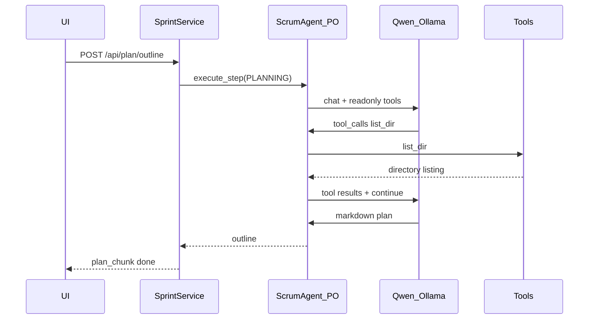

# Fix Plan Outline Tool Calling for Qwen

## Verdict: tool calling **is required** (and already partially wired)

Plan outline creation (`run_po_plan_outline`) deliberately enables read-only explore tools so the PO can inspect an existing codebase before drafting the plan. Your uncommitted changes already moved in this direction:

- [`backend/agents/scrum_agent.py`](backend/agents/scrum_agent.py): during `ACTIVE_SPRINT_TASK_ID == "PLANNING"`, PO tools are filtered to `_PO_READONLY_TOOLS` (`list_dir`, `read_file`, `grep`, `glob_file_search`, etc.)
- [`backend/services/sprint_service.py`](backend/services/sprint_service.py): prompt now says *"use native tool calls … then reply with the markdown plan"* and `max_iterations` increased from `1` to `max(4, _llm_iterations())`
- Qwen XML recovery exists in [`backend/services/tool_call_normalizer/parsers/qwen_xml.py`](backend/services/tool_call_normalizer/parsers/qwen_xml.py)

So Qwen trying to call `list_dir` / `read_file` at this stage is **expected behavior**, not a mistake.



## Root cause: explore-then-plan is blocked

The failure mode you're seeing is almost certainly this conflict in [`_po_step_should_reject_text_only`](backend/agents/scrum_agent.py):

```350:374:backend/agents/scrum_agent.py
def _po_step_should_reject_text_only(content, tools_used, task_id):
    ...
    if _looks_like_po_work_product(content):
        return False
    ...
    explored = bool(tools_used & _PO_READONLY_TOOLS)
    acted = bool(tools_used & _PO_BOARD_TOOLS)
    if explored and not acted:
        return True   # <-- rejects markdown plan after exploration
```

- `_looks_like_po_work_product` only recognizes PO clarification JSON (`description` / `acceptanceCriteria`), **not** markdown plan outlines (`## Summary`, etc.)
- After Qwen explores the repo, a valid markdown plan is treated as "idle/non-action text" and the loop keeps going until max iterations
- Outcomes: `Max tool iterations reached`, or raw Qwen XML left in the final string (rejected by `_looks_like_usable_plan_outline`)

Existing test [`tests/test_po_execute_step_sampling.py::test_po_planning_execute_step_keeps_explore_tools`](tests/test_po_execute_step_sampling.py) only verifies tool filtering on a **single-turn** mock with no tool usage — it does not cover explore → plan.

## Implementation plan

### 1. Exempt PLANNING markdown plans from idle rejection

In [`backend/agents/scrum_agent.py`](backend/agents/scrum_agent.py), early in `_po_step_should_reject_text_only`:

- If `task_id == "PLANNING"` and content matches usable plan outline heuristics → **do not reject**
- Reuse the same logic as [`_looks_like_usable_plan_outline`](backend/services/sprint_service.py) (move helper to avoid circular imports — best home: [`backend/services/brief_service.py`](backend/services/brief_service.py) as `looks_like_usable_plan_outline()`)

Also keep rejecting raw tool markup during PLANNING (already handled).

### 2. Centralize outline validation helper

Move `_looks_like_usable_plan_outline` from `sprint_service.py` → `brief_service.py` (public `looks_like_usable_plan_outline`).

Update callers:
- [`backend/services/sprint_service.py`](backend/services/sprint_service.py) — post-step validation before saving outline
- [`backend/agents/scrum_agent.py`](backend/agents/scrum_agent.py) — idle-rejection exemption

### 3. Add regression tests

**Unit test** in [`tests/test_po_idle_rejection.py`](tests/test_po_idle_rejection.py):
- `test_po_planning_accepts_markdown_after_explore_tools` — assert `_po_step_should_reject_text_only("## Summary\n...", {"list_dir"}, "PLANNING")` is `False`
- `test_po_planning_still_rejects_idle_after_explore` — greeting text after `list_dir` during PLANNING still rejected

**Integration-style test** in [`tests/test_po_execute_step_sampling.py`](tests/test_po_execute_step_sampling.py):
- Multi-turn mock: iteration 1 returns recovered `list_dir` tool call; iteration 2 returns markdown plan
- Assert final result contains `Summary` and is not max-iterations

### 4. No change to tool inventory (per your choice)

Keep readonly explore tools during PLANNING. Board-mutating tools (`add_backlog_tasks`, `update_board`) remain filtered out — phase 2 backlog generation still expects JSON text, not tool writes.

### 5. Verify Qwen paths still guarded

Keep existing safeguards (already in your diff):
- `apply_tool_call_recovery` for Qwen XML in content
- `_looks_like_usable_plan_outline` / `looks_like_raw_tool_markup` to reject XML dumps saved as the plan
- `think=False` for Ollama to reduce thinking/tool interference

## What we are **not** changing

- Disabling tools during plan outline (you chose to keep explore)
- Phase 2 backlog flow (JSON output; `_looks_like_po_work_product` already accepts epics JSON with `description` / `acceptanceCriteria`)
- Legacy `run_po_plan` single-shot path (separate flow; less relevant if UI uses outline → backlog)

## Success criteria

1. Qwen can call `list_dir` / `read_file` during plan outline without getting stuck in the idle-rejection loop
2. After exploration, a markdown plan with `## Summary` / `## Proposed epics` is accepted and stored
3. Raw Qwen XML tool dumps are still rejected as final outline output
4. New tests cover explore → plan and pass with `pytest tests/test_po_idle_rejection.py tests/test_po_execute_step_sampling.py tests/test_plan_outline.py`
