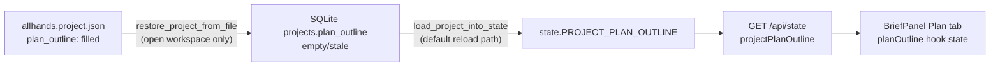

# Plan outline persistence + Generate Features progress

## Problem diagnosis

You see `plan_outline` in [`allhands.project.json`](backend/services/project_file.py) but the Plan tab is empty after reopen. The most likely cause is **storage drift**:



Today, [`load_project_into_state()`](backend/bootstrap.py) reads **SQLite only**. The sidecar is merged only when [`open_workspace_folder()`](backend/services/workspace_open.py) runs (server startup with a valid recent workspace path, or **Open folder**). If reopen hits the SQLite-only path, a plan that exists only in JSON never reaches the API or UI.

Existing tests cover SQLite round-trip ([`tests/test_brief_plan_persistence.py`](tests/test_brief_plan_persistence.py)) but **not** sidecar restore for `plan_outline` ([`tests/test_project_file.py`](tests/test_project_file.py) tests name/brief/board only).

Secondary UX issues (not the JSON bug, but confusing):
- Plan content lives on the **Plan** sub-tab in [`BriefPanel.tsx`](frontend/src/components/BriefPanel.tsx) (Brief tab is selected by default via `allhands-brief-tab` localStorage).
- **Generate Features** from the Brief panel uses `withLoading` ([`App.tsx`](frontend/src/App.tsx) ~1787), which only gates modals — **no button spinner or progress bar**. Sidebar path uses `withSprintBusy` but shows a misleading Kanban banner: "Sprint step in progress" ([`KanbanBoard.tsx`](frontend/src/components/KanbanBoard.tsx) ~265). [`run_po_plan_backlog()`](backend/services/sprint_service.py) does not emit `publish_sprint_progress` (unlike Plan & Run).

---

## Fix 1: Backend — always hydrate plan from sidecar when SQLite is empty

### A. Sidecar merge in `restore_project_from_file()`

In [`backend/services/project_file.py`](backend/services/project_file.py):

- Read incoming plan with alias support (match import API):
  `incoming = data.get("plan_outline") or data.get("projectPlanOutline") or ""`
- **Merge, don't blindly overwrite**: if sidecar plan is empty but SQLite already has a plan, keep SQLite value.
- Only write empty plan to SQLite when both are empty.

This prevents both directions of drift (JSON-only plan lost on load; SQLite plan wiped by empty sidecar).

### B. Fallback in `load_project_into_state()`

In [`backend/bootstrap.py`](backend/bootstrap.py), after loading from SQLite:

- If `PROJECT_PLAN_OUTLINE` is empty and `workspace_dir` exists, read [`read_project_file()`](backend/services/project_file.py) and hydrate from `plan_outline` / `projectPlanOutline`.
- If found, persist back to SQLite via a lightweight `save_project` call (or `save_current_project_state`) so the next load is consistent.

This fixes reopen even when the app loads by project id without calling `open_workspace_folder()`.

---

## Fix 2: Frontend — make restored plan visible and resilient

Small, targeted changes in [`frontend/src/App.tsx`](frontend/src/App.tsx) and [`frontend/src/hooks/useAppState.ts`](frontend/src/hooks/useAppState.ts):

1. **On successful `refresh()` / project switch**, if `projectPlanOutline.trim()` is non-empty, switch BriefPanel to the **Plan** tab (one-time per project load; respect explicit user tab choice where possible).
2. **Reset `planOutlineStreaming` on `refresh()`** so a stuck streaming flag cannot block the sync effect at App.tsx ~274 (`if (planDirty || planOutlineStreaming) return`).
3. In collapsed BriefPanel header, show a short plan preview when plan exists even if the Brief tab is active (optional but low-cost discoverability).

---

## Fix 3: Generate Features — visible progress feedback

Mirror the Plan & Run UX pattern already in App.tsx (~1583–1601):

| Change | Where |
|--------|-------|
| Add `planBacklogActive` state | [`App.tsx`](frontend/src/App.tsx) |
| Set true before `triggerPlanBacklog`, false in `finally` | Both Sidebar and BriefPanel handlers |
| Use `withSprintBusy` for **both** entry points (replace BriefPanel `withLoading`) | [`App.tsx`](frontend/src/App.tsx) |
| Button spinner + label "Generating Features…" | [`BriefPanel.tsx`](frontend/src/components/BriefPanel.tsx), [`Sidebar.tsx`](frontend/src/components/Sidebar.tsx) |
| Auto-expand bottom panel + Console tab on start | [`App.tsx`](frontend/src/App.tsx) (same as Plan & Run) |
| Context-aware Kanban banner | Pass `planBacklogActive` to [`KanbanBoard.tsx`](frontend/src/components/KanbanBoard.tsx): "Generating Features from plan…" |
| Emit `publish_sprint_progress` at start/end of backlog generation | [`run_po_plan_backlog()`](backend/services/sprint_service.py) — reuse existing `sprint_progress` SSE + [`SprintProgressBar.tsx`](frontend/src/components/SprintProgressBar.tsx) |
| Include `planBacklogActive` in progress bar visibility | [`SprintProgressBar.tsx`](frontend/src/components/SprintProgressBar.tsx) / App wiring |

Existing signals that will continue to help once Console is auto-opened: `agent_run` SSE (PO iteration/tool), and `log` SSE ("Generating Features (epics) + child cards…").

---

## Fix 4: Regression tests (your main ask)

Add tests in [`tests/test_project_file.py`](tests/test_project_file.py) and [`tests/test_brief_plan_persistence.py`](tests/test_brief_plan_persistence.py):

| Test | Asserts |
|------|---------|
| `test_restore_project_file_preserves_plan_outline` | Sidecar with `plan_outline` → `restore_project_from_file` → SQLite row contains plan |
| `test_restore_does_not_wipe_sqlite_plan_when_sidecar_empty` | SQLite has plan, sidecar `plan_outline: ""` → plan kept |
| `test_restore_accepts_projectPlanOutline_alias` | Sidecar uses camelCase key → restored correctly |
| `test_load_project_hydrates_plan_from_sidecar_when_sqlite_empty` | SQLite empty, sidecar filled → `load_project_into_state` sets `state.PROJECT_PLAN_OUTLINE` |
| `test_api_state_includes_plan_after_sidecar_only_drift` | TestClient `GET /api/state` after simulate drift + reload returns non-empty `projectPlanOutline` |
| `test_run_po_plan_backlog_publishes_sprint_progress` | Mock PO; assert `publish_sprint_progress` called with `PLANNING_BACKLOG` task |

These lock in the exact failure mode you hit: **plan visible in JSON, empty in UI after reopen**.

---

## Verification (manual, after implementation)

1. Create/generate a plan → confirm `plan_outline` in workspace `allhands.project.json`.
2. Stop server, clear SQLite `plan_outline` for that project (simulate drift), restart → Plan tab should still show content; `/api/state` should return it.
3. Click **Generate Features from plan** → spinner on button, progress bar / console activity within 1–2s, Kanban banner says "Generating Features…" (not "Sprint step").

```bash
pytest tests/test_project_file.py tests/test_brief_plan_persistence.py -q
```
