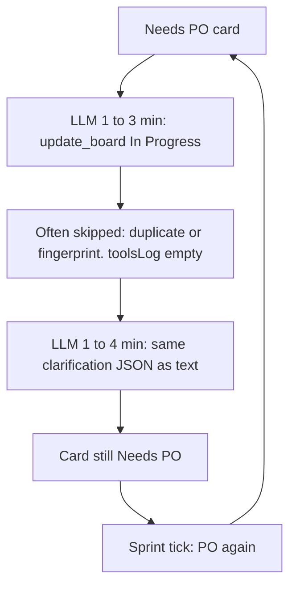

# Insights from the diagnostic traces (and what would actually speed tasks up)

These 36 files cover three cards (`Club Card Image Storage`, `Club Card Display UI`, `Verify Club Card UI Implementation`). Every step is **Product Owner**, every `laneBefore` is **Needs PO**, model **`gemma-4-q4km:26b`**.

## What the numbers say

- **Tools are not the bottleneck.** Logged tool time is ~2s total vs **hours** of Ollama. Typical `update_board` / `read_file` is 2–130ms.
- **Each PO step is 3–12 minutes**, 2–7 LLM calls, ~5–13 eval tok/s. Short tool-only turns still take 90–200s because **prefill on 8–13k prompt tokens** dominates (calls with 55–200 eval tokens still cost 90–130s).
- **The sprint is not making board progress.** Most steps end `ok=True` / `exitReason=fix_verify_done` (a default label, not a real verify loop) while **`laneAfter` stays Needs PO**. Auto-sprint treats that as healthy ([`sprint_speed_gates.py`](backend/services/sprint_speed_gates.py) resets the circuit breaker on `fix_verify_done`) and immediately starts another PO step.
- **Display UI:** 20 PO steps, ~1.6h of model time, first-call prompt **4272 → 10578** tokens. Same ~950-char JSON dumped over and over.
- **Verify UI:** 13 steps, still Needs PO; `update_board → In Progress` blocked as duplicate/fingerprint; PO then spends minutes regenerating JSON as text. Work items on the card are **Developer** items (implement / verify), which is the wrong checklist for PO.

Canonical step pattern (dozens of traces):

1. Iter 1: `update_board` (~80–200s) — frequently **not in `toolsLog`** (duplicate skip / fingerprint block before execute).
2. Iter 2–3: **730–950 chars of the same JSON** (`description` / `acceptanceCriteria`) plus a “moved to In Progress” claim — another 1–4 minutes.
3. Step “completes”. Card is still Needs PO. Repeat.

That is why tasks feel slow: **the pipeline never hands off to Developer**, so implementation never starts. Making Gemma a bit faster would help a little; **stopping this loop would cut hours**.

## Root causes in the app (not the GPU)

1. **PO contract is two expensive outputs.** Needs PO prompts require both clarification JSON *and* `update_board` ([`scrum_agent.py`](backend/agents/scrum_agent.py) `_PO_CLARIFICATION_PLAN_REJECTION`, [`prompt_profile.py`](backend/services/prompt_profile.py)). Gemma does the tool call, then narrates the JSON again. `_po_step_should_reject_text_only` **allows** that JSON as a work product, so the step exits “success” without a lane change.

2. **`update_board` is requested but often not applied.** Cross-step duplicate/fingerprint policy ([`duplicate_tool_policy.py`](backend/services/duplicate_tool_policy.py), [`scrum_agent.py`](backend/agents/scrum_agent.py) around the blocked-fingerprint path) skips the move. The model is not told “already moved / blocked — stop”. It retries the same call, then writes the JSON in prose. Diagnostics omit skipped calls from `toolsLog`, which is why `ollamaCalls[].toolCalls` shows `update_board` and `toolsUsed` is `[]`.

3. **Sprint thinks idle PO steps are healthy.** [`derive_exit_reason`](backend/services/step_diagnostics.py) defaults to `fix_verify_done`. Circuit breaker never trips. One card even went **Needs PO → Done** via `add_backlog_tasks` / `tool_failure_stop` (“task already Done”) — wrong lane, wasted later steps.

4. **Context grows and work items are wrong.** PO prompts pick up Developer-derived items (`write:implement`, `verify:command`, `blocked:tools` for a *different* task id). Extra tokens = extra prefill every turn. `context_rewind` fired twice (removed 3–4 messages) after failed `write_file` on the spec.

5. **Model choice.** A 26B Q4 local model at ~10 tok/s is fine for one PO clarification, not for 20 identical ones. Prefill on 10k tokens is the per-call floor (~1–2 minutes) even with tiny outputs.

## Highest-impact product changes (ordered)

These are application changes; inference tuning is secondary.

**1. Apply PO clarification without a second LLM novel.**  
If the assistant (or a tool arg) contains `{description, acceptanceCriteria, briefAddition}`, persist it and **move Needs PO → In Progress in process** (or make `update_board` carry those fields). Do not require a follow-up text turn. If `update_board` is duplicate-skipped because the target is already In Progress, **treat as success and end the step**.

**2. End the step when the board tool is a no-op, don’t generate JSON again.**  
On fingerprint block / identical `update_board`, inject a short system result and **stop** (or force a single-line “already applied”). Cap PO `num_predict` so it cannot spend 2000 eval tokens restating AC.

**3. Don’t re-queue Needs PO after identical clarification.**  
Fingerprint the JSON (or “update_board In Progress” args) across steps. If unchanged and lane is still Needs PO, **apply + move** or circuit-break instead of another 4-minute call. Stop treating `fix_verify_done` as healthy when `laneAfter == laneBefore == Needs PO`.

**4. Shrink PO context.**  
Role-filter work items so PO does not see Developer implement/verify checklists. Prune prior identical JSON from the transcript. Keep first-call prompt closer to the early ~4k tokens, not 10k+.

**5. Diagnostics honesty (helps the next investigation).**  
Log duplicate-skips in `toolsLog`; don’t default exit to `fix_verify_done`; `ollamaMsTotal` sometimes exceeds `durationMs` (double-count / overlapping waits) — fix the rollup.

**6. Optional: smaller/faster PO model** only after (1)–(4). With single-model mode, swapping models may cost a reload; a smaller PO model helps only if it stays loaded or is the only model.

## What would *not* move the needle here

- Faster tools, parallel tools, more max iterations (one step already hit 6/6 with no completion).
- More explore/read tools (PO already rereads specs; extra reads add LLM turns).
- Generic “high efficiency” prompt trims unless they cut the **repeat JSON + repeat update_board** pattern.

## Suggested implementation slice (if you want this built next)

Focus on PO Needs PO completion in [`backend/agents/scrum_agent.py`](backend/agents/scrum_agent.py), board apply in [`backend/agents/registry.py`](backend/agents/registry.py) / [`backend/services/board_service.py`](backend/services/board_service.py), duplicate handling, and [`backend/services/sprint_speed_gates.py`](backend/services/sprint_speed_gates.py) + [`derive_exit_reason`](backend/services/step_diagnostics.py). Tests: PO JSON text applies AC and leaves Needs PO in one step; duplicate `update_board` ends the step; circuit breaker on repeated Needs PO no-advance.
